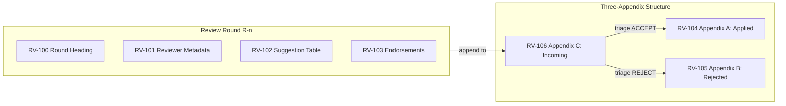
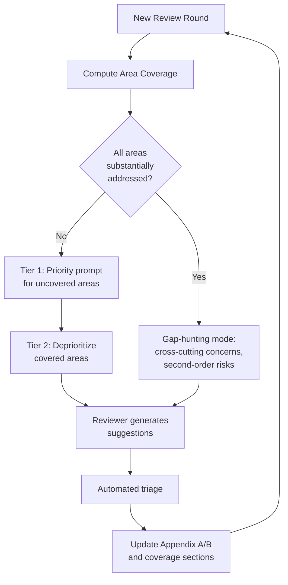
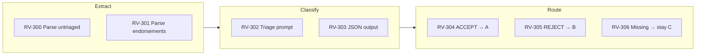
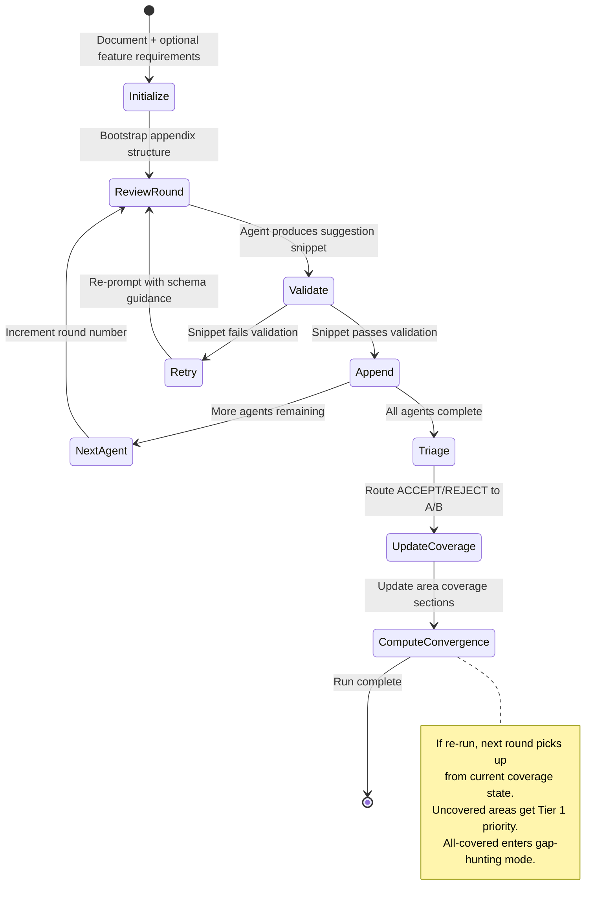

# Architectural Review Workflow — Functional Requirements

**Version:** 1.0.0  
**Created:** 2026-02-14  
**Protocol Name:** Convergent Review Protocol (CRP)  
**Canonical Source:** [`docs/capability-index/startd8.architectural-review.functional-requirements.yaml`](capability-index/startd8.architectural-review.functional-requirements.yaml)

---

## Overview

This document defines functional requirements for the Architectural Review Log Workflow, which implements the **Convergent Review Protocol (CRP)** — a structured, iterative, domain-aware review process that converges toward full coverage across defined review areas.

### What is the Convergent Review Protocol?

CRP is the formal name for the review format and process used by the `architectural-review-log` workflow. Its defining characteristics are:

1. **Structured suggestion format** — a 7-column table schema (ID, Area, Severity, Suggestion, Rationale, Proposed Placement, Validation Approach) ensuring every suggestion is actionable and triage-ready
2. **Three-appendix triage structure** — Applied (A), Rejected with rationale (B), Incoming/Untriaged (C) — providing persistent memory across review rounds
3. **Round-based iteration** — sequential reviewers, each building on the triaged results of prior rounds, with unique `R{round}-S{n}` identifiers
4. **Domain coverage tracking** — suggestions categorized into defined areas (Architecture, Interfaces, Data, Risks, Validation, Ops, Security) with per-area "substantially addressed" thresholds
5. **Two-tier priority steering** — uncovered areas receive explicit priority in reviewer prompts; covered areas are deprioritized to "genuine gap" discovery only
6. **Convergence** — the process naturally narrows focus as areas cross the threshold, and enters "gap-hunting mode" when all areas are substantially addressed
7. **Endorsement system** — later reviewers can endorse untriaged suggestions from prior rounds, building consensus signal for triage
8. **Dual-document mode** — simultaneous review of a plan document against its feature requirements, with split suggestion IDs (S-prefix for plan, F-prefix for feature requirements)

CRP is also the format used when the requirements improvement process is run as part of an architectural review — feature requirements receive the same structured suggestion format, triage, and convergence tracking.

### Status Dashboard

| Layer | ID Range | Total | Implemented | Partial | Planned |
|-------|----------|-------|-------------|---------|---------|
| Core Review Protocol | RV-1xx | 16 | 14 | 0 | 2 |
| Domain Coverage | RV-2xx | 10 | 8 | 0 | 2 |
| Triage and Decision | RV-3xx | 10 | 8 | 0 | 2 |
| Dual-Document Mode | RV-4xx | 8 | 7 | 0 | 1 |
| Agent Selection and Quality | RV-5xx | 8 | 7 | 0 | 1 |
| Validation and Safety | RV-6xx | 10 | 9 | 0 | 1 |
| State and Persistence | RV-7xx | 6 | 5 | 0 | 1 |
| Observability and Cost | RV-8xx | 8 | 6 | 0 | 2 |
| **Total** | | **76** | **64** | **0** | **12** |

---

## Layer 1: Core Review Protocol (RV-1xx)

Defines the fundamental CRP mechanics: suggestion schema, appendix structure, round lifecycle, and append-only invariants.

### CRP Suggestion Schema



| ID | Requirement | Status | Evidence |
|----|-------------|--------|----------|
| RV-100 | Each review round MUST start with a `#### Review Round R{n}` heading with monotonically increasing round number | Implemented | `_validate_snippet()` checks heading presence; `_max_review_round()` computes next |
| RV-101 | Each round MUST include reviewer metadata: Reviewer name/model, Date (UTC), Scope statement | Implemented | `_build_prompt()` includes metadata format in output instructions |
| RV-102 | Suggestions MUST use the 7-column table schema: ID, Area, Severity, Suggestion, Rationale, Proposed Placement, Validation Approach | Implemented | `REQUIRED_COLUMNS` constant; `_validate_snippet()` enforces column match |
| RV-103 | Suggestion IDs MUST follow the `R{round}-S{n}` format for plan suggestions and `R{round}-F{n}` for feature suggestions | Implemented | `_validate_snippet()` validates ID pattern; dual-doc splitting in `_extract_feature_snippet()` |
| RV-104 | Area MUST be one of the allowed values: Architecture, Interfaces, Data, Risks, Validation, Ops, Security | Implemented | `ALLOWED_AREAS` set; `_validate_snippet()` validates area enum |
| RV-105 | Severity MUST be one of: critical, high, medium, low | Implemented | `ALLOWED_SEVERITIES` set; `_validate_snippet()` validates severity enum |
| RV-106 | Appendix A (Applied Suggestions) MUST contain: ID, Suggestion summary, Source, Implementation/Validation Notes, Date | Implemented | `APPENDIX_TEMPLATE` defines schema; `_insert_appendix_rows()` populates |
| RV-107 | Appendix B (Rejected Suggestions) MUST contain: ID, Suggestion summary, Source, Rejection Rationale, Date | Implemented | `APPENDIX_TEMPLATE` defines schema; `_insert_appendix_rows()` populates |
| RV-108 | Appendix C (Incoming Suggestions) MUST be append-only — reviewers MUST NOT modify existing entries | Implemented | `_validate_snippet()` rejects output containing Appendix A/B headers |
| RV-109 | Reviewers MUST NOT rewrite or modify the document body — output MUST be an appendable snippet only | Implemented | Prompt instructs "Do NOT rewrite the document"; validation rejects Appendix A/B modifications |
| RV-110 | The appendix structure (A/B/C sections with tables) MUST be auto-initialized when missing from target document | Implemented | `_ensure_appendix_exists()` bootstraps `APPENDIX_TEMPLATE` |
| RV-111 | Reviewer prompts MUST include previously applied IDs (Appendix A) and rejected IDs (Appendix B) to prevent re-suggestion | Implemented | `_build_prompt()` includes `applied_list` and `rejected_list` with iteration context |
| RV-112 | Reviewers MUST be able to endorse untriaged suggestions from prior rounds by listing IDs with rationale | Implemented | Prompt includes endorsement instructions; `_extract_untriaged_suggestions()` parses endorsement blocks |
| RV-113 | Pipe characters within table cell content MUST be escaped as `\|` to preserve table structure | Implemented | Prompt instructs escaping; `_split_cells()` handles `\|` via placeholder |
| RV-114 | Per-round suggestion count MUST be configurable with a default of 10 and maximum of 25 | Implemented | `max_suggestions` config input; validation enforces 1-25 range |
| RV-115 | Semantic duplicate detection — suggestions with equivalent content under different IDs SHOULD be flagged or prevented | Planned | Described in `ARCHITECTURAL_REVIEW_WORKFLOW_PLAN.md` Phase 2; hash-based dedup not yet implemented |

---

## Layer 2: Domain Coverage (RV-2xx)

Defines the convergence mechanics: area tracking, substantially addressed thresholds, and two-tier priority steering.

### Convergence Flow



| ID | Requirement | Status | Evidence |
|----|-------------|--------|----------|
| RV-200 | Every suggestion MUST be categorized into one of the defined review areas | Implemented | `ALLOWED_AREAS` enforced in `_validate_snippet()` |
| RV-201 | The system MUST track accepted suggestion count per area from Appendix A | Implemented | `_compute_substantially_addressed_from_doc()` groups applied IDs by area |
| RV-202 | An area is "substantially addressed" when it has >= threshold accepted suggestions (default threshold: 3) | Implemented | `_compute_substantially_addressed()` with configurable `substantially_addressed_threshold` |
| RV-203 | The substantially addressed threshold MUST be configurable per workflow run | Implemented | `substantially_addressed_threshold` config input (default 3) |
| RV-204 | When uncovered areas exist, reviewer prompts MUST explicitly list them as priority areas with quantified gap data (count, IDs, gap to threshold) | Implemented | `_build_prompt()` Tier 1 block with `area_coverage` details |
| RV-205 | When uncovered areas exist, prompts MUST instruct reviewers to allocate at least `max_suggestions - 1` slots to priority areas before considering addressed areas | Implemented | `_build_prompt()` Tier 1 includes allocation instruction |
| RV-206 | Addressed areas MUST be presented as secondary ("only propose if you find a genuine gap") with count of existing accepted suggestions | Implemented | `_build_prompt()` Tier 2 block lists covered areas with counts |
| RV-207 | When ALL areas are substantially addressed, the system MUST enter gap-hunting mode — prompts instruct reviewers to focus on cross-cutting concerns, unstated assumptions, second-order effects, and edge cases | Implemented | `_build_prompt()` gap-hunting mode block |
| RV-208 | An "Areas Substantially Addressed" section MUST be inserted/updated in the document listing covered areas with accepted suggestion counts and IDs | Implemented | `_insert_substantially_addressed_section()` |
| RV-209 | An "Areas Needing Further Review" section MUST be inserted/updated listing uncovered areas with gap-to-threshold data | Implemented | `_insert_areas_needing_review_section()` |

---

## Layer 3: Triage and Decision (RV-3xx)

Defines the automated triage process: classification, validation, and appendix routing.

### Triage Pipeline



| ID | Requirement | Status | Evidence |
|----|-------------|--------|----------|
| RV-300 | The system MUST extract untriaged suggestions from Appendix C, excluding any IDs already in Appendix A or B | Implemented | `_extract_untriaged_suggestions()` filters by `triaged` set |
| RV-301 | The system MUST parse endorsement counts per suggestion from endorsement blocks in review rounds | Implemented | `_extract_untriaged_suggestions()` parses `**Endorsements**` sections |
| RV-302 | Triage MUST use a dedicated LLM prompt providing: document context, applied/rejected history, endorsement counts, and all untriaged suggestions | Implemented | `_build_triage_prompt()` |
| RV-303 | Triage output MUST be a JSON array where each element contains: id, decision (ACCEPT/REJECT), summary, rationale, area | Implemented | `_build_triage_prompt()` specifies JSON schema; `_validate_triage_output()` enforces |
| RV-304 | ACCEPT decisions MUST insert a row into Appendix A with: ID, suggestion summary, source reviewer, implementation rationale, date | Implemented | `_apply_triage_decisions()` routes to `_insert_appendix_rows()` for Appendix A |
| RV-305 | REJECT decisions MUST insert a row into Appendix B with: ID, suggestion summary, source reviewer, rejection rationale, date | Implemented | `_apply_triage_decisions()` routes to `_insert_appendix_rows()` for Appendix B |
| RV-306 | Partial triage results MUST be accepted — suggestions not covered by triage output remain untriaged in Appendix C | Implemented | `_validate_triage_output()` returns `missing_ids`; partial success accepted |
| RV-307 | Triage MUST be togglable via `enable_triage` config (default: enabled) | Implemented | `enable_triage` config input; conditional execution in `_execute()` |
| RV-308 | Endorsement counts MUST be included in triage prompts — suggestions endorsed by multiple reviewers should be weighted higher | Implemented | `_build_triage_prompt()` includes endorsement info block |
| RV-309 | Automated cross-round deduplication — triage SHOULD detect semantically equivalent suggestions across rounds and merge or flag them | Planned | Hash-based dedup described in plan but not yet implemented |

---

## Layer 4: Dual-Document Mode (RV-4xx)

Defines the simultaneous plan + feature requirements review, including requirements coverage mapping and split suggestion routing.

### Dual-Document Flow

```mermaid
flowchart TD
    subgraph input [Inputs]
        PLAN[Plan Document]
        FEAT[Feature Requirements]
    end

    subgraph review [CRP Review Round]
        PLANSUGG[Plan Suggestions\nR{n}-S1..S{max}]
        COVERAGE[Requirements Coverage\nMapping Table]
        FEATSUGG[Feature Suggestions\nR{n}-F1..F{max}]
    end

    subgraph route [Suggestion Routing]
        PLANA[Plan Appendix A/B/C]
        FEATA[Feature Appendix A/B/C]
    end

    PLAN --> PLANSUGG
    FEAT --> COVERAGE
    COVERAGE --> FEATSUGG
    PLANSUGG -->|S-prefix| PLANA
    FEATSUGG -->|F-prefix| FEATA
```

| ID | Requirement | Status | Evidence |
|----|-------------|--------|----------|
| RV-400 | When `feature_requirements` config is provided, the workflow MUST enter dual-document mode | Implemented | `_execute()` resolves `feature_doc_path` when `feature_requirements` non-empty |
| RV-401 | In dual-document mode, reviewers MUST produce a Requirements Coverage table mapping each feature requirement section to plan step(s) with Coverage (Full/Partial/Missing) and Gaps | Implemented | `_build_prompt()` dual-doc format block with coverage table schema |
| RV-402 | Plan suggestions MUST use S-prefix IDs (`R{n}-S{m}`) and feature suggestions MUST use F-prefix IDs (`R{n}-F{m}`) | Implemented | Prompt instructs ID format; `_extract_feature_snippet()` splits by prefix |
| RV-403 | S-prefix suggestions MUST be routed to the plan document's appendices; F-prefix suggestions MUST be routed to the feature document's appendices | Implemented | `_execute()` splits and appends to respective documents |
| RV-404 | The feature requirements document MUST be auto-initialized with Appendix A/B/C structure if missing | Implemented | `_ensure_appendix_exists()` called on feature doc when `init_if_missing` is true |
| RV-405 | Feature requirements content MUST be included in the reviewer prompt with explicit instructions to evaluate plan-to-requirements traceability | Implemented | `_build_prompt()` includes `requirements_block` with traceability instructions |
| RV-406 | Triage MUST handle both S-prefix and F-prefix IDs, routing decisions to the correct document's appendices | Implemented | `_build_triage_prompt()` includes suggestion type note; triage routes by prefix |
| RV-407 | Requirements coverage analysis SHOULD be extractable as structured data for downstream pipeline consumption | Planned | Currently embedded in reviewer output as markdown; no structured extraction yet |

---

## Layer 5: Agent Selection and Quality (RV-5xx)

Defines the model selection strategy, tier system, and provider handling.

| ID | Requirement | Status | Evidence |
|----|-------------|--------|----------|
| RV-500 | When agents are not explicitly provided, the system MUST select default models from the model catalog based on `quality_tier` | Implemented | `_select_default_agents()` queries `list_models_by_tier()` |
| RV-501 | Default quality tier MUST be `flagship` — optimizing for review quality over cost | Implemented | Default `quality_tier="flagship"` in config inputs |
| RV-502 | Provider allowlist (`providers` config) MUST filter default model selection to specified providers only | Implemented | `_select_default_agents()` applies provider filter |
| RV-503 | Reviewer count MUST be configurable (default 2, max 5) | Implemented | `reviewer_count` config; validation enforces 1-5 range |
| RV-504 | Reviewers MUST execute sequentially — each reviewer sees the full document plus prior review rounds | Implemented | Sequential loop in `_execute()` with `next_round` increment |
| RV-505 | OpenAI model-not-found errors MUST trigger automatic fallback to a configurable fallback model (default: `openai:gpt-4.1`) | Implemented | `fallback_on_model_not_found` + `fallback_openai_model` config; retry logic in `_execute()` |
| RV-506 | Gemini safety filter blocks MUST trigger automatic retry with relaxed safety settings | Implemented | `GeminiSafetyFilterError` catch with `RELAXED_SAFETY_SETTINGS` in retry logic |
| RV-507 | Custom Gemini safety settings MUST be applicable to all Gemini agents via `gemini_safety_settings` config | Implemented | Config applied in `_execute()` to all Gemini agents |

---

## Layer 6: Validation and Safety (RV-6xx)

Defines snippet validation, retry mechanics, fail-fast behavior, and document integrity.

| ID | Requirement | Status | Evidence |
|----|-------------|--------|----------|
| RV-600 | Every reviewer output MUST be validated before appending to the document | Implemented | `_validate_snippet()` called after each agent response |
| RV-601 | Validation MUST reject output missing the required round heading | Implemented | `_validate_snippet()` checks `#### Review Round R{n}` presence |
| RV-602 | Validation MUST reject output containing Appendix A or B headers (indicating attempted modification of triaged sections) | Implemented | `_validate_snippet()` checks for forbidden section headers |
| RV-603 | Validation MUST verify the suggestion table has all 7 required columns | Implemented | `_validate_snippet()` matches `REQUIRED_COLUMNS` |
| RV-604 | Validation MUST verify Area values are in the allowed enum | Implemented | `_validate_snippet()` checks `ALLOWED_AREAS` |
| RV-605 | Validation MUST verify Severity values are in the allowed enum | Implemented | `_validate_snippet()` checks `ALLOWED_SEVERITIES` |
| RV-606 | Validation MUST enforce suggestion count is between 1 and `max_suggestions` | Implemented | `_validate_snippet()` counts rows and validates range |
| RV-607 | Validation failure MUST trigger a targeted retry with schema guidance before failing the round | Implemented | Retry loop in `_execute()` with validation error feedback |
| RV-608 | Code-block fences (```markdown, ```json) MUST be stripped from LLM output before validation | Implemented | `_strip_code_fences()` and `_strip_json_fences()` |
| RV-609 | Document writes MUST use atomic write operations with backup to prevent corruption on crash | Implemented | `atomic_write()` with `backup=True` for all document writes |

---

## Layer 7: State and Persistence (RV-7xx)

Defines state tracking, round history, and crash recovery.

| ID | Requirement | Status | Evidence |
|----|-------------|--------|----------|
| RV-700 | Workflow state MUST be persisted to a JSON file after each review round | Implemented | `atomic_write_json()` to `state_path` after each round |
| RV-701 | State MUST include: round records (round number, reviewer, token usage, cost, status), cumulative metrics, and configuration | Implemented | `_RoundRecord` dataclass; state JSON includes `rounds`, `total_*` fields |
| RV-702 | Round numbering MUST be derived from the document itself (parsing existing round headings) to survive state file loss | Implemented | `_max_review_round()` parses `#### Review Round R{n}` headings |
| RV-703 | Concurrent access to the document MUST be prevented via file locking | Implemented | `FileLock(lock_path)` context manager wrapping entire `_execute()` |
| RV-704 | State path MUST be configurable, defaulting to `<doc_dir>/.startd8/architectural_review_state.json` | Implemented | `state_path` config input with computed default |
| RV-705 | State SHOULD support incremental resume — ability to continue from the last successful round without re-running prior rounds | Planned | Round numbering from document supports this; explicit resume flag not yet implemented |

---

## Layer 8: Observability and Cost (RV-8xx)

Defines cost tracking, guardrails, telemetry, and progress reporting.

| ID | Requirement | Status | Evidence |
|----|-------------|--------|----------|
| RV-800 | Per-round token usage (input + output) MUST be tracked and reported | Implemented | `token_usage_input()`, `token_usage_output()` extraction per round; stored in `_RoundRecord` |
| RV-801 | Per-round cost MUST be tracked using `token_usage_cost()` and accumulated across the run | Implemented | `token_usage_cost()` per round; `total_cost` accumulator |
| RV-802 | A warning cost threshold (`warn_cost_usd`) MUST trigger a logged warning when exceeded | Implemented | `warn_cost_usd` check after each round with `_logger.warning()` |
| RV-803 | A maximum cost threshold (`max_cost_usd`) MUST trigger fail-fast — no further rounds executed | Implemented | `max_cost_usd` check after each round; early return with cost-exceeded error |
| RV-804 | Progress callbacks MUST fire after each round with (completed_rounds, total_rounds, message) | Implemented | `_emit_progress()` called per round in `_execute()` |
| RV-805 | Workflow result MUST include: triage decisions, area coverage, per-round records, cumulative metrics | Implemented | `WorkflowResult.output` includes `triage`, `rounds`, `total_*` fields |
| RV-806 | OTel span integration — each review round SHOULD emit a span with reviewer, round number, token usage, and cost as attributes | Planned | OTel spans not yet wired into architectural review workflow |
| RV-807 | Triage decisions SHOULD be emittable as structured events for downstream consumption (e.g., ContextCore task tracking) | Planned | Triage results available in workflow output but not emitted as events |

---

## Traceability Matrix

### CRP Components → Requirements

| CRP Component | Requirements |
|---------------|-------------|
| 7-column suggestion schema | RV-102, RV-103, RV-104, RV-105, RV-113, RV-603, RV-604, RV-605 |
| Three-appendix structure | RV-106, RV-107, RV-108, RV-110 |
| Round-based iteration | RV-100, RV-101, RV-109, RV-114, RV-504, RV-702 |
| Domain coverage tracking | RV-200, RV-201, RV-202, RV-203, RV-208, RV-209 |
| Two-tier priority steering | RV-204, RV-205, RV-206, RV-207 |
| Endorsement system | RV-112, RV-301, RV-308 |
| Automated triage | RV-300, RV-302, RV-303, RV-304, RV-305, RV-306, RV-307 |
| Dual-document mode | RV-400, RV-401, RV-402, RV-403, RV-404, RV-405, RV-406 |
| Convergence | RV-202, RV-207, RV-208, RV-209 |

### Implementation Evidence

| Evidence File | Requirements Covered |
|--------------|---------------------|
| `src/startd8/workflows/builtin/architectural_review_log_workflow.py` | All RV-xxx |
| `tests/unit/test_architectural_review_triage.py` | RV-1xx, RV-2xx, RV-3xx, RV-4xx, RV-6xx |
| `tests/unit/test_gemini_safety_filter.py` | RV-506, RV-608 |
| `docs/ARCHITECTURAL_REVIEW_WORKFLOW_PLAN.md` | RV-115, RV-309, RV-705 (planned items) |

---

## Appendix: CRP Protocol Summary

The Convergent Review Protocol can be summarized as a state machine:



### Protocol Invariants

1. **Append-only** — Appendix C is never modified after writing; only new rounds are appended
2. **Monotonic rounds** — Round numbers never decrease; derived from document content, not state file
3. **Triage completeness** — Every suggestion eventually reaches Appendix A or B (or remains untriaged for next triage pass)
4. **Domain exhaustiveness** — All 7 areas are tracked; none can be skipped
5. **Convergence guarantee** — As accepted suggestions accumulate, priority steering reduces redundant suggestions, and gap-hunting mode limits scope to genuine discoveries
