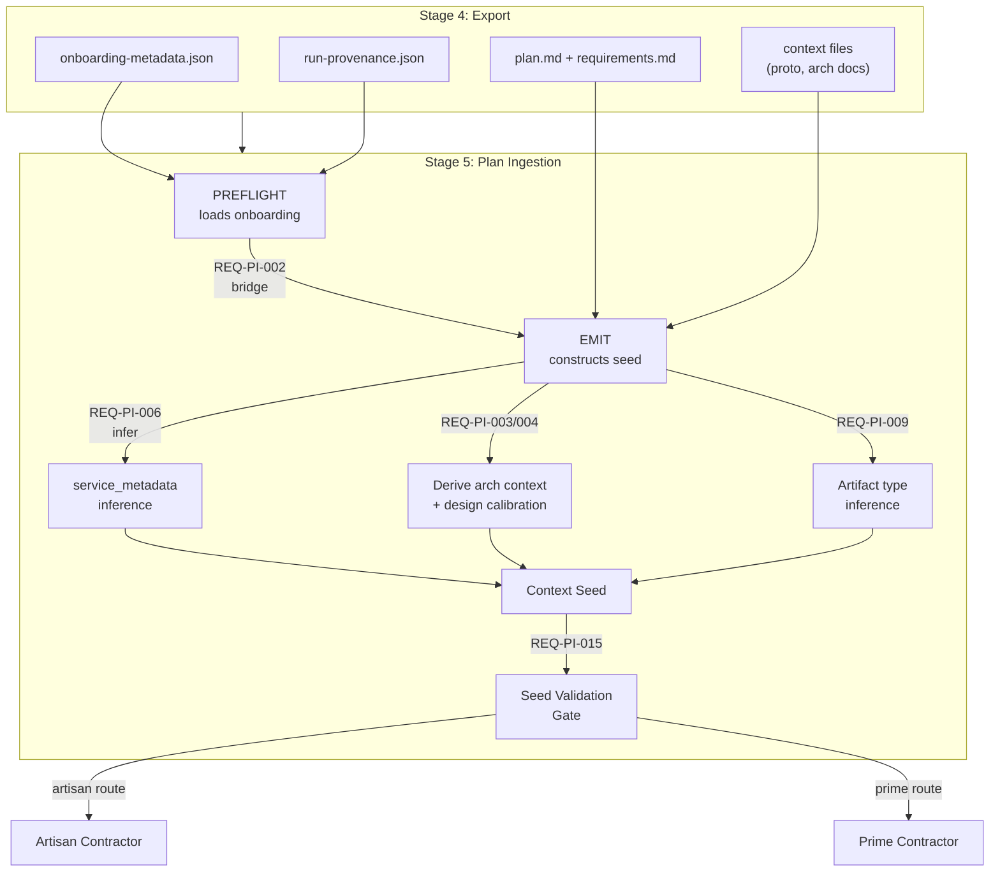

# Plan Ingestion (Stage 5) — Functional Requirements

**Version:** 1.0.0
**Created:** 2026-02-20
**Source:** Run 2 post-mortem, Mottainai fix plan (F3, G1–G8, G16), pipeline requirements audit

---

## Overview

Plan ingestion is Stage 5 of the Capability Delivery Pipeline. It is the critical translation boundary between ContextCore export output (stages 0–4) and the code generation contractors (stage 6). Plan ingestion constructs the context seed that drives all downstream generation.

Prior to this document, Stage 5 had a single requirement: REQ-CDP-INT-002 (Translation Quality Gate). The Run 2 post-mortem and Mottainai analysis identified **8+ gaps** in plan ingestion data flow, including the root cause of why AR-144/AR-147 validators were no-ops (missing `service_metadata`).

**Primary source file:** `src/startd8/workflows/builtin/plan_ingestion_workflow.py`

### Status Dashboard

| Layer | ID Range | Total | Implemented | Planned |
|-------|----------|-------|-------------|---------|
| Seed Construction | REQ-PI-001–005 | 5 | 0 | 5 |
| Service Metadata | REQ-PI-006–008 | 3 | 0 | 3 |
| Task Decomposition | REQ-PI-009–010 | 2 | 0 | 2 |
| Route Parity | REQ-PI-011–012 | 2 | 0 | 2 |
| Context File Management | REQ-PI-013–014 | 2 | 0 | 2 |
| Quality Gates | REQ-PI-015–016 | 2 | 0 | 2 |
| **Total** | | **16** | **0** | **16** |

---

## Data Flow



---

## Layer 1: Seed Construction (REQ-PI-001–005)

### REQ-PI-001: Seed Completeness

**Status:** planned
**Closes:** Mottainai Gaps 1–8 (data prerequisite)
**Source files:** `plan_ingestion_workflow.py` (~line 2668, artisan route)

The emitted seed MUST include ALL non-null fields from the loaded onboarding metadata.

**Acceptance criteria:**
- The seed `onboarding` object MUST include all of:
  - `derivation_rules` (G1)
  - `resolved_parameters` / `resolved_artifact_parameters` (G2)
  - `output_contracts` (G3)
  - `dependency_graph` (G4)
  - `refine_suggestions` (G5) — populated by [REQ-RF-004](REFINE_FORWARDING_REQUIREMENTS.md#req-rf-004-inject-accepted-suggestions-into-artisan-seed)
  - `calibration_hints` (G6)
  - `open_questions` (G7)
  - `service_metadata` (G16, if present)
- Fields that are null/empty in the source MUST still be included as null/empty (not omitted) so downstream consumers can distinguish "absent" from "not propagated"

---

### REQ-PI-002: Onboarding Data Bridging

**Status:** planned
**Closes:** Mottainai Failure 3
**Source files:** `plan_ingestion_workflow.py` (~line 2615, `_phase_emit`)

Onboarding metadata loaded during PREFLIGHT MUST be passed through to the EMIT phase without re-loading.

**Acceptance criteria:**
- `_phase_emit` MUST accept an `onboarding_metadata: Optional[Dict]` parameter
- EMIT MUST use the passed onboarding, falling back to `_load_onboarding_metadata()` only if the parameter is None
- The call site (~line 3242) MUST pass `onboarding_metadata=onboarding_metadata`
- If neither source has data, continue without onboarding (graceful degradation)

---

### REQ-PI-003: Architectural Context Derivation

**Status:** planned
**Closes:** Mottainai Gap 11 (prerequisite)
**Source files:** `plan_ingestion_workflow.py` (artisan route ~line 2720, prime route ~line 2803)

Both artisan and prime seeds MUST include `architectural_context`.

**Acceptance criteria:**
- The artisan route already calls `_derive_architectural_context()` — no change needed
- The prime route currently sets `architectural_context=None` — it MUST call `_derive_architectural_context()` using the same logic as the artisan route
- `architectural_context` MUST include: technology stack, service interaction patterns, shared dependencies

---

### REQ-PI-004: Design Calibration Derivation

**Status:** planned
**Closes:** Mottainai Gap 12 (prerequisite)
**Source files:** `plan_ingestion_workflow.py` (prime route ~line 2803)

Both artisan and prime seeds MUST include `design_calibration`.

**Acceptance criteria:**
- The artisan route already derives design calibration — no change needed
- The prime route currently sets `design_calibration=None` — it MUST call `_derive_design_calibration()` using the same logic
- `design_calibration` MUST include: `implement_max_output_tokens`, depth hints per artifact type

---

### REQ-PI-005: Plan Document Path

**Status:** planned
**Closes:** Mottainai Gap 8 (plan document availability)
**Source files:** `plan_ingestion_workflow.py`

The seed MUST include `artifacts.plan_document_path` pointing to the ingested plan.

**Acceptance criteria:**
- `artifacts.plan_document_path` MUST be a valid file path to the plan document
- The plan document MUST be the post-ingestion version (with traceability markers)
- Both artisan and prime seeds MUST include this field

---

## Layer 2: Service Metadata (REQ-PI-006–008)

### REQ-PI-006: Service Metadata Inference

**Status:** planned
**Closes:** Mottainai Gap 16 (service_metadata not produced)
**Source files:** `plan_ingestion_workflow.py` (~line 2650, new function)

When onboarding metadata lacks `service_metadata`, plan ingestion MUST infer it from plan content.

**Acceptance criteria:**
- Inference heuristics:
  - Protocol indicators in plan text: `Flask`, `FastAPI`, `http`, `REST` → `http`; `gRPC`, `protobuf`, `pb2_grpc`, `proto` → `grpc`
  - Protocol indicators in requirements text: `grpcio` → `grpc`; `flask`, `fastapi`, `django` → `http`
  - Dockerfile patterns in task targets: `grpc_health_probe` → `grpc`; `curl` healthcheck → `http`
- When onboarding already has `service_metadata`, use it (no inference)
- When inference fails (ambiguous or no indicators), omit the field and log a warning
- Inference results MUST be logged: "Inferred service_metadata for {service}: {protocol}"

---

### REQ-PI-007: Service Metadata Schema

**Status:** planned
**Source files:** `plan_ingestion_workflow.py`

Each service entry in `service_metadata` MUST follow a consistent schema.

**Acceptance criteria:**
- Schema per service:
  ```json
  {
    "service_name": "string",
    "transport_protocol": "grpc" | "http",
    "healthcheck_type": "grpc_health_probe" | "curl" | "none",
    "port": 8080
  }
  ```
- `transport_protocol` is REQUIRED
- `healthcheck_type` defaults to: `grpc_health_probe` for grpc, `none` for http
- `port` defaults to 8080 if not determinable from plan/requirements

---

### REQ-PI-008: Service Metadata Propagation

**Status:** planned
**Source files:** `plan_ingestion_workflow.py` (seed construction)

`service_metadata` MUST be present in both artisan and prime seeds.

**Acceptance criteria:**
- `service_metadata` MUST be a top-level field in the seed (not nested under `onboarding`)
- Both artisan and prime route seed constructors MUST include it
- Downstream consumers (AR-144, AR-147, AR-810, REQ-PC-007) MUST be able to access it via `context.get("service_metadata")`

---

## Layer 3: Task Decomposition (REQ-PI-009–010)

### REQ-PI-009: Artifact Type Inference

**Status:** planned
**Closes:** Removes `artifact_types_addressed: []` blocker for Mottainai Gaps 1–7
**Source files:** `plan_ingestion_workflow.py` (~line 1962, `_derive_tasks_from_features`)

When features have empty `artifact_types_addressed`, plan ingestion MUST infer artifact types from target file patterns.

**Acceptance criteria:**
- Inference rules:
  - `Dockerfile` in target path → `"dockerfile"`
  - `requirements.in`, `requirements.txt`, `go.mod`, `package.json`, `pom.xml`, `*.csproj` → `"dependency_manifest"`
  - `.py` → `"source_module"`
  - `.go` → `"source_module"`
  - `.js`, `.ts` → `"source_module"`
  - `.java` → `"source_module"`
  - `.cs` → `"source_module"`
  - `.proto` → `"proto_contract"`
- Inferred types MUST be set on the task's `artifact_types_addressed` field
- If inference produces no types (unknown file extension), leave empty and log a warning
- Original non-empty `artifact_types_addressed` MUST NOT be overwritten

---

### REQ-PI-010: Task Enrichment Completeness

**Status:** planned
**Source files:** `plan_ingestion_workflow.py`

Each task in the seed MUST carry enrichment metadata for downstream phases.

**Acceptance criteria:**
- Each task MUST include:
  - `estimated_loc`: line count estimate (from plan or heuristic)
  - `artifact_types_addressed`: populated (from plan or inferred per REQ-PI-009)
  - `design_doc_sections`: suggested sections for design phase calibration
- Missing enrichment fields MUST default to sensible values, not null

---

## Layer 4: Route Parity (REQ-PI-011–012)

### REQ-PI-011: Route-Agnostic Seed Quality

**Status:** planned
**Source files:** `plan_ingestion_workflow.py` (artisan route ~line 2668, prime route ~line 2779)

The prime seed MUST contain the same structural fields as the artisan seed.

**Acceptance criteria:**
- Both seeds MUST include: `onboarding`, `architectural_context`, `design_calibration`, `service_metadata`, `artifacts.plan_document_path`
- The prime seed MUST NOT have null values for fields that are non-null in the artisan seed
- Route selection MUST NOT reduce seed quality — the difference is in how the seed is consumed, not in its content

---

### REQ-PI-012: Route Selection Logging

**Status:** planned
**Source files:** `plan_ingestion_workflow.py`

The selected route and selection criteria MUST be logged.

**Acceptance criteria:**
- Log MUST include: selected route (artisan/prime), complexity score, feature count, selection reason
- If route is forced (via `--force-artisan` / `--force-prime`), log the override
- Route selection MUST be recorded in the seed metadata for downstream traceability

---

## Layer 5: Context File Management (REQ-PI-013–014)

### REQ-PI-013: Context File Completeness

**Status:** planned
**Source files:** `plan_ingestion_workflow.py`, `resolve-provenance.py`

All files referenced by the provenance chain MUST be included in the seed's `context_files` list.

**Acceptance criteria:**
- `context_files` MUST include: plan document, requirements document, all proto files, architecture docs
- Files referenced in the plan or requirements but not in `context_files` MUST produce a warning
- Missing context files MUST NOT cause a failure (graceful degradation) but MUST be logged

---

### REQ-PI-014: Onboarding Metadata Inclusion

**Status:** planned
**Source files:** `resolve-provenance.py` (~line 90)

`onboarding-metadata.json` MUST always be included in `context_files`.

**Acceptance criteria:**
- After building the `context_files` list, check for `onboarding-metadata.json` in the export directory
- If present, add it to `context_files`
- This is a belt-and-suspenders measure for REQ-PI-002 (which bridges the data in-memory)

---

## Layer 6: Quality Gates (REQ-PI-015–016)

### REQ-PI-015: Seed Validation Gate

**Status:** planned
**Source files:** `plan_ingestion_workflow.py`

After seed construction, a validation pass MUST verify critical fields.

**Acceptance criteria:**
- Validation checks:
  - `onboarding` is present (at least partially populated)
  - `architectural_context` is non-null
  - `tasks` list is non-empty
  - `artifacts.plan_document_path` exists on disk
  - `service_metadata` is present for service-generating projects
- Validation failures produce WARNINGS (not blocking in v1)
- Validation results MUST be included in the ingestion report

---

### REQ-PI-016: Service Metadata Coverage

**Status:** planned
**Source files:** `plan_ingestion_workflow.py`

If the plan references services, `service_metadata` MUST cover all of them.

**Acceptance criteria:**
- Scan task targets for service indicators (Dockerfiles, server implementations)
- For each detected service, check that `service_metadata` has a matching entry
- Missing coverage produces a WARNING with the list of uncovered services
- Full coverage produces an INFO log: "service_metadata covers N/N services"

---

## Traceability Matrix

### Requirement → Source File

| Requirement | Primary Source File | Secondary Files |
|-------------|-------------------|-----------------|
| REQ-PI-001..005 | `src/startd8/workflows/builtin/plan_ingestion_workflow.py` | |
| REQ-PI-006..008 | `src/startd8/workflows/builtin/plan_ingestion_workflow.py` | `src/contextcore/utils/onboarding.py` (upstream) |
| REQ-PI-009..010 | `src/startd8/workflows/builtin/plan_ingestion_workflow.py` | |
| REQ-PI-011..012 | `src/startd8/workflows/builtin/plan_ingestion_workflow.py` | |
| REQ-PI-013..014 | `src/startd8/workflows/builtin/plan_ingestion_workflow.py` | `resolve-provenance.py` (process folder) |
| REQ-PI-015..016 | `src/startd8/workflows/builtin/plan_ingestion_workflow.py` | |

### Requirement → Mottainai Gap

| Requirement | Mottainai Gap | Description |
|-------------|---------------|-------------|
| REQ-PI-001 | G1–G8 | Seed completeness (data prerequisite) |
| REQ-PI-002 | F3 | Onboarding not bridged from PREFLIGHT to EMIT |
| REQ-PI-003 | G11 | Architectural context null for prime |
| REQ-PI-004 | G12 | Design calibration null for prime |
| REQ-PI-005 | G8 | Plan document not available |
| REQ-PI-006 | G16 | service_metadata not produced (inference fallback) |
| REQ-PI-009 | (blocker) | artifact_types_addressed always empty |
| REQ-PI-011 | G10–G13 | Prime seed quality lower than artisan |

### Requirement → Downstream Dependency

| Requirement | Downstream Consumer | Impact if Missing |
|-------------|-------------------|-------------------|
| REQ-PI-006..008 | AR-144, AR-147, AR-810, REQ-PC-007 | Protocol validators degrade to no-ops |
| REQ-PI-009 | AR-125/137 (parameter sources), onboarding enrichment | 4/7 onboarding fields permanently gated off |
| REQ-PI-001..002 | AR-120..126 (design phase), REQ-PC-001..004 | Design lacks calibration, context, parameters |
| REQ-PI-011 | REQ-PC-001..004 | Prime generates with minimal context |

---

## Implementation Priority

| Phase | Requirements | Priority | Impact |
|-------|-------------|----------|--------|
| 1. Seed construction fixes | REQ-PI-001, 002, 003, 004, 005 | **High** | Closes Mottainai F3, enables G1-G8 |
| 2. Service metadata | REQ-PI-006, 007, 008 | **High** | Unblocks AR-144/147/810 validators |
| 3. Artifact type inference | REQ-PI-009, 010 | **High** | Unblocks onboarding enrichment injection |
| 4. Route parity | REQ-PI-011, 012 | **Medium** | Prime seed matches artisan quality |
| 5. Context files | REQ-PI-013, 014 | **Medium** | Belt-and-suspenders completeness |
| 6. Quality gates | REQ-PI-015, 016 | **Low** | Seed validation (advisory in v1) |

---

## Related Documents

| Document | Relationship |
|----------|-------------|
| [`ARTISAN_REQUIREMENTS.md`](ARTISAN_REQUIREMENTS.md) | Downstream consumer (AR-144, AR-147, AR-810 depend on seed quality) |
| [`PRIME_CONTRACTOR_REQUIREMENTS.md`](PRIME_CONTRACTOR_REQUIREMENTS.md) | Downstream consumer (REQ-PC-001..007 depend on seed quality) |
| [`MOTTAINAI_FIX_PLAN.md`](../../../Processes/cap-dev-pipe-test/MOTTAINAI_FIX_PLAN.md) | Phases 0, 1, 2 implement these requirements |
| [`ARTISAN_RUN2_POSTMORTEM.md`](../../../Processes/cap-dev-pipe-test/design/ARTISAN_RUN2_POSTMORTEM.md) | Source: service_metadata absence, design compression root cause |
| [`PIPELINE_REQUIREMENTS_INDEX.md`](../../../Processes/cap-dev-pipe-prod/PIPELINE_REQUIREMENTS_INDEX.md) | Master index (this doc expands Stage 5 from 1 to 17 requirements) |
| REQ-CDP-INT-002 | Existing Stage 5 requirement (translation quality gate) — complementary |
| [`REFINE_FORWARDING_REQUIREMENTS.md`](REFINE_FORWARDING_REQUIREMENTS.md) | Populates `refine_suggestions` in seed (REQ-RF-004/005), closing Mottainai Gap 5 dependency for REQ-PI-001 |
