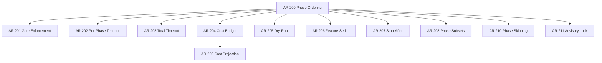
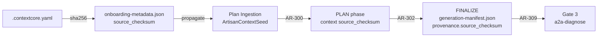
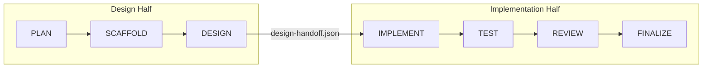

# Artisan Contractor Workflow — Functional Requirements

**Version:** 1.0.0
**Created:** 2026-02-14
**Canonical Source:** [`docs/capability-index/startd8.artisan.functional-requirements.yaml`](capability-index/startd8.artisan.functional-requirements.yaml)

---

## Overview

This document provides narrative context, dependency diagrams, and a traceability matrix for the 108 formal functional requirements defined in the canonical YAML. The artisan contractor is a 7-phase workflow orchestrator for structured multi-task code generation with design review, cost budget enforcement, and checkpoint-based recovery.

### Status Dashboard

| Layer | ID Range | Total | Implemented | Partial | Planned |
|-------|----------|-------|-------------|---------|---------|
| Phase Behavior | AR-1xx | 39 | 30 | 0 | 9 |
| Orchestration | AR-2xx | 12 | 9 | 0 | 3 |
| ContextCore Data Flow | AR-3xx | 12 | 2 | 0 | 10 |
| Cost Model | AR-4xx | 8 | 6 | 1 | 1 |
| Handoff and Recovery | AR-5xx | 12 | 8 | 0 | 4 |
| Observability | AR-6xx | 8 | 6 | 0 | 2 |
| Configuration | AR-7xx | 8 | 8 | 0 | 0 |
| Safety and Resilience | AR-8xx | 11 | 6 | 0 | 5 |
| **Total** | | **110** | **75** | **1** | **34** |

---

## Layer 1: Phase Behavior (AR-1xx)

Defines input, behavior, and output contracts for each of the 7 phases.

### Pipeline Data Flow


### Per-Phase Context Keys

| Phase | Context Keys Set | Source |
|-------|-----------------|--------|
| PLAN | `tasks`, `task_index`, `plan_title`, `plan_goals`, `domain_summary`, `preflight_summary`, `total_estimated_loc`, `architectural_context`, `design_calibration`, `example_artifacts` | AR-100 |
| SCAFFOLD | `scaffold` (directories_needed, directories_exist, directories_created, existing_target_files, skipped_targets, project_root) | AR-110 |
| DESIGN | `design_results` (per-task: design_document, status, agreed, iterations, cost, design_mode, existing_file_inventory) | AR-120, AR-127 |
| IMPLEMENT | `implementation`, `generation_results`, `_downstream_map` | AR-130 |
| TEST | `test_results` (test_plan, total_passed, total_failed, per_task) | AR-140..AR-147 |
| REVIEW | `review_results` (review_items, total_cost, total_passed, total_failed, per_task) | AR-150 |
| FINALIZE | `workflow_summary` | AR-160 |

---

## Layer 2: Orchestration (AR-2xx)

Controls phase sequencing, gate enforcement, timeout, budget, and execution modes.



### Execution Modes

| Mode | Config | Behavior | Requirements |
|------|--------|----------|-------------|
| **Phase-serial** (default) | `feature_serial=False` | All tasks complete each phase before moving to next | AR-200 |
| **Feature-serial** | `feature_serial=True` | Each task completes DESIGN->IMPLEMENT->TEST->REVIEW before next task | AR-206 |
| **Dry-run** | `dry_run=True` | All phases execute but skip LLM calls; cost=0 | AR-205 |
| **Design-only** | `--stop-after design` | PLAN->SCAFFOLD->DESIGN, writes handoff | AR-207, AR-208 |
| **Implement-only** | loads handoff | IMPLEMENT->TEST->REVIEW->FINALIZE | AR-208 |

---

## Layer 3: ContextCore Data Flow (AR-3xx)

Closes the data flow gaps between ContextCore export output and the artisan workflow. This is the primary new requirement layer identified by the pipeline audit.

### Provenance Chain



### Enrichment Data Flow

| Onboarding Field | Propagation | Consumption | Requirements |
|-----------------|-------------|-------------|-------------|
| `source_checksum` | seed -> PLAN context | FINALIZE manifest | AR-300, AR-301, AR-302 |
| `parameter_sources` | seed -> PLAN context | DESIGN prompts, IMPLEMENT chunks | AR-303, AR-304, AR-305, AR-125, AR-137 |
| `semantic_conventions` | seed -> PLAN context | DESIGN prompts, IMPLEMENT chunks | AR-306, AR-126 |
| `output_conventions` | seed -> PLAN context | SCAFFOLD validation | AR-307, AR-111 |
| `design_calibration_hints` | onboarding -> context | DESIGN cross-check | AR-308 |
| `coverage_gaps` | onboarding -> seed | PLAN scoping | AR-311 |

---

## Layer 4: Cost Model (AR-4xx)

Defines the 3-tier model architecture, budget enforcement, and cost reporting.

### Model Tier Architecture

| Role | Catalog Entry | Default Agent | Purpose |
|------|--------------|---------------|---------|
| Drafter | `DRAFT_MODEL_CLAUDE_HAIKU` | `anthropic:claude-haiku-4-5-20251001` | Fast, cheap generation | 
| Validator | `VALIDATE_MODEL_CLAUDE_SONNET` | `anthropic:claude-sonnet-4-5-20250929` | Balanced quality gating |
| Reviewer | `REVIEW_MODEL_CLAUDE_OPUS` | `anthropic:claude-opus-4-6` | Flagship independent review |

> **Runtime note:** `HandlerConfig.lead_agent` defaults to Opus, making the default artisan runtime 2-tier (Haiku + Opus). Sonnet is the validator default for standalone `LeadContractorCodeGenerator`. Set `--lead-agent` to Sonnet for the full 3-tier split.

---

## Layer 5: Handoff and Recovery (AR-5xx)

Supports split execution and checkpoint-based recovery.

### Two-Half Split



### Checkpoint Schema

| Field | Type | Version | Description |
|-------|------|---------|-------------|
| `workflow_id` | str | v1+ | Unique workflow identifier |
| `last_completed_phase` | str | v1+ | Phase name of last completion |
| `phase_results` | list | v1+ | Per-phase result history |
| `cumulative_cost` | float | v1+ | Total USD spent |
| `schema_version` | int | v2 | Currently 2 |
| `completed_features` | list | v2+ | Feature-serial tracking |
| `current_feature` | str | v2+ | Active feature ID |
| `current_feature_phase` | str | v2+ | Active inner phase |
| `feature_partial_results` | dict | v2+ | Per-feature partial state |

---

## Layer 6: Observability (AR-6xx)

OTel span hierarchy, events, and output manifests.

### Span Hierarchy

```
workflow.{workflow_id}                    # Root span (AR-600)
  ├── workflow.{id}.plan                  # Phase span (AR-601)
  ├── workflow.{id}.scaffold
  ├── workflow.{id}.design
  ├── workflow.{id}.implement
  ├── workflow.{id}.test
  ├── workflow.{id}.review
  └── workflow.{id}.finalize
```

### Output Files

| File | Written By | Contents | Requirement |
|------|-----------|----------|-------------|
| `generation-manifest.json` | FINALIZE | Artifacts with sha256, task status, cost | AR-604 |
| `workflow-execution-report.json` | FINALIZE | Full execution report | AR-162 |
| `.events.jsonl` | Orchestrator | Append-only event log | AR-605 (planned) |

---

## Layer 7: Configuration (AR-7xx)

All configuration is fully implemented.

### Configuration Priority Chain

```
CLI flags (--lead-agent, --cost-budget, ...)     # Highest priority
    ↓
Environment / Config file (ConfigManager)         # Middle priority
    ↓
Dataclass defaults (HandlerConfig, WorkflowConfig) # Lowest priority
```

### Key CLI Flags

| Flag | Maps To | Requirement |
|------|---------|-------------|
| `--seed PATH` | Runner arg | AR-100 |
| `--dry-run` | `WorkflowConfig.dry_run` | AR-205 |
| `--cost-budget FLOAT` | `WorkflowConfig.cost_budget` | AR-204 |
| `--timeout FLOAT` | `WorkflowConfig.total_timeout_seconds` | AR-203 |
| `--stop-after PHASE` | Phase subset | AR-207 |
| `--lead-agent SPEC` | `HandlerConfig.lead_agent` | AR-703 |
| `--drafter-agent SPEC` | `HandlerConfig.drafter_agent` | AR-703 |
| `--design-max-tokens INT` | `HandlerConfig.design_max_tokens` | AR-705 |
| `--no-auto-commit` | Disable auto-commit | AR-707 |
| `--force-implement` | Clear cached results | AR-706 |
| `--adopt-prior [PATH]` | Load prior designs | AR-507 |
| `--resume` | Load checkpoint | AR-506 |

---

## Layer 8: Safety and Resilience (AR-8xx)

Defense-in-depth measures for the generation pipeline.

### Implemented Safety Gates

| Gate | Phase | What It Catches | Requirement |
|------|-------|----------------|-------------|
| Pre-flight | Before PLAN | Missing deps, bad config, zero cost | AR-800 |
| Domain checklist | DESIGN/IMPLEMENT | Domain-specific constraint violations | AR-801 |
| Truncation detection | IMPLEMENT | Incomplete LLM output | AR-802 |
| LOC mismatch | IMPLEMENT | Design implies more code than estimated | AR-803 |
| Multi-file completeness | After IMPLEMENT | Missing files in multi-file tasks | AR-804 |
| Semantic validators | TEST | Placeholder, import, proto, protocol, Dockerfile defects | AR-143..AR-147 |
| Service metadata preflight | Before PLAN | Missing service metadata for service-related tasks | AR-810 |

### Planned Safety Features

| Feature | What It Prevents | Requirement |
|---------|-----------------|-------------|
| Interactive mode | Blind acceptance of LLM output | AR-805 |
| Escalation pause | Unresolved design disagreements proceeding to implementation | AR-806 |
| Git tag restore points | Inability to rollback after bad generation | AR-807 |
| Advisory file lock | Concurrent workflow corruption | AR-808 |
| Stalled retry detection | Wasting tokens on non-converging drafts | AR-809 |

---

## Traceability Matrix

### Requirement to Source File

| Requirement | Primary Source File | Secondary Files |
|-------------|-------------------|-----------------|
| AR-100..AR-102 | `src/startd8/contractors/context_seed_handlers.py` (PlanPhaseHandler) | |
| AR-110..AR-111 | `src/startd8/contractors/context_seed_handlers.py` (ScaffoldPhaseHandler) | |
| AR-120..AR-126 | `src/startd8/contractors/context_seed_handlers.py` (DesignPhaseHandler) | `artisan_phases/design_documentation.py` |
| AR-127 | `src/startd8/contractors/context_seed_handlers.py` (DesignPhaseHandler) | Reuses `scaffold.existing_target_files` from ScaffoldPhaseHandler |
| AR-128 | `src/startd8/contractors/context_seed_handlers.py` (ImplementPhaseHandler) | `handoff.py`, `artisan_phases/development.py` |
| AR-130..AR-137 | `src/startd8/contractors/context_seed_handlers.py` (ImplementPhaseHandler) | `artisan_phases/development.py` |
| AR-140..AR-142 | `src/startd8/contractors/context_seed_handlers.py` (TestPhaseHandler) | |
| AR-143..AR-147 | `src/startd8/contractors/artisan_phases/self_consistency.py` | `context_seed_handlers.py` (Gate 3b), `rules_validators.py` |
| AR-150..AR-152 | `src/startd8/contractors/context_seed_handlers.py` (ReviewPhaseHandler) | |
| AR-160..AR-165 | `src/startd8/contractors/context_seed_handlers.py` (FinalizePhaseHandler) | |
| AR-200..AR-211 | `src/startd8/contractors/artisan_contractor.py` | `scripts/run_artisan_workflow.py` |
| AR-300..AR-311 | `src/startd8/contractors/context_seed_handlers.py` | `workflows/builtin/plan_ingestion_workflow.py` |
| AR-400..AR-407 | `src/startd8/contractors/protocols.py` | `artisan_contractor.py`, `context_seed_handlers.py` |
| AR-500..AR-511 | `src/startd8/contractors/handoff.py` | `artisan_contractor.py` |
| AR-600..AR-607 | `src/startd8/contractors/artisan_contractor.py` | `context_seed_handlers.py` |
| AR-700..AR-707 | `src/startd8/contractors/context_seed_handlers.py` | `scripts/run_artisan_workflow.py` |
| AR-800..AR-810 | `src/startd8/contractors/artisan_phases/preflight.py` | `context_seed_handlers.py`, `artisan_contractor.py`, `rules_common.py` |

### Requirement to Test File

| Requirement | Test File(s) |
|-------------|-------------|
| AR-100..AR-102 | `tests/unit/contractors/test_artisan_plan_deconstruction.py` |
| AR-110 | `tests/unit/contractors/test_7phase_integration.py` |
| AR-120..AR-124 | `tests/unit/contractors/test_design_phase_handler.py`, `test_design_quality_context.py`, `test_artisan_design_documentation.py` |
| AR-130..AR-136 | `tests/unit/contractors/test_implement_phase_integration.py`, `test_implement_auto_commit.py` |
| AR-140..AR-142 | `tests/unit/contractors/test_context_seed_review_finalize.py`, `test_artisan_test_construction.py` |
| AR-143..AR-147 | `tests/unit/contractors/test_self_consistency_validators.py`, `test_gate3b_content_validation.py` |
| AR-150..AR-152 | `tests/unit/contractors/test_review_phase_handler.py`, `test_context_seed_review_finalize.py` |
| AR-160..AR-163 | `tests/unit/contractors/test_context_seed_review_finalize.py` |
| AR-200..AR-208 | `tests/unit/contractors/test_7phase_integration.py`, `tests/e2e/contractors/test_artisan_e2e.py` |
| AR-202..AR-203 | `tests/e2e/contractors/test_artisan_timeout.py` |
| AR-205 | `tests/e2e/contractors/test_artisan_dry_run.py` |
| AR-206 | `tests/unit/contractors/test_feature_serial_checkpoint.py` |
| AR-310..AR-311 | `tests/unit/test_plan_ingestion_workflow.py` |
| AR-400..AR-401 | `tests/unit/contractors/test_artisan_models.py`, `tests/unit/test_artisan_config.py` |
| AR-402..AR-404 | `tests/e2e/contractors/test_artisan_resume.py`, `test_artisan_e2e.py` |
| AR-500..AR-504 | `tests/unit/contractors/test_handoff.py` |
| AR-505..AR-506 | `tests/e2e/contractors/test_artisan_resume.py` |
| AR-700..AR-703 | `tests/unit/test_artisan_config.py` |
| AR-800 | `tests/unit/contractors/test_artisan_preflight.py`, `tests/e2e/contractors/test_artisan_preflight_failure.py` |
| AR-806 | `tests/e2e/contractors/test_artisan_escalation.py` |
| AR-810 | `tests/unit/test_service_metadata_preflight.py` |

### Test Coverage Gaps

Requirements with no `verified_by` test file (need new tests):

| Requirement | Status | What Needs Testing |
|-------------|--------|-------------------|
| AR-127, AR-128 | planned | Existing file detection, design_mode propagation, update-mode prompt constraints, post-generation line-reduction validation |
| AR-111 | planned | SCAFFOLD output_conventions validation |
| AR-125, AR-126 | planned | DESIGN parameter_sources / semantic_conventions injection |
| AR-137 | planned | IMPLEMENT parameter_sources in chunk metadata |
| AR-164, AR-165 | planned | FINALIZE provenance block and Gate 3 compatibility |
| AR-300..AR-309 | planned | All ContextCore data flow (provenance chain, enrichment consumption) |
| AR-405 | planned | Cost projection gate |
| AR-508..AR-511 | planned | Recovery hardening (chunk resume, config drift, state integrity, migration) |
| AR-605, AR-606 | planned | Event JSONL externalization and dedup |
| AR-805, AR-807..AR-809 | planned | Interactive mode, git tags, advisory lock, stalled retry |

---

## Implementation Priority

| Phase | Requirements | Priority | Impact |
|-------|-------------|----------|--------|
| 0. Update-First Design Mode | AR-127, AR-128 | **Critical** | Prevents A-15 production file destruction |
| ~~1b. Semantic Validators~~ | ~~AR-143..AR-147, AR-810~~ | ~~**High**~~ | ~~DONE — Commits `bed77d5`, `dc3c241`~~ |
| 1. ContextCore Data Flow Fixes | AR-300..AR-302, AR-164, AR-165 | **High** | Closes provenance chain, enables Gate 3 |
| 2. Onboarding Metadata Consumption | AR-303..AR-308, AR-111, AR-125..AR-126, AR-137 | **Medium** | Enriches code generation with export data |
| 3. Recovery Hardening | AR-508..AR-511 | **Medium** | Robust resume across config changes |
| 4. Orchestration Enhancements | AR-209..AR-211, AR-405, AR-809 | **Low** | Cost projection, operational safety |
| 5. Interactive and Git Safety | AR-605..AR-606, AR-805..AR-808 | **Low** | Interactive operation, event durability |

---

## Related Documents

| Document | Relationship |
|----------|-------------|
| [`startd8.artisan.functional-requirements.yaml`](capability-index/startd8.artisan.functional-requirements.yaml) | Canonical YAML (this doc is the companion) |
| [`PLAN-artisan-contractor.md`](PLAN-artisan-contractor.md) | Implementation plan (source for planned requirements) |
| [`ARTISAN_WORKFLOW_GUIDE.md`](ARTISAN_WORKFLOW_GUIDE.md) | User/developer guide |
| [`plans/ARTISAN_CONTEXTCORE_DATA_FLOW_FIXES.md`](plans/ARTISAN_CONTEXTCORE_DATA_FLOW_FIXES.md) | Code fix plan for AR-3xx |
| [`startd8.workflow.functional-requirements.yaml`](capability-index/startd8.workflow.functional-requirements.yaml) | Workflow framework requirements (FR-1xx..FR-5xx) |
| [`PLAN_INGESTION_CONTEXTCORE_RECOMMENDATIONS.md`](PLAN_INGESTION_CONTEXTCORE_RECOMMENDATIONS.md) | Upstream ingestion design recommendations |
