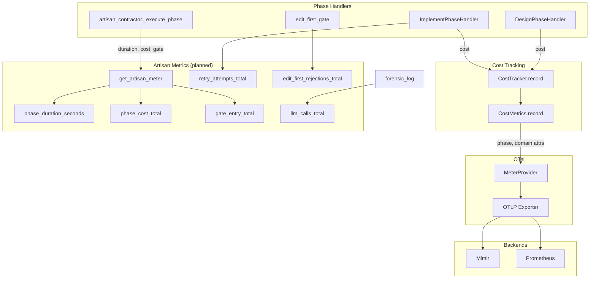

# Artisan Metrics — Requirements

> **Version:** 1.0.0
> **Status:** Draft (AM-1xx, AM-2xx partially implemented; AM-3xx through AM-7xx planned)
> **Date:** 2026-02-24
> **Scope:** OpenTelemetry metrics requirements for the Artisan 8-phase pipeline — cost attribution, phase duration/count, gate outcomes, retries, Edit-First rejections, and Mimir/Prometheus integration
> **Extends:** `ARTISAN_REQUIREMENTS.md` Layer 6 (AR-6xx Observability)
> **Complements:** `ARTISAN_OTEL_FULL_DEPTH_TRACING_REQUIREMENTS.md` (traces), `ARTISAN_LOGGING_REQUIREMENTS.md` (logs) — metrics enable aggregation, dashboards, and alerting; traces provide per-request hierarchy; logs provide searchable events
> **Depends on:** AR-600 (root span), AR-601 (phase spans), AR-403 (per-phase cost), AR-404 (cumulative cost)

---

## Table of Contents

1. [Motivation](#1-motivation)
2. [Design Principles](#2-design-principles)
3. [Requirements](#3-requirements)
   - [Layer 1: Meter Acquisition (AM-1xx)](#layer-1-meter-acquisition-am-1xx)
   - [Layer 2: Cost Metrics (AM-2xx)](#layer-2-cost-metrics-am-2xx)
   - [Layer 3: Phase Metrics (AM-3xx)](#layer-3-phase-metrics-am-3xx)
   - [Layer 4: Gate Metrics (AM-4xx)](#layer-4-gate-metrics-am-4xx)
   - [Layer 5: Operational Metrics (AM-5xx)](#layer-5-operational-metrics-am-5xx)
   - [Layer 6: Mimir/Prometheus Integration (AM-6xx)](#layer-6-mimirprometheus-integration-am-6xx)
   - [Layer 7: Graceful Degradation (AM-7xx)](#layer-7-graceful-degradation-am-7xx)
4. [Metrics Flow Diagram](#4-metrics-flow-diagram)
5. [Traceability Matrix](#5-traceability-matrix)
6. [Status Dashboard](#6-status-dashboard)
7. [Verification](#7-verification)
8. [Related Documents](#8-related-documents)

---

## 1. Motivation

The Artisan pipeline has cost tracking (AR-403, AR-404) and OTel spans (AR-600, AR-601), but metrics for aggregation and dashboards are incomplete:

- **Cost metrics lack Artisan context** — `CostTracker` records costs via `CostMetrics` (startd8.cost.total, input_tokens, output_tokens, per_request) with `model`, `provider`, `project` labels. No `phase` or `domain` attributes for Artisan-specific dashboards (e.g., "cost by phase", "cost by domain").
- **No phase-level aggregations** — Phase duration, task count, and phase cost are captured in span attributes but not as standalone metrics. Grafana dashboards need Prometheus/Mimir queries like `rate(startd8_artisan_phase_duration_seconds_sum[5m])` for SLOs.
- **Gate outcomes invisible to metrics** — Gate pass/fail is logged and span-attributed but not counted. Operators cannot alert on "gate failure rate > 5%".
- **Retries and Edit-First rejections unmeasured** — Retry attempts and Edit-First gate rejections (AR-813) are logged but not emitted as counters for trend analysis.
- **Metric-trace exemplar linkage** — When exemplars are enabled, metrics should carry trace_id for drill-down from Grafana metric panels to Tempo traces.

This document specifies metrics requirements that complement traces and logs. Traces answer "what happened in what order"; logs answer "what did the system report"; metrics answer "how much, how often, and what is the distribution."

---

## 2. Design Principles

| Principle | Source Document | Compliance |
|-----------|----------------|------------|
| Mottainai Rule 6: Measure the Gap | `MOTTAINAI_DESIGN_PRINCIPLE.md` | AM-2xx through AM-5xx measure cost, duration, retries, and gate outcomes — the gaps that represent waste |
| Reuse Existing Infrastructure | `MOTTAINAI_DESIGN_PRINCIPLE.md` | AM-1xx uses existing `CostMetrics`, `configure_metrics()`, MeterProvider; no new export pipeline |
| OTel Semantic Conventions | `otel_conventions.py`, `startd8.observability.manifest.yaml` | AM-6xx aligns metric names and labels with observability manifest |
| Fail Visible, Not Silent | `PATTERN-silent-telemetry-loss.md` | AM-7xx degrades gracefully; no-op when OTel unavailable, no exceptions |
| Low Cardinality Labels | Prometheus best practices | Phase, domain, workflow_id are bounded; task_id excluded from metric labels (use trace for per-task) |

---

## 3. Requirements

### Layer 1: Meter Acquisition (AM-1xx)

Artisan contractor modules that emit metrics must obtain meters via the OTel MeterProvider. Cost tracking uses `CostMetrics`; Artisan-specific metrics use a dedicated meter.

#### AM-100: Artisan Meter

**Status:** planned
**Source:** `artisan_contractor.py`, new `artisan_metrics.py` module

Provide a module-level meter for Artisan-specific metrics, using the same lazy-init and no-op fallback pattern as `CostMetrics`.

**Acceptance criteria:**
1. `get_artisan_meter()` returns `metrics.get_meter("startd8.artisan")` when OTel is available.
2. When OTel is unavailable, returns `None` or a no-op meter wrapper; callers check before recording.
3. Meter is obtained lazily on first use (not at import time).
4. All Artisan-specific metrics (AM-3xx, AM-4xx, AM-5xx) use this meter.

#### AM-101: Cost Metrics Phase/Domain Attributes

**Status:** planned
**Source:** `costs/otel_metrics.py` (`CostMetrics.record`), `costs/tracker.py` (`CostTracker.record`)

Extend `CostRecord` and `CostMetrics.record()` to accept optional `phase` and `domain` attributes for Artisan cost attribution.

**Acceptance criteria:**
1. `CostRecord` (or equivalent) supports optional `phase: str | None` and `domain: str | None`.
2. When recording to OTel, `CostMetrics.record()` includes `phase` and `domain` in attributes when present.
3. CostTracker integration: phase handlers pass `phase` and `domain` when creating cost records.
4. Enables Prometheus queries: `sum by (phase) (rate(startd8_cost_total[5m]))`.

---

### Layer 2: Cost Metrics (AM-2xx)

Cost metrics must be emitted with Artisan context so dashboards can aggregate by phase and domain.

#### AM-200: Per-Phase Cost Counter

**Status:** implemented (via CostTracker + CostMetrics; phase attribute planned)
**Source:** `costs/otel_metrics.py`, `costs/tracker.py`

The existing `startd8.cost.total` counter must support `phase` and `domain` attributes when called from Artisan phases.

**Acceptance criteria:**
1. Design phase: `CostTracker.record()` called with `phase="design"`, `domain` from task.
2. Implement phase: `phase="implement"`, `domain` from task.
3. Review phase: `phase="review"`, `domain` from task.
4. Test phase: `phase="test"` (cost typically 0 for validators; LLM test generation uses `phase="test"`).
5. PLAN, SCAFFOLD, INTEGRATE, FINALIZE: `phase` set accordingly; cost typically 0 for non-LLM phases.
6. `CostMetrics.record()` adds `phase` and `domain` to OTel attributes when provided.

#### AM-201: Per-Request Cost Histogram with Phase

**Status:** implemented (histogram exists; phase attribute planned)
**Source:** `costs/otel_metrics.py`

The existing `startd8.cost.per_request` histogram must support `phase` attribute for percentile analysis by phase.

**Acceptance criteria:**
1. `CostMetrics.record()` includes `phase` in histogram attributes when provided.
2. Enables queries: `histogram_quantile(0.95, rate(startd8_cost_per_request_bucket{phase="implement"}[5m]))`.

---

### Layer 3: Phase Metrics (AM-3xx)

Phase-level metrics enable SLOs, dashboards, and alerting on phase duration and throughput.

#### AM-300: Phase Duration Histogram

**Status:** planned
**Source:** `artisan_contractor.py` (`_execute_phase`)

Emit a histogram of phase duration in seconds.

**Acceptance criteria:**
1. Metric name: `startd8.artisan.phase_duration_seconds`.
2. Instrument: histogram, unit: `s`.
3. Labels: `phase`, `status` (passed|failed|skipped).
4. Recorded at phase exit with duration from phase start.
5. Buckets: [1, 5, 15, 30, 60, 120, 300] seconds (typical phase durations).
6. No-op when `get_artisan_meter()` returns None.

#### AM-301: Phase Cost Counter

**Status:** planned
**Source:** `artisan_contractor.py` (`_execute_phase`)

Emit a counter of cost per phase (redundant with AM-200 when CostTracker is used; provides Artisan-native aggregation).

**Acceptance criteria:**
1. Metric name: `startd8.artisan.phase_cost_total`.
2. Instrument: counter, unit: `USD`.
3. Labels: `phase`, `workflow_id` (optional, for per-run attribution).
4. Incremented at phase exit with phase result cost.
5. No-op when meter unavailable.

#### AM-302: Phase Task Count Histogram

**Status:** planned
**Source:** Phase handlers (`DesignPhaseHandler`, `ImplementPhaseHandler`, etc.)

Emit a histogram of task count per phase per workflow run.

**Acceptance criteria:**
1. Metric name: `startd8.artisan.phase_task_count`.
2. Instrument: histogram (or counter with 1 per phase), unit: `tasks`.
3. Labels: `phase`.
4. Recorded at phase exit with number of tasks processed.
5. Buckets: [1, 2, 5, 10, 20, 50, 100] for task count distribution.

---

### Layer 4: Gate Metrics (AM-4xx)

Gate pass/fail metrics enable alerting on contract validation health.

#### AM-400: Gate Entry Pass Counter

**Status:** planned
**Source:** `artisan_contractor.py` (`_execute_phase`), after gate.entry span

Increment a counter when the entry gate passes.

**Acceptance criteria:**
1. Metric name: `startd8.artisan.gate_entry_total`.
2. Instrument: counter, unit: `1`.
3. Labels: `phase`, `passed` (true|false).
4. Two increments per phase: one with `passed=true`, one with `passed=false` (or single increment with label).
5. Enables query: `rate(startd8_artisan_gate_entry_total{passed="false"}[5m]) / rate(startd8_artisan_gate_entry_total[5m])` for failure rate.

#### AM-401: Gate Exit Pass Counter

**Status:** planned
**Source:** `artisan_contractor.py` (`_execute_phase`), after gate.exit span

Same pattern as AM-400 for exit gate.

**Acceptance criteria:**
1. Metric name: `startd8.artisan.gate_exit_total`.
2. Labels: `phase`, `passed`.
3. Recorded at phase exit.

---

### Layer 5: Operational Metrics (AM-5xx)

Retries, Edit-First rejections, and LLM call counts enable operational visibility.

#### AM-500: Retry Attempt Counter

**Status:** planned
**Source:** `development.py` (LLMChunkExecutor), `test_construction.py`, `design_documentation.py`

Increment a counter when a retry is attempted.

**Acceptance criteria:**
1. Metric name: `startd8.artisan.retry_attempts_total`.
2. Instrument: counter, unit: `1`.
3. Labels: `phase`, `context` (chunk|test|design).
4. Incremented before each retry LLM call.
5. Enables query: `rate(startd8_artisan_retry_attempts_total[5m])` for retry rate trend.

#### AM-501: Edit-First Rejection Counter

**Status:** planned
**Source:** `edit_first_gate.py` (`validate_task_size_regression`, `emit_rejection_telemetry`)

Increment a counter when the Edit-First gate rejects a file (AR-811, AR-813).

**Acceptance criteria:**
1. Metric name: `startd8.artisan.edit_first_rejections_total`.
2. Instrument: counter, unit: `1`.
3. Labels: `phase` (implement), `artifact_type` (when available).
4. Incremented in `emit_rejection_telemetry` alongside OTel span event (AR-813).
5. Complements AR-813 span event with aggregatable counter.

#### AM-502: LLM Call Counter by Phase

**Status:** planned
**Source:** `forensic_log.py` (`emit_forensic_log`), or phase handlers

Increment a counter for each LLM call, with phase and call_type labels.

**Acceptance criteria:**
1. Metric name: `startd8.artisan.llm_calls_total`.
2. Instrument: counter, unit: `1`.
3. Labels: `phase`, `call_type` (design.generate|design.review|implement.chunk|test.generate|review.evaluate|etc.).
4. Incremented at each forensic log emission (OT-701–OT-707) or equivalent.
5. Enables query: `sum by (phase, call_type) (rate(startd8_artisan_llm_calls_total[5m]))`.

---

### Layer 6: Mimir/Prometheus Integration (AM-6xx)

Metrics must be exportable via OTLP to Mimir/Prometheus and conform to naming conventions.

#### AM-600: OTLP Metric Export

**Status:** implemented
**Source:** `otel.py` (`configure_metrics`, `PeriodicExportingMetricReader`, `OTLPMetricExporter`)

Metrics are exported via OTLP to the configured endpoint (Alloy, collector, or Mimir OTLP ingest).

**Acceptance criteria:**
1. `configure_metrics()` creates `MeterProvider` with `PeriodicExportingMetricReader`.
2. Export interval configurable via `OTelConfig.metrics_export_interval_ms` (default 60000).
3. Metrics appear in Mimir when OTLP endpoint is configured.
4. Same endpoint as traces (OTLP gRPC) unless overridden.

#### AM-601: Metric Naming Conventions

**Status:** planned
**Source:** `otel_conventions.py` or new `artisan_metrics_conventions.py`

Artisan metrics use consistent naming: `startd8.artisan.<metric_name>`.

**Acceptance criteria:**
1. All Artisan metrics use prefix `startd8.artisan.`.
2. Names use snake_case: `phase_duration_seconds`, `gate_entry_total`, `retry_attempts_total`.
3. Units are explicit in name when ambiguous: `phase_duration_seconds`, `phase_cost_total` (USD).
4. Observability manifest (`startd8.observability.manifest.yaml`) is updated with new metrics.

#### AM-602: Label Cardinality Control

**Status:** planned
**Source:** This document

Labels must be low-cardinality to avoid Prometheus/Mimir series explosion.

**Acceptance criteria:**
1. Allowed labels: `phase` (8 values), `domain` (bounded by seed), `status` (passed|failed|skipped), `passed` (true|false), `call_type` (~7 values), `artifact_type` (bounded).
2. Excluded from metric labels: `task_id`, `workflow_id` (optional; high cardinality), `chunk_id`, raw file paths.
3. Per-task and per-chunk detail remains in spans and logs; metrics aggregate.

---

### Layer 7: Graceful Degradation (AM-7xx)

When OTel is unavailable or metrics are disabled, metric recording must be a no-op.

#### AM-700: No-Op When OTel Unavailable

**Status:** implemented
**Source:** `costs/otel_metrics.py` (`CostMetrics._ensure_initialized`), `events/otel_bridge.py`

`CostMetrics.record()` and `OTelEventBridge` are no-ops when OTel is not installed or MeterProvider is not configured.

**Acceptance criteria:**
1. `CostMetrics._ensure_initialized()` returns False when OTel unavailable; `record()` returns without raising.
2. `get_artisan_meter()` returns None or no-op wrapper when OTel unavailable.
3. All metric recording sites check for None/no-op before calling `add()` or `record()`.
4. No ImportError or AttributeError when OTel is not installed.

#### AM-701: Metrics Disabled Config

**Status:** implemented
**Source:** `otel.py` (`OTelConfig.enable_metrics`)

`OTelConfig.enable_metrics=False` disables metric configuration.

**Acceptance criteria:**
1. `configure_metrics()` returns None when `config.enable_metrics is False`.
2. CostTracker and Artisan metric recording are no-ops when meter is None.
3. Pipeline continues normally; no metric-related exceptions.

---

## 4. Metrics Flow Diagram



---

## 5. Traceability Matrix

### Source Files → Requirements

| Source File | Implemented | Planned |
|-------------|-------------|---------|
| `src/startd8/otel.py` | AM-600, AM-701 | |
| `src/startd8/costs/otel_metrics.py` | AM-200 (partial), AM-201 (partial), AM-700 | AM-101 |
| `src/startd8/costs/tracker.py` | | AM-101 |
| `src/startd8/contractors/artisan_contractor.py` | | AM-100, AM-300, AM-301, AM-400, AM-401 |
| `src/startd8/contractors/context_seed_handlers.py` | | AM-302 |
| `src/startd8/contractors/edit_first_gate.py` | | AM-501 |
| `src/startd8/contractors/artisan_phases/development.py` | | AM-500 |
| `src/startd8/contractors/artisan_phases/test_construction.py` | | AM-500 |
| `src/startd8/contractors/artisan_phases/design_documentation.py` | | AM-500 |
| `src/startd8/contractors/forensic_log.py` | | AM-502 |
| `docs/capability-index/startd8.observability.manifest.yaml` | | AM-601 |

### Cross-Cutting Requirements → Affected Source Files

| Requirement | Affected Source Files |
|-------------|----------------------|
| AM-100 (Artisan Meter) | New `artisan_metrics.py`, `artisan_contractor.py`, phase handlers |
| AM-101 (Cost phase/domain) | `costs/otel_metrics.py`, `costs/tracker.py`, all phase handlers that record cost |
| AM-601 (Naming) | All modules emitting AM-3xx, AM-4xx, AM-5xx metrics |

### Upstream Requirements (extends)

| This Requirement | Extends | Relationship |
|-----------------|---------|--------------|
| AM-200, AM-201 | AR-403, AR-404 | Cost metrics add phase/domain attribution |
| AM-300, AM-301, AM-302 | AR-601 | Phase metrics aggregate span-level data |
| AM-400, AM-401 | OT-200, OT-201 | Gate metrics count span outcomes |
| AM-501 | AR-813 | Edit-First counter complements span event |
| AM-502 | OT-7xx | LLM call counter complements forensic logs |
| AM-700 | AR-607 | Metrics degrade when OTel degrades |

---

## 6. Status Dashboard

| Layer | ID Range | Total | Implemented | Partial | Planned |
|-------|----------|-------|-------------|---------|---------|
| Meter Acquisition | AM-1xx | 2 | 0 | 0 | 2 |
| Cost Metrics | AM-2xx | 2 | 2 | 2 | 0 |
| Phase Metrics | AM-3xx | 3 | 0 | 0 | 3 |
| Gate Metrics | AM-4xx | 2 | 0 | 0 | 2 |
| Operational Metrics | AM-5xx | 3 | 0 | 0 | 3 |
| Mimir/Prometheus | AM-6xx | 3 | 1 | 0 | 2 |
| Graceful Degradation | AM-7xx | 2 | 2 | 0 | 0 |
| **Total** | | **17** | **5** | **2** | **10** |

> **AM-2xx partial note:** Cost metrics exist and are recorded by CostTracker, but `phase` and `domain` attributes are not yet passed. AM-101/AM-200/AM-201 require extending CostRecord and CostMetrics.record().

---

## 7. Verification

### Unit Tests

```bash
# Cost metrics (existing)
pytest tests/unit/costs/ -v

# Artisan metrics (when implemented)
pytest tests/unit/contractors/test_artisan_metrics.py -v  # planned
```

### Integration Verification

1. **OTLP export** — Run Artisan workflow with OTel configured, verify metrics in Mimir:
   ```promql
   rate(startd8_cost_total[5m])
   ```

2. **Phase attribution** (after AM-101) — Verify phase label on cost metrics:
   ```promql
   sum by (phase) (rate(startd8_cost_total[5m]))
   ```

3. **Gate metrics** (after AM-400) — Verify gate counters:
   ```promql
   rate(startd8_artisan_gate_entry_total[5m])
   ```

4. **Observability manifest** — Regenerate and verify new metrics are declared:
   ```bash
   python scripts/generate_observability_manifest.py
   ```

### Prometheus/Mimir Query Examples

| Use Case | Query |
|----------|-------|
| Cost by phase | `sum by (phase) (increase(startd8_cost_total[1h]))` |
| Phase duration p95 | `histogram_quantile(0.95, rate(startd8_artisan_phase_duration_seconds_bucket[5m]))` |
| Gate failure rate | `rate(startd8_artisan_gate_entry_total{passed="false"}[5m]) / rate(startd8_artisan_gate_entry_total[5m])` |
| Retry rate | `rate(startd8_artisan_retry_attempts_total[5m])` |
| Edit-First rejections | `increase(startd8_artisan_edit_first_rejections_total[1h])` |
| LLM calls by phase | `sum by (phase, call_type) (rate(startd8_artisan_llm_calls_total[5m]))` |

---

## 8. Related Documents

| Document | Relationship |
|----------|--------------|
| `ARTISAN_REQUIREMENTS.md` Layer 6 (AR-6xx) | Parent — observability layer |
| `ARTISAN_OTEL_FULL_DEPTH_TRACING_REQUIREMENTS.md` | Sibling — traces; metrics aggregate span data |
| `ARTISAN_LOGGING_REQUIREMENTS.md` | Sibling — logs; metrics complement with aggregations |
| `MOTTAINAI_DESIGN_PRINCIPLE.md` | Design principle — measure the gap |
| `docs/capability-index/startd8.observability.manifest.yaml` | Metric declarations, dashboard hints |
| `src/startd8/otel.py` | Implementation — configure_metrics, OTLP export |
| `src/startd8/costs/otel_metrics.py` | Implementation — CostMetrics |
| `COST_TRACKING_USER_GUIDE.md` | User guide — cost tracking usage |
