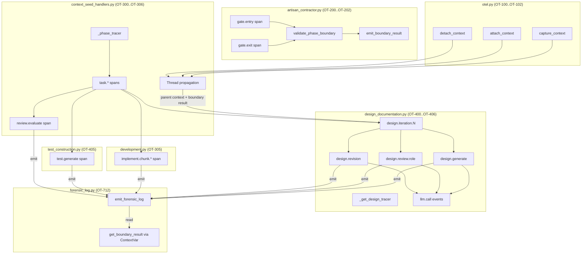

# Full-Depth OTel Tracing — Requirements

> **Version:** 1.7.0
> **Status:** Implemented (OT-1xx through OT-6xx); Planned (OT-7xx Forensic Logging)
> **Date:** 2026-02-22
> **Scope:** Full-depth OpenTelemetry span instrumentation for the Artisan 8-phase pipeline — gate boundary spans, per-task spans, LLM call spans, thread context propagation, forensic LLM call logging with context correctness metadata, and Grafana Tempo integration
> **Extends:** `ARTISAN_REQUIREMENTS.md` Layer 6 (AR-6xx Observability)
> **Depends on:** AR-600 (root span), AR-601 (phase spans)

---

## Table of Contents

1. [Motivation](#1-motivation)
2. [Design Principles](#2-design-principles)
3. [Requirements](#3-requirements)
   - [Layer 1: Thread Context Propagation (OT-1xx)](#layer-1-thread-context-propagation-ot-1xx)
   - [Layer 2: Gate Boundary Spans (OT-2xx)](#layer-2-gate-boundary-spans-ot-2xx)
   - [Layer 3: Per-Task Spans (OT-3xx)](#layer-3-per-task-spans-ot-3xx)
   - [Layer 4: LLM Call Spans (OT-4xx)](#layer-4-llm-call-spans-ot-4xx)
   - [Layer 5: Graceful Degradation (OT-5xx)](#layer-5-graceful-degradation-ot-5xx)
   - [Layer 6: Infrastructure (OT-6xx)](#layer-6-infrastructure-ot-6xx)
   - [Layer 7: Forensic LLM Call Logging (OT-7xx)](#layer-7-forensic-llm-call-logging-ot-7xx)
4. [Span Hierarchy](#4-span-hierarchy)
5. [Data Flow Diagram](#5-data-flow-diagram)
6. [Traceability Matrix](#6-traceability-matrix)
7. [Status Dashboard](#7-status-dashboard)
8. [Verification](#8-verification)
9. [Related Documents](#9-related-documents)

---

## 1. Motivation

The Artisan pipeline previously had only 2 levels of tracing: a root `workflow.{id}` span (AR-600) and per-phase `phase.{phase}` spans (AR-601). When debugging issues like PI-001's design-to-implement file propagation failure, there was no visibility into what happened *inside* a phase — which task was slow, which LLM call failed, whether the reviewer agreed, or how many iterations a design took.

Full-depth instrumentation makes every operation visible as a span in Grafana Tempo, enabling:
- **Per-task cost attribution** — TraceQL queries can aggregate `task.cost` by domain or phase
- **Gate contract correlation** — `context.boundary.*` events from the propagation contract system land inside gate spans, enabling correlated querying
- **Thread context continuity** — Spans created inside daemon threads (design async, development phase) are properly parented instead of orphaned
- **LLM call profiling** — Response time, token usage, and cost per individual LLM call

---

## 2. Design Principles

| Principle | Source Document | Compliance |
|-----------|----------------|------------|
| DP-3: Trace Context Propagation | `context-propagation.md` | Thread context helpers (OT-100..OT-102) + per-task/gate/LLM spans implement DP-3's requirement that "each context propagation boundary should be instrumented as an OTel span event" |
| Observable Contracts Over Invisible Guarantees | `CONTEXT_CORRECTNESS_BY_CONSTRUCTION.md` | Span hierarchy makes existing contract events navigable in Tempo waterfall view — gate spans parent contract events |
| Mottainai Rule 2: Forward, Don't Regenerate | `MOTTAINAI_DESIGN_PRINCIPLE.md` | Reuses existing `HAS_OTEL` / `_NoOpTracer` / `_NoOpSpan` from `artisan_contractor.py`, existing `self.tracer`, existing `get_current_span()` patterns. Forensic log construction is centralized in a single builder (OT-712) to prevent schema drift across 7 call sites |
| Mottainai Rule 6: Measure the Gap | `MOTTAINAI_DESIGN_PRINCIPLE.md` | LLM call spans capture `llm.cost_usd`, `llm.tokens_*`, `llm.response_time_ms` — enables measuring waste in Gaps 17-36 via TraceQL aggregation |
| Layer 4: Runtime Boundary Checks | `ContextCore-context-contracts.md` | Gate spans wrap `validate_phase_boundary()` + `emit_boundary_result()` — contract validation events become children of gate spans |
| Layer 6: Observability & Alerting | `ContextCore-context-contracts.md` | Full span hierarchy enables dashboard panels and TraceQL queries described in the contracts design |
| OTel Event Semantics §7 | `CONTEXT_PROPAGATION_CONTRACTS_DESIGN.md` | Gate spans encompass `emit_boundary_result()` so existing `context.boundary.*` events land inside gate spans — no event schema changes needed |
| **Single Span-Creation Degradation Pattern** | This document (OT-504) | **Aspirational (not yet fully enforced)** — All span-creating code must use the same degradation strategy: the `_NoOpTracer` / `_NoOpSpan` fallback pattern (not `contextlib.nullcontext()`). OT-305 (`development.py`) and OT-405 (`test_construction.py`) currently use `contextlib.nullcontext()` and require migration per OT-504. The `_NoOpSpan` class guarantees that `span.set_attribute()`, `span.set_status()`, `span.record_exception()`, and `span.is_recording()` are safe no-ops. In contrast, `contextlib.nullcontext()` yields `None`, causing `AttributeError` if span methods are called inside the `with` block. All existing `contextlib.nullcontext()` usages must be migrated to the `_NoOpTracer` pattern per OT-504. |

---

## 3. Requirements

### Layer 1: Thread Context Propagation (OT-1xx)

The Artisan pipeline spawns daemon threads with new asyncio event loops for design and development phases. Without explicit OTel context propagation, spans created inside these threads are orphaned (no parent trace).

#### OT-100: Capture Context Helper

**Status:** implemented
**Source:** `src/startd8/otel.py` (`capture_context`)

Provide a `capture_context()` function in the existing `otel.py` module that captures the current OTel context for cross-thread propagation. Returns `None` when OTel is unavailable.

**Acceptance criteria:**
1. `capture_context()` returns a context object when `OTEL_AVAILABLE is True`.
2. `capture_context()` returns `None` when `OTEL_AVAILABLE is False`.
3. The function is exported in `otel.py.__all__`.

#### OT-101: Attach Context Helper

**Status:** implemented
**Source:** `src/startd8/otel.py` (`attach_context`)

Provide an `attach_context(ctx)` function that attaches a captured OTel context in a child thread. Returns a detach token (or `None` if OTel is unavailable or `ctx is None`).

**Acceptance criteria:**
1. `attach_context(ctx)` returns a non-None token when given a valid context.
2. `attach_context(None)` returns `None` (no-op).
3. `attach_context(ctx)` returns `None` when `OTEL_AVAILABLE is False`.

#### OT-102: Detach Context Helper

**Status:** implemented
**Source:** `src/startd8/otel.py` (`detach_context`)

Provide a `detach_context(token)` function that detaches a previously attached OTel context. No-op when OTel is unavailable or token is `None`.

**Acceptance criteria:**
1. `detach_context(token)` does not raise for valid tokens.
2. `detach_context(None)` is a no-op.
3. `detach_context(token)` is a no-op when `OTEL_AVAILABLE is False`.

#### OT-103: Design Phase Thread Propagation

**Status:** implemented
**Source:** `src/startd8/contractors/context_seed_handlers.py` (`DesignPhaseHandler._run_design_async`)

`_run_design_async()` spawns a daemon thread with `asyncio.new_event_loop()`. The parent thread's OTel context must be captured before thread creation and attached inside the child thread, so that design phase spans (iteration, generate, review, revise) are children of the `phase.design` span.

> **ContextVar propagation note:** `contextvars.ContextVar` values are **not** automatically copied to threads created with `threading.Thread` (only to `asyncio` tasks). Since this handler uses `threading.Thread`, the `_runner()` function must explicitly propagate any `ContextVar` values needed in the child thread — including the boundary result `ContextVar` required by OT-710 AC-11. See OT-710 for the concrete propagation mechanism.

**Acceptance criteria:**
1. `capture_context()` is called in the parent thread before `threading.Thread(target=_runner)`.
2. `attach_context(parent_ctx)` is called at the start of `_runner()`.
3. `detach_context(token)` is called in a `finally` block in `_runner()`.
4. The boundary result `ContextVar` value is captured in the parent thread and explicitly set in the child thread's `_runner()` function, with reset in the `finally` block (per OT-710 AC-11).

#### OT-104: Development Phase Thread Propagation

**Status:** implemented
**Source:** `src/startd8/contractors/context_seed_handlers.py` (`ImplementPhaseHandler._run_development_phase`)

Same pattern as OT-103 for the IMPLEMENT phase's daemon thread.

> **ContextVar propagation note:** Same `threading.Thread` limitation as OT-103 — the boundary result `ContextVar` must be explicitly propagated. See OT-710 AC-11.

**Acceptance criteria:**
1. `capture_context()` is called before thread creation.
2. `attach_context(parent_ctx)` is called at thread start.
3. `detach_context(token)` is called in a `finally` block.
4. The boundary result `ContextVar` value is captured in the parent thread and explicitly set in the child thread's `_runner()` function, with reset in the `finally` block (per OT-710 AC-11).

---

### Layer 2: Gate Boundary Spans (OT-2xx)

Gate spans wrap the entry and exit `validate_phase_boundary()` calls in `_execute_phase()`, encompassing `emit_boundary_result()` so that contract events are children of the gate span.

#### OT-200: Gate Entry Span

**Status:** implemented
**Source:** `src/startd8/contractors/artisan_contractor.py` (`_execute_phase`)

Wrap the entry-side `validate_phase_boundary()` call in a `gate.entry` span using the existing `self.tracer` property. The span must encompass `emit_boundary_result()` so that `context.boundary.entry` events are children of this span.

**Acceptance criteria:**
1. `self.tracer.start_as_current_span("gate.entry", attributes={"gate.phase": phase.value})` creates the span.
2. `gate.passed` attribute is set on the span from `entry_result.passed`.
3. `gate.propagation_status` attribute is set from `entry_result.propagation_status`.
4. `emit_boundary_result(entry_result)` is called inside the gate span.
5. The existing `PhaseContextError` raise on entry failure is preserved.
6. On exception, the span records the exception via `span.record_exception(e)` and sets `span.set_status(StatusCode.ERROR, str(e))` before re-raising (see OT-507).

#### OT-201: Gate Exit Span

**Status:** implemented
**Source:** `src/startd8/contractors/artisan_contractor.py` (`_execute_phase`)

Same pattern as OT-200 for the exit-side boundary call. Wrap the exit-side `validate_phase_boundary()` call in a `gate.exit` span.

**Acceptance criteria:**
1. `self.tracer.start_as_current_span("gate.exit", attributes={"gate.phase": phase.value})` creates the span.
2. `gate.passed` attribute is set on the span.
3. `gate.propagation_status` attribute is set on the span.
4. `emit_boundary_result(exit_result)` is called inside the gate span.
5. On exception, the span records the exception via `span.record_exception(e)` and sets `span.set_status(StatusCode.ERROR, str(e))` before re-raising (see OT-507).

#### OT-202: Gate Spans Use Existing Tracer

**Status:** implemented
**Source:** `src/startd8/contractors/artisan_contractor.py` (`.tracer` lazy property)

Gate spans reuse the existing `self.tracer` lazy property (which returns `_NoOpTracer` when OTel is unavailable). No new tracer instances are created.

**Acceptance criteria:**
1. Gate spans use `self.tracer.start_as_current_span(...)`, not a new tracer.
2. When `HAS_OTEL is False`, `self.tracer` returns `_NoOpTracer` and gate spans are no-ops.

---

### Layer 3: Per-Task Spans (OT-3xx)

Each phase handler creates a span for each task it processes. Span attributes include task metadata (ID, title, domain, target files) and outcome data (cost, status, attempts).

#### OT-300: Module-Level Phase Tracer

**Status:** implemented
**Source:** `src/startd8/contractors/context_seed_handlers.py` (`_phase_tracer`)

A module-level tracer `_phase_tracer` is created using the existing `_NoOpTracer` fallback pattern:

```python
try:
    from opentelemetry import trace as _trace
    _phase_tracer = _trace.get_tracer("startd8.artisan.phases")
except ImportError:
    _phase_tracer = _NoOpTracer()
```

**Acceptance criteria:**
1. `_phase_tracer` is importable from `context_seed_handlers`.
2. `_phase_tracer` has a `start_as_current_span` method.
3. When OTel is unavailable, `_phase_tracer` is a `_NoOpTracer` instance.

#### OT-301: Design Phase Per-Task Span

**Status:** implemented
**Source:** `src/startd8/contractors/context_seed_handlers.py` (`DesignPhaseHandler.execute`)

Wrap each task's design retry loop in a `task.{task_id}` span.

**Acceptance criteria:**
1. Span name is `f"task.{task.task_id}"`.
2. Attributes include: `task.id`, `task.title`, `task.domain`, `task.target_files` (comma-joined, max 5).
3. `task.cost` attribute is set after the design completes (if cost is available).
4. `task.status` attribute is set to the final status.
5. `task.attempts` attribute records the number of retry attempts.
6. The span is closed on every exit path (`continue`, `break`, natural end) — whether via `with` block auto-close or explicit `__exit__` in a `finally` block.
7. On exception, the span records the exception via `span.record_exception(e)` and sets `span.set_status(StatusCode.ERROR, str(e))` before re-raising (see OT-507).

#### OT-302: Integrate Phase Per-Task Span

**Status:** implemented
**Source:** `src/startd8/contractors/context_seed_handlers.py` (`IntegratePhaseHandler.execute`)

Wrap each task's integration in a `task.{task_id}` span using a `with` block.

**Acceptance criteria:**
1. Span name is `f"task.{task_id}"`.
2. Attributes include: `task.id`, `task.phase` (`"integrate"`).
3. `task.success` attribute is set from the integration result.
4. On exception, the span records the exception via `span.record_exception(e)` and sets `span.set_status(StatusCode.ERROR, str(e))` before re-raising (see OT-507).

#### OT-303: Test Phase Per-Task Span

**Status:** implemented
**Source:** `src/startd8/contractors/context_seed_handlers.py` (`TestPhaseHandler.execute`)

Wrap each task's test generation in a `task.{task_id}` span with guaranteed span closure on all exit paths.

**Acceptance criteria:**
1. Span name is `f"task.{task.task_id}"`.
2. Attributes include: `task.id`, `task.title`, `task.domain`, `task.phase` (`"test"`).
3. `task.status` attribute is set on completion.
4. Span is closed on all exit paths (via `with` block or `finally` block).
5. On exception, the span records the exception via `span.record_exception(e)` and sets `span.set_status(StatusCode.ERROR, str(e))` before re-raising (see OT-507).

#### OT-304: Review Phase Per-Task Span

**Status:** implemented
**Source:** `src/startd8/contractors/context_seed_handlers.py` (`ReviewPhaseHandler.execute`)

Wrap each task's review in a `task.{task_id}` span with guaranteed span closure on all exit paths.

**Acceptance criteria:**
1. Span name is `f"task.{task.task_id}"`.
2. Attributes include: `task.id`, `task.title`, `task.domain`, `task.phase` (`"review"`).
3. `task.status` attribute is set on completion.
4. Span is closed on all exit paths (via `with` block or `finally` block).
5. On exception, the span records the exception via `span.record_exception(e)` and sets `span.set_status(StatusCode.ERROR, str(e))` before re-raising (see OT-507).

#### OT-305: Per-Chunk Span in Development Phase

**Status:** implemented
**Source:** `src/startd8/contractors/artisan_phases/development.py` (`_execute_chunk`)

Wrap each chunk's execution in an `implement.chunk.{chunk_id}` span. Must use the `_NoOpTracer` / `_NoOpSpan` fallback pattern per OT-504 (not `contextlib.nullcontext()`).

> **Migration note:** The original implementation used `contextlib.nullcontext()` as the conditional fallback when `_HAS_OTEL is False`. Per OT-504, this must be migrated to the `_NoOpTracer` pattern to prevent `AttributeError` when span methods are called inside the `with` block on the no-OTel code path.

**Acceptance criteria:**
1. Span name is `f"implement.chunk.{chunk.chunk_id}"`.
2. Attributes include: `chunk.id`, `chunk.file_targets` (comma-joined, max 5), `chunk.max_retries`.
3. `chunk.status` attribute is set to `"PASSED"` or `"FAILED"`.
4. `chunk.attempts` attribute records the number of attempts.
5. Span closes automatically at `with` block exit.
6. On exception, the span records the exception via `span.record_exception(e)` and sets `span.set_status(StatusCode.ERROR, str(e))` before re-raising (see OT-507).
7. Span creation uses `_NoOpTracer` fallback (not `contextlib.nullcontext()`) per OT-504.

#### OT-306: Review Evaluate Span

**Status:** implemented
**Source:** `src/startd8/contractors/context_seed_handlers.py` (`ReviewPhaseHandler._review_task`)

Wrap each task's review evaluation LLM call in a `review.evaluate` span as a child of the `task.{task_id}` span (OT-304). This span corresponds to the inner LLM call within the review phase, distinct from the outer per-task span.

> **Implementation note:** OT-306 should be implemented alongside or before the OT-7xx forensic logging layer, as OT-707 (Review Evaluate Forensic Log) depends on this span being present for full trace-to-log correlation. OT-507 compliance for OT-306 is deferred until OT-306 is implemented.

**Acceptance criteria:**
1. Span name is `"review.evaluate"`.
2. Attributes include: `review.task_id`, `review.attempt`, `review.has_design_doc`, `review.has_parameter_sources`.
3. `review.verdict` attribute is set from the parsed review result.
4. Span is a child of the `task.{task_id}` span created by OT-304.
5. Uses `_phase_tracer.start_as_current_span(...)` with the `_NoOpTracer` fallback pattern per OT-504.
6. On exception, the span records the exception via `span.record_exception(e)` and sets `span.set_status(StatusCode.ERROR, str(e))` before re-raising (see OT-507).

---

### Layer 4: LLM Call Spans (OT-4xx)

Fine-grained spans for individual LLM calls within the design phase, enabling per-call cost attribution and latency profiling.

#### OT-400: AgentLLMBackend Span Events

**Status:** implemented
**Source:** `src/startd8/contractors/artisan_phases/design_documentation.py` (`AgentLLMBackend.generate`)

`AgentLLMBackend.generate()` is the single chokepoint for all design LLM calls. Add `llm.call.start` and `llm.call.complete` span events (not child spans) to the current span.

> **Design note:** Span *events* are used here rather than child spans because `AgentLLMBackend.generate()` is a thin wrapper around a single LLM API call — there is no meaningful sub-operation to model as a child span. Using events avoids inflating trace cardinality (one event pair vs. one additional span per LLM call across all design iterations) while still capturing latency, cost, and token data. The parent span (e.g., `design.generate`, `design.review.{role}`) already provides the structural context. If future requirements need per-call TraceQL filtering independent of the parent span, this decision should be revisited in favor of child spans.

**Acceptance criteria:**
1. `llm.call.start` event records: `llm.prompt_length`, `llm.max_tokens`.
2. `llm.call.complete` event records: `llm.response_time_ms`, `llm.tokens_input`, `llm.tokens_output`, `llm.cost_usd`.
3. Events are only emitted when `_HAS_OTEL is True` and the current span is recording.
4. When the current span exists but `is_recording() is False` (e.g., sampled-out span), no events are emitted and no exception is raised. The `is_recording()` check is safe on both real OTel spans and `_NoOpSpan` (which implements `is_recording()` returning `False` per OT-500 AC-5).
5. On LLM call failure, an `llm.call.error` event is recorded with exception details, and the parent span's error status is set via `span.set_status(StatusCode.ERROR)` and `span.record_exception()` (see OT-507).

#### OT-401: Design Generate Span

**Status:** implemented
**Source:** `src/startd8/contractors/artisan_phases/design_documentation.py` (`_generate_design`)

Wrap `_generate_design()` in a `design.generate` span.

**Acceptance criteria:**
1. Span name is `"design.generate"`.
2. Attributes include: `design.feature_name`, `design.iteration`, `design.is_refine`.
3. On exception, the span records the exception via `span.record_exception(e)` and sets `span.set_status(StatusCode.ERROR, str(e))` before re-raising (see OT-507).

#### OT-402: Design Review Span

**Status:** implemented
**Source:** `src/startd8/contractors/artisan_phases/design_documentation.py` (`_review_design`)

Wrap `_review_design()` in a `design.review.{role}` span.

**Acceptance criteria:**
1. Span name is `f"design.review.{role}"` where role is `"reviewer"` or `"arbiter"`.
2. Attributes include: `design.review_role`, `design.iteration`.
3. On exception, the span records the exception via `span.record_exception(e)` and sets `span.set_status(StatusCode.ERROR, str(e))` before re-raising (see OT-507).

#### OT-403: Design Revision Span

**Status:** implemented
**Source:** `src/startd8/contractors/artisan_phases/design_documentation.py` (`_revise_design`)

Wrap `_revise_design()` in a `design.revision` span.

**Acceptance criteria:**
1. Span name is `"design.revision"`.
2. Attributes include: `design.iteration`.
3. On exception, the span records the exception via `span.record_exception(e)` and sets `span.set_status(StatusCode.ERROR, str(e))` before re-raising (see OT-507).

#### OT-404: Design Iteration Span

**Status:** implemented
**Source:** `src/startd8/contractors/artisan_phases/design_documentation.py` (`run`)

Wrap each design iteration in a `design.iteration.{n}` span with guaranteed closure on all exit paths.

**Acceptance criteria:**
1. Span name is `f"design.iteration.{iteration}"`.
2. Attributes include: `design.iteration`.
3. Span is closed on all exit paths (via `with` block or `finally` block).
4. On exception, the span records the exception via `span.record_exception(e)` and sets `span.set_status(StatusCode.ERROR, str(e))` before re-raising (see OT-507).

#### OT-405: Test Generate Span

**Status:** implemented
**Source:** `src/startd8/contractors/artisan_phases/test_construction.py` (`generate_tests`)

Wrap `generate_tests()` in a `test.generate` span. Must use the `_NoOpTracer` / `_NoOpSpan` fallback pattern per OT-504 (not `contextlib.nullcontext()`).

> **Migration note:** The original implementation used `contextlib.nullcontext()` as the conditional fallback when `_HAS_OTEL is False`. Per OT-504, this must be migrated to the `_NoOpTracer` pattern to prevent `AttributeError` when span methods are called inside the `with` block on the no-OTel code path.

**Acceptance criteria:**
1. Span name is `"test.generate"`.
2. Attributes include: `test.feature_name`, `test.prompt_length`, `test.has_implementation`.
3. On completion: `test.response_time_ms`, `test.tokens_input`, `test.tokens_output`, `test.cost_usd`.
4. On exception, the span records the exception via `span.record_exception(e)` and sets `span.set_status(StatusCode.ERROR, str(e))` before re-raising (see OT-507).
5. Span creation uses `_NoOpTracer` fallback (not `contextlib.nullcontext()`) per OT-504.

#### OT-406: Design Phase Tracer

**Status:** implemented
**Source:** `src/startd8/contractors/artisan_phases/design_documentation.py` (`_get_design_tracer`)

Lazy tracer getter using the same `_HAS_OTEL` guard + `_NoOpTracer` fallback pattern:

```python
def _get_design_tracer():
    if _HAS_OTEL:
        return _trace.get_tracer("startd8.artisan.design")
    from startd8.contractors.artisan_contractor import _NoOpTracer
    return _NoOpTracer()
```

**Acceptance criteria:**
1. Returns a tracer with `start_as_current_span` method.
2. When `_HAS_OTEL is False`, returns `_NoOpTracer`.

---

### Layer 5: Graceful Degradation (OT-5xx)

All tracing instrumentation must degrade gracefully when OpenTelemetry packages are not installed.

> **ID gap note:** IDs OT-504 through OT-506 are allocated non-contiguously. OT-504 is defined below; OT-505, OT-506, and OT-508–OT-599 are reserved for future use. No requirements have been removed.

#### OT-500: No-Op Tracer Fallback

**Status:** implemented (pre-existing)
**Source:** `src/startd8/contractors/artisan_contractor.py` (`_NoOpTracer`, `_NoOpSpan`)

The existing `_NoOpTracer` and `_NoOpSpan` classes provide a zero-cost fallback when OTel is unavailable. All new instrumentation reuses these classes — no new no-op types are created.

**Acceptance criteria:**
1. `_NoOpSpan.__enter__` returns `self`.
2. `_NoOpSpan.__exit__` is a no-op.
3. `_NoOpSpan.set_attribute`, `set_status`, `add_event`, `record_exception` are no-ops.
4. `_NoOpTracer.start_as_current_span` returns `_NoOpSpan`.
5. `_NoOpSpan.is_recording()` returns `False`. This is required because OT-400 AC-4 guards event emission with `is_recording()`, and code paths that reach this check with a `_NoOpSpan` (when OTel is unavailable) must not raise `AttributeError`.

#### OT-501: HAS_OTEL Guard Pattern

**Status:** implemented
**Source:** `design_documentation.py`, `development.py`, `test_construction.py` (each has `_HAS_OTEL`)

Each phase module that adds span instrumentation follows the same guard pattern:

```python
try:
    from opentelemetry import trace as _trace
    _HAS_OTEL = True
except ImportError:
    _HAS_OTEL = False
```

**Acceptance criteria:**
1. `_HAS_OTEL` is a `bool` in each instrumented module.
2. No `ImportError` escapes the try block.
3. Conditional span creation uses the `_NoOpTracer` fallback pattern (per OT-504), not `contextlib.nullcontext()`.

#### OT-502: Context Propagation No-Op Path

**Status:** implemented
**Source:** `src/startd8/otel.py` (`capture_context`, `attach_context`, `detach_context`)

Thread context helpers return `None` and do not raise when `OTEL_AVAILABLE is False`.

**Acceptance criteria:**
1. `capture_context()` returns `None` without raising.
2. `attach_context(None)` returns `None` without raising.
3. `detach_context(None)` does not raise.
4. `detach_context("arbitrary-token")` does not raise when OTel is unavailable.

#### OT-503: Semantic Conventions Module

**Status:** implemented
**Source:** `src/startd8/otel_conventions.py` (new file)

Define a centralized, version-controlled module for all OTel span names, attribute keys, event names, and degradation reason codes used across the instrumentation layers. String literals for attributes like `gate.passed`, `task.cost`, `llm.cost_usd`, `chunk.status`, etc. are currently scattered across multiple files (`artisan_contractor.py`, `context_seed_handlers.py`, `design_documentation.py`, `development.py`, `test_construction.py`). A central conventions module prevents typos, enables IDE discovery, and makes refactoring safe.

```python
# src/startd8/otel_conventions.py
class SpanNames:
    GATE_ENTRY = "gate.entry"
    GATE_EXIT = "gate.exit"
    DESIGN_GENERATE = "design.generate"
    DESIGN_REVIEW = "design.review"  # append .{role}
    DESIGN_REVISION = "design.revision"
    DESIGN_ITERATION = "design.iteration"  # append .{n}
    IMPLEMENT_CHUNK = "implement.chunk"  # append .{chunk_id}
    TEST_GENERATE = "test.generate"
    REVIEW_EVALUATE = "review.evaluate"

class SpanAttributes:
    GATE_PHASE = "gate.phase"
    GATE_PASSED = "gate.passed"
    GATE_PROPAGATION_STATUS = "gate.propagation_status"
    TASK_ID = "task.id"
    TASK_TITLE = "task.title"
    TASK_DOMAIN = "task.domain"
    TASK_COST = "task.cost"
    TASK_STATUS = "task.status"
    TASK_ATTEMPTS = "task.attempts"
    # ... etc.

class EventNames:
    LLM_CALL_START = "llm.call.start"
    LLM_CALL_COMPLETE = "llm.call.complete"
    LLM_CALL_ERROR = "llm.call.error"
    FORENSIC_LOG_ERROR = "forensic_log.error"

class DegradationReasons:
    """Reason codes for the `degradation_reasons` field in forensic logs (OT-700/OT-711).

    Each constant corresponds 1:1 with a degradation condition in OT-711.
    Used by `is_degraded()` in `emit_forensic_log()` (OT-712) and queryable
    in Loki via the `degradation_reasons` JSON field.
    """
    DOMAIN_DEFAULTED = "DOMAIN_DEFAULTED"
    DESIGN_DOC_MISSING = "DESIGN_DOC_MISSING"
    DESIGN_CALIBRATION_MISSING = "DESIGN_CALIBRATION_MISSING"
    PROMPT_CONSTRAINTS_EMPTY = "PROMPT_CONSTRAINTS_EMPTY"
    PARAMETER_SOURCES_MISSING = "PARAMETER_SOURCES_MISSING"
    FILE_INVENTORY_MISSING = "FILE_INVENTORY_MISSING"
    DEPTH_TIER_NULL = "DEPTH_TIER_NULL"
    DESIGN_DOC_EMPTY = "DESIGN_DOC_EMPTY"
    ENTRY_GATE_FAILED = "ENTRY_GATE_FAILED"
    BOUNDARY_SEVERITY_HIGH = "BOUNDARY_SEVERITY_HIGH"
    CHAIN_DEGRADED_PREFIX = "CHAIN_DEGRADED"  # append :{chain_name}
    QUALITY_VIOLATIONS_PRESENT = "QUALITY_VIOLATIONS_PRESENT"
```

**Acceptance criteria:**
1. All span name strings, attribute key strings, event name strings, and degradation reason code strings used in OT-2xx through OT-4xx and OT-7xx are defined as constants in `otel_conventions.py`.
2. Existing instrumentation code references these constants instead of inline string literals.
3. The module has no runtime dependencies on OpenTelemetry (pure constants).
4. The module is importable regardless of whether OTel is installed.
5. The `DegradationReasons` class defines all 12 reason codes from OT-711, and the `is_degraded()` function in `emit_forensic_log()` (OT-712) references these constants when populating the `degradation_reasons` field.

#### OT-504: Standardized Span-Creation Degradation Pattern

**Status:** implemented
**Source:** Cross-cutting — applies to all span-creating requirements (OT-200, OT-201, OT-301–OT-306, OT-305, OT-401–OT-405)

All span-creating code must use a single, consistent degradation pattern when OpenTelemetry is unavailable. The mandated pattern is `_NoOpTracer` / `_NoOpSpan` fallback. The `contextlib.nullcontext()` pattern is prohibited for span creation.

> **Rationale:** The two patterns have different failure modes. `_NoOpTracer.start_as_current_span()` returns a `_NoOpSpan` that safely absorbs all method calls (`set_attribute`, `set_status`, `record_exception`, `is_recording`, etc.). In contrast, `contextlib.nullcontext()` yields `None`, so any `span.set_attribute()` call inside the `with` block raises `AttributeError`. This is a latent bug in the no-OTel code path that surfaces only when OTel packages are not installed. The `_NoOpTracer` pattern eliminates this class of bug entirely.

**Acceptance criteria:**
1. All span creation uses the `_NoOpTracer` / `_NoOpSpan` fallback pattern (either via `self.tracer`, `_phase_tracer`, or `_get_design_tracer()`).
2. No span-creating code uses `contextlib.nullcontext()` as a fallback for missing OTel.
3. Existing usages of `contextlib.nullcontext()` in OT-305 (`development.py`) and OT-405 (`test_construction.py`) are migrated to the `_NoOpTracer` pattern.
4. The `_NoOpSpan` class provides safe no-op implementations for all methods that may be called inside `with` blocks: `set_attribute`, `set_status`, `add_event`, `record_exception`, `is_recording` (per OT-500).

#### OT-507: Span Error Handling

**Status:** implemented (partial — OT-306 deferred)

> **Status clarification:** OT-507 is implemented for all existing span-creating requirements (OT-200, OT-201, OT-301–OT-305, OT-401–OT-405), as verified by the test file `test_artisan_otel_spans.py`. The error handling pattern (`span.record_exception(e)` + `span.set_status(StatusCode.ERROR, str(e))` + re-raise) is present in all implemented spans. OT-306 (review.evaluate span) is planned and must implement this pattern when built — OT-507 compliance for OT-306 is deferred until OT-306 is implemented.

**Source:** Cross-cutting — applies to all span-creating requirements (OT-200, OT-201, OT-301–OT-306, OT-401–OT-405)

All spans must record error information on failure paths. When an exception propagates through a span boundary, the span must record the exception and set its status to ERROR before the exception is re-raised. This ensures that failed operations are distinguishable from successful operations in Tempo's waterfall view and that error details are queryable.

**Acceptance criteria:**
1. When an exception occurs within a span, `span.record_exception(e)` is called to attach exception details (type, message, traceback) to the span.
2. `span.set_status(StatusCode.ERROR, str(e))` is called to mark the span as failed.
3. The exception is re-raised after recording — error handling does not swallow exceptions.
4. When `_HAS_OTEL is False` or the span is a `_NoOpSpan`, error recording is a no-op (guaranteed by OT-500).
5. Error handling is placed in `except` clauses within the span's `with` block or in the `__exit__` path for manual span lifecycle management.
6. Tempo queries can filter for failed spans:
   ```traceql
   { status = error }
   ```

**Affected source files:**
| Source File | Span Requirements Affected |
|-------------|---------------------------|
| `src/startd8/contractors/artisan_contractor.py` | OT-200, OT-201 |
| `src/startd8/contractors/context_seed_handlers.py` | OT-301, OT-302, OT-303, OT-304, OT-306 |
| `src/startd8/contractors/artisan_phases/design_documentation.py` | OT-401, OT-402, OT-403, OT-404 |
| `src/startd8/contractors/artisan_phases/development.py` | OT-305 |
| `src/startd8/contractors/artisan_phases/test_construction.py` | OT-405 |

---

### Layer 6: Infrastructure (OT-6xx)

#### OT-600: Tempo Datasource Configuration

**Status:** implemented
**Source:** `scripts/configure_tempo_datasource.sh`

Idempotent shell script to configure the Tempo datasource in Grafana for trace visibility. Extends the existing Loki stack (`docker-compose.loki-stack.yml`).

**Acceptance criteria:**
1. Checks for existing Tempo datasource before creating.
2. Uses `GRAFANA_URL` and `GRAFANA_AUTH` environment variables with sensible defaults.
3. Creates datasource with `nodeGraph.enabled: true`.
4. Exit 0 on both "already exists" and "created" paths.

---

### Layer 7: Forensic LLM Call Logging (OT-7xx)

Every LLM call in the Artisan pipeline must emit a structured log entry with full context metadata — correct by construction — enabling forensic inspection of any call via three correlated signals: **trace** (span parent chain), **log** (structured fields with exemplars), and **metrics** (aggregation by phase/domain/model).

The design principle is drawn directly from ContextCore's context correctness framework:
- **Prescriptive over descriptive** (`CONTEXT_CORRECTNESS_BY_CONSTRUCTION.md` §DP-1) — the log declares what context *should* be present and flags what's missing, not just what happened
- **Observable contracts over invisible guarantees** (`CONTEXT_CORRECTNESS_BY_CONSTRUCTION.md` §DP-6) — contract validation state is logged alongside the LLM call so that silent degradation is visible
- **Trace context propagation** (`context-propagation.md` §DP-3) — each log carries the OTel trace ID and span ID as exemplars, linking the log entry to the trace waterfall in Tempo

The key insight: OTel spans (Layer 4) capture *that* an LLM call happened and its latency/cost. Forensic logs capture *why* the call was made, *what context drove the prompt*, and *whether the context was intact or degraded*. Together, they make every LLM call auditable.

#### OT-700: Structured Log Schema for LLM Calls

**Status:** implemented
**Target files:** All 7 LLM call sites (see OT-701..OT-707)

Define a canonical structured log schema emitted at every LLM call. The log must use `get_logger()` from `startd8.logging_config` (not `logging.getLogger()`) to ensure the OTel log bridge forwards the entry to Loki. All call sites must use the `emit_forensic_log()` helper (OT-712) to construct the log entry — direct JSON assembly at call sites is not permitted.

**Log schema:**

```json
{
  "schema_version": "1.0",
  "event": "llm.call",
  "call_type": "design.generate | design.review | design.revise | implement.chunk | test.generate | test.retry | review.evaluate",

  "call": {
    "prompt_length": 12450,
    "max_tokens": 16000,
    "model_spec": "anthropic:claude-sonnet-4-20250514",
    "response_time_ms": 4230,
    "tokens_input": 3100,
    "tokens_output": 8200,
    "cost_usd": 0.042,
    "attempt": 1,
    "max_attempts": 3
  },

  "task": {
    "task_id": "T-3",
    "title": "Generate monitoring dashboard",
    "domain": "observability",
    "feature_id": "F-1",
    "phase": "design",
    "target_files": ["src/dashboards/monitoring.py"]
  },

  "context_propagation": {
    "domain_source": "domain_preflight_workflow",
    "domain_defaulted": false,
    "prompt_constraints_count": 4,
    "environment_checks_count": 2,
    "design_calibration_present": true,
    "depth_tier": "deep",
    "design_doc_present": true,
    "design_doc_line_count": 127,
    "parameter_sources_present": true,
    "existing_file_inventory_present": false
  },

  "contract_state": {
    "entry_gate_passed": true,
    "entry_propagation_status": "VALIDATED",
    "chain_statuses": {
      "domain_to_design": "INTACT",
      "seed_to_implement": "INTACT",
      "design_mode_to_implement": "DEGRADED"
    },
    "quality_violations": [],
    "quality_violations_truncated": false,
    "boundary_severity_max": "ADVISORY"
  },

  "provenance": {
    "workflow_id": "wf-abc123",
    "iteration": 2,
    "prior_design_available": true,
    "reviewer_verdict": "REVISE",
    "arbiter_verdict": "AGREE_REVISE"
  },

  "exemplars": {
    "trace_id": "abc123def456...",
    "span_id": "789abc...",
    "parent_span_id": "456def..."
  },

  "degradation_reasons": ["DOMAIN_DEFAULTED", "DESIGN_MODE_TO_IMPLEMENT_DEGRADED"],
  "degradation_reasons_truncated": false
}
```

The `degradation_reasons` field is a list of human-readable reason codes that explain *why* a log entry was flagged as degraded per the OT-711 conditions. When no degradation conditions are met, the field is an empty list `[]`. This field is populated by the `is_degraded()` function within `emit_forensic_log()` (OT-712), which already evaluates each condition individually. Reason codes correspond 1:1 with the 12 degradation conditions defined in OT-711, and are defined as constants in the `DegradationReasons` class in `otel_conventions.py` (OT-503):

| Reason Code | OT-711 Condition | OT-503 Constant |
|------------|-----------------|-----------------|
| `DOMAIN_DEFAULTED` | Condition 1 | `DegradationReasons.DOMAIN_DEFAULTED` |
| `DESIGN_DOC_MISSING` | Condition 2 | `DegradationReasons.DESIGN_DOC_MISSING` |
| `DESIGN_CALIBRATION_MISSING` | Condition 3 | `DegradationReasons.DESIGN_CALIBRATION_MISSING` |
| `PROMPT_CONSTRAINTS_EMPTY` | Condition 4 | `DegradationReasons.PROMPT_CONSTRAINTS_EMPTY` |
| `PARAMETER_SOURCES_MISSING` | Condition 5 | `DegradationReasons.PARAMETER_SOURCES_MISSING` |
| `FILE_INVENTORY_MISSING` | Condition 6 | `DegradationReasons.FILE_INVENTORY_MISSING` |
| `DEPTH_TIER_NULL` | Condition 7 | `DegradationReasons.DEPTH_TIER_NULL` |
| `DESIGN_DOC_EMPTY` | Condition 8 | `DegradationReasons.DESIGN_DOC_EMPTY` |
| `ENTRY_GATE_FAILED` | Condition 9 | `DegradationReasons.ENTRY_GATE_FAILED` |
| `BOUNDARY_SEVERITY_HIGH` | Condition 10 | `DegradationReasons.BOUNDARY_SEVERITY_HIGH` |
| `CHAIN_DEGRADED:{chain_name}` | Condition 11 (one per degraded/broken chain) | `DegradationReasons.CHAIN_DEGRADED_PREFIX` + `:{chain_name}` |
| `QUALITY_VIOLATIONS_PRESENT` | Condition 12 | `DegradationReasons.QUALITY_VIOLATIONS_PRESENT` |

**`contract_state.chain_statuses` construction:**

The `chain_statuses` field is a dictionary mapping propagation chain names to their status values. It is constructed from the `BoundaryResult` object's `PropagationChainResult` entries. Specifically, when a `BoundaryResult` is available (via `get_boundary_result()` per OT-710), the `chain_statuses` dict is built by iterating over the boundary result's propagation chain results and extracting each chain's name and status. The `PropagationChainResult.status` field is a `PropagationChainStatus` enum (defined in the contracts module) with values `INTACT`, `DEGRADED`, and `BROKEN`. The concrete mapping logic uses a string-safe access pattern to handle both enum and string representations:

```python
chain_statuses = {}
if boundary_result and boundary_result.chain_results:
    for chain_result in boundary_result.chain_results:
        status = chain_result.status
        chain_statuses[chain_result.chain_name] = (
            status.value if hasattr(status, 'value') else str(status)
        )
```

> **Chain name vocabulary note:** Chain names (e.g., `domain_to_design`, `seed_to_implement`) are dynamic — they are defined by the contract configuration and may vary across deployments. The `chain_statuses` field logs whatever chain names the `BoundaryResult` contains. The `CHAIN_DEGRADED:{chain_name}` degradation reason code (OT-711 Condition 11) similarly uses the dynamic chain name. Consumers of these logs (Loki queries, dashboards) should use pattern matching (e.g., `degradation_reasons =~ ".*CHAIN_DEGRADED.*"`) rather than exact string matching for chain-related queries.

When `boundary_result` is `None` (no boundary validation was performed), `chain_statuses` is logged as `null`. When `boundary_result` exists but has no chain results (e.g., contract validation is configured but no chains are defined), `chain_statuses` is logged as an empty dict `{}`. The `emit_forensic_log()` helper (OT-712) encapsulates this construction logic so that call sites do not need to understand the `BoundaryResult` internal structure.

**Field-to-Source Mapping:**

The following table maps every schema field to its concrete source at the call sites. Fields marked as "Supplementary" in the "Normative Status" column provide implementation guidance but are not repeated in per-call-site acceptance criteria — the per-call-site ACs (OT-701–OT-707) are the normative requirements. Fields marked as "AC-referenced" are explicitly required by per-call-site acceptance criteria. For fields marked "Supplementary" that are available at a call site, the `emit_forensic_log()` helper (OT-712) is responsible for including them when the call site provides the data — the supplementary mapping ensures the helper knows *where* to source the data, even though per-call-site ACs do not individually enumerate these fields.

| Schema Field | Source | Available At | Normative Status |
|-------------|--------|-------------|-----------------|
| `call.prompt_length` | `len(prompt)` or `len(messages)` | All call sites | AC-referenced (via OT-712) |
| `call.max_tokens` | Agent config / function parameter | All call sites | AC-referenced (via OT-712) |
| `call.model_spec` | See OT-714 for the public accessor interface | All call sites (via `get_model_spec()` — see OT-714) | AC-referenced |
| `call.response_time_ms` | `time.monotonic()` delta | All call sites | AC-referenced (via OT-712) |
| `call.tokens_input` | LLM response metadata | All call sites | AC-referenced (via OT-712) |
| `call.tokens_output` | LLM response metadata | All call sites | AC-referenced (via OT-712) |
| `call.cost_usd` | Computed from token counts + model pricing | All call sites | AC-referenced (via OT-712) |
| `call.attempt` | Loop counter / `ChunkState.attempts` | All call sites | AC-referenced |
| `call.max_attempts` | Config / function parameter | All call sites | AC-referenced (via OT-712) |
| `task.task_id` | `task.task_id` or `chunk.metadata["task_id"]` | All call sites | AC-referenced |
| `task.title` | `task.title` | OT-701, OT-702, OT-703, OT-705, OT-706, OT-707 | AC-referenced (via OT-712) |
| `task.domain` | `context.additional_context.get("domain")` or `task.domain` | All call sites | AC-referenced |
| `task.feature_id` | `context.feature_id` or `task.feature_id` | OT-701, OT-702, OT-703 | AC-referenced (via OT-712) |
| `task.phase` | Hardcoded per call site | All call sites | AC-referenced (via OT-712) |
| `task.target_files` | `task.target_files` or `chunk.file_targets` | OT-701, OT-704, OT-705, OT-707 | AC-referenced (via OT-712) |
| `context_propagation.domain_source` | `task.metadata.get("domain_source")` or handler config | OT-701, OT-704, OT-707 | Supplementary |
| `context_propagation.domain_defaulted` | `task.domain == "unknown"` | All call sites | AC-referenced |
| `context_propagation.prompt_constraints_count` | `len(context.constraints)` or `len(chunk.metadata.get("prompt_constraints", []))` | OT-701, OT-704 | AC-referenced (OT-701, OT-704) |
| `context_propagation.environment_checks_count` | `len(context.environment_checks)` or `len(handler.config.environment_checks)` | OT-701, OT-704 (from context/config); `null` at other sites | AC-referenced (OT-701, OT-704) |
| `context_propagation.design_calibration_present` | `context.sections is not None` | OT-701, OT-703 | AC-referenced (OT-701) |
| `context_propagation.depth_tier` | `context.depth_guidance` | OT-701, OT-703 | Supplementary |
| `context_propagation.design_doc_present` | `design_document is not None and len(design_document) > 0` | OT-704, OT-705, OT-707 | AC-referenced |
| `context_propagation.design_doc_line_count` | `design_document.count('\n') + 1` when present | OT-704, OT-705, OT-707 | Supplementary |
| `context_propagation.parameter_sources_present` | `parameter_sources is not None` | OT-707 | AC-referenced (OT-707) |
| `context_propagation.existing_file_inventory_present` | `implementation_code is not None` | OT-705, OT-706 | AC-referenced (OT-705) |
| `contract_state.*` | `get_boundary_result()` via ContextVar (see OT-710) | All call sites (via ContextVar accessor) | AC-referenced (OT-707, OT-710) |
| `provenance.workflow_id` | `self.workflow_id` or handler context | All call sites | AC-referenced (via OT-712) |
| `provenance.iteration` | `iteration` parameter | OT-701, OT-702, OT-703 | AC-referenced |
| `provenance.prior_design_available` | `context.prior_design is not None` | OT-701, OT-703, OT-704 | AC-referenced (OT-704) |
| `provenance.reviewer_verdict` | Parsed verdict string | OT-702, OT-703 | AC-referenced |
| `provenance.arbiter_verdict` | Parsed verdict string | OT-702, OT-703 | AC-referenced (OT-703) |
| `exemplars.*` | `trace.get_current_span().get_span_context()` | All call sites (when OTel available) | AC-referenced (OT-708) |
| `degradation_reasons` | Computed by `is_degraded()` in `emit_forensic_log()` (OT-712) using constants from `DegradationReasons` (OT-503) | All call sites | AC-referenced (OT-711, OT-712) |

**Acceptance criteria:**
1. The log is emitted as a single structured log entry (JSON) at INFO level.
2. All fields are populated from context available at the call site — no new data fetches.
3. Missing context fields are logged as `null` (not omitted) to make absence visible.
4. The `exemplars` section includes trace_id and span_id from the current OTel span (when available).
5. The logger is obtained via `get_logger()` from `startd8.logging_config` to ensure OTel log bridge forwarding to Loki.
6. The `schema_version` field is always present and set to `"1.0"` for the initial release. Schema evolution must increment this value.
7. All call sites use `emit_forensic_log()` (OT-712) to construct and emit the log — direct JSON assembly is prohibited.
8. The `degradation_reasons` field is always present: an empty list `[]` when no degradation conditions are met, or a list of reason codes (from the table above) identifying which conditions triggered. Reason codes are sourced from `DegradationReasons` constants in `otel_conventions.py` (OT-503).

#### OT-701: Design Generate Forensic Log

**Status:** implemented
**Source:** `src/startd8/contractors/artisan_phases/design_documentation.py` (`_generate_design`)

Emit an `llm.call` structured log at `_generate_design()` (line ~1212) after the `AgentLLMBackend.generate()` call completes, using `emit_forensic_log()` (OT-712). Available context at this call site:

| Field | Source |
|-------|--------|
| `task.feature_name` | `context.feature_name` |
| `task.domain` | `context.additional_context.get("domain")` |
| `context_propagation.design_calibration_present` | `context.sections is not None` |
| `context_propagation.depth_tier` | `context.depth_guidance` |
| `context_propagation.prompt_constraints_count` | `len(context.constraints)` |
| `context_propagation.environment_checks_count` | `len(context.environment_checks)` (when `context.environment_checks` is available) |
| `provenance.iteration` | `iteration` parameter |
| `provenance.prior_design_available` | `context.prior_design is not None` |
| `call.model_spec` | `self.llm.get_model_spec()` (see OT-714) |

**Acceptance criteria:**
1. Log emitted after successful LLM response (not on exception).
2. `call_type` is `"design.generate"`.
3. `context_propagation.domain_defaulted` is `True` when domain is `"unknown"`.
4. `context_propagation.environment_checks_count` is populated from `len(context.environment_checks)` when available, or `null` when unavailable.
5. `context_propagation.prompt_constraints_count` is populated from `len(context.constraints)`.
6. Log is constructed via `emit_forensic_log()` (OT-712).

#### OT-702: Design Review Forensic Log

**Status:** implemented
**Source:** `src/startd8/contractors/artisan_phases/design_documentation.py` (`_review_design`)

Emit an `llm.call` log at `_review_design()` (line ~1296) using `emit_forensic_log()` (OT-712). Available context includes the review role (reviewer/arbiter) and the design document being reviewed.

**Acceptance criteria:**
1. `call_type` is `"design.review"`.
2. `provenance.reviewer_verdict` / `provenance.arbiter_verdict` are set from the parsed verdict.
3. Log includes `design.review_role` to distinguish reviewer from arbiter calls.
4. Log is constructed via `emit_forensic_log()` (OT-712).

#### OT-703: Design Revision Forensic Log

**Status:** implemented
**Source:** `src/startd8/contractors/artisan_phases/design_documentation.py` (`_revise_design`)

Emit an `llm.call` log at `_revise_design()` (line ~1516) using `emit_forensic_log()` (OT-712). Available context includes both reviewer and arbiter verdicts that drove the revision.

**Acceptance criteria:**
1. `call_type` is `"design.revise"`.
2. `provenance.reviewer_verdict` and `provenance.arbiter_verdict` summarize why revision was needed.
3. `provenance.iteration` reflects the new iteration number.
4. Log is constructed via `emit_forensic_log()` (OT-712).

#### OT-704: Implement Chunk Forensic Log

**Status:** implemented
**Source:** `src/startd8/contractors/artisan_phases/development.py` (`LLMChunkExecutor.execute`, line ~734)

Emit an `llm.call` log at `LLMChunkExecutor.execute()` after `drafter.agenerate()` using `emit_forensic_log()` (OT-712). This call site has the richest implementation context: chunk metadata, design document reference, domain constraints, and retry state.

**Acceptance criteria:**
1. `call_type` is `"implement.chunk"`.
2. `task.task_id` from `chunk.metadata["task_id"]` or `chunk.chunk_id`.
3. `context_propagation.design_doc_present` is `True` when `chunk.metadata.get("design_document")` is non-empty.
4. `context_propagation.prompt_constraints_count` from `chunk.metadata.get("prompt_constraints", [])`.
5. `context_propagation.environment_checks_count` from `chunk.metadata.get("environment_checks", [])` when available, or `null` when unavailable.
6. `provenance.prior_design_available` from `chunk.metadata.get("design_document")`.
7. `call.attempt` reflects the retry attempt number from `ChunkState.attempts`.
8. `call.model_spec` from `drafter.get_model_spec()` (see OT-714).
9. Log is constructed via `emit_forensic_log()` (OT-712).

#### OT-705: Test Generate Forensic Log

**Status:** implemented
**Source:** `src/startd8/contractors/artisan_phases/test_construction.py` (`generate_tests`, line ~1527)

Emit an `llm.call` log at `generate_tests()` after `agent.agenerate()` using `emit_forensic_log()` (OT-712).

**Acceptance criteria:**
1. `call_type` is `"test.generate"`.
2. `context_propagation.design_doc_present` reflects whether `design_phase_doc` was provided.
3. `task.feature_name` from the design's `feature_name`.
4. `context_propagation.existing_file_inventory_present` reflects whether `implementation_code` was provided.
5. `call.model_spec` from `agent.get_model_spec()` (see OT-714).
6. Log is constructed via `emit_forensic_log()` (OT-712).

#### OT-706: Test Retry Forensic Log

**Status:** implemented
**Source:** `src/startd8/contractors/artisan_phases/test_construction.py` (`_retry_generate_tests`, line ~1586)

Emit an `llm.call` log at `_retry_generate_tests()` after the retry LLM call using `emit_forensic_log()` (OT-712).

**Acceptance criteria:**
1. `call_type` is `"test.retry"`.
2. `call.attempt` reflects that this is a retry (attempt >= 2).
3. Log includes the count of collection errors that triggered the retry.
4. `call.model_spec` from `agent.get_model_spec()` (see OT-714).
5. Log is constructed via `emit_forensic_log()` (OT-712).

#### OT-707: Review Evaluate Forensic Log

**Status:** implemented
**Source:** `src/startd8/contractors/context_seed_handlers.py` (`ReviewPhaseHandler._review_task`, line ~6250)

Emit an `llm.call` log at `_review_task()` after `agent.generate()` using `emit_forensic_log()` (OT-712). This call site has the most context of any LLM call — design document, generated code, test results, truncation info, parameter sources, semantic conventions, project context, and service metadata.

**Acceptance criteria:**
1. `call_type` is `"review.evaluate"`.
2. `context_propagation.design_doc_present` reflects whether `design_document` was injected.
3. `context_propagation.parameter_sources_present` reflects whether parameter sources were injected.
4. `contract_state` section populated from `get_boundary_result()` via ContextVar (see OT-710).
5. `call.attempt` reflects the retry attempt within the review retry loop.
6. `call.model_spec` from `agent.get_model_spec()` (see OT-714).
7. Log is constructed via `emit_forensic_log()` (OT-712).

#### OT-708: Trace-Log Correlation via Exemplars

**Status:** implemented
**Source:** All 7 call sites (OT-701..OT-707)

Each forensic log entry must include OTel trace_id and span_id as exemplars, enabling Grafana's trace-to-log and log-to-trace navigation. When the OTel log bridge is active, these are automatically attached; when not, the log must explicitly extract them from `trace.get_current_span().get_span_context()`. The `emit_forensic_log()` helper (OT-712) handles exemplar extraction centrally.

**Acceptance criteria:**
1. `exemplars.trace_id` is a hex string from the current span context (or `null`).
2. `exemplars.span_id` is a hex string from the current span context (or `null`).
3. When `_HAS_OTEL is False`, all exemplar fields are `null`.
4. Loki queries can correlate with Tempo traces:
   ```logql
   {job="artisan"} | json | call_type="implement.chunk" | trace_id != ""
   ```

#### OT-709: Context Correctness Diagnostic Fields

**Status:** implemented
**Source:** All 7 call sites (OT-701..OT-707)

The `context_propagation` section of each log entry must make context correctness *prescriptive* — it declares what *should* be present and flags what's missing. This follows the "Prescriptive Over Descriptive" principle from `CONTEXT_CORRECTNESS_BY_CONSTRUCTION.md`.

Each boolean field (`*_present`, `*_defaulted`) is a binary diagnostic: `true` means the context was propagated correctly; `false` means silent degradation may have occurred.

**Acceptance criteria:**
1. `domain_defaulted: true` when `task.domain == "unknown"` — signals broken domain propagation (DP-2: No Silent Defaults).
2. `design_doc_present: false` at IMPLEMENT or TEST signals a propagation gap between DESIGN and downstream phases.
3. `design_calibration_present: false` at DESIGN signals that plan ingestion didn't produce calibration data.
4. `prompt_constraints_count: 0` at IMPLEMENT signals that domain enrichment didn't reach chunk construction.
5. All diagnostic fields are always emitted (never omitted) — absence of a field in the log is itself a bug.

#### OT-710: Contract State Snapshot in Forensic Log

**Status:** implemented
**Source:** All 7 call sites (OT-701..OT-707)

The `contract_state` section captures the most recent boundary validation result available to the call site. This connects the LLM call to the contract system defined in `ContextCore-context-contracts.md`, making contract violations visible alongside the LLM calls they affect.

To make boundary results accessible at LLM call sites, `_execute_phase()` in `artisan_contractor.py` must store the entry boundary result on the handler instance before invoking the handler's `execute()` method. The mechanism is:

1. After the entry gate span (OT-200), `_execute_phase()` sets `handler._last_entry_boundary_result = entry_result`.
2. Phase handler methods (and their callees) access `self._last_entry_boundary_result` to populate the `contract_state` section.
3. For call sites deep in the call chain (e.g., `_generate_design()` inside the design module), the boundary result is propagated via a `contextvars.ContextVar`. See OT-710 AC-9 for the concrete mechanism.
4. When no boundary result is available (e.g., direct invocation outside `_execute_phase()`), `_last_entry_boundary_result` defaults to `None` and all `contract_state` fields are logged as `null`.

**Boundary result propagation mechanism for deep call sites:**

The design module's `DesignDocumentationAgent.run()` is invoked via several indirection layers from the handler's `execute()`. Rather than threading an explicit parameter through `run()` → `_iterate()` → `_generate_design()` (which would require signature changes at every intermediate level) or storing on the `DesignContext` dataclass (which conflates design data with observability metadata), the boundary result is propagated via a `contextvars.ContextVar`:

```python
# src/startd8/contractors/forensic_log.py (or otel.py)
import contextvars
_boundary_result_var: contextvars.ContextVar[BoundaryResult | None] = contextvars.ContextVar(
    'boundary_result', default=None
)

def set_boundary_result(result: BoundaryResult | None) -> contextvars.Token:
    return _boundary_result_var.set(result)

def get_boundary_result() -> BoundaryResult | None:
    return _boundary_result_var.get()
```

This approach is chosen because:
- **Decoupling:** No signature changes to intermediate functions (`run()`, `_iterate()`) that don't use the boundary result
- **Testability:** The `ContextVar` can be set/reset in tests without modifying handler instances
- **Consistency:** All 7 call sites (OT-701–OT-707) use the same `get_boundary_result()` accessor, regardless of call chain depth

> **Thread safety limitation and mitigation:** `contextvars.ContextVar` values are automatically inherited by `asyncio` tasks but are **not** automatically copied to threads created with `threading.Thread`. The design and development phases (OT-103/OT-104) spawn daemon threads using `threading.Thread`, which means the `_boundary_result_var` would have its default value (`None`) in those threads unless explicitly propagated. To address this, the thread helper pattern established by OT-100–OT-102 must be extended: the `_runner()` function in both `_run_design_async()` (OT-103) and `_run_development_phase()` (OT-104) must explicitly copy the boundary result `ContextVar` into the child thread. The concrete mechanism is:
>
> ```python
> # In the parent thread, before spawning:
> parent_ctx = capture_context()
> parent_boundary_result = get_boundary_result()
>
> def _runner():
>     token = attach_context(parent_ctx)
>     br_token = set_boundary_result(parent_boundary_result)
>     try:
>         ...  # phase execution
>     finally:
>         _boundary_result_var.reset(br_token)
>         detach_context(token)
> ```
>
> This ensures that forensic logs emitted from within daemon threads (e.g., design generate/review/revise calls in OT-701–OT-703, implement chunk calls in OT-704) have access to the boundary result from the parent thread's `_execute_phase()` context. The propagation is a simple value copy — the `BoundaryResult` object is immutable after creation, so no thread-safety concerns arise from sharing the reference.
>
> **Without this explicit propagation, `get_boundary_result()` would return `None` in all daemon threads, causing all forensic logs from design and development phases to have null `contract_state` — a silent loss of exactly the diagnostic data the forensic logging system is designed to provide.**

The handler-level attribute (`_last_entry_boundary_result`) is retained as the authoritative source. `_execute_phase()` sets both the handler attribute and the `ContextVar`:

```python
handler._last_entry_boundary_result = entry_result
_token = set_boundary_result(entry_result)
try:
    handler.execute(...)
finally:
    _boundary_result_var.reset(_token)
```

**Acceptance criteria:**
1. `entry_gate_passed` reflects the phase's entry boundary validation result.
2. `chain_statuses` is a dict of `{chain_name: "INTACT" | "DEGRADED" | "BROKEN"}` from the most recent `PropagationChainResult`. Construction logic is encapsulated in `emit_forensic_log()` (OT-712) per the mapping described in OT-700's `chain_statuses` construction section. When no boundary result is available, `chain_statuses` is `null`. When a boundary result exists but has no chain results, `chain_statuses` is an empty dict `{}`.
3. `quality_violations` lists any quality gate violations from the entry boundary.
4. `boundary_severity_max` is the highest severity level from the entry boundary result (`"BLOCKING"`, `"WARNING"`, `"ADVISORY"`, or `null` when no violations).
5. When contract validation is not available (e.g., `contract_path is None`), all contract fields are `null`.
6. `_execute_phase()` sets `handler._last_entry_boundary_result = entry_result` after the entry gate span completes.
7. `_last_entry_boundary_result` is declared as a class attribute on the base handler class with a default value of `None` (type: `BoundaryResult | None = None`), ensuring the interface is explicit, enables IDE discovery, and eliminates the need for `hasattr`/`getattr` checks at access points.
8. When a handler instance is reused across phases, `_last_entry_boundary_result` is reset to the new phase's entry result by `_execute_phase()` — the value always reflects the most recent phase entry.
9. Boundary result propagation to deep call sites uses a `contextvars.ContextVar` (`_boundary_result_var`), set by `_execute_phase()` alongside the handler attribute and reset in a `finally` block. All 7 call sites (OT-701–OT-707) use the same `get_boundary_result()` accessor to retrieve the boundary result, regardless of call chain depth.
10. The `ContextVar` default is `None`, and `get_boundary_result()` returns `None` when called outside `_execute_phase()` (e.g., in unit tests or direct invocations), resulting in all `contract_state` fields being logged as `null`.
11. For daemon threads spawned by OT-103 and OT-104 (`threading.Thread`), the boundary result `ContextVar` value must be explicitly captured in the parent thread and set in the child thread's `_runner()` function, following the same capture-attach-detach pattern used for OTel context propagation. This is required because `contextvars.ContextVar` values are **not** automatically copied to `threading.Thread` children (only to `asyncio` tasks). Without explicit propagation, `get_boundary_result()` returns `None` in daemon threads, causing all forensic logs from design and development phases to have null `contract_state`. The `_runner()` function must capture `get_boundary_result()` in the parent thread, call `set_boundary_result()` at the start of the child thread, and reset via `_boundary_result_var.reset(br_token)` in a `finally` block. See the code example in the "Thread safety limitation and mitigation" note above for the concrete pattern.

#### OT-711: Forensic Log Level and Volume Control

**Status:** implemented
**Source:** All 7 call sites

Forensic logs must be emitted at `INFO` level by default. A configuration option (`HandlerConfig.forensic_log_level`) allows raising the level to `DEBUG` for high-volume production use, or lowering to `WARNING` for cost-sensitive environments that only want logs when context is degraded.

The degradation condition for `WARNING`-level filtering is defined by the `is_degraded()` function (part of the `emit_forensic_log()` helper, OT-712). A forensic log entry is considered degraded when **any** of the following conditions are true:

**Context propagation degradation conditions:**
1. `context_propagation.domain_defaulted` is `true`
2. `context_propagation.design_doc_present` is `false` (at IMPLEMENT, TEST, or REVIEW phases)
3. `context_propagation.design_calibration_present` is `false` (at DESIGN phase)
4. `context_propagation.prompt_constraints_count` is `0` (at IMPLEMENT phase)
5. `context_propagation.parameter_sources_present` is `false` (at REVIEW phase)
6. `context_propagation.existing_file_inventory_present` is `false` (at TEST phase when implementation should exist)
7. `context_propagation.depth_tier` is `null`
8. `context_propagation.design_doc_line_count` is `0` when `design_doc_present` is `true` (empty document)

**Contract state degradation conditions:**
9. `contract_state.entry_gate_passed` is `false`
10. `contract_state.boundary_severity_max` is `"WARNING"` or `"BLOCKING"`
11. Any value in `contract_state.chain_statuses` is `"DEGRADED"` or `"BROKEN"`
12. `contract_state.quality_violations` is non-empty

When `is_degraded()` evaluates to `true`, the `degradation_reasons` field (see OT-700) is populated with the corresponding reason codes for all triggered conditions, using the constants defined in `DegradationReasons` (OT-503).

**Acceptance criteria:**
1. Default log level is `INFO`.
2. When `forensic_log_level` is `"WARNING"`, logs are only emitted when `is_degraded()` returns `true` — i.e., at least one of the degradation conditions (1–12 above) is met.
3. When `forensic_log_level` is `"DEBUG"`, full logs are emitted at DEBUG level (reduces Loki volume in production).
4. The level is configurable via `HandlerConfig` and the artisan YAML config file.
5. The `is_degraded()` function is implemented within the `emit_forensic_log()` helper (OT-712) and is independently testable.
6. The `is_degraded()` function returns both a boolean and a list of reason codes (e.g., `["DOMAIN_DEFAULTED", "CHAIN_DEGRADED:design_mode_to_implement"]`) that are used to populate the `degradation_reasons` field in the log schema. Reason codes use constants from `DegradationReasons` in `otel_conventions.py` (OT-503).

#### OT-712: Forensic Log Builder Helper

**Status:** implemented
**Source:** `src/startd8/contractors/forensic_log.py` (new file)

Provide a centralized `emit_forensic_log()` helper function (or `ForensicLogBuilder` class) that constructs and emits the canonical OT-700 log schema. All 7 call sites (OT-701–OT-707) must use this helper — direct JSON assembly at call sites is prohibited. This follows the Mottainai "Forward, Don't Regenerate" principle and the document's own "correct by construction" design philosophy.

The helper is responsible for:
1. Constructing the full JSON schema from typed parameters
2. Extracting OTel exemplars from the current span context (OT-708)
3. Populating `schema_version` automatically
4. Evaluating the `is_degraded()` condition for WARNING-level filtering (OT-711) and populating `degradation_reasons`
5. Emitting the log via `get_logger()` at the configured level
6. Ensuring all fields are present (logging `null` for missing fields, never omitting)
7. Recording a `forensic_log.error` event on the current OTel span when internal errors are caught, providing a fallback signal path (Tempo) independent of the log pipeline (Loki)
8. Validating inputs at runtime to catch malformed data from callers
9. Constructing `contract_state` from the boundary result retrieved via `get_boundary_result()` ContextVar (OT-710), including `chain_statuses` mapping (see OT-700 `chain_statuses` construction section)
10. Enforcing size limits on list-based fields per OT-716

> **Contract state construction — API design decision:** The `emit_forensic_log()` function does **not** accept a pre-constructed `ContractStateMetadata` parameter. Instead, it reads the boundary result directly from the `get_boundary_result()` ContextVar (OT-710) and constructs the entire `contract_state` section internally. This design ensures that the `BoundaryResult` → `contract_state` mapping logic (including `chain_statuses` construction, `boundary_severity_max` derivation, and `quality_violations` extraction) is centralized in a single location. All 7 call sites benefit from this centralization without duplicating mapping logic, honoring the Mottainai principle.
>
> If a call site needs to override the contract state (e.g., in tests), an optional `boundary_result_override: BoundaryResult | None` parameter is accepted. When provided, it takes precedence over the ContextVar value. When not provided (the default), the helper reads from the ContextVar. This preserves testability without breaking the centralization guarantee.

```python
def emit_forensic_log(
    *,
    call_type: str,
    call: CallMetadata,
    task: TaskMetadata,
    context_propagation: ContextPropagationMetadata,
    provenance: ProvenanceMetadata | None = None,
    boundary_result_override: BoundaryResult | None = _SENTINEL,
    forensic_log_level: str = "INFO",
) -> None:
    """Construct and emit a forensic LLM call log entry.

    All fields are required or explicitly None. The function handles
    exemplar extraction, schema versioning, contract state construction
    from the boundary result (via ContextVar or override), degradation
    evaluation, degradation_reasons population, size limit enforcement,
    input validation, and log emission.

    Contract state is constructed internally from the boundary result
    obtained via get_boundary_result() (OT-710). To override in tests,
    pass boundary_result_override explicitly.

    On internal errors (including input validation failures), the
    exception is caught and:
    1. A warning is logged via the standard logger.
    2. If an OTel span is current and recording, a `forensic_log.error`
       event is recorded on the span with the exception details.
    The calling code is never interrupted by forensic log failures.
    """
    ...
```

**Acceptance criteria:**
1. `emit_forensic_log()` accepts typed keyword arguments for each schema section (except `contract_state`, which is constructed internally from the boundary result ContextVar).
2. The function constructs a JSON structure conforming exactly to the OT-700 schema.
3. `schema_version` is automatically set to the current version (`"1.0"`).
4. OTel exemplars are extracted from the current span context (or set to `null` when unavailable).
5. The `is_degraded()` evaluation is performed internally when `forensic_log_level` is `"WARNING"`.
6. Missing optional fields are logged as `null`, never omitted.
7. The function does not raise exceptions — any internal errors are caught and logged as warnings.
8. When internal errors are caught, if an OTel span is current and recording, a `forensic_log.error` event is recorded on the span with the following attributes: `forensic_log.error.type` (the exception class name, e.g., `"ValueError"`), `forensic_log.error.message` (the exception message string), and `forensic_log.error.call_type` (the `call_type` that was being processed when the error occurred, or `"unknown"` if `call_type` itself was invalid). This ensures forensic log failures are observable through Tempo even when the Loki pipeline is degraded, and provides sufficient context to diagnose the failure.
9. The `contract_state` section is constructed internally by reading from `get_boundary_result()` (OT-710) and applying the `chain_statuses` mapping logic described in OT-700. Call sites do not pass pre-constructed contract state — the centralization guarantee is enforced by the API signature. An optional `boundary_result_override` parameter (defaulting to a sentinel value) allows tests to inject a specific `BoundaryResult` without relying on the ContextVar.
10. Input types (`CallMetadata`, `TaskMetadata`, `ContextPropagationMetadata`, `ProvenanceMetadata`) are defined as `TypedDict` or `dataclass` types in the same module to ensure type safety at call sites.
11. The function performs runtime validation of non-`None` input values before constructing the log entry. Specifically: (a) `call_type` must be one of the 7 defined values (`"design.generate"`, `"design.review"`, `"design.revise"`, `"implement.chunk"`, `"test.generate"`, `"test.retry"`, `"review.evaluate"`); (b) numeric fields (`call.prompt_length`, `call.max_tokens`, etc.) must be non-negative integers when the value is not `None` — `None` values are valid and indicate the field is unavailable at the call site, logged as `null` per AC-6; (c) string fields (`task.task_id`, `task.phase`) must be non-empty strings when the value is not `None` — `None` values are valid and indicate the field is unavailable. Validation failures are handled identically to other internal errors: a warning is logged, a `forensic_log.error` event is recorded on the current span (if available), and no exception is raised to the caller.
12. The `degradation_reasons` field is populated from the reason codes returned by `is_degraded()` and always included in the emitted log. Reason codes reference `DegradationReasons` constants from `otel_conventions.py` (OT-503).
13. List-based fields are truncated per OT-716 size limits before emission.

#### OT-713: Forensic Log Automated Tests

**Status:** implemented
**Source:** `tests/unit/contractors/test_forensic_logging.py` (new file)

Automated tests for the forensic log generation system, covering the `emit_forensic_log()` helper (OT-712), schema correctness, degradation evaluation, and per-call-site field population.

**Acceptance criteria:**
1. Tests verify that `emit_forensic_log()` produces a JSON structure conforming to the OT-700 schema for each `call_type`.
2. Tests verify that all fields are present in the output (no omitted fields — `null` for missing values).
3. Tests verify `schema_version` is always present and set to the expected value.
4. Tests verify `is_degraded()` returns `true` for each of the 12 degradation conditions defined in OT-711, and `false` when all conditions are healthy.
5. Tests verify that OTel exemplar extraction works with mock span contexts and returns `null` when OTel is unavailable.
6. Tests verify that WARNING-level filtering correctly suppresses non-degraded logs and emits degraded logs.
7. Tests verify that `emit_forensic_log()` does not raise exceptions when given `None` values for optional sections.
8. Tests use mocked inputs (not live LLM calls) to verify field population logic for representative call sites.
9. Tests verify that when `emit_forensic_log()` encounters an internal error, a `forensic_log.error` event is recorded on the current OTel span (when available), and that the event includes the required attributes (`forensic_log.error.type`, `forensic_log.error.message`, `forensic_log.error.call_type`).
10. Tests verify that `degradation_reasons` is correctly populated with the expected reason codes for each triggered degradation condition, and is an empty list when no conditions are met.
11. Tests verify runtime input validation: invalid `call_type`, negative numeric fields, and empty required strings produce a warning log and span event without raising an exception. Tests also verify that `None` values for numeric and string fields are accepted without triggering validation errors (they are logged as `null`).
12. Integration-level tests verify that `emit_forensic_log()` is actually invoked at each of the 7 call sites (OT-701–OT-707) with correct arguments. These tests employ a two-layer strategy: (a) **patch-and-capture tests** that mock the LLM response (not the forensic log helper) and use `unittest.mock.patch` with `wraps=emit_forensic_log` to simultaneously verify invocation *and* inspect the actual arguments and output. The `wraps=` parameter allows the real function to execute fully while still capturing the call arguments, catching both "not called" and "called with wrong arguments" bugs in a single assertion. (b) **Representative end-to-end tests** for at least 2 call sites (one design-phase, one non-design-phase) that let the helper execute without patching and assert on the captured log output to verify full schema correctness including contract state construction and exemplar extraction.
13. Tests verify that `emit_forensic_log()` correctly constructs `contract_state` from a `BoundaryResult` passed via `boundary_result_override`, including correct `chain_statuses` mapping, `boundary_severity_max` derivation, and `quality_violations` extraction.
14. Tests verify that list-based field truncation (OT-716) is applied correctly: lists exceeding the configured limit are truncated and the `*_truncated` indicator is set to `true`.

#### OT-714: Public Model Spec Accessor

**Status:** partially implemented
**Source:** Agent interface — `AgentLLMBackend`, `LLMChunkExecutor.drafter`, test/review agent instances

Provide a public `get_model_spec() -> str | None` method on all agent/LLM backend interfaces used at the 7 forensic log call sites. This replaces direct access to the private `_agent_spec` attribute and provides a consistent, stable API for model identification across all phases.

> **Rationale:** OT-700's `call.model_spec` field was originally sourced from `self.llm._agent_spec` for design phase calls (OT-701–703), which is a private attribute access and fragile coupling. For non-design phases (OT-704–707), no concrete source was specified. A public accessor eliminates the private attribute dependency and ensures all 7 call sites have a defined, consistent mechanism.

**Concrete source mapping per call site:**

| Call Site | Agent Instance | `get_model_spec()` Implementation |
|-----------|---------------|-----------------------------------|
| OT-701 (`_generate_design`) | `self.llm` (`AgentLLMBackend`) | Returns `self._agent_spec` (wraps existing private field) |
| OT-702 (`_review_design`) | `self.llm` (`AgentLLMBackend`) | Same as OT-701 |
| OT-703 (`_revise_design`) | `self.llm` (`AgentLLMBackend`) | Same as OT-701 |
| OT-704 (`LLMChunkExecutor.execute`) | `self.drafter` (agent from `AgentFactory`) | Returns model identifier from agent factory configuration (e.g., `self._model_config.model_spec`) |
| OT-705 (`generate_tests`) | `agent` (from `AgentFactory.create_test_agent()`) | Returns model identifier from agent factory configuration |
| OT-706 (`_retry_generate_tests`) | `agent` (same as OT-705) | Same as OT-705 |
| OT-707 (`ReviewPhaseHandler._review_task`) | `agent` (from `AgentFactory.create_review_agent()`) | Returns model identifier from agent factory configuration |

> **Agent type hierarchy note:** `AgentLLMBackend` is a design-phase-specific wrapper, while `AgentFactory` produces phase-specific agents that may wrap third-party LLM client types. These agent types do not currently share a common base class. AC-6 requires introducing a shared type — the recommended approach is to define a `ModelSpecProvider` Protocol (using `typing.Protocol`) rather than requiring a common base class, as this avoids refactoring the agent hierarchy and works with third-party types that cannot be modified:
>
> ```python
> from typing import Protocol, runtime_checkable
>
> @runtime_checkable
> class ModelSpecProvider(Protocol):
>     def get_model_spec(self) -> str | None: ...
> ```
>
> For agents produced by `AgentFactory` that wrap third-party types without a `get_model_spec()` method, a thin adapter must be introduced at the factory level. The factory's `create_*_agent()` methods should return objects conforming to `ModelSpecProvider`, either by adding `get_model_spec()` to the wrapper class or by wrapping the returned agent in an adapter. The scope of this adapter work is limited to the factory's return types and does not require modifying third-party agent classes.

**Acceptance criteria:**
1. `get_model_spec()` is a public method returning `str | None`.
2. `AgentLLMBackend` implements `get_model_spec()` wrapping the existing `_agent_spec` attribute.
3. Agents created by `AgentFactory` (for implement, test, and review phases) implement `get_model_spec()` returning their configured model identifier.
4. When the model spec is unavailable or the agent does not support the method, `get_model_spec()` returns `None` (not raising an exception).
5. All 7 forensic log call sites (OT-701–OT-707) use `get_model_spec()` instead of private attribute access.
6. A `ModelSpecProvider` Protocol is defined (using `typing.Protocol`) as the shared type contract for all agent types that provide model spec information. `AgentLLMBackend` and factory-produced agent wrappers must conform to this protocol. For agents wrapping third-party types that lack `get_model_spec()`, the `AgentFactory` must provide an adapter at the factory level — the third-party types themselves are not modified.

#### OT-715: Forensic Logging and Trace Sampling Interaction

**Status:** implemented
**Source:** `src/startd8/contractors/forensic_log.py` (`emit_forensic_log`)

Forensic log emission MUST be independent of the parent span's OTel trace sampling decision. This ensures 100% of LLM calls are auditable via logs, even when trace sampling is configured below 100% in production.

> **Rationale:** When the OTel log bridge is active and forensic logs are emitted within a sampled-out span context, the default behavior of some OTel log bridge implementations is to suppress or de-prioritize logs associated with non-sampled traces. If forensic logs were coupled to the sampling decision, a production environment with (for example) 10% trace sampling would silently lose 90% of LLM call audit data — directly undermining the forensic logging system's core value proposition. Forensic logs use the standard Python logging pipeline (via `get_logger()`) which writes to Loki independently of the trace export pipeline. The OTel exemplars attached to the log entry (OT-708) provide trace correlation *when available* but their absence (due to sampling) does not suppress the log itself.

**Acceptance criteria:**
1. `emit_forensic_log()` emits the log entry via the standard Python logging pipeline (`get_logger()`) regardless of whether the current span is sampled, sampled-out, or absent.
2. When the current span is sampled-out (`is_recording() is False`), the forensic log is still emitted. The `exemplars` section contains the trace_id and span_id (which are still available from the span context even for sampled-out spans) to enable after-the-fact correlation if the trace is later reconstructed.
3. When no OTel span exists at all (`_HAS_OTEL is False` or no active span), the forensic log is still emitted with `null` exemplars.
4. The forensic log emission path does not call any OTel span methods that are gated by sampling (e.g., `add_event` on the current span) as a prerequisite for log emission. OTel span events (like `forensic_log.error` per OT-712 AC-8) are supplementary signals, not gates.
5. Unit tests verify that `emit_forensic_log()` produces a log entry when called within a sampled-out span context (using a mock span where `is_recording()` returns `False` but `get_span_context()` returns a valid context).

#### OT-716: Forensic Log Size Management

**Status:** implemented
**Source:** `src/startd8/contractors/forensic_log.py` (`emit_forensic_log`)

List-based fields in the forensic log schema must be truncated if they exceed a configured limit, with a summary field indicating truncation. This prevents oversized log entries from being rejected by Loki or causing performance issues. The truncation logic is implemented centrally in the `emit_forensic_log()` helper (OT-712).

**Affected fields and default limits:**

| Field | Default Max Items | Truncation Indicator Field |
|-------|-------------------|---------------------------|
| `task.target_files` | 20 | `task.target_files_truncated` |
| `contract_state.quality_violations` | 20 | `contract_state.quality_violations_truncated` |
| `degradation_reasons` | 50 | `degradation_reasons_truncated` |

> **Note:** The span attribute `task.target_files` in OT-301 AC-2 already limits to 5 items with "max 5" for span attributes (which have tighter size constraints). The forensic log allows a higher limit (20) because Loki log entries can accommodate larger payloads than OTel span attributes. The truncation limit is configurable via a module-level constant in `forensic_log.py` to allow tuning without code changes.

**Acceptance criteria:**
1. When a list-based field exceeds its configured maximum item count, the list is truncated to the maximum and a sibling boolean field (`*_truncated`) is set to `true` in the log output.
2. When a list-based field is within the limit, the `*_truncated` field is set to `false`.
3. Truncation limits are defined as module-level constants in `forensic_log.py` with the default values specified above.
4. The `emit_forensic_log()` helper applies truncation to all list-based fields before emission — call sites do not need to pre-truncate.
5. The truncation indicator fields are always present in the log output (never omitted), consistent with OT-700 AC-3 (missing fields logged as `null`, never omitted).
6. The total serialized log entry size (after truncation) should remain under 64 KB for compatibility with common Loki ingestion limits. If the entry exceeds this threshold after list truncation, a `log_size_warning: true` field is added but the entry is still emitted (best-effort delivery).

---

## 4. Span Hierarchy

The full-depth span hierarchy extends AR-600/AR-601 with 4 additional levels:

```
workflow.{workflow_id}                                    # AR-600 (pre-existing)
  └── phase.{phase}                                       # AR-601 (pre-existing)
       ├── gate.entry                                     # OT-200
       │    └── [context.boundary.entry event]            # Emitted by emit_boundary_result()
       ├── task.{task_id}                                 # OT-301..OT-304
       │    ├── design.iteration.{n}                      # OT-404
       │    │    ├── design.generate                      # OT-401
       │    │    │    ├── [llm.call.start event]          # OT-400
       │    │    │    └── [llm.call.complete event]       # OT-400
       │    │    ├── design.review.reviewer               # OT-402
       │    │    ├── design.review.arbiter                # OT-402
       │    │    └── design.revision                      # OT-403
       │    ├── implement.chunk.{chunk_id}                # OT-305
       │    ├── test.generate                             # OT-405
       │    └── review.evaluate                           # OT-306
       └── gate.exit                                      # OT-201
            └── [context.boundary.exit event]             # Emitted by emit_boundary_result()
```

---

## 5. Data Flow Diagram



---

## 6. Traceability Matrix

### Source Files → Requirements

| Source File | Implemented | Planned |
|-------------|-------------|---------|
| `src/startd8/otel.py` | OT-100, OT-101, OT-102, OT-502, OT-710 | |
| `src/startd8/otel_conventions.py` | OT-503 | |
| `src/startd8/contractors/artisan_contractor.py` | OT-200, OT-201, OT-202, OT-500, OT-504, OT-507, OT-710 | |
| `src/startd8/contractors/context_seed_handlers.py` | OT-103, OT-104, OT-300, OT-301, OT-302, OT-303, OT-304, OT-504, OT-507, OT-707, OT-708, OT-709, OT-710 | OT-306 |
| `src/startd8/contractors/artisan_phases/design_documentation.py` | OT-400, OT-401, OT-402, OT-403, OT-404, OT-406, OT-501, OT-504, OT-507, OT-701, OT-702, OT-703, OT-708, OT-709, OT-710 | OT-714 (partial) |
| `src/startd8/contractors/artisan_phases/development.py` | OT-305, OT-501, OT-504, OT-507, OT-704, OT-708, OT-709, OT-710 | OT-714 (partial) |
| `src/startd8/contractors/artisan_phases/test_construction.py` | OT-405, OT-501, OT-504, OT-507, OT-705, OT-706, OT-708, OT-709, OT-710 | OT-714 (partial) |
| `src/startd8/contractors/forensic_log.py` | OT-700, OT-708, OT-709, OT-710, OT-711, OT-712, OT-715, OT-716 | |
| `scripts/configure_tempo_datasource.sh` | OT-600 | |

### Cross-Cutting Requirements → All Affected Source Files

| Requirement | Affected Source Files |
|------------|---------------------|
| OT-504 (Span-Creation Pattern) | `artisan_contractor.py`, `context_seed_handlers.py`, `design_documentation.py`, `development.py`, `test_construction.py` |
| OT-507 (Span Error Handling) | `artisan_contractor.py`, `context_seed_handlers.py`, `design_documentation.py`, `development.py`, `test_construction.py` |
| OT-710 (Boundary Result Propagation) | `artisan_contractor.py` (handler attribute + ContextVar setting), `context_seed_handlers.py` (daemon thread ContextVar propagation in OT-103/OT-104 `_runner`), `forensic_log.py` (ContextVar definition + accessor) |
| OT-714 (Model Spec Accessor) | `design_documentation.py`, `development.py`, `test_construction.py`, `context_seed_handlers.py`, agent factory module(s) |
| OT-715 (Sampling Independence) | `forensic_log.py` |
| OT-716 (Size Management) | `forensic_log.py` |

### Test Files → Requirements

| Test File | Requirements Verified (implemented) | Requirements Verified (planned — tests to be added) |
|-----------|-------------------------------------|------------------------------------------------------|
| `tests/unit/contractors/test_thread_context_propagation.py` | OT-100, OT-101, OT-102, OT-502 | OT-710 AC-11 (boundary result ContextVar propagation in daemon threads) |
| `tests/unit/contractors/test_artisan_otel_spans.py` | OT-200, OT-201, OT-300, OT-301, OT-305, OT-400 (including is_recording guard), OT-405, OT-406, OT-500, OT-501, OT-504, OT-507 | OT-306 (planned) |
| `tests/unit/contractors/test_forensic_logging.py` | OT-700, OT-701, OT-702, OT-703, OT-704, OT-705, OT-706, OT-707, OT-708, OT-709, OT-710, OT-711, OT-712, OT-713, OT-715, OT-716 | OT-714 (partial) |

### Upstream Requirements (extends)

| This Requirement | Extends | Relationship |
|-----------------|---------|-------------|
| OT-200, OT-201 | AR-600, AR-601 | Gate spans are children of phase spans |
| OT-301..OT-304 | AR-601 | Per-task spans are children of phase spans |
| OT-306 | AR-601, OT-304 | Review evaluate span is a child of the review task span |
| OT-400..OT-404 | AR-120 (Dual-Review) | LLM spans instrument the design review orchestration |
| OT-305 | AR-130 (Chunk Execution) | Chunk spans instrument the LLMChunkExecutor |
| OT-405 | AR-140 (Validators) | Test generation span instruments the LLMTestGenerator |
| OT-103 | AR-120 | Thread propagation ensures design spans are parented |
| OT-104 | AR-130 | Thread propagation ensures development spans are parented |
| OT-507 | AR-600, AR-601 | Error handling extends all span-creating requirements |

---

## 7. Status Dashboard

| Layer | ID Range | Total | Implemented | Partial | Planned |
|-------|----------|-------|-------------|---------|---------|
| Thread Context Propagation | OT-1xx | 5 | 5 | 0 | 0 |
| Gate Boundary Spans | OT-2xx | 3 | 3 | 0 | 0 |
| Per-Task Spans | OT-3xx | 7 | 7 | 0 | 0 |
| LLM Call Spans | OT-4xx | 7 | 7 | 0 | 0 |
| Graceful Degradation | OT-5xx | 5 | 5 | 0 | 0 |
| Infrastructure | OT-6xx | 1 | 1 | 0 | 0 |
| Forensic LLM Call Logging | OT-7xx | 17 | 15 | 1 | 1 |
| **Total** | | **45** | **43** | **1** | **1** |

> **ID gap note:** Requirement IDs are non-contiguous by design. Gaps (e.g., OT-504 is defined but OT-505, OT-506, OT-508–OT-599 are unused) are reserved for future use. No requirements have been removed. The total count is verified by enumeration: OT-1xx (100–104) = 5, OT-2xx (200–202) = 3, OT-3xx (300–306) = 7, OT-4xx (400–406) = 7, OT-5xx (500–504, 507) = 5, OT-6xx (600) = 1, OT-7xx (700–716) = 17. Total = 45.

> **Partial implementation note:** OT-714 (Public Model Spec Accessor) is partially implemented — `AgentLLMBackend.get_model_spec()` exists but non-design call sites (OT-704–OT-707) do not yet use it. OT-507 (Span Error Handling) is fully implemented for all existing spans; OT-306 (review.evaluate span) is planned and must implement OT-507 compliance when built.

> **Planned span note:** OT-306 (`review.evaluate` span) is listed as planned in Section 3 (Layer 3) and the Status Dashboard. It is part of the target span hierarchy (Section 4) and should be implemented alongside or before the OT-7xx forensic logging layer, as OT-707 (Review Evaluate Forensic Log) depends on the span being present for full trace-to-log correlation.

---

## 8. Verification

### Unit Tests

```bash
python3 -m pytest tests/unit/contractors/test_thread_context_propagation.py -v
python3 -m pytest tests/unit/contractors/test_artisan_otel_spans.py -v
python3 -m pytest tests/unit/contractors/test_forensic_logging.py -v  # planned (OT-713)
```

### Integration Verification

1. **Configure datasource** (idempotent):
   ```bash
   bash scripts/configure_tempo_datasource.sh
   ```

2. **Run smoke test** to confirm base OTel export:
   ```bash
   python3 scripts/otel_smoke_test.py
   ```

3. **Check Grafana Tempo** at `http://localhost:3000` → Explore → Tempo:
   ```traceql
   { resource.service.name = "startd8-sdk" }
   ```

4. **Design thread propagation check**: Confirm `design.generate` spans are children of `task.{id}` spans (not orphaned root spans).

5. **Development thread propagation check**: Confirm `implement.chunk.*` spans are children of `task.{id}` spans in the implement phase (not orphaned or direct children of `phase.implement`). This verifies OT-104.

6. **Contract event nesting check**: Verify `context.boundary.entry` events appear inside `gate.entry` spans:
   ```traceql
   { name = "gate.entry" } | select(span.gate.passed, span.gate.propagation_status)
   ```

7. **Cost attribution query** — per-task cost via TraceQL:
   ```traceql
   { name =~ "task.*" } | select(span.task.cost, span.task.domain)
   ```

8. **Error span verification** — confirm failed operations are queryable (OT-507):
   ```traceql
   { status = error }
   ```

### Forensic Logging Verification (OT-7xx, planned)

9. **Forensic log emission** — verify structured logs appear in Loki:
   ```logql
   {job="artisan"} | json | event="llm.call"
   ```

10. **Context degradation detection** — find LLM calls with broken context:
    ```logql
    {job="artisan"} | json | event="llm.call" | context_propagation_domain_defaulted="true"
    ```

11. **Trace-to-log correlation** — navigate from a Tempo trace to its forensic logs:
    ```logql
    {job="artisan"} | json | event="llm.call" | exemplars_trace_id="<trace_id_from_tempo>"
    ```

12. **Contract violation forensics** — find LLM calls made during degraded contract state:
    ```logql
    {job="artisan"} | json | event="llm.call" | contract_state_boundary_severity_max="WARNING" or contract_state_boundary_severity_max="BLOCKING"
    ```

13. **Metrics exemplar linkage** (future) — when metrics exemplars are enabled, verify that `llm.call.cost_usd` and `llm.call.response_time_ms` metrics carry trace_id exemplars for drill-down from Grafana metric panels to individual calls.

14. **Schema version verification** — confirm all forensic logs carry the `schema_version` field:
    ```logql
    {job="artisan"} | json | event="llm.call" | schema_version=""
    ```
    (This query should return zero results — all entries must have a non-empty `schema_version`.)

15. **Degradation filtering verification** — with `forensic_log_level: WARNING`, confirm only degraded logs are emitted:
    ```logql
    {job="artisan"} | json | event="llm.call" | context_propagation_domain_defaulted!="true" | contract_state_boundary_severity_max!="WARNING" | contract_state_boundary_severity_max!="BLOCKING"
    ```
    (At WARNING level, this query should return zero results — only degraded entries should be logged.)

16. **Degradation reasons verification** — confirm `degradation_reasons` field is populated for degraded logs:
    ```logql
    {job="artisan"} | json | event="llm.call" | degradation_reasons =~ ".*DOMAIN_DEFAULTED.*"
    ```

17. **Boundary result ContextVar thread propagation check** — confirm forensic logs emitted from daemon threads (design/development phases) have non-null `contract_state` fields when boundary validation was performed in the parent thread. This verifies OT-710 AC-11.

18. **Sampling independence verification** — with trace sampling configured below 100%, confirm forensic logs are still emitted for all LLM calls (not just sampled traces). This verifies OT-715:
    ```logql
    {job="artisan"} | json | event="llm.call" | count_over_time([5m])
    ```
    (The count should match the total number of LLM calls, not the sampled trace count.)

19. **Size management verification** — confirm truncation indicators appear when list fields are large:
    ```logql
    {job="artisan"} | json | event="llm.call" | task_target_files_truncated="true"
    ```

---

## 9. Related Documents

| Document | Relationship |
|----------|-------------|
| `ARTISAN_REQUIREMENTS.md` Layer 6 (AR-6xx) | Parent — this document extends the observability layer |
| `CONTRACT_VALIDATION_REQUIREMENTS.md` | Sibling — gate spans encompass contract boundary events |
| `MOTTAINAI_DESIGN_PRINCIPLE.md` (Rule 2, Rule 6) | Design principles — reuse existing patterns, measure waste |
| `CONTEXT_PROPAGATION_CONTRACTS_DESIGN.md` §7 | OTel event semantics — gate span/event nesting |
| **ContextCore Design Principles (OT-7xx foundations):** | |
| `CONTEXT_CORRECTNESS_BY_CONSTRUCTION.md` | **Primary** — "Prescriptive Over Descriptive" (§DP-1), "Observable Contracts Over Invisible Guarantees" (§DP-6), 7-layer defense-in-depth model. OT-709 context diagnostic fields directly implement §DP-1; OT-710 contract state snapshot implements §DP-6 |
| `ContextCore-context-contracts.md` | **Primary** — Layer 4 runtime boundary checks (OT-710 snapshots boundary results), Layer 6 observability (OT-708 exemplars enable TraceQL/LogQL correlation). The "silent degradation" insight (§1) motivates the forensic log's prescriptive boolean fields |
| `context-propagation.md` | **Primary** — DP-3 trace context propagation (OT-708 exemplars), DP-2 no silent defaults (OT-709 `domain_defaulted`), DP-4 propagation completeness validation (OT-709 `*_present` fields). The 6 propagation gap categories (§4) directly map to OT-709 diagnostic fields |

## Appendix: Iterative Review Log (Applied / Rejected Suggestions)

This appendix is intentionally **append-only**. New reviewers (human or model) should add suggestions to Appendix C, and then once validated, record the final disposition in Appendix A (applied) or Appendix B (rejected with rationale).

### Reviewer Instructions (for humans + models)

- **Before suggesting changes**: Scan Appendix A and Appendix B first. Do **not** re-suggest items already applied or explicitly rejected.
- **When proposing changes**: Append them to Appendix C using a unique suggestion ID (`R{round}-S{n}`).
- **When endorsing prior suggestions**: If you agree with an untriaged suggestion from a prior round, list it in an **Endorsements** section after your suggestion table. This builds consensus signal — suggestions endorsed by multiple reviewers should be prioritized during triage.
- **When validating**: For each suggestion, append a row to Appendix A (if applied) or Appendix B (if rejected) referencing the suggestion ID. Endorsement counts inform priority but do not auto-apply suggestions.
- **If rejecting**: Record **why** (specific rationale) so future models don't re-propose the same idea.

### Areas Substantially Addressed

- **ambiguity**: 6 suggestions applied (R5-S5, R1-S3, R2-S7, R3-S1, R3-S8, R4-S9)
- **completeness**: 5 suggestions applied (R6-S1, R1-S1, R1-S5, R1-S9, R2-S6)
- **consistency**: 6 suggestions applied (R5-S1, R5-S6, R5-S10, R1-S4, R3-S2, R3-S5)
- **feasibility**: 5 suggestions applied (R5-S3, R6-S4, R1-S6, R3-S3, R4-S8)
- **testability**: 4 suggestions applied (R5-S4, R1-S2, R1-S8, R2-S4)
- **traceability**: 4 suggestions applied (R2-S1, R3-S4, R3-S6, R4-S1)
- **unknown**: 8 suggestions applied (R1-F1, R1-F2, R1-F3, R1-F4, R1-F5, R1-F6, R2-F2, R2-F5)

### Areas Needing Further Review

All areas have reached the substantially addressed threshold.

### Appendix A: Applied Suggestions

| ID | Suggestion | Source | Implementation / Validation Notes | Date |
|----|------------|--------|----------------------------------|------|
| R1-S1 | Add a requirement for a shared ForensicLogBuilder/emit_forensic_log() helper to prevent schema drift across 7 independent call sites. | claude-4 (claude-opus-4-6) | With 7 call sites independently assembling the same complex JSON schema, schema drift is inevitable. A single construction path directly follows the document's own 'correct by construction' principle and the Mottainai 'Forward, Don't Regenerate' rule. This is a critical DRY violation that would undermine the entire OT-7xx layer's reliability. | 2026-02-22 22:40:24 UTC |
| R1-S2 | Add planned test file mappings for OT-7xx requirements in the Traceability Matrix. | claude-4 (claude-opus-4-6) | The document establishes bidirectional traceability as a standard (§6), and every implemented layer has test file entries. Leaving 12 planned requirements without any test file mapping breaks the document's own traceability contract and creates a gap that won't be caught until implementation time. | 2026-02-22 22:40:24 UTC |
| R1-S3 | Exhaustively enumerate the degraded-field conditions for OT-711's WARNING-level filtering or define an is_degraded() predicate. | claude-4 (claude-opus-4-6) | The current specification uses examples rather than an exhaustive definition, which will lead to inconsistent implementations across call sites and make the WARNING-level behavior untestable. Fields like `design_doc_line_count: 0` or `depth_tier: null` are ambiguous edge cases that need explicit resolution. | 2026-02-22 22:40:24 UTC |
| R1-S4 | Add a span requirement for review.evaluate or remove it from the span hierarchy diagram. | claude-4 (claude-opus-4-6) | The span hierarchy (§4) shows review.evaluate as a child of task.{task_id}, but no OT-3xx or OT-4xx requirement defines this span. This is a direct consistency gap between the normative hierarchy diagram and the requirements. Either the diagram is aspirational (and should be annotated) or a requirement is missing. | 2026-02-22 22:40:24 UTC |
| R1-S5 | Add a field-to-source mapping for every field in the OT-700 schema, including environment_checks_count. | claude-4 (claude-opus-4-6) | The schema defines fields that no call-site requirement traces to a source. Untraced fields will be hardcoded nulls, which defeats the forensic purpose and violates the document's 'prescriptive over descriptive' principle. A mapping table ensures implementability. | 2026-02-22 22:40:24 UTC |
| R1-S6 | Specify the mechanism by which boundary validation results are propagated from _execute_phase() to LLM call sites for OT-710. | claude-4 (claude-opus-4-6) | This is a genuine feasibility gap. Contract boundary validation runs in artisan_contractor.py's _execute_phase(), but the 7 LLM call sites are deep inside phase handler methods with no specified path to access the result. Without specifying a propagation mechanism (e.g., handler attribute), implementers will either skip the field or invent ad-hoc coupling. | 2026-02-22 22:40:24 UTC |
| R1-S8 | Add an acceptance criterion to OT-400 for the non-recording span guard path and require a corresponding test. | claude-4 (claude-opus-4-6) | The 'span is recording' guard is specified in criterion 3 but represents a distinct code path from the _HAS_OTEL guard. A sampled-out span that is not recording is a realistic production scenario, and without explicit testing, this guard could silently break or raise. The additional criterion is lightweight and closes a real validation gap. | 2026-02-22 22:40:24 UTC |
| R1-S9 | Add a schema_version field to the OT-700 forensic log schema. | claude-4 (claude-opus-4-6) | Forensic logs are explicitly designed for historical analysis (the entire Layer 7 motivation). Without schema versioning, Loki queries against historical logs after schema evolution will silently return incomplete results. This is a low-cost addition with high long-term value for the forensic use case. | 2026-02-22 22:40:24 UTC |
| R2-S1 | Add a requirement for a centralized semantic conventions module containing all span names, attribute keys, and event names as constants. | gemini-2.5 (gemini-2.5-pro) | String literals for OTel attributes are scattered across multiple files (artisan_contractor.py, context_seed_handlers.py, design_documentation.py, development.py, test_construction.py). A central conventions module prevents typos, enables IDE discovery, and makes refactoring safe. This directly supports the Mottainai 'Forward, Don't Regenerate' principle. | 2026-02-22 22:40:24 UTC |
| R2-S4 | Add a requirement for automated unit testing of forensic log generation with mocked inputs, asserting field correctness. | gemini-2.5 (gemini-2.5-pro) | This directly complements R1-S2 (test traceability) and R1-S1 (shared builder). The complex conditional logic for populating context_propagation and contract_state fields across 7 call sites demands automated regression testing. Manual LogQL verification is insufficient for catching regressions in field population logic. | 2026-02-22 22:40:24 UTC |
| R2-S6 | Expand OT-711's WARNING-level trigger to also fire when contract_state indicates significant violations (WARNING or BLOCKING severity). | gemini-2.5 (gemini-2.5-pro) | This is a logical extension of the degradation-aware filtering. A contract violation at BLOCKING severity is at least as important as a context propagation degradation, yet the current OT-711 criteria would suppress the log in WARNING mode if context fields look healthy. This makes the WARNING-level behavior more robust and aligns with the document's own principle that contract violations should be observable. | 2026-02-22 22:40:24 UTC |
| R2-S7 | Add a design rationale note to OT-400 explaining why span events were chosen over child spans. | gemini-2.5 (gemini-2.5-pro) | This is a lightweight clarification that prevents future maintainers from 'fixing' the events into child spans without understanding the trade-off. The choice between events and child spans has real implications for trace cardinality and queryability, and the reasoning should be documented alongside the decision. | 2026-02-22 22:40:24 UTC |
| R1-F1 | Add error handling requirements (set_status(ERROR), record_exception) for all span definitions in OT-2xx through OT-4xx. |  | Same as R1-S1 — this is the requirements-doc counterpart. Every span requirement (OT-200 through OT-405) needs an acceptance criterion specifying error handling behavior. Without this, the requirements are incomplete for the primary use case (debugging failures). | 2026-02-22 22:50:00 UTC |
| R1-F2 | Resolve the contradiction in OT-305 between 'span is closed before each return' and the `contextlib.nullcontext()` auto-close pattern. |  | The requirement simultaneously describes a `with` block pattern (which auto-closes) and manual close-before-return semantics. These are mutually exclusive. The acceptance criterion should be consistent with the implementation pattern described in the same requirement. Since the `contextlib.nullcontext()` pattern uses `with`, criterion 5 should state the span closes at block exit, not that it must be manually closed before each return. | 2026-02-22 22:50:00 UTC |
| R1-F3 | Specify that when `emit_forensic_log()` catches internal errors, it records a `forensic_log.error` span event as a fallback observability mechanism. |  | If the forensic log fails and the only indication is a warning log sent through the same potentially-broken log pipeline, the failure is unobservable. Recording a span event on the current OTel span provides a fallback through an independent signal path (Tempo vs Loki). This is a low-cost addition that prevents silent observability failures. | 2026-02-22 22:50:00 UTC |
| R1-F4 | Declare `_last_entry_boundary_result` as a class attribute on the handler base class rather than an ad-hoc instance attribute. |  | An ad-hoc attribute set only by `_execute_phase()` creates a fragile interface where every access point needs `getattr(..., None)` guards. Declaring it as a class attribute with `None` default makes the interface explicit, enables IDE discovery, and eliminates the need for `hasattr`/`getattr` checks at every call site. This is a straightforward improvement to interface clarity. | 2026-02-22 22:50:00 UTC |
| R1-F5 | Add a verification step for development phase thread propagation (OT-104) analogous to the existing design phase check. |  | OT-104 is an implemented requirement with no verification step in §8. The design phase (OT-103) has an explicit check (item 5), but the development phase thread propagation — which is arguably harder to get right due to the cross-module task→chunk hierarchy — has none. This is a simple gap to close. | 2026-02-22 22:50:00 UTC |
| R1-F6 | Make the field-to-source mapping for `call.model_spec` precise about which call sites have access and which need alternative sources. |  | Stating 'Available At: All call sites' when the source is `self.llm._agent_spec` (specific to `AgentLLMBackend`) is inaccurate. The review and test phases use different agent access patterns. Precise mapping prevents implementers from discovering access gaps at implementation time and hardcoding nulls as a workaround. | 2026-02-22 22:50:00 UTC |
| R2-F2 | Resolve the gap between the target span hierarchy (which shows `review.evaluate`) and the implementation plan (which doesn't create it). |  | OT-306 is listed as 'planned' in the requirements and shown in the §4 hierarchy, but the plan's Change 3d only lists 'ReviewPhaseHandler.execute()' for a per-task span without addressing the inner `review.evaluate` span. The plan should either include the `review.evaluate` span implementation or explicitly note it as deferred with a reference to OT-306. | 2026-02-22 22:50:00 UTC |
| R2-F5 | Remove implementation-specific details (like 'uses manual __enter__/__exit__') from requirement descriptions, keeping requirements focused on what, not how. |  | Requirements like OT-301 prescribe implementation mechanics ('Uses manual __enter__/__exit__ lifecycle to avoid re-indenting the 200+ line loop body'). This makes the requirements brittle — they couple to a specific implementation choice and make alternative approaches (extracting helper methods, decorators) seem non-compliant. Requirements should define acceptance criteria (span created, attributes set, span closed on all paths) without prescribing the mechanism. | 2026-02-22 22:50:00 UTC |
| R3-S1 | Specify a single concrete propagation mechanism for BoundaryResult to deep call sites in OT-710. | claude-4 (claude-opus-4-6) | The ambiguity between parameter threading, shared context object, and thread-local storage is a real architectural fork with different coupling/testability tradeoffs. The design module has 3+ layers of indirection, making this non-trivial. Deferring this to implementation risks inconsistent approaches across 7 call sites. This aligns with the previously accepted R4-S2 which raised the same concern. | 2026-02-23 00:09:23 UTC |
| R3-S2 | Standardize on a single span-creation degradation pattern (NoOpTracer vs. nullcontext) across all layers. | claude-4 (claude-opus-4-6) | The two patterns have genuinely different failure modes: nullcontext() yields None, so span.set_attribute() inside the with block raises AttributeError, while _NoOpTracer always provides safe no-op methods. This is a latent bug risk, not just style inconsistency. A single mandated pattern prevents AttributeError in the no-OTel path. This subsumes R4-S6 which raises the same issue at lower severity. | 2026-02-23 00:09:23 UTC |
| R3-S3 | Replace vague model_spec source descriptions for non-design call sites with concrete source expressions or add a public accessor prerequisite. | claude-4 (claude-opus-4-6) | For 4 of 7 call sites, the model spec source is explicitly undefined ('must identify its agent access pattern'). Accessing private `_agent_spec` is fragile coupling, and undefined sources for OT-704–707 mean the field may always be null, undermining forensic cost attribution. This should be resolved at requirements time. This aligns with the previously accepted concern pattern and subsumes R4-S4. | 2026-02-23 00:09:23 UTC |
| R3-S4 | Resolve the status inconsistency where OT-507 is 'planned' but its dependents are 'implemented' and tests claim to verify it. | claude-4 (claude-opus-4-6) | The test file `test_artisan_otel_spans.py` lists OT-507 as verified while the requirement says 'planned' — this is a direct contradiction that undermines confidence in the status dashboard. Either the status should be updated to 'implemented' or the dependent requirements should note that error handling is pending. This is a straightforward factual correction. | 2026-02-23 00:09:23 UTC |
| R3-S5 | Add a footnote to the Status Dashboard explaining non-contiguous ID numbering (e.g., OT-504–506 gaps). | claude-4 (claude-opus-4-6) | The suggestion correctly identifies that ID gaps without explanation create ambiguity about whether requirements were deleted or deferred. The fix is minimal (a single footnote) and prevents future maintainer confusion. The counts are verified correct, so only the gap explanation is needed. | 2026-02-23 00:09:23 UTC |
| R3-S6 | Distinguish between existing and planned test coverage in the Traceability Matrix. | claude-4 (claude-opus-4-6) | The traceability matrix mixes implemented and planned test mappings without distinguishing them, which undermines its primary purpose. OT-507 and OT-306 appear in the test mapping but are 'planned' — readers cannot determine actual verification status. Annotating each entry with status or splitting into existing/planned sections is a low-cost, high-value improvement. | 2026-02-23 00:09:23 UTC |
| R3-S8 | Add is_recording() method returning False to _NoOpSpan to prevent AttributeError when OT-400's guard pattern runs without OTel. | claude-4 (claude-opus-4-6) | This is a concrete latent bug: OT-400 AC-4 implies checking span.is_recording(), but _NoOpSpan (OT-500) doesn't define this method. The fix is trivial (one method returning False) and prevents an AttributeError in the no-OTel code path. This is a clear gap between two requirements that reference each other. | 2026-02-23 00:09:23 UTC |
| R4-S1 | Expand the Traceability Matrix to map cross-cutting requirements like OT-507 to all affected source files. | gemini-2.5 (gemini-2.5-pro) | OT-507 applies to 14 other requirements across 5 source files, but the matrix only shows one file. This is a genuine traceability gap that makes it impossible to verify full implementation scope from the matrix alone. The fix is straightforward: expand the row to list all affected files. | 2026-02-23 00:09:23 UTC |
| R4-S8 | Add runtime input validation to emit_forensic_log() with graceful degradation on validation failure. | gemini-2.5 (gemini-2.5-pro) | As the single chokepoint for 7 call sites that must never raise exceptions, emit_forensic_log() is vulnerable to malformed inputs from any caller. Runtime validation with a warning log and span event on failure is consistent with the function's existing error-handling philosophy (catch, log, don't raise) and provides defense-in-depth against silent data quality issues in forensic logs. | 2026-02-23 00:09:23 UTC |
| R4-S9 | Add a degradation_reasons field to the forensic log schema listing which degradation conditions triggered WARNING-level logging. | gemini-2.5 (gemini-2.5-pro) | With 12 degradation conditions defined in OT-711, operators viewing a WARNING-level forensic log would have to manually evaluate all 12 rules against the JSON fields to understand why it was flagged. A degradation_reasons list (e.g., ['DOMAIN_DEFAULTED', 'DESIGN_DOC_MISSING']) makes the log self-explanatory and enables Loki queries like `| json | degradation_reasons =~ ".*DOMAIN_DEFAULTED.*"`. The implementation cost is minimal since is_degraded() already evaluates each condition. | 2026-02-23 00:09:23 UTC |
| R1-F1 | OT-710's ContextVar mechanism is incompatible with threading.Thread used by OT-103/OT-104 — ContextVar values aren't automatically inherited by threads created with threading.Thread. |  | This is a genuine technical gap. contextvars.ContextVar values are copied to asyncio tasks but NOT to threads created with threading.Thread. The design and development phases use daemon threads (OT-103/OT-104), so the boundary result ContextVar would be None in those threads. The plan or requirements need to address explicit ContextVar propagation in the thread helpers or use an alternative mechanism for those specific call sites. | 2026-02-23 00:19:55 UTC |
| R1-F2 | OT-712 AC-10's validation semantics for 'when provided' need clarification — should validation trigger on None values or only non-None values? |  | With TypedDict fields, keys are always present but may be None. If validation triggers on None (treating it as invalid), every call site with legitimately null fields would generate spurious warnings. The requirement should clarify: validate only non-None values. This is a real ambiguity that would cause either noise or missed validation depending on interpretation. | 2026-02-23 00:19:55 UTC |
| R1-F3 | The environment_checks_count field exists in the OT-700 schema and mapping table but is not mentioned in any call-site AC (OT-701, OT-704). |  | There's a gap between the informational mapping table and the normative acceptance criteria. Since ACs are what implementers follow, the field will likely not be populated. Either add it to the relevant call-site ACs or document that the mapping table provides supplementary guidance beyond the per-site ACs. | 2026-02-23 00:19:55 UTC |
| R1-F4 | OT-700 defines contract_state.chain_statuses but the concrete source for chain names and their status values at each call site is underspecified. |  | The suggestion appears truncated but the core concern is valid — chain_statuses requires knowing which propagation chains exist and their status at each call site. This mapping from BoundaryResult to the schema's chain_statuses dict needs clarification to be implementable. | 2026-02-23 00:19:55 UTC |
| R2-F2 | The plan omits the review.evaluate span (OT-306) which is planned in the requirements and shown in the span hierarchy. |  | This was already applied in the requirements' Appendix A. However, the implementation plan still doesn't include OT-306 as a planned step. The plan should either include it or explicitly note it as out-of-scope for this plan with a reference to OT-306 as future work. | 2026-02-23 00:19:55 UTC |
| R5-S1 | Resolve contradiction between OT-712's `contract_state` parameter and OT-710's ContextVar-based access for boundary results. | claude-4 (claude-opus-4-6) | This is a genuine internal contradiction. OT-712 AC-9 claims to encapsulate chain_statuses construction from BoundaryResult, but the function signature requires callers to pass a pre-constructed ContractStateMetadata. This would either defeat centralization (7 call sites duplicate mapping logic) or make the parameter misleading. The resolution—either removing the parameter so the helper reads the ContextVar internally, or restructuring to have the helper accept a raw BoundaryResult—must be explicit. This directly impacts whether the Mottainai centralization principle is honored. | 2026-02-23 00:40:25 UTC |
| R5-S3 | Clarify OT-714 AC-6 by scoping whether a shared base class/Protocol exists for all agent types, or if an adapter pattern is needed. | claude-4 (claude-opus-4-6) | OT-714 AC-6 ('defined on a base class or protocol shared by all agent types') assumes a shared type hierarchy that likely doesn't exist given AgentLLMBackend is a custom wrapper and AgentFactory may produce third-party types. Without auditing the actual agent hierarchy, this AC is aspirational. The requirement should either specify a Protocol type to be introduced or acknowledge that a wrapper/adapter is needed for third-party agents, explicitly scoping any required refactoring. | 2026-02-23 00:40:25 UTC |
| R5-S4 | Add integration-level test acceptance criteria to OT-713 verifying that each of the 7 call sites actually invokes `emit_forensic_log()` with correct arguments. | claude-4 (claude-opus-4-6) | There is a real testing gap between unit tests of the helper (OT-713) and runtime LogQL verification (Section 8). Unit tests verify the builder works correctly in isolation, but nothing verifies that the 7 call sites actually invoke it with the right parameters. Given that OT-712 explicitly prohibits direct JSON assembly at call sites, there should be automated tests enforcing this contract. Integration-level tests that mock LLM responses and patch `emit_forensic_log` to verify invocation close this gap. | 2026-02-23 00:40:25 UTC |
| R5-S5 | Specify the concrete type of `PropagationChainResult.status` in the OT-700 chain_statuses construction code example to avoid `.value` AttributeError risk. | claude-4 (claude-opus-4-6) | The code example uses `chain_result.status.value` which assumes an enum type. If `PropagationChainResult.status` is already a string, this would raise AttributeError at runtime. Since this code example will be directly referenced during implementation, it should be type-safe. The fix is simple: either confirm the enum type or use a string-safe pattern like `str(chain_result.status)` or `getattr(chain_result.status, 'value', chain_result.status)`. | 2026-02-23 00:40:25 UTC |
| R5-S6 | Update OT-507 status to reflect that it is partially implemented since OT-306 (a listed affected requirement) is still planned. | claude-4 (claude-opus-4-6) | This is a straightforward bookkeeping issue that undermines the Status Dashboard's reliability. OT-507 claims 'implemented' status while acknowledging in its own text that OT-306 must implement this pattern 'when they are built.' The status should accurately reflect partial implementation to maintain the dashboard's utility as a tracking tool. | 2026-02-23 00:40:25 UTC |
| R5-S10 | Add '(pending OT-504 migration)' annotation to the Design Principles table's Compliance column for the Single Span-Creation Degradation Pattern row. | claude-4 (claude-opus-4-6) | The Design Principles table reads as a compliance statement, but OT-504 is planned and OT-305/OT-405 explicitly note they still use `contextlib.nullcontext()`. Adding a parenthetical note is a minimal, non-disruptive change that maintains the table's integrity as a compliance reference. | 2026-02-23 00:40:25 UTC |
| R6-S1 | Add requirement specifying that forensic log emission is independent of OTel trace sampling decisions. | gemini-2.5 (gemini-2.5-pro) | This is a critical architectural gap. If forensic logs are only emitted for sampled traces (which is the default behavior when logs are emitted within span contexts using the OTel log bridge), a significant portion of LLM call audit data would be silently lost in production with <100% sampling. The forensic logging system's core value proposition—auditing every LLM call—requires explicit independence from trace sampling. This has direct implementation implications for how `emit_forensic_log()` handles the logging path. | 2026-02-23 00:40:25 UTC |
| R6-S4 | Add a size limit and truncation strategy for unbounded list fields in the forensic log schema. | gemini-2.5 (gemini-2.5-pro) | The forensic log schema contains several unbounded list fields (`target_files`, `quality_violations`, `degradation_reasons`). While `target_files` already has 'max 5' in span attributes (OT-301 AC-2), the forensic log schema has no such limits. In edge cases (many quality violations, many target files), oversized log entries could be rejected by Loki or cause performance issues. The `emit_forensic_log()` helper (OT-712) is the ideal place to enforce this centrally, and the fix is simple: truncate with a count indicator. | 2026-02-23 00:40:25 UTC |
| R1-F1 | ContextVar values are not automatically inherited by threading.Thread children, so boundary result propagation to daemon threads requires explicit copying. |  | This is a genuine technical correctness issue with 1 endorsement. contextvars.ContextVar values are NOT copied to threading.Thread children (only to asyncio tasks). Since OT-103/OT-104 use threading.Thread, the boundary result ContextVar would silently be None in those threads. This is a real bug that would cause all forensic logs from design and development phases to have null contract_state. The requirements need to specify explicit ContextVar propagation in thread runners. | 2026-02-23 00:54:13 UTC |
| R1-F2 | Clarify that OT-712 runtime validation triggers only on non-None values, since None is a legitimate value meaning 'unavailable'. |  | This is a real ambiguity that would cause either spurious validation warnings (if None triggers validation) or missed bugs (if the guard is wrong). The clarification is simple: validate only non-None values, and treat None as a valid 'field unavailable' signal consistent with OT-700 AC-3. Low cost, prevents implementation-time confusion. | 2026-02-23 00:54:13 UTC |
| R1-F3 | The environment_checks_count field exists in the schema and mapping table but is absent from OT-701/OT-704 acceptance criteria. |  | With 1 endorsement, this correctly identifies a gap between the informational mapping table and the normative ACs. The resolution should be to add environment_checks_count to OT-701 and OT-704 ACs where it's available, and to add a note that the mapping table provides supplementary guidance beyond per-site ACs for fields not explicitly listed in call-site ACs. | 2026-02-23 00:54:13 UTC |
| R1-F4 | The chain_statuses construction needs to specify the concrete type of PropagationChainResult.status and use a type-safe access pattern. |  | The suggestion (appears truncated but the concern is clear from context) addresses a real implementability gap. The code example uses .value assuming an enum, which would fail if the type is already a string. The requirements should specify the type or use a string-safe pattern like getattr(status, 'value', str(status)). This was partially addressed in R5-S5 (already applied) but the broader concern about chain name vocabulary being dynamic vs. canonical should be acknowledged. | 2026-02-23 00:54:13 UTC |
| R2-F2 | The implementation plan omits the review.evaluate span (OT-306) which is planned in requirements and shown in the span hierarchy. |  | This is a genuine gap between requirements and plan. The plan should either include OT-306 as a step or explicitly note it as deferred/out-of-scope for this plan with a reference to OT-306 as future work. This was already noted in the requirements' Appendix A but the plan still doesn't address it. | 2026-02-23 00:54:13 UTC |
| R3-F4 | Clarify that OT-713 AC-12 integration tests should use spy (wraps=) rather than pure patches to verify both invocation and content correctness. |  | The distinction between patching (verifying invocation only) and spying (verifying invocation + content) is important for test quality. Using wraps= allows the function to execute fully while still capturing arguments, which catches both 'not called' and 'called with wrong arguments' bugs. This is a practical testing improvement that closes the gap between unit tests and runtime verification. | 2026-02-23 00:54:13 UTC |
| R4-F1 | Standardize on 'call_type' (from requirements) instead of 'call_site' (from plan) to avoid naming confusion. |  | The requirements document consistently uses 'call_type' in the OT-700 schema and OT-701-707 ACs, while the plan uses 'call_site' in the helper signature. This naming mismatch will cause implementation confusion. The plan should align with the requirements' terminology since the requirements are normative. | 2026-02-23 00:54:13 UTC |
| R4-F2 | Define degradation_reasons string constants in otel_conventions.py (OT-503) to prevent typos in reason codes. |  | The degradation_reasons codes (DOMAIN_DEFAULTED, DESIGN_DOC_MISSING, etc.) are used for Loki queries and potentially alerting. Free-form strings at the point of use invite typos that silently break downstream consumers. Since OT-503 (conventions module) was already accepted, adding these constants there is a natural extension and low-cost improvement. | 2026-02-23 00:54:13 UTC |
| R4-F3 | Specify the required attributes for the forensic_log.error span event recorded on internal logging failures. |  | OT-712 AC-8 requires recording a span event on internal errors but doesn't specify the event's attributes. For debugging observability pipeline issues, the event should include structured data (exception type, message, call_type being processed). This is a minor but useful clarification that makes the error event actionable rather than just a boolean signal. | 2026-02-23 00:54:13 UTC |

### Appendix B: Rejected Suggestions (with Rationale)

| ID | Suggestion | Source | Rejection Rationale | Date |
|----|------------|--------|---------------------|------|
| R1-S7 | Add an effort/scope column to the Status Dashboard to distinguish atomic from cross-cutting requirements. | claude-4 (claude-opus-4-6) | While the observation is valid, this is a project management concern rather than a requirements specification issue. The dashboard accurately counts distinct requirement IDs. Implementation effort tracking is better handled in sprint planning or work item decomposition, not in the requirements document itself. Adding effort columns to a requirements doc conflates specification with estimation. | 2026-02-22 22:40:24 UTC |
| R1-S10 | Add expected result shapes and pass/fail criteria to the verification queries in §8. | claude-4 (claude-opus-4-6) | The verification section (§8) serves as a manual integration verification guide, not a CI test specification. The queries demonstrate how to navigate the trace/log data. Defining rigid pass/fail criteria for exploratory TraceQL/LogQL queries is impractical because results depend on the specific workflow run. Automated testing is better addressed by the unit test requirements (R1-S2, R2-S4) rather than by constraining manual verification steps. | 2026-02-22 22:40:24 UTC |
| R2-S2 | Add a PII/sensitive data redaction requirement for forensic log fields. | gemini-2.5 (gemini-2.5-pro) | While PII handling is important, this requirement is speculative for the current context. The logged fields (task IDs, file paths, domain names, token counts, costs) are internal system metadata, not customer-facing data. Task titles and file paths are developer-created identifiers within the pipeline's own codebase. Adding a redaction layer adds complexity without a demonstrated PII risk. If PII concerns arise from specific deployment contexts, they should be addressed as a cross-cutting security requirement, not within the OTel tracing spec. | 2026-02-22 22:40:24 UTC |
| R2-S3 | Add a performance benchmarking requirement for forensic logging overhead. | gemini-2.5 (gemini-2.5-pro) | The forensic log is assembled from data already available at the call site (no new data fetches, per OT-700 criterion 2), and JSON serialization of ~20 fields is negligible compared to the LLM call latency it follows (typically 1-30 seconds). A <5ms budget requirement for something that wraps multi-second LLM calls is unnecessary engineering overhead. If performance issues emerge during implementation, they should be addressed as bugs, not pre-specified as requirements. | 2026-02-22 22:40:24 UTC |
| R2-S5 | Add a prompt_hash field to the forensic log schema for offline prompt correlation. | gemini-2.5 (gemini-2.5-pro) | While prompt hashing has some forensic value, it introduces scope creep. The current schema is designed to capture context metadata about *why* a call was made and *whether context was intact*. Prompt content correlation is a different concern that could involve prompt storage, versioning, and retrieval — a separate feature. Additionally, computing SHA256 over multi-KB prompts at every call adds the kind of overhead the document aims to avoid. | 2026-02-22 22:40:24 UTC |
| R2-S8 | Standardize the OTel availability guard variable name across all modules to a single name. | gemini-2.5 (gemini-2.5-pro) | The two variable names serve different scopes by design: OTEL_AVAILABLE is the public API in otel.py (used by callers of the context propagation helpers), while _HAS_OTEL is a module-private guard in each phase module (prefixed with underscore per Python convention). Forcing a single name across public and private scopes would actually violate Python naming conventions. The pattern is consistent within its scope — each module's private guard follows the same try/except ImportError pattern. | 2026-02-22 22:40:24 UTC |
| R2-F1 | Add a PII/sensitive data redaction requirement for forensic logs. |  | This was already rejected in the previous review round as R2-S2. The logged fields are internal system metadata (task IDs, file paths, domain names, token counts), not customer-facing data. PII handling, if needed for specific deployments, should be a cross-cutting security requirement rather than scoped to the OTel tracing specification. | 2026-02-22 22:50:00 UTC |
| R2-F3 | Add a performance benchmarking requirement for forensic logging overhead. |  | This was already rejected in the previous review round as R2-S3. The forensic log assembles data already available at the call site, and JSON serialization of ~20 fields is negligible compared to multi-second LLM call latency. A formal <5ms budget requirement for something wrapping 1-30 second operations is unnecessary engineering overhead. | 2026-02-22 22:50:00 UTC |
| R2-F4 | Expand OT-711's WARNING-level trigger to include contract state violations. |  | This was already applied in the previous review round as R2-S6. The current requirements document's OT-711 already includes contract state degradation conditions (items 9-12 in the exhaustive enumeration), including `entry_gate_passed is false`, `boundary_severity_max is WARNING or BLOCKING`, degraded chain statuses, and non-empty quality violations. | 2026-02-22 22:50:00 UTC |
| R3-S7 | Add a sys.stderr fallback as a third tier when both Loki and OTel span event recording fail. | claude-4 (claude-opus-4-6) | The two-tier fallback (Loki → OTel span event) already provides reasonable defense-in-depth. Adding stderr as a third tier adds complexity for an extremely unlikely correlated failure scenario. In containerized environments, stderr may not be monitored anyway. The current design is pragmatic and the 'Observable Contracts' principle doesn't require infinite fallback depth. | 2026-02-23 00:09:23 UTC |
| R3-S9 | Add explicit 'Depends on: OT-304' field to OT-306. | claude-4 (claude-opus-4-6) | The dependency is already captured in the Upstream Requirements table in §6 ('OT-306 extends AR-601, OT-304') and in OT-306's AC-4 which explicitly states 'Span is a child of the task.{task_id} span created by OT-304.' Adding a redundant 'Depends on' field creates a third place to maintain the same information. The existing documentation is sufficient for change impact analysis. | 2026-02-23 00:09:23 UTC |
| R3-S10 | Standardize whether dynamic identifiers go in span names or attributes, addressing OTel cardinality best practices. | claude-4 (claude-opus-4-6) | While the OTel best practice point about low-cardinality span names is valid in general, the document already acknowledges this is acceptable at current scale. Task IDs and chunk IDs provide immediate human readability in Tempo waterfall views, which is the primary use case. The OT-503 conventions module (planned) is the right place to document this decision, but forcing a refactor to fixed names + attribute filtering would degrade the debugging experience that motivates this entire instrumentation effort. | 2026-02-23 00:09:23 UTC |
| R4-S2 | Specify concrete propagation mechanism for BoundaryResult to deep call sites with sequence diagram. | gemini-2.5 (gemini-2.5-pro) | This is a duplicate of R3-S1 which has already been accepted. R3-S1 covers the same concern (OT-710 ambiguity about propagation mechanism) and proposes the same resolution. Accepting both would create redundant requirements. | 2026-02-23 00:09:23 UTC |
| R4-S3 | Standardize on a single pattern for acquiring an OTel Tracer instance (lazy property vs. module-level variable vs. lazy getter). | gemini-2.5 (gemini-2.5-pro) | The three patterns exist for legitimate structural reasons: the lazy property is on an instance (artisan_contractor), the module-level variable is for a standalone module (context_seed_handlers), and the lazy getter avoids import-time side effects in the design module. Forcing a single pattern would either require architectural changes (passing tracer instances everywhere) or create awkward abstractions. The existing OT-503 conventions module can document which pattern to use in which context without mandating uniformity. | 2026-02-23 00:09:23 UTC |
| R4-S4 | Mandate that all Field-to-Source Mapping entries resolve to concrete class properties or function parameters. | gemini-2.5 (gemini-2.5-pro) | This is a duplicate of R3-S3 which has already been accepted. R3-S3 covers the same concern about vague source descriptions in the OT-700 mapping table, specifically for model_spec and the non-design call sites. | 2026-02-23 00:09:23 UTC |
| R4-S5 | Make the use of span events vs. child spans for LLM calls configurable via a flag. | gemini-2.5 (gemini-2.5-pro) | The document already provides clear rationale for the events-over-spans decision in OT-400's design note, including when to revisit it. Adding a configuration flag introduces runtime complexity (two code paths for the same concern), doubles the testing surface, and the forensic logging layer (OT-7xx) already addresses the detailed per-call analysis need that child spans would serve. The current design is a deliberate, well-reasoned tradeoff, not an ambiguity. | 2026-02-23 00:09:23 UTC |
| R4-S6 | Standardize the conditional OTel instrumentation pattern (NoOpTracer vs. nullcontext). | gemini-2.5 (gemini-2.5-pro) | This is a duplicate of R3-S2 which has already been accepted with higher severity and more detailed analysis of the failure mode differences between the two patterns. | 2026-02-23 00:09:23 UTC |
| R4-S7 | Add a traceability matrix mapping Design Principles to OT requirements that implement them. | gemini-2.5 (gemini-2.5-pro) | The Design Principles table in §2 already maps each principle to its source document and compliance description. The Related Documents table in §9 provides detailed mappings from ContextCore design principles to specific OT-7xx requirements. Adding a third matrix would create redundant traceability that must be maintained in sync. The existing coverage is sufficient for verification. | 2026-02-23 00:09:23 UTC |
| R4-S10 | Mandate artisan.* namespace prefix for all custom OTel span attributes. | gemini-2.5 (gemini-2.5-pro) | While OTel semantic conventions recommend namespacing to avoid collisions, the Artisan pipeline is a self-contained application (not a library), and attributes like gate.passed, task.id are already domain-specific enough to avoid realistic collision. Prefixing everything with artisan.* would make TraceQL queries more verbose (span.artisan.task.cost vs span.task.cost) without practical benefit. If collision issues arise, OT-503 can be updated to add prefixes at that time. | 2026-02-23 00:09:23 UTC |
| R2-F1 | Add a PII/sensitive data redaction requirement for forensic log fields. |  | This was already rejected in the requirements document's Appendix B (as both R2-S2 and R2-F1) with detailed rationale: logged fields are internal system metadata (task IDs, file paths, domain names, token counts), not customer-facing data. PII handling should be a cross-cutting security requirement if needed, not scoped to OTel tracing. Re-suggesting an already-rejected item violates the review protocol. | 2026-02-23 00:19:55 UTC |
| R2-F3 | Add a performance benchmarking requirement for forensic logging overhead. |  | This was already rejected in the requirements' Appendix B (as both R2-S3 and R2-F3) with detailed rationale: forensic log assembly uses data already available at call sites, and JSON serialization of ~20 fields is negligible compared to multi-second LLM call latency. A formal performance budget requirement is unnecessary overhead. | 2026-02-23 00:19:55 UTC |
| R2-F4 | Expand OT-711's WARNING-level degradation trigger to include contract state violations. |  | This was already applied in the requirements' Appendix A (as R2-S6). OT-711 already includes contract state degradation conditions 9-12 (entry_gate_passed, boundary_severity_max, chain_statuses, quality_violations). The suggestion is already addressed. | 2026-02-23 00:19:55 UTC |
| R2-F5 | Remove implementation details from requirement descriptions. |  | This was already applied in the requirements' Appendix A (as R2-F5). The requirements document has already been updated to remove prescriptive implementation mechanics from requirement descriptions. The suggestion is already addressed. | 2026-02-23 00:19:55 UTC |
| R5-S2 | Add requirement for capturing exit boundary results in forensic logs, not just entry results. | claude-4 (claude-opus-4-6) | Forensic logs are emitted at LLM call sites, which occur *during* phase execution—between the entry and exit gates. By definition, the exit gate hasn't executed yet when these logs are emitted, so there is no exit boundary result to capture. Exit-time degradation is already observable through the gate.exit span attributes (OT-201 captures gate.passed and gate.propagation_status). Adding post-phase forensic logging would be a different feature entirely (post-mortem analysis) and is out of scope for the current LLM call forensic layer. | 2026-02-23 00:40:25 UTC |
| R5-S7 | Add schema evolution rules (backward compatibility, coexistence) for the OT-700 forensic log schema. | claude-4 (claude-opus-4-6) | While schema evolution will eventually be needed, this is premature process definition for a schema that hasn't shipped its first version yet (all OT-7xx are planned). OT-700 AC-6 already establishes the versioning mechanism. Defining compatibility rules, consumer handling, and migration strategies before the first consumer exists adds speculative process overhead. This should be addressed when the first schema change is actually needed, at which point the concrete constraints will be known. | 2026-02-23 00:40:25 UTC |
| R5-S8 | Add a traceability table mapping each OT-711 degradation condition to its applicable call sites. | claude-4 (claude-opus-4-6) | While theoretically useful, OT-711 already specifies phase-conditional logic inline (e.g., 'at IMPLEMENT, TEST, or REVIEW phases' for condition 2, 'at TEST phase' for condition 6). The `is_degraded()` function in OT-712 evaluates these conditions centrally based on the `call_type` parameter, so the mapping is implicit in the implementation. Adding another traceability table for 12 conditions × 7 call sites would create significant maintenance burden for marginal value, especially since the logic is centralized in a single function rather than distributed across call sites. | 2026-02-23 00:40:25 UTC |
| R5-S9 | Create a unified `propagate_to_thread()` helper that captures both OTel context and boundary result ContextVar in a single call. | claude-4 (claude-opus-4-6) | With only 2 context values to propagate (OTel context + boundary result), the generalization overhead outweighs the benefit. The suggestion itself acknowledges this: 'if only 2 vars need propagation, document the decision to defer generalization.' The current explicit capture/attach/detach pattern for each value is clear, debuggable, and follows established patterns. Premature abstraction here would add complexity for hypothetical future needs. | 2026-02-23 00:40:25 UTC |
| R6-S2 | Promote `is_degraded()` to a first-class metric counter and span attribute. | gemini-2.5 (gemini-2.5-pro) | While conceptually appealing, this conflates the concerns of the forensic logging layer with metrics instrumentation, which is a separate observability concern. The `degradation_reasons` field in the log already provides the raw data for Loki-based alerting and dashboarding. Adding a Prometheus counter introduces a new dependency (metrics SDK) and span attributes for degradation duplicate information already available in the forensic log. This optimization can be added later when actual dashboarding needs demonstrate that log-based aggregation is insufficient. | 2026-02-23 00:40:25 UTC |
| R6-S3 | Enrich `chain_statuses` and `quality_violations` with detailed failure reasons, fields, and rule IDs from BoundaryResult. | gemini-2.5 (gemini-2.5-pro) | The current schema already captures the essential information: which chains are degraded and whether violations exist. The detailed failure reasons are available in the BoundaryResult's span events (which are children of gate spans per OT-200/OT-201) and are queryable via Tempo's trace waterfall. Duplicating this granular contract internals data into every forensic log entry increases log size, couples the log schema tightly to the contract validation system's internal structure, and creates a maintenance burden when contract rules change. The trace-to-log correlation (OT-708) already enables drill-down from log to trace for detailed investigation. | 2026-02-23 00:40:25 UTC |
| R6-S5 | Standardize `task.id` vs `task.task_id` naming across span attributes and forensic log schema. | gemini-2.5 (gemini-2.5-pro) | This was already addressed by previously accepted suggestion R3-S1 which deals with naming consistency in span attributes and conventions. The OT-503 conventions module (also previously accepted as a mechanism) is explicitly designed to be the single source of truth for all attribute names. Re-accepting this would duplicate prior work. | 2026-02-23 00:40:25 UTC |
| R6-S6 | Standardize LLM cost/token attributes across all LLM-related spans for consistent TraceQL querying. | gemini-2.5 (gemini-2.5-pro) | The document already explains the design rationale for the current differentiation. OT-400 explicitly documents why events are used instead of child spans for AgentLLMBackend calls (avoiding trace cardinality inflation). OT-306 is planned and its scope is deliberately minimal as a span wrapper. The forensic log layer (OT-7xx) is the designated home for consistent, queryable LLM cost/token data across all call types. Forcing all span types to carry identical attributes would undermine the deliberate architectural choices about span vs. event vs. log signal separation. | 2026-02-23 00:40:25 UTC |
| R6-S7 | Define a formal schema versioning process with a SCHEMA_REGISTRY.md, compatibility policy, and CI enforcement. | gemini-2.5 (gemini-2.5-pro) | This is essentially the same suggestion as R5-S7, which was already rejected for being premature process definition before the first schema version ships. Adding CI checks and registry files for a schema that exists only as a planned requirement is over-engineering. The `schema_version` field in OT-700 provides the necessary hook; process can be defined when evolution actually occurs. | 2026-02-23 00:40:25 UTC |
| R6-S8 | Add test criteria for `contextvars` propagation across `asyncio.create_task` boundaries. | gemini-2.5 (gemini-2.5-pro) | Python's `asyncio.create_task` automatically copies the current `contextvars.Context` to the new task—this is part of the Python language specification (PEP 567) and asyncio's documented behavior. The actual propagation risk identified in OT-710 is with `threading.Thread`, which does NOT auto-copy context, and this is already addressed with explicit capture/set/reset in OT-710 AC-11. Adding tests for behavior guaranteed by the language runtime adds test maintenance burden without reducing risk. | 2026-02-23 00:40:25 UTC |
| R2-F1 | Add PII/sensitive data redaction requirement for forensic log fields. |  | This has been rejected THREE times already (as R2-S2, R2-F1 in round 2, and R2-F1 in a later round) in the requirements document's Appendix B with detailed rationale. The logged fields are internal system metadata (task IDs, file paths, domain names, token counts), not customer-facing data. Re-suggesting an already-rejected item repeatedly violates the review protocol. | 2026-02-23 00:54:13 UTC |
| R2-F3 | Add a performance benchmarking requirement for forensic logging overhead. |  | This has been rejected twice already (as R2-S3 and R2-F3) in the requirements' Appendix B. Forensic log assembly uses data already available at call sites, and JSON serialization of ~20 fields is negligible compared to multi-second LLM call latency. A formal performance budget is unnecessary overhead. | 2026-02-23 00:54:13 UTC |
| R2-F4 | Expand OT-711's WARNING-level degradation trigger to include contract state violations. |  | This was already applied as R2-S6 in the requirements' Appendix A. OT-711 already includes contract state degradation conditions 9-12. The suggestion is already addressed in the current document. | 2026-02-23 00:54:13 UTC |
| R2-F5 | Remove implementation details from requirement descriptions. |  | This was already applied as R2-F5 in the requirements' Appendix A. The requirements document has already been updated per this suggestion. | 2026-02-23 00:54:13 UTC |
| R3-F1 | Add retention policy and pseudonymization requirements for workflow_id in forensic logs. |  | This is a deployment/operations concern, not a logging schema design concern. Workflow IDs are internal execution identifiers, not PII. Log retention policies are determined by the Loki configuration and organizational policy, not by the logging schema. Every log entry in any system has some form of correlation ID — requiring pseudonymization for internal execution IDs is excessive. If specific deployments need retention controls, that's configured at the Loki/infrastructure level. | 2026-02-23 00:54:13 UTC |
| R3-F2 | Consider caching the contract_state construction across multiple forensic log calls within the same phase execution. |  | This is a premature optimization. The BoundaryResult is a relatively small object (a few chains with status values), and constructing a dict from it is negligible compared to the LLM call latency (1-30 seconds) that precedes each forensic log. The design phase has at most 3 calls × N iterations, and the construction involves iterating over a handful of chain results. Adding caching complexity for microsecond savings on a millisecond-scale operation is not warranted. If profiling later shows this is a bottleneck, it can be optimized then. | 2026-02-23 00:54:13 UTC |
| R3-F3 | Make the is_degraded() phase-condition mappings data-driven rather than hard-coded. |  | With 12 conditions and 4 phases, the combinatorial space is manageable and unlikely to change frequently (new phases are rare, new degradation conditions require schema changes anyway). A data-driven mapping adds abstraction overhead for a function that is centralized in a single location (OT-712) and thoroughly tested (OT-713 AC-4 requires testing each condition). The hard-coded approach is simpler, more readable, and the function is already independently testable. This is an implementation detail that can be refactored if the condition set grows significantly. | 2026-02-23 00:54:13 UTC |
| R4-F4 | Clarify whether string validation should strip whitespace before emptiness checks. |  | This is over-specification for an edge case. A task_id or phase string containing only whitespace would be caught by other validation mechanisms (the values come from structured sources, not user input). Adding whitespace handling to validation rules adds complexity for a scenario that is extremely unlikely in practice. The existing 'non-empty string when not None' rule is sufficient. | 2026-02-23 00:54:13 UTC |

### Appendix C: Incoming Suggestions (Untriaged, append-only)

#### Review Round R1

- **Reviewer**: claude-4 (claude-opus-4-6)
- **Date**: 2026-02-22 22:38:09 UTC
- **Scope**: Architecture-focused review

| ID | Area | Severity | Suggestion | Rationale | Proposed Placement | Validation Approach |
| ---- | ---- | ---- | ---- | ---- | ---- | ---- |
| R1-S1 | completeness | critical | OT-7xx defines a log schema (OT-700) but never specifies a reusable helper function or class to construct it. Each of the 7 call sites (OT-701–OT-707) would independently assemble the same JSON structure, violating DRY and risking schema drift. Add a requirement (e.g., OT-712) for a `ForensicLogBuilder` or `emit_forensic_log()` helper that accepts typed kwargs and produces the canonical schema. | Without a shared construction mechanism, 7 independent implementations will diverge in field naming, null handling, and ordering. The document's own "correct by construction" principle demands a single construction path. | New requirement OT-712 in Layer 7, referenced by OT-701–OT-707 acceptance criteria | Unit test: `ForensicLogBuilder` produces valid schema for each `call_type`; property test: all required fields are present and null-safe |
| R1-S2 | testability | high | OT-7xx requirements (OT-700–OT-711) have zero test file entries in the Traceability Matrix (§6). The "Test Files → Requirements" table only covers OT-1xx through OT-5xx. Add planned test file mappings for OT-7xx. | The document's own traceability standard requires bidirectional mapping. Planned requirements without planned test mappings create an untestable gap that won't surface until implementation. | §6 "Test Files → Requirements" table — add rows for planned test files (e.g., `tests/unit/contractors/test_forensic_logging.py`) | Verify every OT-7xx ID appears in at least one test file row |
| R1-S3 | ambiguity | high | OT-711 says forensic logs at WARNING level are "only emitted when `context_propagation` contains at least one degraded field" but the degradation criteria are specified by example (`domain_defaulted: true`, `*_present: false`, `prompt_constraints_count: 0`). The complete list of degraded-field conditions is not defined, leaving implementers to guess edge cases like `design_doc_line_count: 0` or `depth_tier: null`. | Ambiguous degradation predicates will lead to inconsistent filtering across call sites and make WARNING-level behavior untestable. | OT-711 acceptance criteria — add an exhaustive enumeration of degraded-field conditions or define a boolean `is_degraded()` function requirement | Unit test: `is_degraded()` returns True/False for each field boundary case |
| R1-S4 | consistency | high | The span hierarchy diagram (§4) shows `review.evaluate` as a child of `task.{task_id}` but there is no OT-3xx or OT-4xx requirement defining a `review.evaluate` span. OT-304 defines a `task.{task_id}` span for the review phase but the inner `review.evaluate` span is only mentioned parenthetically. OT-707 defines a forensic log but not a span. | The hierarchy diagram implies a span that no requirement creates. Either add a span requirement or remove the span from the diagram. | §4 Span Hierarchy — either add OT-307 for `review.evaluate` span, or annotate the hierarchy to show it's log-only | Grep implementation for `review.evaluate` span creation; verify hierarchy matches requirements |
| R1-S5 | completeness | medium | OT-700 schema includes `context_propagation.environment_checks_count` but no OT-7xx call-site requirement (OT-701–OT-707) maps this field to a source. The field appears in the schema example but is never mentioned in any acceptance criteria. | Untraced schema fields will be implemented as hardcoded nulls, defeating the forensic purpose. Every schema field should have at least one call site that populates it from a real source. | OT-700 acceptance criteria or a new field-to-source mapping table below OT-700 | Review: every field in the schema has ≥1 call-site mapping; test: no field is always null across all call types |
| R1-S6 | feasibility | medium | OT-710 requires `chain_statuses` from `PropagationChainResult`, but the acceptance criteria for call sites like OT-701 (design.generate) don't explain how the chain result is accessible inside `_generate_design()`. The contract boundary validation runs in `_execute_phase()` (artisan_contractor.py), not in the phase handler methods. There's no specified mechanism to pass the boundary result down to the LLM call site. | Without a propagation mechanism (thread-local, parameter, handler attribute), implementers will either skip the field or introduce tight coupling. This is a feasibility gap for 5 of 7 call sites. | OT-710 — add an acceptance criterion specifying how boundary results are made available to LLM call sites (e.g., `handler.last_entry_boundary_result` attribute set by `_execute_phase`) | Integration test: boundary result is accessible at each of the 7 call sites |
| R1-S7 | consistency | medium | The Status Dashboard (§7) counts OT-7xx as 12 requirements, but counting OT-700 through OT-711 yields 12 individual IDs. However, OT-708, OT-709, and OT-710 each apply to "all 7 call sites" — they are cross-cutting concerns, not standalone implementations. The dashboard doesn't distinguish atomic requirements from cross-cutting ones, making progress tracking misleading (completing OT-708 requires changes in 7 files, not 1). | Implementation effort tracking will be inaccurate. A requirement that touches 7 files looks the same as one touching 1 file. | §7 Status Dashboard — add an "Effort" or "Scope" column, or split OT-708/709/710 into per-call-site sub-requirements | Review: dashboard accurately reflects implementation scope per requirement |
| R1-S8 | testability | medium | OT-400 acceptance criterion 3 states events are "only emitted when `_HAS_OTEL is True` and the current span is recording," but there is no test verifying the "span is recording" guard. The test file `test_artisan_otel_spans.py` is listed as covering OT-400 but the recording-guard behavior is a distinct code path from the `_HAS_OTEL` guard. | Without testing the recording guard, a non-recording span (e.g., sampled-out) could silently break the event emission logic or, worse, raise an exception. | OT-400 acceptance criteria — add criterion 4: "When the current span exists but `is_recording() is False`, no events are emitted and no exception is raised" | Unit test: mock a non-recording span, verify no `add_event` calls |
| R1-S9 | completeness | medium | No requirement addresses log schema versioning. OT-700 defines a schema but doesn't include a `schema_version` field. When OT-7xx is implemented and the schema later evolves, Loki queries against historical logs will silently return partial results or fail. | Forensic logs are designed for historical analysis. Schema evolution without versioning undermines the forensic use case. | OT-700 schema — add `"schema_version": "1.0"` field and acceptance criterion requiring its presence | LogQL query: verify all `llm.call` entries have a `schema_version` field |
| R1-S10 | completeness | low | The Verification section (§8) provides example TraceQL and LogQL queries but doesn't define expected result shapes or pass/fail criteria. For instance, query 8 ("find LLM calls with broken context") has no threshold for what constitutes a passing verification — is 0 results a pass (no degradation) or a fail (logs not emitting)? | Verification steps without pass/fail criteria are aspirational, not actionable. They can't be automated or used in CI. | §8 items 7–11 — add expected result descriptions (e.g., "Returns ≥1 result for any workflow that completed the design phase") | CI: each verification query has a scripted assertion |

#### Review Round R2
- **Reviewer**: gemini-2.5 (gemini-2.5-pro)
- **Date**: 2026-02-22 22:39:00 UTC
- **Scope**: Architecture-focused review

| ID | Area | Severity | Suggestion | Rationale | Proposed Placement | Validation Approach |
| ---- | ---- | ---- | ---- | ---- | ---- | ---- |
| R2-S1 | traceability | high | Define a centralized, version-controlled "Semantic Conventions" module for all span names, attribute keys, and event names (e.g., `gate.passed`, `task.cost`). | Hardcoding string literals for OTel attributes across multiple files is error-prone and leads to inconsistencies. A central module of constants (e.g., `otel_conventions.py`) becomes the single source of truth, improving maintainability and discoverability. | Add a new requirement, perhaps OT-503, under Layer 5 or as a new "Best Practices" layer. | Code review confirms that instrumented files import constants from the central module instead of using string literals. A static analysis check could enforce this. |
| R2-S2 | completeness | critical | Add a requirement for PII/sensitive data redaction for all fields logged in the OT-7xx forensic logs, especially `task.title` and `task.target_files`. | The forensic logs are detailed and could capture sensitive customer data, feature names, or internal file paths. Logging this data without redaction poses a significant security and privacy risk. | Add a new requirement, OT-712, under Layer 7. | Unit tests for the logging function should assert that a known sensitive string in a task title is properly redacted (e.g., replaced with `[REDACTED]`) in the final JSON output. |
| R2-S3 | feasibility | high | Add a requirement to benchmark the performance overhead of the OT-7xx forensic logging instrumentation and establish an acceptable latency budget per call (e.g., <5ms). | Assembling the rich context for the forensic log (especially contract and propagation state) at every LLM call might introduce non-trivial performance degradation. This must be measured and controlled to avoid impacting overall pipeline latency. | Add a new requirement, OT-713, under Layer 7. | A micro-benchmark test that wraps an LLM call site, running it 1000s of times with and without the forensic logging enabled, measuring the difference in p95 latency. |
| R2-S4 | testability | high | Add a requirement for automated testing of the OT-7xx forensic log generation, asserting the correctness of the structured log content based on mocked inputs. | The manual verification via LogQL is insufficient for regression testing. The complex logic for populating fields like `context_propagation` and `contract_state` needs automated tests to ensure its correctness over time. | Add a new "Verification" sub-section to OT-700 or a new requirement OT-714. | Unit tests for each of the 7 LLM call sites should use a mock logger to capture the structured log output and assert that fields like `domain_defaulted` or `entry_gate_passed` are set correctly based on the test's setup. |
| R2-S5 | completeness | medium | In the OT-7xx log schema, add a `prompt_hash` (e.g., SHA256) field to the `call` object. | For deep forensics, it's often necessary to correlate a log entry with the exact prompt that was sent. Logging the full prompt is infeasible due to size and PII risk. A hash provides a unique, safe identifier for offline correlation and debugging. | Add `prompt_hash` to the `call` object in the schema definition under OT-700. | In the automated tests (per R2-S4), verify that the `prompt_hash` field is populated with the correct hash of the mock prompt used in the test. |
| R2-S6 | completeness | medium | The logic for OT-711's `"WARNING"` log level should be expanded to also trigger when the `contract_state` indicates a significant violation (e.g., `boundary_severity_max` is `"WARNING"` or `"BLOCKING"`). | The current logic only considers context degradation. A contract violation is an equally, if not more, important signal of a problem that warrants a log entry even in a volume-controlled environment. This makes the feature more robust. | Amend the acceptance criteria for OT-711. | A unit test for the logging logic where context is intact but a mock contract result has a `BLOCKING` severity should assert that the log is still emitted when the level is set to `WARNING`. |
| R2-S7 | ambiguity | medium | Clarify the rationale for using span events instead of child spans in OT-400 (`AgentLLMBackend`). | The document mandates events but doesn't explain the trade-off. Child spans are more easily queryable and aggregatable in systems like Tempo, while events reduce trace verbosity. Stating the reason (e.g., "to prevent span explosion in highly iterative tasks") makes the design choice clear for future maintainers. | Add a short explanatory sentence or design note within the description of OT-400. | N/A (clarification of rationale). |
| R2-S8 | consistency | low | Standardize the use of the "OTel available" guard variable. The document refers to both `OTEL_AVAILABLE` (OT-100) and `_HAS_OTEL` (OT-501). | Using two different names for the same concept creates minor confusion and code drift. A single, consistently named variable (e.g., `otel_is_available`) should be used across all modules. | Add a note to OT-501 or a new "Cross-cutting Concerns" section. | A simple codebase search (`grep`) should find only one of the variable names in use after implementation. |

#### Review Round R1

- **Reviewer**: claude-4 (claude-opus-4-6)
- **Date**: 2026-02-22 22:47:29 UTC
- **Scope**: Architecture-focused review (Feature Requirements)

#### Feature Requirements Suggestions
| ID | Area | Severity | Suggestion | Rationale | Proposed Placement | Validation Approach |
| ---- | ---- | ---- | ---- | ---- | ---- | ---- |
| R1-F1 | completeness | critical | The requirements specify no error handling semantics for spans. OT-200–OT-405 define span creation and attribute setting but never require `span.set_status(StatusCode.ERROR)` or `span.record_exception()` on failure paths. This is the most basic OTel span lifecycle requirement and its absence means failed operations will appear as successful in Tempo. | OTel's span status is the primary mechanism for error visibility. Without it, the TraceQL query `{ status = error }` — the first thing any operator runs when debugging — returns nothing. Every span requirement should specify error handling behavior. | Add a cross-cutting requirement OT-507 (or add error handling acceptance criteria to each of OT-200, OT-201, OT-301–OT-306, OT-401–OT-405). | Verify each span requirement has an acceptance criterion for the error path. |
| R1-F2 | ambiguity | high | OT-305 acceptance criterion 5 says "Span is closed before each `return state` path" but the implementation uses `contextlib.nullcontext()` which auto-closes. This criterion contradicts the conditional span pattern described in the same requirement. If using `with _span_ctx`, the span closes automatically at block exit — manual closing before return is unnecessary and suggests a different implementation pattern. | Mixed signals about span lifecycle management. The `contextlib.nullcontext()` pattern implies `with` statement (auto-close), but "closed before each return" implies manual lifecycle. The requirement should be consistent about which pattern is used. | OT-305 — clarify: if using `with` block, remove "closed before each return" criterion; if using manual lifecycle (like OT-301), state it explicitly and add a `finally` requirement. | Review acceptance criteria for internal consistency. |
| R1-F3 | completeness | high | OT-712 specifies `emit_forensic_log()` must "not raise exceptions — any internal errors are caught and logged as warnings." But no requirement specifies what happens to the *calling code* if the logger itself fails (e.g., Loki is unreachable). Should the LLM call proceed? Should the forensic log failure be recorded on the span? The error-swallowing behavior is specified but the observability of swallowed errors is not. | If `emit_forensic_log()` silently swallows errors and the only indication is a warning log... that warning log also goes through the same potentially-broken logging pipeline. There should be a fallback: at minimum, record the forensic log failure as a span event (which goes to Tempo, a separate system from Loki). | OT-712 acceptance criteria — add: "When internal errors are caught, if an OTel span is current, a `forensic_log.error` event is recorded on the span with the exception details." | Unit test: mock logger to raise, verify span event `forensic_log.error` is recorded. |
| R1-F4 | ambiguity | medium | OT-710's acceptance criterion 6 says `_execute_phase()` sets `handler._last_entry_boundary_result = entry_result` but doesn't specify the attribute's type contract. Is it always set (even to `None`)? Is it set before or after the handler's `__init__`? If a handler is reused across phases, is it reset? The "defaults to `None`" in criterion 7 suggests it's an ad-hoc attribute, not a declared class attribute, which means `hasattr` checks are needed at every access point. | Ad-hoc attribute setting (`handler._last_entry_boundary_result = entry_result`) without a declared class attribute creates a fragile interface. If the handler is instantiated but `_execute_phase` never runs (e.g., unit tests), the attribute doesn't exist. Every access must use `getattr(self, '_last_entry_boundary_result', None)`. | OT-710 — specify that `_last_entry_boundary_result` is declared as a class attribute (`_last_entry_boundary_result: BoundaryResult | None = None`) on the handler base class, not set as an ad-hoc instance attribute. | Code review: verify the attribute is declared on the class, not just set in `_execute_phase`. |
| R1-F5 | completeness | medium | The requirements define OT-103 and OT-104 for thread context propagation in design and development phases, but the verification section (§8, item 4) only checks design phase thread propagation ("confirm `design.generate` spans are children of `task.{id}` spans"). There is no equivalent verification step for development phase thread propagation (OT-104). | OT-104 is an implemented requirement with no verification step. The development phase thread propagation is actually harder to verify because the task→chunk hierarchy crosses module boundaries (per plan Change 3d → Change 5). | §8 Verification — add item 4b: "Development thread propagation check: Confirm `implement.chunk.*` spans are children of `task.{id}` spans in the implement phase (not orphaned or direct children of `phase.implement`)." | TraceQL: verify chunk spans have task spans as parents in a development workflow trace. |
| R1-F6 | clarity | medium | OT-700's field-to-source mapping table has "Available At" entries like "All call sites" for fields such as `call.model_spec`, but the source is listed as `self.llm._agent_spec` which is specific to `AgentLLMBackend` in `design_documentation.py`. The review phase (OT-707) and test phase (OT-705, OT-706) use different agent access patterns. "All call sites" overstates availability. | If an implementer trusts "Available At: All call sites" for `call.model_spec` and then discovers the review handler's agent doesn't expose `_agent_spec`, they'll either hardcode `null` (defeating the purpose) or introduce ad-hoc agent introspection. The mapping should be precise about which call sites have which access pattern. | OT-700 field-to-source mapping — for `call.model_spec`, change "Available At" to list specific call sites and note that non-design call sites need an alternative source (e.g., handler config, agent factory metadata). | Review: verify each "Available At" claim against the actual code at each call site. |

#### Review Round R2

- **Reviewer**: gemini-2.5 (gemini-2.5-pro)
- **Date**: 2026-02-22 22:48:35 UTC
- **Scope**: Architecture-focused review (Feature Requirements)

#### Feature Requirements Suggestions
| ID | Area | Severity | Suggestion | Rationale | Affected Requirement(s) |
| ---- | ---- | ---- | ---- | ---- | ---- |
| R2-F1 | security | critical | Add a requirement for PII/sensitive data redaction in the OT-7xx forensic logs. | The proposed schema logs fields like `task.title` and `task.target_files` which could contain sensitive project names, customer data, or internal infrastructure details. Logging this without a redaction strategy is a security risk. | OT-700 |
| R2-F2 | traceability | high | The implementation plan omits the `review.evaluate` span (OT-306), which is part of the target span hierarchy and listed as "planned". | There is a gap between the requirements (which define this span) and the implementation plan (which does not create it). This either means the plan is incomplete or the requirement's status is wrong. The inconsistency needs to be resolved. | OT-306, Section 4 (Span Hierarchy) |
| R2-F3 | completeness | high | Add a non-functional requirement to measure and cap the performance overhead of OT-7xx forensic logging. | Assembling and serializing a large, structured log on every LLM call could introduce significant latency. A performance budget (e.g., <5ms overhead per call) should be a formal requirement to prevent observability from degrading system performance. | OT-7xx (new requirement, e.g., OT-714) |
| R2-F4 | completeness | medium | Expand OT-711's WARNING-level degradation trigger to include contract state violations. | The current logic for WARNING-level logs only considers context propagation issues. A `BLOCKING` contract violation is an equally severe form of degradation and should also trigger a log, even if context appears intact. | OT-711 |
| R2-F5 | clarity | medium | Remove implementation details from requirement descriptions. | Requirements like OT-301 specify *how* to implement the span ("Uses manual `__enter__`/`__exit__` lifecycle..."). Requirements should define *what* is needed, not prescribe the implementation method, which makes them brittle. | OT-301, OT-303, OT-304, OT-404 |

#### Review Round R3

- **Reviewer**: claude-4 (claude-opus-4-6)
- **Date**: 2026-02-23 00:06:11 UTC
- **Scope**: Architecture-focused review

| ID | Area | Severity | Suggestion | Rationale | Proposed Placement | Validation Approach |
| ---- | ---- | ---- | ---- | ---- | ---- | ---- |
| R3-S1 | ambiguity | high | OT-710 specifies boundary results must reach "call sites deep in the call chain" (e.g., `_generate_design()`) but offers two alternative mechanisms ("passes as a parameter or stores it on the shared context object") without specifying which. The design module's `DesignDocumentationAgent.run()` is invoked via several indirection layers from the handler's `execute()`. Specify the concrete propagation mechanism: either (a) thread-local storage via `contextvars.ContextVar`, (b) an explicit parameter threaded through `run()` → `_iterate()` → `_generate_design()`, or (c) storage on the `DesignContext` dataclass. Each has different coupling and testability tradeoffs that must be decided at requirements time, not deferred to implementation. | "passes as a parameter or stores it on the shared context object" is an implementation fork that could lead to inconsistent approaches across the 7 call sites. The design module call chain has 3+ layers of indirection, making "just pass it" non-trivial. Without a single specified mechanism, different implementers may choose differently, creating maintenance burden. | OT-710 acceptance criteria — add new criterion specifying the concrete propagation mechanism and requiring all 7 call sites to use the same mechanism | Verify in code review that all 7 call sites access `_last_entry_boundary_result` through the same mechanism; unit test that the value is accessible at the deepest call site (`_generate_design`) |
| R3-S2 | consistency | high | OT-305 uses `contextlib.nullcontext()` conditional pattern for span creation, while OT-301 uses `_phase_tracer.start_as_current_span()` directly (relying on `_NoOpTracer` fallback). OT-405 also uses `contextlib.nullcontext()`. These are two distinct degradation strategies for the same concern — the document should standardize on one pattern and require all per-task/per-chunk spans to use it. | Two co-existing patterns for the same problem (no-op when OTel is absent) creates cognitive overhead and inconsistency risk. The `_NoOpTracer` pattern (OT-300, OT-500) and `contextlib.nullcontext()` pattern (OT-305, OT-405, OT-501) have different failure modes: `_NoOpTracer` always provides `set_attribute`/`record_exception` no-ops, while `nullcontext()` returns `None` as the context variable, meaning any `span.set_attribute()` call inside the `with` block will raise `AttributeError`. | Add a consistency note in §2 Design Principles or a new OT-5xx requirement mandating a single span-creation degradation pattern across all layers, with rationale for the chosen approach | Grep codebase for both patterns; verify no `AttributeError` when `nullcontext()` is used and `span.set_attribute()` is called inside the `with` block |
| R3-S3 | feasibility | high | OT-700 schema field `call.model_spec` is sourced from `self.llm._agent_spec` for design phase (OT-701–703) — this is a private attribute access. For non-design phases (OT-704–707), the source is described as "handler config or agent factory metadata" with the caveat "each non-design call site must identify its agent access pattern." This defers a concrete design question to implementation without verifying that the agent access pattern actually exists at those call sites. | Accessing `_agent_spec` (private by Python convention) creates coupling to an implementation detail that may change without notice. For 4 of 7 call sites, the model spec source is explicitly undefined ("must identify its agent access pattern"). If the agent abstraction at those sites doesn't expose model info, the field will always be `null`, undermining the forensic log's value for cost attribution. This should be validated at requirements time. | OT-700 Field-to-Source Mapping table — replace "handler config or agent factory metadata" with concrete source expressions for each of OT-704 through OT-707, or add a prerequisite requirement for a public `model_spec` accessor on the agent interface | Verify at each of the 7 call sites that the model spec is programmatically accessible; unit test that `call.model_spec` is non-null in forensic logs for each call type |
| R3-S4 | traceability | high | OT-507 is referenced as a cross-cutting requirement by 14 other requirements (OT-200, OT-201, OT-301–306, OT-401–405) but has status "planned" while many of its dependents have status "implemented." If the implemented spans do not yet have error handling, then the "implemented" status is misleading. If they do have error handling, then OT-507 should be "implemented." Clarify whether existing "implemented" spans already satisfy OT-507's acceptance criteria or whether they need retrofitting. | The status inconsistency creates a traceability gap: readers cannot determine whether "implemented" spans actually handle errors per OT-507, or whether OT-507 represents a retrofit pass. The test file `test_artisan_otel_spans.py` lists OT-507 as verified, suggesting the behavior exists, but the requirement says "planned." This contradiction undermines confidence in the status dashboard. | OT-507 status field — change to "implemented" if test evidence confirms error handling exists; alternatively, add a note to each "implemented" OT-2xx/3xx/4xx requirement clarifying whether its error handling is complete or pending OT-507 | Cross-reference `test_artisan_otel_spans.py` test cases against OT-507 acceptance criteria; verify each "implemented" span has error recording in its except clause |
| R3-S5 | consistency | critical | The Status Dashboard (§7) counts do not match the actual requirements. Layer 3 (OT-3xx) lists 7 total but only 7 requirements exist (OT-300–OT-306). Layer 5 (OT-5xx) lists 5 total but only 4 requirements are defined (OT-500, OT-501, OT-502, OT-503, OT-507 = 5). The total of 42 should be verified by enumeration: OT-1xx has 5 (100–104), OT-2xx has 3 (200–202), OT-3xx has 7 (300–306), OT-4xx has 7 (400–406), OT-5xx has 5 (500–503, 507), OT-6xx has 1 (600), OT-7xx has 14 (700–713). That's 42 total, 25 implemented, 17 planned. The counts happen to be correct but the ID gaps (OT-504–506, OT-508–599) are not explained — are these reserved or is the numbering non-contiguous by design? | Non-contiguous ID numbering without explanation creates ambiguity about whether requirements were deleted, deferred, or never existed. Future maintainers may wonder if OT-504–506 were removed during review. A note explaining the numbering convention prevents confusion. | §7 Status Dashboard — add a footnote: "ID gaps (e.g., OT-504–506) are reserved for future use; no requirements have been removed." | Manual verification that all IDs in §7 match requirements in §3 |
| R3-S6 | traceability | high | The Traceability Matrix (§6) "Test Files → Requirements" table maps `test_artisan_otel_spans.py` to OT-507, but OT-507 is status "planned." Similarly, OT-306 is listed as "planned" but appears in the test file mapping. Either these tests exist (contradicting "planned" status) or the traceability matrix is aspirational (undermining its reliability as a verification artifact). The matrix should distinguish between existing test coverage and planned test coverage. | A traceability matrix that mixes implemented and planned test mappings without distinguishing them fails its primary purpose: allowing a reader to determine current verification status. This is especially problematic for OT-507 which is cross-cutting — if its tests don't actually exist yet, 14 requirements have unverified error handling. | §6 Traceability Matrix — either (a) split the test table into "Existing Tests" and "Planned Tests" sections, or (b) annotate each requirement ID with its status (e.g., "OT-507 (planned)") | Verify each test file listed in §6 exists and contains tests for the mapped requirements |
| R3-S7 | feasibility | high | OT-712 specifies that `emit_forensic_log()` "does not raise exceptions — any internal errors are caught and logged as warnings." However, the function's primary action is to emit a log. If the logging infrastructure itself is broken (e.g., Loki pipeline down, disk full), the warning log will also fail. The fallback to recording a `forensic_log.error` event on the OTel span (AC-8) addresses Tempo visibility, but if both Loki and OTel are degraded simultaneously, the failure is completely silent. Consider whether a final fallback to `sys.stderr` is warranted for defense-in-depth. | In production, logging infrastructure failures are correlated (shared network, shared disk). A function designed for forensic auditability that can fail completely silently contradicts the "Observable Contracts Over Invisible Guarantees" principle cited as foundational. The current two-tier fallback (Loki → Tempo span event) should have a third tier (stderr) for the case where both observability pipelines are degraded. | OT-712 acceptance criteria — add criterion: "If both the log emission and OTel span event recording fail, a final fallback writes a minimal error message to `sys.stderr` to ensure forensic log failures are never completely silent." | Unit test with both logger and OTel span mocked to raise; verify stderr output |
| R3-S8 | ambiguity | medium | OT-400 AC-4 states: "When the current span exists but `is_recording() is False` (e.g., sampled-out span), no events are emitted and no exception is raised." However, the `_NoOpSpan` class (OT-500) does not define an `is_recording()` method. If code checks `span.is_recording()` before emitting events, and the span is a `_NoOpSpan`, this will raise `AttributeError`. Either `_NoOpSpan` must implement `is_recording()` returning `False`, or the guard pattern must be specified differently (e.g., `hasattr` check or `isinstance` check). | OT-400's acceptance criterion implies a code pattern (`if span.is_recording(): ...`) that is incompatible with the `_NoOpSpan` contract defined in OT-500. This is a latent `AttributeError` bug in the no-OTel path that would only manifest when OT-400's guard code runs without OpenTelemetry installed. | OT-500 acceptance criteria — add: "`_NoOpSpan.is_recording()` returns `False`." Alternatively, update OT-400 AC-4 to specify the guard uses `hasattr(span, 'is_recording') and span.is_recording()` | Unit test: create `_NoOpSpan`, call `is_recording()`, verify returns `False` without raising |
| R3-S9 | traceability | medium | OT-306 (Review Evaluate Span) is status "planned" but its parent requirement OT-304 (Review Phase Per-Task Span) is "implemented." OT-306's AC-4 states "Span is a child of the `task.{task_id}` span created by OT-304." This parent-child dependency means OT-306 cannot be independently verified without OT-304. The dependency is implicit — the Upstream Requirements table in §6 captures `OT-306 extends AR-601, OT-304` but the requirement text doesn't state a prerequisite. Add an explicit "Depends on: OT-304" field to OT-306. | Implicit dependencies between requirements create scheduling and verification risks. A future implementer of OT-306 might not realize it requires the span created by OT-304 to be active. More importantly, if OT-304's implementation changes (e.g., span name format), OT-306's AC-4 could silently break. Making the dependency explicit enables change impact analysis. | OT-306 — add "Depends on: OT-304" field below Status line, mirroring the document-level "Depends on" pattern used in the header | Verify OT-306 test creates OT-304 span as prerequisite setup |
| R3-S10 | consistency | medium | The document uses two different conventions for span naming with dynamic suffixes: OT-402 uses `f"design.review.{role}"` (dot-separated), while OT-404 uses `f"design.iteration.{iteration}"` (dot-separated with numeric). OT-305 uses `f"implement.chunk.{chunk_id}"`. OT-301 uses `f"task.{task.task_id}"`. These are consistent in using dot separation, but the Span Hierarchy diagram (§4) shows `design.review.reviewer` and `design.review.arbiter` as distinct entries, implying the role is part of the span name — not an attribute. This means TraceQL queries must use `name =~ "design.review.*"` to find all reviews, which is less efficient than filtering on a `design.review_role` attribute with a fixed span name `"design.review"`. The OT-503 conventions module should specify whether dynamic suffixes go in span names or attributes, and apply the decision consistently. | OTel best practices recommend low-cardinality span names with high-cardinality data in attributes (to avoid exploding span name indices in backends like Tempo). Task IDs and chunk IDs in span names violate this guidance. While acceptable at current scale, this creates a latent scalability issue and an inconsistency with OTel community conventions. The decision should be explicit and documented. | OT-503 — add a "Naming Convention" section that explicitly documents the decision to include dynamic identifiers in span names (with rationale for current scale), or refactor to use fixed span names with dynamic attributes | Review Tempo documentation for span name cardinality limits; verify TraceQL queries in §8 work correctly with the chosen convention |

#### Review Round R4
- **Reviewer**: gemini-2.5 (gemini-2.5-pro)
- **Date**: 2026-02-23 00:07:39 UTC
- **Scope**: Architecture-focused review

| ID | Area | Severity | Suggestion | Rationale | Proposed Placement | Validation Approach |
| ---- | ---- | ---- | ---- | ---- | ---- | ---- |
| R4-S1 | traceability | medium | Enhance the Traceability Matrix to explicitly map cross-cutting requirements to all affected source files. | Cross-cutting requirements like OT-507 (Span Error Handling) apply to many files, but the current matrix only lists a single "planned" location (`artisan_contractor.py`). This creates a traceability gap, making it hard to verify the full implementation scope of such requirements. | Section 6: Traceability Matrix | Audit the traceability matrix to confirm that the row for OT-507 lists all source files mentioned in its scope (OT-2xx, OT-3xx, OT-4xx call sites). |
| R4-S2 | feasibility | high | Specify the concrete propagation mechanism for `BoundaryResult` to deep call sites for forensic logging. | OT-710 is ambiguous, stating the result is passed "as a parameter or stores it on the shared context object". This is a critical architectural decision, not an implementation detail. For modules running in separate threads (e.g., design phase), access to the `handler` instance is non-trivial, making this a feasibility risk. | OT-710 Acceptance Criteria | Add a new acceptance criterion to OT-710 requiring a sequence diagram or explicit description of how `BoundaryResult` reaches `design_documentation.py` from `artisan_contractor.py`, and update the Field-to-Source mapping to reflect this specific path. |
| R4-S3 | consistency | medium | Standardize on a single pattern for acquiring an OTel Tracer instance across the codebase. | The document describes three different patterns: a lazy property (`self.tracer`), a module-level variable (`_phase_tracer`), and a lazy getter function (`_get_design_tracer`). This inconsistency increases cognitive load and maintenance risk. | New requirement under Layer 5 (e.g., OT-504: Consistent Tracer Acquisition). | A static analysis check or code review verifies that all tracer acquisition points have been refactored to use a single, shared pattern (e.g., a centralized `get_tracer` utility function in `otel.py`). |
| R4-S4 | feasibility | medium | Mandate that all entries in OT-700's Field-to-Source Mapping table point to concrete, unambiguous implementation sources. | Several source descriptions in OT-700 are vague (e.g., `call.model_spec` is sourced from "handler config or agent factory metadata"). This ambiguity poses a feasibility risk, as developers may find the required data is not easily accessible from the specified abstract locations. | OT-700 Acceptance Criteria | Add an acceptance criterion to OT-700: "All entries in the Field-to-Source Mapping table must resolve to a specific class property, context key, or function parameter (e.g., `handler.config.agent_spec.model_id`), not abstract descriptions." |
| R4-S5 | ambiguity | medium | Make the use of span events vs. child spans for LLM calls configurable. | OT-400 makes a firm decision to use span events to reduce cardinality but notes the trade-off for queryability. The introduction of OT-7xx (Forensic Logging) increases the need for detailed per-call analysis, which strains this trade-off. This creates ambiguity about which approach is best for all observability goals. | New requirement under Layer 4 (e.g., OT-407: Configurable LLM Span Type). | Add an acceptance criterion that a configuration flag (`otel.llm_calls_as_child_spans: bool`) exists. Verify in integration tests that when `true`, `llm.call` spans are created, and when `false`, `llm.call.*` events are created. |
| R4-S6 | consistency | low | Standardize the code pattern for conditional OTel instrumentation. | The document mentions multiple patterns for handling `_HAS_OTEL` guards: implicit reliance on a `_NoOpTracer` (OT-202) and explicit use of `contextlib.nullcontext()` (OT-305, OT-501). A single, consistent pattern should be enforced to improve code clarity and maintainability. | OT-501 Acceptance Criteria | Update OT-501 to explicitly choose one pattern (e.g., the `if/else` with `nullcontext`) and add an acceptance criterion that all span creation sites must adhere to this pattern. |
| R4-S7 | traceability | medium | Add a traceability matrix mapping Design Principles (DPs) to the specific OT requirements that implement them. | The document references many critical design principles from external documents (e.g., "Prescriptive Over Descriptive") but only links them informally in prose. A formal matrix would make it easier to verify that every core design principle is actually implemented and tested by a concrete requirement. | New sub-section in Section 6: Traceability Matrix. | Create a table mapping each DP (e.g., `CCBC-DP-1`, `CP-DP-2`) to one or more OT-xxx requirement IDs. Verify that key principles cited in OT-7xx have corresponding entries. |
| R4-S8 | feasibility | high | Add runtime validation for inputs to the `emit_forensic_log` helper. | OT-712 is a critical chokepoint called from 7 different locations. Its ACs state it should not raise exceptions. Without runtime validation of its input data structures (e.g., `TaskMetadata`), it is vulnerable to malformed data from any call site, risking silent failure of the entire forensic logging system. | OT-712 Acceptance Criteria | Add an AC to OT-712: "The helper must perform runtime validation of its structured inputs (e.g., using `isinstance` checks or a data validation library). On validation failure, it must log a warning and record a `forensic_log.validation_error` event on the current span." |
| R4-S9 | ambiguity | medium | Add an explicit `degradation_reasons` field to the forensic log schema. | OT-711 defines 12 conditions for a log to be considered "degraded" but doesn't specify if the *reason* for the degradation is logged. This is ambiguous for operators, who would have to manually re-evaluate all 12 rules against the JSON to understand why a log was flagged at WARNING level. | OT-700 Log Schema and OT-711 Acceptance Criteria. | Update the OT-700 schema with `degradation_reasons: list[str]`. Add an AC to OT-711 that this list is populated with keys (e.g., `DOMAIN_DEFAULTED`) corresponding to each failed degradation check. |
| R4-S10 | consistency | medium | Mandate namespacing for all custom OTel attributes to align with semantic convention best practices. | OT-503 proposes a central conventions module but doesn't enforce a naming scheme. Attributes like `task.id` or `gate.passed` are not namespaced, creating a risk of collision with other instrumented libraries or future OTel conventions. This is inconsistent with OTel's recommended practices. | OT-503 Acceptance Criteria | Add an AC to OT-503: "All custom span attribute keys must be namespaced with a prefix, e.g., `artisan.*`. The `SpanAttributes` class must be updated to reflect this (e.g., `artisan.task.id`, `artisan.gate.passed`)." |

#### Review Round R1

- **Reviewer**: claude-4 (claude-opus-4-6)
- **Date**: 2026-02-23 00:17:55 UTC
- **Scope**: Architecture-focused review (Feature Requirements)

#### Feature Requirements Suggestions
| ID | Area | Severity | Suggestion | Rationale | Affected Requirement(s) |
| ---- | ---- | ---- | ---- | ---- | ---- |
| R1-F1 | completeness | high | OT-710 AC-9 specifies the ContextVar mechanism but doesn't address how it interacts with the daemon thread spawning in OT-103/OT-104. `contextvars.ContextVar` values are automatically copied to child threads created with `asyncio` but NOT to threads created with `threading.Thread` (which is what OT-103/OT-104 use). The design and development phases spawn daemon threads where the ContextVar value would be `None` unless explicitly propagated. The requirement claims "compatible with the daemon thread spawning" but this is incorrect for `threading.Thread`. | If `_boundary_result_var` is set in the parent thread and a daemon thread is spawned via `threading.Thread`, the child thread gets a fresh ContextVar copy that does NOT inherit the parent's value (unlike asyncio tasks). The `capture_context()`/`attach_context()` helpers (OT-100-102) propagate OTel context but not arbitrary ContextVars. Either the ContextVar must be explicitly copied in the thread propagation helpers, or an alternative mechanism (thread-local or explicit parameter) must be used. | OT-710 AC-9, OT-103, OT-104 |
| R1-F2 | ambiguity | medium | OT-712 AC-10 specifies validation for `call.prompt_length` and `call.max_tokens` as "non-negative integers when provided" but the OT-700 schema and field-to-source mapping show these fields can be `null`. The validation criterion says "when provided" but doesn't define what "provided" means — is it when the value is not `None`, or when it's passed as a keyword argument? For TypedDict fields, all keys are always present but may be `None`. The validation semantics need clarification. | If validation triggers on `None` values (treating them as "provided but invalid"), every call site that legitimately has `null` for `prompt_length` would generate a validation warning and span event, creating noise. If validation only triggers on non-None values, then a call site passing `prompt_length=-1` (a bug) would still pass validation if the guard is `if value is not None and value < 0`. The requirement should clarify: validate only non-None values. | OT-712 AC-10 |
| R1-F3 | completeness | medium | OT-700's Field-to-Source Mapping table shows `context_propagation.environment_checks_count` as available at "OT-701, OT-704 (from context/config); `null` at other sites" but neither OT-701 nor OT-704's individual acceptance criteria mention this field. OT-701 has no AC for `environment_checks_count`, and OT-704's ACs list `design_doc_present`, `prompt_constraints_count`, `prior_design_available`, `attempt`, and `model_spec` but not `environment_checks_count`. The field is defined in the schema and the mapping table but not in any call-site AC. | If the field isn't mentioned in call-site ACs, an implementer following the per-call-site requirements (OT-701, OT-704) will not populate it. The mapping table is informational but the ACs are normative. Either add `environment_checks_count` to OT-701/OT-704 ACs or accept that the mapping table and ACs are intentionally at different granularity levels (and document this). | OT-701, OT-704, OT-700 |
| R1-F4 | ambiguity | medium | OT-700 defines `contract_state.chain_statuses` as `{chain_name: "INTACT" | "DEGRADED" | "BROKEN"}` and OT-711 condition 11 checks for any value being `"DEGRADED"` or `"BROKEN"`. However, neither requirement defines what chain names exist or where they come from. The example shows `"domain_to_design"`, `"seed_to_implement"`, `"design_mode_to_implement"` but these are not defined as a canonical set. If the chain names change (new chains added, chains renamed), the degradation reason code `CHAIN_DEGRADED:{chain_name}` becomes unpredictable. | For `is_degraded()` to be testable per OT-713 AC-4, tests need to know what chain names to use. For Loki queries filtering on `degradation_reasons =~ ".*CHAIN_DEGRADED.*"`, operators need to know the valid chain name vocabulary. The requirements should either define the canonical chain name set or explicitly state that chain names are dynamic and determined by the contract validation system. | OT-700, OT-711, OT-713 |

#### Review Round R2

- **Reviewer**: gemini-2.5 (gemini-2.5-pro)
- **Date**: 2026-02-23 00:18:49 UTC
- **Scope**: Architecture-focused review (Feature Requirements)

#### Feature Requirements Suggestions
| ID | Area | Severity | Suggestion | Rationale | Affected Requirement(s) |
| ---- | ---- | ---- | ---- | ---- | ---- |
| R2-F1 | security | critical | Add a requirement for PII/sensitive data redaction in the OT-7xx forensic logs. | The proposed schema logs fields like `task.title` and `task.target_files` which could contain sensitive project names, customer data, or internal infrastructure details. Logging this without a redaction strategy is a security risk. | OT-700 |
| R2-F2 | traceability | high | The implementation plan omits the `review.evaluate` span (OT-306), which is part of the target span hierarchy and listed as "planned". | There is a gap between the requirements (which define this span) and the implementation plan (which does not create it). This either means the plan is incomplete or the requirement's status is wrong. The inconsistency needs to be resolved. | OT-306, Section 4 (Span Hierarchy) |
| R2-F3 | completeness | high | Add a non-functional requirement to measure and cap the performance overhead of OT-7xx forensic logging. | Assembling and serializing a large, structured log on every LLM call could introduce significant latency. A performance budget (e.g., <5ms overhead per call) should be a formal requirement to prevent observability from degrading system performance. | OT-7xx (new requirement, e.g., OT-715) |
| R2-F4 | completeness | medium | Expand OT-711's WARNING-level degradation trigger to include contract state violations. | The current logic for WARNING-level logs only considers context propagation issues. A `BLOCKING` contract violation is an equally severe form of degradation and should also trigger a log, even if context appears intact. | OT-711 |
| R2-F5 | clarity | medium | Remove implementation details from requirement descriptions. | Requirements like OT-301 specify *how* to implement the span ("Uses manual `__enter__`/`__exit__` lifecycle..."). Requirements should define *what* is needed, not prescribe the implementation method, which makes them brittle. | OT-301, OT-303, OT-304, OT-404 |

#### Review Round R5

- **Reviewer**: claude-4 (claude-opus-4-6)
- **Date**: 2026-02-23 00:37:01 UTC
- **Scope**: Architecture-focused review

| ID | Area | Severity | Suggestion | Rationale | Proposed Placement | Validation Approach |
| ---- | ---- | ---- | ---- | ---- | ---- | ---- |
| R5-S1 | consistency | high | OT-712's `emit_forensic_log()` signature specifies `contract_state: ContractStateMetadata | None` as a parameter, but OT-710 establishes that contract state is accessed via `get_boundary_result()` ContextVar. This creates two contradictory data flow paths: callers must either (a) call `get_boundary_result()` themselves and construct `ContractStateMetadata` before passing it, or (b) `emit_forensic_log()` calls `get_boundary_result()` internally. The document says OT-712 "encapsulates this construction logic" (OT-700 chain_statuses section) but the function signature requires callers to pass it in. Resolve by either removing `contract_state` from the signature (helper reads ContextVar internally) or documenting that callers construct it. | The current design has a silent contradiction: OT-712 AC-9 says it encapsulates chain_statuses construction from BoundaryResult, but the function signature expects a pre-constructed `ContractStateMetadata`. If callers must construct it, the encapsulation claim is false and 7 call sites duplicate BoundaryResult→ContractStateMetadata mapping logic. If the helper reads the ContextVar, the parameter is misleading. This is not just an API aesthetics issue — it determines whether the Mottainai principle (centralize, don't duplicate) is actually honored. | OT-712 signature definition and AC-9; OT-710 AC-9 ContextVar accessor | Review OT-712 signature: verify whether `contract_state` parameter exists alongside internal `get_boundary_result()` call; confirm no duplicated mapping logic across call sites |
| R5-S2 | completeness | high | No requirement addresses forensic log behavior during the EXIT gate boundary. OT-710 stores the ENTRY boundary result (`_last_entry_boundary_result`), but if a phase's exit gate reveals new degradation (e.g., a chain that was INTACT at entry but DEGRADED at exit), forensic logs emitted during the phase only reflect entry state. Add OT-715 requiring that exit boundary results are also captured and available for post-phase forensic analysis, or explicitly document that exit state is out of scope for forensic logs. | The contract system validates at both entry and exit (OT-200/OT-201), but forensic logs only snapshot entry state. A phase could execute with INTACT entry chains, produce outputs that break a chain, and the exit gate would detect this — but no forensic log captures it. This violates "Observable Contracts Over Invisible Guarantees" because exit-time degradation is invisible in the forensic log layer. The gap is particularly relevant for IMPLEMENT→TEST transitions where generated code may invalidate design assumptions. | OT-710 (currently only captures entry), OT-201 (exit gate span exists but result is not persisted) | Add exit boundary result logging requirement or explicit scope exclusion; verify that exit-gate degradation is observable through at least one signal (span attributes on gate.exit may partially cover this) |
| R5-S3 | feasibility | high | OT-714 requires `get_model_spec()` on "all agent/LLM backend interfaces" but the acceptance criteria specify implementation on `AgentLLMBackend` and agents from `AgentFactory`. The document never identifies the concrete base class or protocol that these agents share. If no common base exists (which is likely given that `AgentLLMBackend` is design-phase-specific while `AgentFactory` produces phase-specific agents), AC-6 ("defined on a base class or protocol shared by all agent types") may require a non-trivial refactoring of the agent hierarchy that is unscoped. | OT-714 AC-6 assumes a shared agent type hierarchy that may not exist. The design phase uses `AgentLLMBackend` (a custom wrapper), while other phases use agents from `AgentFactory` which may produce `langchain` `BaseChatModel` instances or other third-party types. Adding `get_model_spec()` to a third-party base class is impossible. If the resolution is a Protocol type, this is a new interface contract that should be explicitly scoped. Without this, OT-714 is aspirational rather than implementable. | OT-714, specifically AC-6 | Audit the agent type hierarchy: list concrete types returned by AgentFactory for each phase; determine if a shared Protocol is viable or if a wrapper/adapter pattern is needed; scope the refactoring |
| R5-S4 | testability | medium | OT-713 (forensic log tests) AC-8 says "Tests use mocked inputs (not live LLM calls)" but no acceptance criterion verifies that `emit_forensic_log()` actually gets called at the 7 real call sites (OT-701–OT-707). Unit tests for the helper in isolation verify schema correctness but not integration. There's a class of bug where the helper works perfectly but a call site never invokes it (or invokes it with wrong arguments). Add AC-12 requiring integration-level tests that mock the LLM response but verify `emit_forensic_log()` is called with correct arguments at each call site. | This is a testing gap between unit tests (OT-713 tests the helper) and integration verification (Section 8 LogQL queries). The LogQL queries only work with a running Grafana/Loki stack. There's no automated test layer that verifies the 7 call sites actually call `emit_forensic_log()` with correct parameters. Given that OT-712 explicitly prohibits direct JSON assembly ("direct JSON assembly at call sites is prohibited"), there should be a test that enforces this — e.g., checking that call sites import and invoke `emit_forensic_log`. | OT-713 acceptance criteria | Add integration-level test ACs that patch `emit_forensic_log` and verify it is called with expected `call_type` and field values for each of the 7 call sites |
| R5-S5 | ambiguity | medium | OT-700's `contract_state.chain_statuses` construction section specifies behavior when `boundary_result.chain_results` exists, but the code example uses `chain_result.status.value` without specifying the enum type. If `PropagationChainResult.status` is not a Python `enum.Enum` with a `.value` attribute (e.g., if it's a plain string), this code would fail. The requirement should either specify the concrete type of `chain_result.status` or use a string-safe access pattern. | This is a subtle type assumption. The code example `chain_result.status.value` assumes an enum, but the `PropagationChainResult` type comes from the contract validation system which may use string status values. If it's already a string, `.value` raises `AttributeError`. If it's an enum, this works. The document should be explicit about the type to prevent implementation-time confusion. | OT-700 `chain_statuses` construction section | Verify `PropagationChainResult.status` type in the contracts codebase; update the code example to match the actual type |
| R5-S6 | consistency | medium | OT-507 is marked "implemented" with a status clarification note, but OT-306 (review.evaluate span) is "planned" and OT-507's affected source files table includes OT-306. This means OT-507 claims implementation completeness while acknowledging that one of its affected requirements doesn't exist yet. The status should be "implemented (partial)" or the note should explicitly state that OT-507 compliance for OT-306 is deferred. | The status dashboard counts OT-507 as implemented (contributing to the 25/43 implemented count), but it cannot be fully implemented until OT-306 is built. This is a minor bookkeeping issue but undermines the Status Dashboard's utility for tracking actual completion. | OT-507 status field, Section 7 Status Dashboard | Update OT-507 status to "implemented (partial — OT-306 pending)" or add a note to the Status Dashboard |
| R5-S7 | completeness | medium | No requirement addresses schema evolution for the OT-700 forensic log schema. OT-700 AC-6 says "Schema evolution must increment this value" for `schema_version`, but there is no requirement defining: (a) backward compatibility rules (can fields be removed?), (b) how consumers handle unknown schema versions, (c) whether old and new schema versions can coexist in Loki. Without this, the first schema change will be ad-hoc. | The forensic log schema will inevitably evolve (new fields, renamed fields, changed semantics). The `schema_version` field is a good start but without compatibility rules, the first evolution will either break LogQL queries silently or require a full migration. This is a "Context Correctness by Construction" issue — the schema contract between producer (emit_forensic_log) and consumer (LogQL queries) should be declared and verified. | New requirement OT-716 or addendum to OT-700 | Define schema compatibility rules (additive-only for minor versions, breaking changes require major version bump); add LogQL verification query that filters by schema_version |
| R5-S8 | traceability | medium | The Traceability Matrix (Section 6) maps source files to requirements but does not map the 12 OT-711 degradation conditions to their data sources. Each condition references a specific field (e.g., "condition 2: design_doc_present is false at IMPLEMENT, TEST, or REVIEW") but the phase-conditional logic is not traced to the call sites where it applies. For example, condition 6 ("existing_file_inventory_present is false at TEST phase when implementation should exist") only applies at OT-705/OT-706 but this is not in the traceability matrix. | The degradation conditions are the core logic of the forensic system's value proposition, but they're defined abstractly in OT-711 without explicit traceability to which call sites evaluate which conditions. This makes it hard to verify completeness — an implementer could miss that condition 5 only applies at OT-707 (review phase). A mapping table from condition → applicable call sites would close this gap. | OT-711 or Section 6 Traceability Matrix | Add a table mapping each OT-711 degradation condition to its applicable call sites (OT-701–OT-707) and the concrete field source at each site |
| R5-S9 | feasibility | low | OT-710 AC-11 requires boundary result ContextVar propagation in daemon threads, extending the OT-100–OT-102 pattern. However, the capture/attach/detach helpers in `otel.py` are OTel-specific. Adding boundary result propagation to `_runner()` functions couples the forensic logging system to the thread management code in `context_seed_handlers.py`. Consider instead creating a unified `propagate_to_thread()` helper that captures both OTel context AND the boundary result ContextVar in a single call, following Mottainai Rule 2 (forward, don't regenerate) — the thread propagation pattern is being duplicated rather than generalized. | Currently OT-103/OT-104 use `capture_context()`/`attach_context()`/`detach_context()` for OTel. OT-710 AC-11 adds a parallel capture/set/reset pattern for boundary results. If future ContextVars need thread propagation (e.g., workflow metadata, feature context), each will add another 3-line pattern to `_runner()`. A unified propagation helper would prevent this pattern from proliferating. | OT-710 AC-11 implementation guidance, `otel.py` or new thread propagation module | Evaluate whether a `ThreadContextBundle` or `propagate_to_thread(capture_fn, attach_fn, detach_fn)` pattern reduces per-ContextVar boilerplate; if only 2 vars need propagation, document the decision to defer generalization |
| R5-S10 | consistency | low | The document's Design Principles table (Section 2) includes "Single Span-Creation Degradation Pattern" sourced from "This document (OT-504)" but OT-504 is status "planned". This means the document declares a design principle that is not yet enforced. Every other principle in the table references an external source document and is already followed. Either mark the principle as aspirational or note that existing code (OT-305, OT-405) currently violates it per the migration notes. | The Design Principles table reads as a statement of current compliance ("Compliance" column), but OT-504's compliance is aspirational — OT-305 and OT-405 explicitly note they still use `contextlib.nullcontext()`. The table should distinguish between "currently compliant" and "will comply when OT-504 is implemented" to maintain the table's reliability as a compliance reference. | Section 2 Design Principles table, "Compliance" column for OT-504 row | Add "(pending OT-504 migration)" to the Compliance column entry for the Single Span-Creation Degradation Pattern row |

**Endorsements** (prior untriaged suggestions this reviewer agrees with):
- R4-S1: The forensic log module location in the traceability matrix is important for implementation clarity — having `forensic_log.py` explicitly mapped prevents it from being overlooked during the OT-7xx implementation phase.

#### Review Round R6
- **Reviewer**: gemini-2.5 (gemini-2.5-pro)
- **Date**: 2026-02-23 00:38:24 UTC
- **Scope**: Architecture-focused review

| ID | Area | Severity | Suggestion | Rationale | Proposed Placement | Validation Approach |
| --- | --- | --- | --- | --- | --- | --- |
| R6-S1 | completeness | critical | Define the interaction between OTel trace sampling and forensic logging. | The document does not specify if forensic logging (OT-7xx) is subject to the OTel trace sampling decisions. If logs are only emitted for sampled traces, a vast majority of forensic data for high-volume operations will be lost, undermining the feature's purpose. If logging is independent, this should be stated, as it has architectural implications (e.g., logs may exist for which there is no trace in Tempo). This is a critical gap in the observability strategy. | Add new requirement OT-715: Forensic Logging and Trace Sampling Interaction. This should explicitly state that forensic log emission MUST be independent of the parent span's sampling decision to ensure 100% of LLM calls can be audited via logs. | In an integration environment with head-based sampling configured to <100% (e.g., 10%), verify that the number of `llm.call` log entries in Loki for a given period significantly exceeds the number of corresponding traces in Tempo. |
| R6-S2 | completeness | high | Promote the `is_degraded()` signal to a first-class metric and span attribute. | The `is_degraded()` logic (OT-711) is a powerful, centralized health signal for LLM call context. Limiting its use to filtering logs (OT-711 AC-2) is a missed opportunity. Exposing it as a metric (`artisan_llm_calls_degraded_total`) and a span attribute (`context.degraded: true`) makes the signal available for robust alerting, dashboarding (e.g., % of degraded calls by phase), and high-level trace analysis in Tempo, fully realizing the "Observable Contracts" principle. | Amend OT-712 (`emit_forensic_log`). In addition to its current duties, the helper should: 1. Increment a Prometheus counter when `is_degraded()` is true, with labels for `call_type` and `degradation_reasons`. 2. Set an attribute (e.g., `context.degraded: true`) on the current OTel span. | 1. Grafana dashboard panel shows a non-zero count for the new metric after inducing a context failure (e.g., running a task with a missing design doc). 2. TraceQL query `{ resource.service.name = "startd8-sdk", context.degraded = true }` returns the span corresponding to the degraded LLM call. |
| R6-S3 | completeness | high | Forensic logs must capture the specific root cause of contract degradation, not just the status. | The current schema (OT-700) logs `chain_statuses` as "DEGRADED" but omits *why* it's degraded. The underlying `BoundaryResult` object contains the specific fields and validation rules that failed. To be truly "forensic" and actionable, the log must capture this granular detail. This aligns with the "Observable Contracts Over Invisible Guarantees" principle by making the contract failure explicit and self-contained within the log. | Amend OT-700 schema. Change `contract_state.quality_violations` from a list of strings to a list of objects, e.g., `[{ "rule_id": "...", "message": "...", "field": "..." }]`. Amend `chain_statuses` to be `[{ "chain_name": "...", "status": "DEGRADED", "reason": "Field 'x' failed validation 'y'" }]`. Update OT-712 to populate these richer structures from the `BoundaryResult` object. | Create a unit test for OT-712 that passes in a mock `BoundaryResult` with a specific field validation failure. Verify the resulting JSON log contains the detailed rule, field, and message in the `contract_state` section. |
| R6-S4 | feasibility | high | Define a size limit and truncation strategy for forensic log fields. | The forensic log schema (OT-700) contains several unbounded fields (`target_files`, `quality_violations`, `degradation_reasons`). A large number of files or violations could generate a log entry exceeding size limits for Loki or other downstream systems, creating an operational risk. The design must specify how large fields will be handled. | Add new requirement OT-716: Forensic Log Size Management. Specify that list-based fields in the log schema (e.g., `task.target_files`, `contract_state.quality_violations`) must be truncated if they exceed a configured limit (e.g., 20 items), with a summary field indicating truncation (e.g., `target_files_truncated: true`). This should be implemented in the central `emit_forensic_log` helper (OT-712). | Unit test OT-712 with an input context containing 50 target files. Verify the output log contains only the first 20 files and a field like `task.target_files_count: 50`. |
| R6-S5 | consistency | medium | Resolve the `task.id` vs. `task.task_id` naming inconsistency. | The document is inconsistent. OT-301 AC-1 uses `task.task_id` for the span name, while OT-503 proposes the attribute `SpanAttributes.TASK_ID = "task.id"`. The OT-700 schema uses `task.task_id`. This ambiguity will lead to implementation errors and difficult correlation queries. A single, consistent naming convention should be enforced. The convention should be `task.id` to align with OTel's common `namespace.object_id` pattern. | Amend all relevant requirements (OT-301, OT-302, OT-303, OT-304, OT-503, OT-700) to standardize on `task.id` for the attribute/field name and `task.{task_id}` for the span name (where `task_id` is the variable). Update the central conventions module (OT-503) to be the single source of truth. | A TraceQL query `{ span.task.id = "T-123" }` and a LogQL query `{job="artisan"} | json | task_id="T-123"` both successfully find telemetry for the same task. All code references use the constant from `otel_conventions.py`. |
| R6-S6 | consistency | medium | Standardize core LLM telemetry (cost, tokens) across all LLM-related spans. | The requirements for LLM-related spans are inconsistent. OT-405 (`test.generate`) includes cost and token attributes directly on the span. OT-400 (design calls) puts this data in span *events*. OT-306 (`review.evaluate`) omits them entirely from the span, deferring to the forensic log. For consistent performance analysis in Tempo, all spans directly wrapping a single LLM call should have the same core set of attributes (`llm.cost_usd`, `llm.tokens_input`, `llm.tokens_output`). | Update acceptance criteria for OT-306 (`review.evaluate`) and OT-400 (`AgentLLMBackend` events) to align with OT-405. Mandate that any span or event set representing a single LLM call must record `llm.cost_usd`, `llm.tokens_input`, and `llm.tokens_output` as attributes. The OT-400 rationale should be updated to clarify that while events are used, the key metrics are still attached for direct querying. | A single TraceQL query `select(span.llm.cost_usd)` returns cost data from spans named `design.generate`, `test.generate`, and `review.evaluate` without needing to parse event data differently for each. |
| R6-S7 | completeness | medium | Define a formal process for forensic log schema versioning and consumer notification. | OT-700 AC-6 correctly identifies the need to version the log schema but fails to specify any process for managing changes. This creates a high risk of breaking downstream consumers like dashboards, alerts, and metrics derived from logs. A formal process is required for long-term maintainability. | Add new requirement OT-717: Forensic Log Schema Evolution Process. It should require: 1. A `SCHEMA_REGISTRY.md` file documenting the history of schema versions and changes. 2. A policy that schema changes must be backward-compatible within a major version (e.g., only adding new, optional fields). 3. A deprecation policy for breaking changes, requiring a temporary period where both old and new schemas may be emitted. | The `SCHEMA_REGISTRY.md` file is created. A pull request that removes a field from the OT-700 schema without incrementing the major version fails a CI check. |
| R6-S8 | testability | medium | Explicitly require verification of `contextvars` propagation in complex `asyncio` scenarios. | OT-710's plan to use `contextvars` for boundary result propagation correctly identifies and solves the `threading.Thread` problem. However, it is silent on potential `asyncio` edge cases, such as tasks created with `asyncio.create_task` from a library function that might not inherit the context correctly. This is a subtle but potent source of bugs. | Add an acceptance criterion to OT-713 (Forensic Log Automated Tests): "Tests must verify that the boundary result `ContextVar` is correctly propagated across `asyncio.create_task` boundaries, ensuring that forensic logs emitted from detached tasks still contain the correct contract state." | A unit test creates a mock `BoundaryResult`, sets it in the `ContextVar`, calls a function that internally uses `asyncio.create_task` to spawn a new task that emits a forensic log, and asserts that the log contains the correct `contract_state` data from the parent task. |

#### Review Round R3

- **Reviewer**: claude-4 (claude-opus-4-6)
- **Date**: 2026-02-23 00:51:01 UTC
- **Scope**: Architecture-focused review (Feature Requirements)

#### Feature Requirements Suggestions
| ID | Area | Severity | Suggestion | Rationale | Affected Requirement(s) |
| ---- | ---- | ---- | ---- | ---- | ---- |
| R3-F1 | security | high | OT-700's log schema includes `provenance.workflow_id` which is a unique identifier that could be used to correlate logs across systems and reconstruct pipeline execution history. The requirements don't specify retention policies for forensic logs or whether `workflow_id` should be rotatable/pseudonymized in long-term storage. For compliance-sensitive deployments, unbounded retention of workflow execution traces may create audit liability. | Unlike task metadata (rejected as non-PII in R2-S2), workflow IDs are execution correlation keys. In Loki with long retention, they enable reconstruction of full execution histories. The requirements should at minimum acknowledge this as a deployment consideration, even if the default is "no redaction." | OT-700, OT-712 |
| R3-F2 | scalability | high | OT-712's `emit_forensic_log()` constructs the full `contract_state` section by reading `get_boundary_result()` and iterating over chain results on every call. The `BoundaryResult` object may contain large validation trees (many chains × many rules). The requirements don't specify whether `emit_forensic_log()` should cache the contract state construction across calls within the same phase execution, or reconstruct it every time. For phases with many LLM calls (design: 3 calls × N iterations), redundant reconstruction wastes CPU. | The boundary result doesn't change during phase execution (it's from the entry gate), so constructing `contract_state` once and reusing it for all calls in the phase would be more efficient. The requirements specify `emit_forensic_log()` reads from the ContextVar on every call, which implies per-call reconstruction. This should be an explicit design decision. | OT-710, OT-712 |
| R3-F3 | maintainability | high | OT-711 defines 12 degradation conditions with phase-conditional logic (e.g., condition 2 applies at "IMPLEMENT, TEST, or REVIEW phases" but not DESIGN). The `is_degraded()` function must encode these phase-condition mappings, but neither OT-711 nor OT-712 specifies whether this mapping is data-driven (a configuration table) or hard-coded. If hard-coded, adding a new phase or changing which conditions apply to which phase requires modifying the function body. A data-driven approach (condition → applicable phases mapping) would be more maintainable. | With 12 conditions × 4+ phases, hard-coded `if phase == "DESIGN" and not calibration_present` branches create a combinatorial maintenance burden. A declarative mapping (e.g., `{CONDITION_2: {"IMPLEMENT", "TEST", "REVIEW"}}`) makes the logic auditable, testable per-condition, and extensible without touching control flow. | OT-711, OT-712 |
| R3-F4 | testability | medium | OT-713 AC-12 requires integration tests that "mock the LLM response (not the forensic log helper) and patch `emit_forensic_log` to capture and assert on the arguments." This creates a testing paradox: patching `emit_forensic_log` means the test can't verify the log's actual content (schema correctness, null handling), only that it was called. Conversely, not patching means the test must set up a full logging pipeline. The requirements should specify a two-layer test strategy: (a) patch-and-capture for call-site invocation verification, (b) spy-and-inspect for end-to-end schema verification at representative call sites. | Patching `emit_forensic_log` tests *that* it's called but not *what* it produces. A spy (e.g., `wraps=emit_forensic_log`) would let the function execute fully while still capturing arguments. The requirements should be explicit about whether AC-12 tests verify invocation only or also content, since this determines whether schema bugs at call sites are caught. | OT-713 |

#### Review Round R4

- **Reviewer**: gemini-2.5 (gemini-2.5-pro)
- **Date**: 2026-02-23 00:52:08 UTC
- **Scope**: Architecture-focused review (Feature Requirements)

#### Feature Requirements Suggestions
| ID | Area | Severity | Suggestion | Rationale | Affected Requirement(s) |
| ---- | ---- | ---- | ---- | ---- | ---- |
| R4-F1 | consistency | medium | Standardize the name of the field identifying the call site. The plan uses `call_site`, while the requirements document uses `call_type`. | Using two different names for the same core concept (`call_site` in the plan's helper signature vs. `call_type` in the OT-700 schema and OT-701-707 ACs) will lead to implementation confusion and likely bugs. The requirements document should be internally consistent and the plan should align with it. `call_type` is arguably more descriptive. | OT-700 (schema `call_type` field and example), OT-712 (helper signature) |
| R4-F2 | maintainability | medium | Require that the string constants used for the `degradation_reasons` list (OT-700) be defined in the central `otel_conventions.py` module (OT-503). | The `degradation_reasons` field is powerful for automated alerting and dashboarding, but relying on free-form strings is fragile. A typo in a reason code at the call site would silently break any downstream consumer filtering on that code. Centralizing these as constants enables static analysis, IDE completion, and safe refactoring. | OT-700, OT-503, OT-711 |
| R4-F3 | completeness | medium | Specify the required attributes for the `forensic_log.error` span event in OT-712 AC-8. | The requirement to add a span event on internal logging failure is excellent for robustness. However, it doesn't specify the event's payload. To be maximally useful for debugging the observability pipeline itself, the event should contain structured attributes, not just a simple message. | OT-712 AC-8 |
| R4-F4 | clarity | low | Refine the runtime validation rules in OT-712 AC-11 for string fields to be more precise about handling whitespace. | The rule "must be non-empty strings when the value is not `None`" is ambiguous. A string containing only whitespace (`" "`) is technically non-empty but semantically is often equivalent to empty. The validation rule should be clarified to state whether strings should be stripped of whitespace before the emptiness check. | OT-712 AC-11 |

