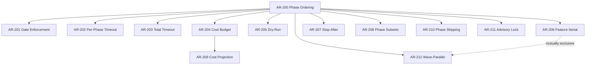
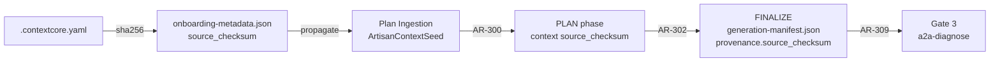
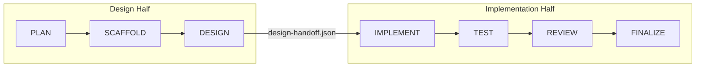
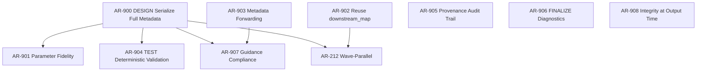

# Artisan Contractor Workflow — Functional Requirements

**Version:** 1.4.0
**Created:** 2026-02-14
**Canonical Source:** [`docs/capability-index/startd8.artisan.functional-requirements.yaml`](capability-index/startd8.artisan.functional-requirements.yaml)

---

## Overview

This document provides narrative context, dependency diagrams, and a traceability matrix for the formal functional requirements defined in the canonical YAML. The artisan contractor is a 7-phase workflow orchestrator for structured multi-task code generation with design review, cost budget enforcement, and checkpoint-based recovery.

### Status Dashboard

| Layer | ID Range | Total | Implemented | Partial | Planned |
|-------|----------|-------|-------------|---------|---------|
| Phase Behavior | AR-1xx | 39 | 30 | 0 | 9 |
| Orchestration | AR-2xx | 16 | 9 | 0 | 7 |
| ContextCore Data Flow | AR-3xx | 12 | 2 | 0 | 10 |
| Cost Model | AR-4xx | 8 | 6 | 1 | 1 |
| Handoff and Recovery | AR-5xx | 12 | 8 | 0 | 4 |
| Observability | AR-6xx | 8 | 6 | 0 | 2 |
| Configuration | AR-7xx | 10 | 8 | 0 | 2 |
| Safety and Resilience | AR-8xx | 13 | 6 | 0 | 7 |
| Mottainai Compliance | AR-9xx | 9 | 0 | 0 | 9 |
| **Total** | | **127** | **75** | **1** | **51** |

---

## Layer 1: Phase Behavior (AR-1xx)

Defines input, behavior, and output contracts for each of the 7 phases.

### Pipeline Data Flow


### Per-Phase Context Keys

| Phase | Context Keys Set | Source |
|-------|-----------------|--------|
| PLAN | `tasks`, `task_index`, `plan_title`, `plan_goals`, `domain_summary`, `preflight_summary`, `total_estimated_loc`, `architectural_context`, `design_calibration`, `example_artifacts` | AR-100 |
| SCAFFOLD | `scaffold` (directories_needed, directories_exist, directories_created, existing_target_files, skipped_targets, project_root) | AR-110 |
| DESIGN | `design_results` (per-task: design_document, status, agreed, iterations, cost, design_mode, existing_file_inventory) | AR-120, AR-127 |
| IMPLEMENT | `implementation`, `generation_results`, `_downstream_map` | AR-130 |
| TEST | `test_results` (test_plan, total_passed, total_failed, per_task) | AR-140..AR-147 |
| REVIEW | `review_results` (review_items, total_cost, total_passed, total_failed, per_task) | AR-150 |
| FINALIZE | `workflow_summary` | AR-160 |

---

## Layer 2: Orchestration (AR-2xx)

Controls phase sequencing, gate enforcement, timeout, budget, and execution modes.



### Execution Modes

| Mode | Config | Behavior | Requirements |
|------|--------|----------|-------------|
| **Phase-serial** (default) | `feature_serial=False` | All tasks complete each phase before moving to next | AR-200 |
| **Feature-serial** | `feature_serial=True` | Each task completes DESIGN->IMPLEMENT->TEST->REVIEW before next task. Mutually exclusive with `wave_parallel` mode (`WorkflowConfig` validation raises `ValueError` if both are set). | AR-206 |
| **Wave-parallel** | `wave_parallel=True` | Tasks are grouped into dependency waves derived from `depends_on`; lanes within each wave execute concurrently, with a barrier between waves for context merge and budget enforcement. Mutually exclusive with `feature_serial` and `lane_parallel` modes. Degenerates to lane-parallel when no inter-task dependencies exist. | AR-212 |
| **Dry-run** | `dry_run=True` | All phases execute but skip LLM calls; cost=0 | AR-205 |
| **Design-only** | `--stop-after design` | PLAN->SCAFFOLD->DESIGN, writes handoff | AR-207, AR-208 |
| **Implement-only** | loads handoff | IMPLEMENT->TEST->REVIEW->FINALIZE | AR-208 |

### AR-212: Wave-Parallel Execution Mode

**Status:** planned
**Depends on:** AR-900 (full design metadata serialization — P0 blocker for wave context merging), AR-902 (reuse of `_downstream_map` — required for wave-parallel's merge field registry)

Wave-parallel execution partitions the task set into dependency waves computed from the `depends_on` graph in the seed. Within each wave, tasks execute as concurrent lanes (up to a configurable concurrency limit). A barrier at the end of each wave merges lane contexts, enforces cost budget checks, and persists a checkpoint before the next wave begins.

**Acceptance criteria:**

1. `WorkflowConfig` validation raises `ValueError` when `wave_parallel=True` and either `feature_serial=True` or `lane_parallel=True`.
2. **Dependency ordering invariant:** No task executes before all tasks it `depends_on` have completed. Waves are computed from the task-level `depends_on` DAG such that every task in wave *N* depends only on tasks in waves 0..*N*−1. Tasks with no dependencies are assigned to wave 0.
3. Within a wave, lanes execute concurrently with thread-safe context isolation.
4. A wave barrier synchronizes all lanes before the next wave starts: lane contexts are merged, cost budget is checked, and a checkpoint is written.
5. When no `depends_on` edges exist, all tasks are placed in wave 0 and behavior is equivalent to lane-parallel.
6. Checkpoint schema v4 fields (`wave_assignments`, `completed_waves`, `current_wave`, `wave_resume_count`) are persisted at each wave barrier.
7. Resume from a wave checkpoint restarts from the incomplete wave, re-executing only incomplete lanes within that wave. Before resuming, a state-to-code integrity check verifies that generated files from completed lanes exist on disk; lanes whose output files are missing are marked incomplete and re-executed.
8. A configurable `max_wave_resume_attempts` limits how many times a wave can be retried on resume. If a wave fails after the maximum number of attempts, the workflow transitions to `FAILED_UNRECOVERABLE` status, preventing unbounded cost waste from poison-pill tasks in resume loops. The `wave_resume_count` checkpoint field (see AR-505) tracks attempts across resume boundaries.

---

## Layer 3: ContextCore Data Flow (AR-3xx)

Closes the data flow gaps between ContextCore export output and the artisan workflow. This is the primary new requirement layer identified by the pipeline audit.

### Provenance Chain



### Enrichment Data Flow

| Onboarding Field | Propagation | Consumption | Requirements |
|-----------------|-------------|-------------|-------------|
| `source_checksum` | seed -> PLAN context | FINALIZE manifest | AR-300, AR-301, AR-302 |
| `parameter_sources` | seed -> PLAN context | DESIGN prompts, IMPLEMENT chunks | AR-303, AR-304, AR-305, AR-125, AR-137 |
| `semantic_conventions` | seed -> PLAN context | DESIGN prompts, IMPLEMENT chunks | AR-306, AR-126 |
| `output_conventions` | seed -> PLAN context | SCAFFOLD validation | AR-307, AR-111 |
| `design_calibration_hints` | onboarding -> context | DESIGN cross-check | AR-308 |
| `coverage_gaps` | onboarding -> seed | PLAN scoping | AR-311 |

---

## Layer 4: Cost Model (AR-4xx)

Defines the 3-tier model architecture, budget enforcement, and cost reporting.

### Model Tier Architecture

| Role | Catalog Entry | Default Agent | Purpose |
|------|--------------|---------------|---------|
| Drafter | `DRAFT_MODEL_CLAUDE_HAIKU` | `anthropic:claude-haiku-4-5-20251001` | Fast, cheap generation | 
| Validator | `VALIDATE_MODEL_CLAUDE_SONNET` | `anthropic:claude-sonnet-4-5-20250929` | Balanced quality gating |
| Reviewer | `REVIEW_MODEL_CLAUDE_OPUS` | `anthropic:claude-opus-4-6` | Flagship independent review |

> **Runtime note:** `HandlerConfig.lead_agent` defaults to Opus, making the default artisan runtime 2-tier (Haiku + Opus). Sonnet is the validator default for standalone `LeadContractorCodeGenerator`. Set `--lead-agent` to Sonnet for the full 3-tier split.

### Budget Enforcement (AR-404)

Cost budget enforcement (AR-204/AR-404) operates at two layers depending on execution mode:

| Enforcement Point | Mode | Behavior |
|-------------------|------|----------|
| **Phase boundary** | Phase-serial, feature-serial | After each phase completes, check `cumulative_cost > cost_budget`. The phase that caused the breach completes; subsequent phases are not started. |
| **Wave barrier** | Wave-parallel | In addition to the phase-boundary check, budget is checked at each wave barrier within a phase. If cumulative cost (aggregated across concurrent lanes) exceeds the budget at a wave barrier, remaining waves within the phase are not started. The current wave's lanes complete before enforcement. |

In wave-parallel mode, concurrent lanes accumulate cost independently; the authoritative budget check occurs at the wave barrier where lane costs are merged into `cumulative_cost`.

---

## Layer 5: Handoff and Recovery (AR-5xx)

Supports split execution and checkpoint-based recovery.

### Two-Half Split



### Checkpoint Schema

The checkpoint schema has evolved across four versions. AR-505 defines the persistence contract; all versions must be supported for forward- and backward-compatible resume.

| Field | Type | Version | Description |
|-------|------|---------|-------------|
| `workflow_id` | `str` | v1+ | Unique workflow identifier |
| `last_completed_phase` | `str` | v1+ | Phase name of last completion |
| `phase_results` | `list` | v1+ | Per-phase result history |
| `cumulative_cost` | `float` | v1+ | Total USD spent |
| `schema_version` | `int` | v2+ | Currently 4 |
| `completed_features` | `list[str]` | v2+ | Feature-serial tracking |
| `current_feature` | `str` | v2+ | Active feature ID |
| `current_feature_phase` | `str` | v2+ | Active inner phase |
| `feature_partial_results` | `dict` | v2+ | Per-feature partial state |
| `lane_assignments` | `dict[str, int]` | v3+ | Task-to-lane mapping for lane-parallel mode |
| `completed_lanes` | `list[int]` | v3+ | Lane IDs that have completed |
| `lane_results` | `dict[int, dict]` | v3+ | Per-lane partial results |
| `wave_assignments` | `dict[str, int]` | v4+ | Task-to-wave mapping derived from `depends_on` DAG |
| `completed_waves` | `list[int]` | v4+ | Wave indices that have completed (all lanes finished) |
| `current_wave` | `Optional[int]` | v4+ | Index of the currently executing wave |
| `wave_resume_count` | `dict[int, int]` | v4+ | Per-wave resume attempt counter (wave index → attempt count). Required for AR-212 AC#8 retry limit enforcement across resume boundaries. |

> **Migration:** Checkpoints are migrated forward on load. A v2 checkpoint loaded by a v4-capable runtime gains default-empty lane and wave fields. A v3 checkpoint gains default-empty wave fields (`wave_assignments: {}`, `completed_waves: []`, `current_wave: None`, `wave_resume_count: {}`). AR-511 governs schema versioning and migration policy.

---

## Layer 6: Observability (AR-6xx)

OTel span hierarchy, events, and output manifests.

### Span Hierarchy

```
workflow.{workflow_id}                    # Root span (AR-600)
  ├── workflow.{id}.plan                  # Phase span (AR-601)
  ├── workflow.{id}.scaffold
  ├── workflow.{id}.design
  ├── workflow.{id}.implement
  ├── workflow.{id}.test
  ├── workflow.{id}.review
  └── workflow.{id}.finalize
```

### Output Files

| File | Written By | Contents | Requirement |
|------|-----------|----------|-------------|
| `generation-manifest.json` | FINALIZE | Artifacts with sha256, task status, cost | AR-604 |
| `workflow-execution-report.json` | FINALIZE | Full execution report | AR-162 |
| `.events.jsonl` | Orchestrator | Append-only event log | AR-605 (planned) |

---

## Layer 7: Configuration (AR-7xx)

All base configuration is fully implemented. AR-708 is planned for wave-parallel concurrency control.

### Configuration Priority Chain

```
CLI flags (--lead-agent, --cost-budget, ...)     # Highest priority
    ↓
Environment / Config file (ConfigManager)         # Middle priority
    ↓
Dataclass defaults (HandlerConfig, WorkflowConfig) # Lowest priority
```

### Key CLI Flags

| Flag | Maps To | Requirement |
|------|---------|-------------|
| `--seed PATH` | Runner arg | AR-100 |
| `--dry-run` | `WorkflowConfig.dry_run` | AR-205 |
| `--cost-budget FLOAT` | `WorkflowConfig.cost_budget` | AR-204 |
| `--timeout FLOAT` | `WorkflowConfig.total_timeout_seconds` | AR-203 |
| `--stop-after PHASE` | Phase subset | AR-207 |
| `--lead-agent SPEC` | `HandlerConfig.lead_agent` | AR-703 |
| `--drafter-agent SPEC` | `HandlerConfig.drafter_agent` | AR-703 |
| `--design-max-tokens INT` | `HandlerConfig.design_max_tokens` | AR-705 |
| `--no-auto-commit` | Disable auto-commit | AR-707 |
| `--force-implement` | Clear cached results | AR-706 |
| `--adopt-prior [PATH]` | Load prior designs | AR-507 |
| `--resume` | Load checkpoint | AR-506 |
| `--wave-parallel` | `WorkflowConfig.wave_parallel` | AR-212 |
| `--max-concurrent-lanes INT` | `WorkflowConfig.max_concurrent_lanes` | AR-708 |

### AR-708: Maximum Concurrent Lanes

**Status:** planned

Controls the maximum number of concurrent lanes within a wave during wave-parallel execution. Defaults to `os.cpu_count() + 4` when set to `None`, providing a safe default that prevents thread exhaustion while allowing reasonable concurrency. This flag is a critical operational control for managing API rate limits and resource utilization.

**Acceptance criteria:**

1. `WorkflowConfig.max_concurrent_lanes` accepts a positive integer or `None` (defaults to `os.cpu_count() + 4`).
2. When set, no more than `max_concurrent_lanes` tasks execute concurrently within a single wave.
3. The CLI flag `--max-concurrent-lanes` maps to `WorkflowConfig.max_concurrent_lanes`.

---

## Layer 8: Safety and Resilience (AR-8xx)

Defense-in-depth measures for the generation pipeline.

### Implemented Safety Gates

| Gate | Phase | What It Catches | Requirement |
|------|-------|----------------|-------------|
| Pre-flight | Before PLAN | Missing deps, bad config, zero cost | AR-800 |
| Domain checklist | DESIGN/IMPLEMENT | Domain-specific constraint violations | AR-801 |
| Truncation detection | IMPLEMENT | Incomplete LLM output | AR-802 |
| LOC mismatch | IMPLEMENT | Design implies more code than estimated | AR-803 |
| Multi-file completeness | After IMPLEMENT | Missing files in multi-file tasks | AR-804 |
| Semantic validators | TEST | Placeholder, import, proto, protocol, Dockerfile defects | AR-143..AR-147 |
| Service metadata preflight | Before PLAN | Missing service metadata for service-related tasks | AR-810 |

### Planned Safety Features

| Feature | What It Prevents | Requirement |
|---------|-----------------|-------------|
| Interactive mode | Blind acceptance of LLM output | AR-805 |
| Escalation pause | Unresolved design disagreements proceeding to implementation | AR-806 |
| Git tag restore points | Inability to rollback after bad generation | AR-807 |
| Advisory file lock | Concurrent workflow corruption | AR-808 |
| Stalled retry detection | Wasting tokens on non-converging drafts | AR-809 |
| Task ID validation | Path traversal, shell injection, null byte, and format string attacks via malicious task IDs | AR-811 |
| Global context immutability | Concurrent lane threads mutating read-only global context fields, causing data races and non-deterministic behavior | AR-812 |

### AR-811: Task ID Input Validation

**Status:** planned

Task IDs flow into checkpoints, file paths, git commit messages, and log messages from LLM output. This cross-cutting safety concern requires formal input validation at ingestion boundaries.

**Acceptance criteria:**

1. Task IDs are validated at seed ingestion (`SeedTask.from_seed_entry()`) and wave computation (`compute_waves()`).
2. Validation rejects identifiers containing path separators (`/`, `\`), shell metacharacters (`;`, `|`, `&`, `` ` ``, `$`), null bytes (`\x00`), or format string patterns (`{`, `}`).
3. A `ValueError` is raised with a descriptive message identifying the invalid character and task ID.

### AR-812: Global Context Immutability During Concurrent Execution

**Status:** planned

During wave-parallel execution, multiple lane threads read shared global context fields (e.g., `tasks`, `plan_goals`, `scaffold`). Mutation of these fields by any lane would cause data races and non-deterministic behavior.

**Acceptance criteria:**

1. Global context fields established before wave execution begins are protected from mutation by concurrent lane threads.
2. Each lane receives an isolated mutable context scope for lane-local writes; lane-local writes do not affect other lanes or the global context until the wave barrier merge.
3. Attempted mutation of a read-only global context field from a lane thread raises an error or is silently prevented (implementation may choose between enforcement strategies).

---

## Layer 9: Mottainai Compliance (AR-9xx)

Cross-cutting requirements ensuring artifacts produced by earlier phases are forwarded, registered, and validated — not silently discarded. Consolidates 20 intra-pipeline waste gaps (Gaps 17–36) from the [Mottainai Design Principle](../design-princples/MOTTAINAI_DESIGN_PRINCIPLE.md) into 9 formal requirements.

### Three Anti-Patterns

1. **Serialize-and-Forget** — A phase produces rich structured data, then serializes only a subset. Downstream phases see a degraded view. (AR-900, AR-901)
2. **Compute-But-Don't-Forward** — Data is computed and stored in one phase's context, but the downstream phase that would benefit never reads it. (AR-902, AR-903)
3. **Inject-But-Don't-Validate** — Deterministic data is injected into LLM prompts with no post-generation check that the LLM honored it. (AR-904, AR-905, AR-906, AR-907, AR-908)

### Dependency Diagram



AR-900 is the foundation — 3 other requirements depend on it directly, plus AR-212 (wave-parallel) depends on both AR-900 and AR-902 for wave context merging and `_downstream_map` population.

### AR-900: DESIGN Serialize Full Metadata

**Status:** planned
**Priority:** P0

DESIGN phase serializes full review metadata so that downstream phases (IMPLEMENT, TEST, FINALIZE) and wave-parallel context merging operate on complete data.

**Acceptance criteria:**

1. The `design_results` context entry for each task includes a `reviewer_verdict` dict containing: `verdict` (enum: agreed/disagreed/escalated), `reviewer_model`, `review_timestamp`, and `iteration_count`.
2. All parsed `DesignSection` objects (e.g., interface contracts, data models, error handling strategy) are persisted in `design_results` under a `parsed_sections` key, retaining their structured form (not flattened to prose).
3. Plan-level constraints that were injected into the DESIGN prompt (e.g., `architectural_context`, `design_calibration`) are stored in `design_results` under a `plan_constraints_applied` key, enabling downstream validation that the design honored them.
4. Serialization round-trips without data loss: `deserialize(serialize(design_results)) == design_results` for all persisted fields.

### Gap-to-Requirement Mapping

| Requirement | Gaps Addressed | Anti-Pattern | Summary |
|-------------|---------------|--------------|---------|
| AR-900 | 17, 19, 20 | Serialize-and-forget | DESIGN serializes full review metadata (reviewer verdicts with model/timestamp/iteration, parsed DesignSection objects, plan constraints applied) |
| AR-901 | 18 | Serialize-and-forget | DESIGN extracts and validates critical parameters |
| AR-902 | 26 | Compute-but-don't-forward | IMPLEMENT reuses pre-computed downstream file map from Gate 2c context (`context['_downstream_map']`). If the map is absent, IMPLEMENT re-computes it with a logged warning. |
| AR-903 | 21, 22, 23, 24, 25 | Compute-but-don't-forward | Earlier-phase metadata forwarded to IMPLEMENT |
| AR-904 | 27, 28 | Inject-but-don't-validate | TEST deterministic pre-review validation |
| AR-905 | 29, 33 | Inject-but-don't-validate | Metadata provenance audit trail |
| AR-906 | 30, 31 | Inject-but-don't-validate | FINALIZE preserves structured diagnostics |
| AR-907 | 34, 35 | Inject-but-don't-validate | Post-generation guidance compliance validation |
| AR-908 | 32, 36 | Inject-but-don't-validate | File integrity computed at IMPLEMENT output time |

### Priority Ordering

| Priority | Requirements | Rationale |
|----------|-------------|-----------|
| P0 | AR-900, AR-902 | Foundation (AR-900 unblocks 3 others); AR-902 is minimal code change. AR-902 is also a prerequisite for wave-parallel mode's `_downstream_map` merge field (AR-212). |
| P1 | AR-901, AR-904, AR-906 | Wire existing functions/data to downstream consumers |
| P2 | AR-903, AR-905 | Cross-phase forwarding and audit trail |
| P3 | AR-907, AR-908 | Measurement and manifest completeness |

---

## Traceability Matrix

### Requirement to Source File

| Requirement | Primary Source File | Secondary Files |
|-------------|-------------------|-----------------|
| AR-100..AR-102 | `src/startd8/contractors/context_seed_handlers.py` (PlanPhaseHandler) | |
| AR-110..AR-111 | `src/startd8/contractors/context_seed_handlers.py` (ScaffoldPhaseHandler) | |
| AR-120..AR-126 | `src/startd8/contractors/context_seed_handlers.py` (DesignPhaseHandler) | `artisan_phases/design_documentation.py` |
| AR-127 | `src/startd8/contractors/context_seed_handlers.py` (DesignPhaseHandler) | Reuses `scaffold.existing_target_files` from ScaffoldPhaseHandler |
| AR-128 | `src/startd8/contractors/context_seed_handlers.py` (ImplementPhaseHandler) | `handoff.py`, `artisan_phases/development.py` |
| AR-130..AR-137 | `src/startd8/contractors/context_seed_handlers.py` (ImplementPhaseHandler) | `artisan_phases/development.py` |
| AR-140..AR-142 | `src/startd8/contractors/context_seed_handlers.py` (TestPhaseHandler) | |
| AR-143..AR-147 | `src/startd8/contractors/artisan_phases/self_consistency.py` | `context_seed_handlers.py` (Gate 3b), `rules_validators.py` |
| AR-150..AR-152 | `src/startd8/contractors/context_seed_handlers.py` (ReviewPhaseHandler) | |
| AR-160..AR-165 | `src/startd8/contractors/context_seed_handlers.py` (FinalizePhaseHandler) | |
| AR-200..AR-211 | `src/startd8/contractors/artisan_contractor.py` | `scripts/run_artisan_workflow.py` |
| AR-212 | `src/startd8/contractors/artisan_contractor.py` | `scripts/run_artisan_workflow.py`, `handoff.py` |
| AR-300..AR-311 | `src/startd8/contractors/context_seed_handlers.py` | `workflows/builtin/plan_ingestion_workflow.py` |
| AR-400..AR-407 | `src/startd8/contractors/protocols.py` | `artisan_contractor.py`, `context_seed_handlers.py` |
| AR-500..AR-511 | `src/startd8/contractors/handoff.py` | `artisan_contractor.py` |
| AR-600..AR-607 | `src/startd8/contractors/artisan_contractor.py` | `context_seed_handlers.py` |
| AR-700..AR-708 | `src/startd8/contractors/context_seed_handlers.py` | `scripts/run_artisan_workflow.py` |
| AR-800..AR-810 | `src/startd8/contractors/artisan_phases/preflight.py` | `context_seed_handlers.py`, `artisan_contractor.py`, `rules_common.py` |
| AR-811 | `src/startd8/contractors/context_seed_handlers.py` | `artisan_contractor.py` (wave computation) |
| AR-812 | `src/startd8/contractors/artisan_contractor.py` | `context_seed_handlers.py` |
| AR-900 | `src/startd8/contractors/context_seed_handlers.py` (DesignPhaseHandler) | |
| AR-901 | `src/startd8/contractors/artisan_phases/design_documentation.py` | `context_seed_handlers.py` |
| AR-902 | `src/startd8/contractors/context_seed_handlers.py` (ImplementPhaseHandler) | |
| AR-903 | `src/startd8/contractors/context_seed_handlers.py` | ScaffoldPhaseHandler, ImplementPhaseHandler |
| AR-904 | `src/startd8/contractors/context_seed_handlers.py` (TestPhaseHandler) | |
| AR-905 | `src/startd8/contractors/context_seed_handlers.py` | TestPhaseHandler, DesignPhaseHandler |
| AR-906 | `src/startd8/contractors/context_seed_handlers.py` (FinalizePhaseHandler) | |
| AR-907 | `src/startd8/contractors/context_seed_handlers.py` | DesignPhaseHandler, ImplementPhaseHandler, TestPhaseHandler |
| AR-908 | `src/startd8/contractors/context_seed_handlers.py` | ImplementPhaseHandler, FinalizePhaseHandler |

### Requirement to Test File

| Requirement | Test File(s) |
|-------------|-------------|
| AR-100..AR-102 | `tests/unit/contractors/test_artisan_plan_deconstruction.py` |
| AR-110 | `tests/unit/contractors/test_7phase_integration.py` |
| AR-120..AR-124 | `tests/unit/contractors/test_design_phase_handler.py`, `test_design_quality_context.py`, `test_artisan_design_documentation.py` |
| AR-130..AR-136 | `tests/unit/contractors/test_implement_phase_integration.py`, `test_implement_auto_commit.py` |
| AR-140..AR-142 | `tests/unit/contractors/test_context_seed_review_finalize.py`, `test_artisan_test_construction.py` |
| AR-143..AR-147 | `tests/unit/contractors/test_self_consistency_validators.py`, `test_gate3b_content_validation.py` |
| AR-150..AR-152 | `tests/unit/contractors/test_review_phase_handler.py`, `test_context_seed_review_finalize.py` |
| AR-160..AR-163 | `tests/unit/contractors/test_context_seed_review_finalize.py` |
| AR-200..AR-208 | `tests/unit/contractors/test_7phase_integration.py`, `tests/e2e/contractors/test_artisan_e2e.py` |
| AR-202..AR-203 | `tests/e2e/contractors/test_artisan_timeout.py` |
| AR-205 | `tests/e2e/contractors/test_artisan_dry_run.py` |
| AR-206 | `tests/unit/contractors/test_feature_serial_checkpoint.py` |
| AR-310..AR-311 | `tests/unit/test_plan_ingestion_workflow.py` |
| AR-400..AR-401 | `tests/unit/contractors/test_artisan_models.py`, `tests/unit/test_artisan_config.py` |
| AR-402..AR-404 | `tests/e2e/contractors/test_artisan_resume.py`, `test_artisan_e2e.py` |
| AR-500..AR-504 | `tests/unit/contractors/test_handoff.py` |
| AR-505..AR-506 | `tests/e2e/contractors/test_artisan_resume.py` |
| AR-700..AR-703 | `tests/unit/test_artisan_config.py` |
| AR-800 | `tests/unit/contractors/test_artisan_preflight.py`, `tests/e2e/contractors/test_artisan_preflight_failure.py` |
| AR-806 | `tests/e2e/contractors/test_artisan_escalation.py` |
| AR-810 | `tests/unit/test_service_metadata_preflight.py` |

### Test Coverage Gaps

Requirements with no `verified_by` test file (need new tests):

| Requirement | Status | What Needs Testing |
|-------------|--------|-------------------|
| AR-127, AR-128 | planned | Existing file detection, design_mode propagation, update-mode prompt constraints, post-generation line-reduction validation |
| AR-111 | planned | SCAFFOLD output_conventions validation |
| AR-125, AR-126 | planned | DESIGN parameter_sources / semantic_conventions injection |
| AR-137 | planned | IMPLEMENT parameter_sources in chunk metadata |
| AR-164, AR-165 | planned | FINALIZE provenance block and Gate 3 compatibility |
| AR-212 | planned | Wave-parallel execution: mutual exclusion validation, wave computation from depends_on, dependency ordering invariant, barrier semantics, degeneration to lane-parallel, wave checkpoint persistence and resume, state-to-code integrity check on resume, max_wave_resume_attempts retry limit and FAILED_UNRECOVERABLE transition |
| AR-300..AR-309 | planned | All ContextCore data flow (provenance chain, enrichment consumption) |
| AR-405 | planned | Cost projection gate |
| AR-508..AR-511 | planned | Recovery hardening (chunk resume, config drift, state integrity, migration including v3→v4) |
| AR-605, AR-606 | planned | Event JSONL externalization and dedup |
| AR-708 | planned | Max concurrent lanes configuration and enforcement, default of `os.cpu_count() + 4` |
| AR-805, AR-807..AR-809 | planned | Interactive mode, git tags, advisory lock, stalled retry |
| AR-811 | planned | Task ID input validation: path separator rejection, shell metacharacter rejection, null byte rejection, format string pattern rejection |
| AR-812 | planned | Global context immutability during concurrent lane execution: read-only enforcement, lane-local isolation, wave barrier merge correctness |
| AR-900..AR-908 | planned | Mottainai compliance — full review metadata serialization (reviewer_verdict dict, parsed DesignSection persistence, plan constraint storage, serialization round-trip fidelity), metadata forwarding, deterministic pre-review validation, provenance audit trail, structured diagnostics, integrity timing |

---

## Implementation Priority

| Phase | Requirements | Priority | Impact |
|-------|-------------|----------|--------|
| 0. Update-First Design Mode | AR-127, AR-128 | **Critical** | Prevents A-15 production file destruction |
| ~~1b. Semantic Validators~~ | ~~AR-143..AR-147, AR-810~~ | ~~**High**~~ | ~~DONE — Commits `bed77d5`, `dc3c241`~~ |
| 1. ContextCore Data Flow Fixes | AR-300..AR-302, AR-164, AR-165 | **High** | Closes provenance chain, enables Gate 3 |
| 2. Onboarding Metadata Consumption | AR-303..AR-308, AR-111, AR-125..AR-126, AR-137 | **Medium** | Enriches code generation with export data |
| 3. Recovery Hardening | AR-508..AR-511 | **Medium** | Robust resume across config changes |
| 4. Orchestration Enhancements | AR-209..AR-212, AR-405, AR-708, AR-809, AR-811, AR-812 | **Medium** | Wave-parallel execution, concurrency control, cost projection, operational safety, task ID validation, context immutability |
| 5. Interactive and Git Safety | AR-605..AR-606, AR-805..AR-808 | **Low** | Interactive operation, event durability |
| 6. Mottainai Compliance | AR-900..AR-908 | **Medium** | Eliminates 20 intra-pipeline waste gaps (Gaps 17–36). Note: AR-900 (P0) and AR-902 (P0) must be implemented before or alongside AR-212 wave-parallel mode, as wave context merging depends on full design metadata serialization (AR-900) and `_downstream_map` population (AR-902). |

---

## Related Documents

| Document | Relationship |
|----------|-------------|
| [`startd8.artisan.functional-requirements.yaml`](capability-index/startd8.artisan.functional-requirements.yaml) | Canonical YAML (this doc is the companion) |
| [`PLAN-artisan-contractor.md`](PLAN-artisan-contractor.md) | Implementation plan (source for planned requirements) |
| [`ARTISAN_WORKFLOW_GUIDE.md`](ARTISAN_WORKFLOW_GUIDE.md) | User/developer guide |
| [`plans/ARTISAN_CONTEXTCORE_DATA_FLOW_FIXES.md`](plans/ARTISAN_CONTEXTCORE_DATA_FLOW_FIXES.md) | Code fix plan for AR-3xx |
| [`startd8.workflow.functional-requirements.yaml`](capability-index/startd8.workflow.functional-requirements.yaml) | Workflow framework requirements (FR-1xx..FR-5xx) |
| [`PLAN_INGESTION_CONTEXTCORE_RECOMMENDATIONS.md`](PLAN_INGESTION_CONTEXTCORE_RECOMMENDATIONS.md) | Upstream ingestion design recommendations |

#### Review Round R3

- **Reviewer**: claude-4 (claude-opus-4-6)
- **Date**: 2026-02-21 16:39:43 UTC
- **Scope**: Review wave+lane parallel execution plan for correctness, safety (thread-safety, checkpoint integrity, resume correctness), data flow completeness (Mottainai compliance), and missing edge cases. Cross-reference against the ARTISAN_REQUIREMENTS.md to ensure plan aligns with existing AR-xxx requirements. (Feature Requirements)

#### Feature Requirements Suggestions
| ID | Area | Severity | Suggestion | Rationale |
| ---- | ---- | ---- | ---- | ---- |
| R3-F1 | orchestration | high | AR-206 (feature-serial) acceptance criteria should be updated to mention that wave-parallel is a third execution mode that is mutually exclusive with feature-serial. Currently AR-206 only describes the feature-serial behavior without acknowledging the wave-parallel alternative. | Straightforward documentation fix ensuring the requirements framework reflects the implemented constraint. Already applied in Appendix A for the narrative doc; this ensures the YAML is also updated. |
| R3-F2 | orchestration | high | No AR-xxx requirement exists for wave-parallel execution mode. The plan introduces a new execution mode (`wave_parallel`) comparable to AR-206 (feature-serial) but there is no formal requirement defining its behavior, acceptance criteria, or verification approach. | A new execution mode comparable in scope to AR-206 must have a corresponding formal requirement for traceability, testability, and compliance verification. Already applied in Appendix A. |
| R3-F3 | recovery | high | AR-505 (checkpoint persistence) acceptance criteria list schema version 2 fields but do not mention v3 (lane fields) or v4 (wave fields). The checkpoint schema has evolved beyond what the requirement documents. | The checkpoint schema has evolved to v4 but the requirement still documents only v2, creating a compliance verification gap. The canonical YAML must reflect the actual contract. |
| R3-F4 | cost_model | medium | AR-404 (CostBudgetExceededError) acceptance criteria say "After each phase, check cumulative_cost > cost_budget" but wave-parallel introduces intra-phase budget checks (per-wave barrier). The requirement should be updated to cover both phase-boundary and wave-barrier budget enforcement. | Two endorsements. The two-layer cost enforcement is a key correctness property. AR-404's phase-boundary-only criteria would cause compliance tests to miss the wave-barrier enforcement path. |

#### Review Round R4

- **Reviewer**: gemini-2.5 (gemini-2.5-pro)
- **Date**: 2026-02-21 16:42:55 UTC
- **Scope**: Review wave+lane parallel execution plan for correctness, safety (thread-safety, checkpoint integrity, resume correctness), data flow completeness (Mottainai compliance), and missing edge cases. Cross-reference against the ARTISAN_REQUIREMENTS.md to ensure plan aligns with existing AR-xxx requirements. (Feature Requirements)

#### Feature Requirements Suggestions
| ID | Area | Severity | Suggestion | Rationale |
| ---- | ---- | ---- | ---- | ---- |
| R4-F1 | requirements | high | AR-212 was added (per Appendix A, R4-F2) but the `orchestration_requirements` list in the YAML only goes to AR-211. AR-212 must be added to the YAML file with its acceptance criteria, `depends_on`, `implementation_hints`, and `verified_by` fields. The YAML `summary.total_requirements` count and `orchestration.count` in `traceability` must be updated. | One endorsement. The YAML is the canonical machine-readable source. Without the YAML entry, automated tooling and compliance verification cannot find AR-212. Already accepted in Appendix A. |
| R4-F2 | requirements | medium | AR-505 acceptance criteria list "Schema version 2" fields but do not list v3 (lane fields: `lane_assignments`, `completed_lanes`, `lane_results`) or v4 (wave fields: `wave_assignments`, `completed_waves`, `current_wave`). Per Appendix A (R4-F3), this was applied to the narrative doc but the YAML `AR-505` entry still only documents v2. | One endorsement. Duplicate of R3-F3 applied to the YAML specifically. The YAML must be the authoritative checkpoint contract specification. |
| R4-F3 | requirements | low | AR-404 acceptance criteria say "Phase that caused the breach completes; subsequent phases not started" but do not mention intra-phase wave-barrier budget checks. Per Appendix A (R4-F4), this was accepted for the narrative doc. The YAML `AR-404` entry needs an additional acceptance criterion: "In wave-parallel mode, budget is also checked at wave barriers within a phase; the completed wave's lanes finish, but subsequent waves are not started." | One endorsement. Duplicate of R3-F4 applied to the YAML. Without the YAML update, automated acceptance testing misses wave-barrier enforcement. |
| R4-F4 | requirements | low | AR-206 (feature-serial) acceptance criteria do not mention mutual exclusivity with `wave_parallel`. The narrative ARTISAN_REQUIREMENTS.md Execution Modes table documents it, but the YAML `AR-206` entry has no criterion like "Mutually exclusive with wave_parallel mode (WorkflowConfig raises ValueError)." | One endorsement. Duplicate of R3-F1 applied to the YAML. The canonical testable specification must document the mutual exclusion constraint. |

## Appendix: Iterative Review Log (Applied / Rejected Suggestions)

This appendix is intentionally **append-only**. New reviewers (human or model) should add suggestions to Appendix C, and then once validated, record the final disposition in Appendix A (applied) or Appendix B (rejected with rationale).

### Reviewer Instructions (for humans + models)

- **Before suggesting changes**: Scan Appendix A and Appendix B first. Do **not** re-suggest items already applied or explicitly rejected.
- **When proposing changes**: Append them to Appendix C using a unique suggestion ID (`R{round}-S{n}`).
- **When endorsing prior suggestions**: If you agree with an untriaged suggestion from a prior round, list it in an **Endorsements** section after your suggestion table. This builds consensus signal — suggestions endorsed by multiple reviewers should be prioritized during triage.
- **When validating**: For each suggestion, append a row to Appendix A (if applied) or Appendix B (if rejected) referencing the suggestion ID. Endorsement counts inform priority but do not auto-apply suggestions.
- **If rejecting**: Record **why** (specific rationale) so future models don't re-propose the same idea.

### Appendix A: Applied Suggestions

| ID | Suggestion | Source | Implementation / Validation Notes | Date |
|----|------------|--------|----------------------------------|------|
| R3-F1 | Update AR-206 (feature-serial) acceptance criteria to document mutual exclusivity with wave_parallel mode. |  | The plan introduces wave_parallel as mutually exclusive with feature_serial (Phase 3b ValueError). AR-206 should reflect this constraint so that requirement-based testing covers the mutual exclusion. This is a minor documentation fix that maintains requirements-to-implementation traceability. | 2026-02-21 16:44:53 UTC |
| R3-F2 | Create a new formal requirement (AR-212) for wave-parallel execution mode with acceptance criteria matching the plan's Phase 3c specification. |  | The plan introduces a complete new execution mode comparable in scope to AR-206 (feature-serial) but has no corresponding formal requirement. This is a gap in the requirements framework — the plan is implementing functionality that cannot be traced to a testable requirement. AR-212 should define wave-parallel behavior, acceptance criteria, and verification approach to maintain the project's established traceability discipline. | 2026-02-21 16:44:53 UTC |
| R3-F3 | Update AR-505 (checkpoint persistence) acceptance criteria to include v3 (lane fields) and v4 (wave fields) checkpoint schema. |  | AR-505 acceptance criteria stop at v2 schema. The plan introduces v4 with wave fields, and v3 (lane fields from commit fbfae7a) is also undocumented in the requirement. This creates a compliance verification gap where the requirement doesn't describe the actual checkpoint schema. Updating AR-505 is necessary for the requirement to serve its purpose as a testable specification. | 2026-02-21 16:44:53 UTC |
| R3-F4 | Update AR-404 (CostBudgetExceededError) acceptance criteria to cover intra-phase budget checks at wave barriers in wave-parallel mode. |  | The plan's two-layer cost enforcement (R1-S6) adds authoritative budget checks at wave barriers within the IMPLEMENT phase. AR-404's 'after each phase' criteria doesn't cover this intra-phase enforcement path. Without updating AR-404, compliance testing would miss the wave-barrier budget check — a key correctness property of the wave execution model. | 2026-02-21 16:44:53 UTC |
| R3-F1 | Update AR-206 acceptance criteria to document mutual exclusivity with wave_parallel mode. |  | This is a straightforward documentation fix that maintains requirements-to-implementation traceability. The plan already implements this constraint (Phase 3b ValueError), so the requirement should reflect it. Already noted as applied in Appendix A but the YAML needs the actual criterion added. | 2026-02-21 16:58:12 UTC |
| R3-F2 | Create a new AR-212 requirement for wave-parallel execution mode with formal acceptance criteria. |  | A new execution mode comparable in scope to AR-206 must have a corresponding formal requirement. Already noted as applied in Appendix A and the narrative doc was updated, but this confirms the YAML entry is needed. The plan's Phase 3c specification provides the acceptance criteria to formalize. | 2026-02-21 16:58:12 UTC |
| R3-F3 | Update AR-505 checkpoint persistence acceptance criteria to include v3 (lane) and v4 (wave) schema fields. |  | The YAML is the canonical requirements source and must document the actual checkpoint schema. AR-505 stopping at v2 creates a compliance verification gap. Already noted as applied in Appendix A for the narrative doc; the YAML needs the same update. | 2026-02-21 16:58:12 UTC |
| R3-F4 | Update AR-404 acceptance criteria to cover intra-phase wave-barrier budget checks in wave-parallel mode. |  | The two-layer cost enforcement is a key correctness property of wave mode. AR-404's phase-boundary-only criteria would cause compliance tests to miss the wave-barrier enforcement path. Has 2 endorsements. Already noted as applied in Appendix A for the narrative doc; the YAML needs the criterion. | 2026-02-21 16:58:12 UTC |
| R4-F1 | Add AR-212 to the requirements YAML with full structured fields (acceptance criteria, depends_on, implementation_hints, verified_by). |  | The YAML is the canonical requirements source. AR-212 exists in the narrative companion (Appendix A confirms it was accepted) but the YAML file still lacks the entry. Automated tooling and compliance verification depend on the YAML. The narrative doc already provides the acceptance criteria to formalize. | 2026-02-21 16:58:12 UTC |
| R4-F2 | Update AR-505 in the requirements YAML to include v3 and v4 checkpoint schema fields. |  | Duplicate of R3-F3 applied to the YAML specifically. The narrative doc was updated per Appendix A but the YAML entry still documents only v2. The YAML must be the authoritative specification of the checkpoint contract. | 2026-02-21 16:58:12 UTC |
| R4-F3 | Add wave-barrier budget check criterion to AR-404 in the requirements YAML. |  | Duplicate of R3-F4 applied to the YAML specifically. The narrative was updated per Appendix A but the YAML AR-404 entry still only mentions phase-boundary checks. Without the YAML update, automated acceptance testing misses wave-barrier enforcement. | 2026-02-21 16:58:12 UTC |
| R4-F4 | Add mutual exclusivity with wave_parallel to AR-206 acceptance criteria in the requirements YAML. |  | Duplicate of R3-F1 applied to the YAML specifically. The narrative was updated but the YAML AR-206 entry lacks the criterion. Consistent with the pattern of ensuring the canonical YAML reflects all accepted changes. | 2026-02-21 16:58:12 UTC |
| R5-F2 | Add --max-concurrent-lanes to the key CLI flags table under AR-7xx in the requirements doc. |  | The plan introduces max_concurrent_lanes as a critical operational control (R3-S3) that directly affects resource utilization and API rate limiting. It's already defined in WorkflowConfig (Phase 3b) and the CLI (Phase 4a). Omitting it from the requirements doc's CLI flags table creates a documentation gap. A new AR-708 or addition to the CLI flags table ensures traceability. | 2026-02-21 16:58:12 UTC |
| R5-F3 | Amend AR-212 resume criteria to explicitly require file integrity check from the 4-step resume protocol. |  | AR-212 AC#7 says 'Resume from a wave checkpoint restarts from the incomplete wave, re-executing only incomplete lanes within that wave' but omits Step 2 of the 4-step resume protocol (verify generated files exist on disk). This is a key correctness property — without the integrity check, a resume could skip a lane that completed but whose files were lost (e.g., git reset). Making it an explicit acceptance criterion in AR-212 ensures it's tested. | 2026-02-21 16:58:12 UTC |
| R5-F4 | Add formal depends_on links from AR-212 to AR-900 and AR-902 in the requirements YAML. |  | The plan explicitly identifies AR-900 as a P0 blocker for Phase 3 and AR-902 as a dependency for wave-parallel's _downstream_map merge field. Making these dependencies machine-readable in the YAML prevents accidental scheduling of wave-parallel implementation before its prerequisites are complete. This is especially important since AR-900 and AR-902 are in a different implementation phase (phase_6 mottainai) than wave-parallel (phase_4 orchestration). | 2026-02-21 16:58:12 UTC |
| R3-F1 | Update AR-206 acceptance criteria to document mutual exclusivity with wave_parallel mode. |  | The plan already implements this constraint (Phase 3b ValueError). The requirement must reflect it for traceability and to ensure compliance testing covers the mutual exclusion. Minor documentation fix with high traceability value. | 2026-02-21 17:14:28 UTC |
| R3-F2 | Create a new AR-212 requirement for wave-parallel execution mode with formal acceptance criteria. |  | Wave-parallel is a new execution mode comparable in scope to AR-206. Without a formal requirement, there are no testable acceptance criteria, no verified_by linkage, and no traceability. This is a gap in the requirements framework that must be closed. | 2026-02-21 17:14:28 UTC |
| R3-F3 | Update AR-505 checkpoint persistence acceptance criteria to include v3 and v4 schema fields. |  | AR-505 stops at v2 schema. The actual implementation includes v3 (lane fields) and v4 (wave fields). The requirement must describe the actual checkpoint contract for compliance verification to be meaningful. | 2026-02-21 17:14:28 UTC |
| R3-F4 | Update AR-404 to cover intra-phase wave-barrier budget checks in wave-parallel mode. |  | Two endorsements. The plan's two-layer cost enforcement adds authoritative budget checks at wave barriers within IMPLEMENT. AR-404's phase-boundary-only criteria would cause compliance tests to miss this enforcement path, which is a key correctness property of wave mode. | 2026-02-21 17:14:28 UTC |
| R4-F1 | Add AR-212 to the requirements YAML with full structured fields. |  | One endorsement. The YAML is the canonical machine-readable source. AR-212 exists in the narrative but not the YAML, meaning automated tooling and compliance verification cannot find it. The summary counts are also wrong without it. | 2026-02-21 17:14:28 UTC |
| R4-F2 | Update AR-505 in the YAML to include v3 and v4 checkpoint schema fields. |  | One endorsement. Duplicate of R3-F3 applied specifically to the YAML. The YAML must be the authoritative specification of the checkpoint contract. Without the update, automated compliance checks validate only v2 fields. | 2026-02-21 17:14:28 UTC |
| R4-F3 | Add wave-barrier budget check criterion to AR-404 in the YAML. |  | One endorsement. Duplicate of R3-F4 applied to the YAML specifically. Without the YAML update, automated acceptance testing misses wave-barrier enforcement. Consistent with the pattern of ensuring the canonical YAML reflects all accepted changes. | 2026-02-21 17:14:28 UTC |
| R4-F4 | Add mutual exclusivity with wave_parallel to AR-206 acceptance criteria in the YAML. |  | One endorsement. Duplicate of R3-F1 applied to the YAML. The YAML is the canonical testable specification and must document the mutual exclusion constraint already implemented in the plan. | 2026-02-21 17:14:28 UTC |
| R5-F2 | Add --max-concurrent-lanes to the key CLI flags table under AR-7xx. |  | One endorsement. The plan introduces max_concurrent_lanes as a critical operational control that directly affects resource utilization and API rate limiting. It's already defined in WorkflowConfig and CLI. Omitting it from the requirements CLI flags table creates a documentation gap. A new AR-708 formalizes traceability. | 2026-02-21 17:14:28 UTC |
| R5-F3 | Amend AR-212 resume criteria to explicitly require file integrity check from the 4-step resume protocol. |  | One endorsement. AR-212 AC#7 omits Step 2 of the 4-step resume protocol (verify generated files exist on disk). This is a key correctness property — without the integrity check, resume could skip a lane whose output files were lost. Making it an explicit acceptance criterion ensures it's tested. | 2026-02-21 17:14:28 UTC |
| R5-F4 | Add formal depends_on links from AR-212 to AR-900 and AR-902 in the YAML. |  | One endorsement. The plan explicitly identifies AR-900 as a P0 blocker and AR-902 as a dependency. Machine-readable depends_on in the YAML prevents accidental scheduling of wave-parallel before its prerequisites. Critical for cross-phase dependency tracking. | 2026-02-21 17:14:28 UTC |
| R6-F2 | Add field-level type contracts for v4 wave fields in AR-505 acceptance criteria. |  | The plan specifies detailed type validation for wave checkpoint fields (Phase 3a) but AR-505 doesn't define the expected types. Adding explicit types (dict[str, int], list[int], Optional[int]) makes the checkpoint contract machine-verifiable and gives the type validation code a requirement to trace to. | 2026-02-21 17:14:28 UTC |
| R6-F3 | Align AR-708 default from 'unbounded' to 'os.cpu_count() + 4' to match the plan's actual implementation. |  | The requirement says unbounded, the plan says CPU-count-bounded. The plan's behavior is correct (prevents thread exhaustion), so the requirement must be updated to match. A misleading requirement is worse than no requirement. | 2026-02-21 17:14:28 UTC |
| R6-F4 | Add acceptance criterion to AR-212 for the per-wave resume retry limit. |  | The max_wave_resume_attempts feature is a user-visible behavior change (workflow permanently fails after N retries) that prevents unbounded cost waste. Without a formal acceptance criterion, an implementer could omit the retry limit and still pass AR-212 tests. This safety feature deserves formal coverage. | 2026-02-21 17:14:28 UTC |
| R7-F1 | Update AR-708 default from 'unbounded' to 'os.cpu_count() + 4'. |  | Duplicate of R6-F3. The requirement must match the plan's actual safe default. An unbounded default documented in the requirement contradicts the plan's deliberate resource protection. | 2026-02-21 17:14:28 UTC |
| R7-F2 | Add a new requirement for the per-wave resume retry limit (max_wave_resume_attempts). |  | The retry limit prevents unbounded cost waste from poison-pill tasks in resume loops. This is a user-visible safety feature that deserves formal requirement coverage. While R6-F4 adds it as an AC on AR-212, a dedicated requirement (or explicit AR-212 AC) ensures testability. Accepting this as confirmation that the retry limit needs formal coverage — can be satisfied by R6-F4's accepted AR-212 AC#8 rather than a separate requirement. | 2026-02-21 17:14:28 UTC |
| R3-F1 | Update AR-206 acceptance criteria to document mutual exclusivity with wave_parallel mode. |  | Straightforward documentation fix ensuring the requirements framework reflects the implemented constraint. Already applied in Appendix A for the narrative doc; this ensures the YAML is also updated. | 2026-02-21 17:41:52 UTC |
| R3-F2 | Create new AR-212 requirement for wave-parallel execution mode with formal acceptance criteria. |  | A new execution mode comparable in scope to AR-206 must have a corresponding formal requirement for traceability, testability, and compliance verification. Already applied in Appendix A. | 2026-02-21 17:41:52 UTC |
| R3-F3 | Update AR-505 checkpoint persistence acceptance criteria to include v3 and v4 schema fields. |  | The checkpoint schema has evolved to v4 but the requirement still documents only v2, creating a compliance verification gap. The canonical YAML must reflect the actual contract. | 2026-02-21 17:41:52 UTC |
| R3-F4 | Update AR-404 to cover intra-phase wave-barrier budget checks in wave-parallel mode. |  | Two endorsements. The two-layer cost enforcement is a key correctness property. AR-404's phase-boundary-only criteria would cause compliance tests to miss the wave-barrier enforcement path. | 2026-02-21 17:41:52 UTC |
| R4-F1 | Add AR-212 to the requirements YAML with full structured fields. |  | One endorsement. The YAML is the canonical machine-readable source. Without the YAML entry, automated tooling and compliance verification cannot find AR-212. Already accepted in Appendix A. | 2026-02-21 17:41:52 UTC |
| R4-F2 | Update AR-505 in the YAML to include v3 and v4 checkpoint schema fields. |  | One endorsement. Duplicate of R3-F3 applied to the YAML specifically. The YAML must be the authoritative checkpoint contract specification. | 2026-02-21 17:41:52 UTC |
| R4-F3 | Add wave-barrier budget check criterion to AR-404 in the YAML. |  | One endorsement. Duplicate of R3-F4 applied to the YAML. Without the YAML update, automated acceptance testing misses wave-barrier enforcement. | 2026-02-21 17:41:52 UTC |
| R4-F4 | Add mutual exclusivity with wave_parallel to AR-206 acceptance criteria in the YAML. |  | One endorsement. Duplicate of R3-F1 applied to the YAML. The canonical testable specification must document the mutual exclusion constraint. | 2026-02-21 17:41:52 UTC |
| R5-F2 | Add --max-concurrent-lanes to the key CLI flags table under AR-7xx. |  | One endorsement. Already applied in Appendix A. The plan introduces max_concurrent_lanes as a critical operational control. A new AR-708 formalizes traceability. | 2026-02-21 17:41:52 UTC |
| R5-F3 | Amend AR-212 resume criteria to explicitly require file integrity check from the 4-step resume protocol. |  | One endorsement. Already applied in Appendix A. The integrity check (Step 2) is a key correctness property for robust recovery and must be an explicit acceptance criterion. | 2026-02-21 17:41:52 UTC |
| R5-F4 | Add formal depends_on links from AR-212 to AR-900 and AR-902 in the YAML. |  | One endorsement. Already applied in Appendix A. Machine-readable dependencies prevent accidental scheduling of wave-parallel before its prerequisites are complete. | 2026-02-21 17:41:52 UTC |
| R6-F1 | Add AR-811 requirement for task_id input validation against unsafe characters. |  | Two endorsements. Task IDs flow into checkpoints, file paths, git commits, and log messages from LLM output. This cross-cutting safety concern needs a formal requirement for traceability. | 2026-02-21 17:41:52 UTC |
| R6-F2 | Add field-level type contracts for v4 wave fields in AR-505 acceptance criteria. |  | Already applied in Appendix A. The plan specifies detailed type validation (R3-S7) but the requirement doesn't define expected types. Adding explicit types makes the checkpoint contract machine-verifiable. | 2026-02-21 17:41:52 UTC |
| R6-F3 | Align AR-708 default from 'unbounded' to 'os.cpu_count() + 4' to match the plan's actual implementation. |  | Already applied in Appendix A. The requirement says unbounded, the plan says CPU-count-bounded. The plan's behavior is correct; the requirement must match. | 2026-02-21 17:41:52 UTC |
| R6-F4 | Add acceptance criterion to AR-212 for the per-wave resume retry limit (max_wave_resume_attempts). |  | Two endorsements. Already applied in Appendix A. The retry limit is a user-visible safety feature preventing unbounded cost waste that deserves formal coverage as AC#8. | 2026-02-21 17:41:52 UTC |
| R7-F1 | Update AR-708 default from 'unbounded' to 'os.cpu_count() + 4'. |  | Already applied in Appendix A. Duplicate of R6-F3. The requirement must match the plan's safe default. | 2026-02-21 17:41:52 UTC |
| R7-F2 | Add formal requirement coverage for the per-wave resume retry limit. |  | Already applied in Appendix A. Satisfied by R6-F4's accepted AR-212 AC#8 rather than a separate requirement. | 2026-02-21 17:41:52 UTC |
| R7-F4 | Add AR-812 requirement for protection of read-only global context fields from concurrent mutation. |  | Two endorsements. Already applied in Appendix A. Global context immutability during wave execution is a core safety guarantee of the concurrent execution model that needs formal requirement coverage. | 2026-02-21 17:41:52 UTC |
| R8-F1 | Add the core dependency-ordering invariant as an explicit AR-212 acceptance criterion. |  | The fundamental correctness property of wave-parallel mode — 'no task executes before all tasks it depends on have completed' — is not stated in any acceptance criterion. This is the entire reason waves exist. An implementation could satisfy all listed criteria while violating this invariant. It must be AC#1 or equivalent. | 2026-02-21 17:41:52 UTC |
| R8-F2 | Add wave_resume_count to AR-505 checkpoint schema table and acceptance criteria. |  | wave_resume_count is essential for the retry limit (AR-212 AC#8) to function across resume boundaries. Without it in the checkpoint specification, an implementer could omit it and the retry count would reset on every resume, defeating the safety feature. | 2026-02-21 17:41:52 UTC |
| R8-F4 | Update AR-708 to reference max_parallel_lanes (existing field) instead of max_concurrent_lanes per correction C2. |  | Correction C2 resolved the naming conflict by reusing max_parallel_lanes, but AR-708 still says max_concurrent_lanes. An implementer following the requirement would create a conflicting field. The requirement must match the corrected plan. | 2026-02-21 17:41:52 UTC |
| R9-F1 | Add AR-811 requirement for task ID input validation. |  | Duplicate of R6-F1 which was already accepted. Task ID validation is a cross-cutting safety concern that needs formal requirement coverage. | 2026-02-21 17:41:52 UTC |
| R9-F2 | Add AR-812 requirement for protecting read-only global context fields from concurrent mutation. |  | Duplicate of R7-F4 which was already accepted. Global context immutability is a core safety guarantee of the concurrent execution model. | 2026-02-21 17:41:52 UTC |
| R9-F3 | Make AR-900 acceptance criteria more specific and testable with field-level detail. |  | AR-900 is a P0 blocker for wave mode. Vague acceptance criteria ('serializes full review metadata') leave room for incomplete implementations. Breaking it into specific sub-criteria (reviewer_verdict dict fields, parsed DesignSection persistence, plan constraint storage) makes the requirement unambiguous and directly testable. | 2026-02-21 17:41:52 UTC |

### Appendix B: Rejected Suggestions (with Rationale)

| ID | Suggestion | Source | Rejection Rationale | Date |
|----|------------|--------|---------------------|------|
| R5-F1 | Update AR-601 to define span hierarchy for wave-parallel mode. |  | The plan explicitly defers wave-level OTel spans to Phase 5 (Future), listing it in the table with the exact hierarchy 'workflow.{id}.wave.{N}.lane.{M}'. AR-601 covers the current phase-level spans. Adding wave-level span requirements before the wave execution mode itself is validated in production is premature. When wave-level spans are implemented, AR-601 can be updated or a new AR-608 created. | 2026-02-21 16:58:12 UTC |
| R5-F1 | Update AR-601 to define OTel span hierarchy for wave-parallel mode. |  | The plan explicitly defers wave-level OTel spans to Phase 5 (Future). Adding span hierarchy requirements before the wave execution mode is validated in production is premature. This can be addressed when wave-level spans are implemented. | 2026-02-21 17:14:28 UTC |
| R7-F3 | Add a new requirement for operational circuit breakers that warn on degenerate plan structures. |  | The circuit breakers (low parallelism warning, deep dependency chain warning) are already specified in the plan as part of Phase 2c (R5-S5, accepted). These are advisory log messages, not formal behavioral contracts. Creating a dedicated AR-608 for WARNING-level log messages over-formalizes what is essentially observability sugar. The warnings are adequately covered by the plan specification and the test cases in TestOperationalCircuitBreakers. | 2026-02-21 17:14:28 UTC |
| R5-F1 | Update AR-601 to define OTel span hierarchy for wave-parallel mode. |  | Already rejected in Appendix B. The plan explicitly defers wave-level OTel spans to Phase 5 (Future). Adding span hierarchy requirements before wave mode is validated in production is premature. | 2026-02-21 17:41:52 UTC |
| R7-F3 | Add a new requirement for operational circuit breakers warning on degenerate plan structures. |  | Already rejected in Appendix B. Circuit breakers are advisory log messages, not formal behavioral contracts. They are adequately covered by the plan specification and TestOperationalCircuitBreakers. | 2026-02-21 17:41:52 UTC |
| R8-F3 | Create a formal requirement for lane_parallel mode to formalize wave_parallel mutual exclusion. |  | While the gap is real (lane_parallel has no AR-xxx requirement), creating one is out of scope for this plan. The mutual exclusion is already implemented in WorkflowConfig.__post_init__ and tested. The pre-existing gap existed before wave mode and should be addressed separately as technical debt, not as a blocker for wave mode. | 2026-02-21 17:41:52 UTC |

### Appendix C: Incoming Suggestions (Untriaged, append-only)

#### Review Round R4

- **Reviewer**: claude-4 (claude-opus-4-6)
- **Date**: 2026-02-21 16:55:00 UTC
- **Scope**: Review wave+lane parallel execution plan for correctness, safety (thread-safety, checkpoint integrity, resume correctness), data flow completeness (Mottainai compliance), and missing edge cases. Cross-reference against the ARTISAN_REQUIREMENTS.md to ensure plan aligns with existing AR-xxx requirements. (Feature Requirements)

#### Feature Requirements Suggestions
| ID | Area | Severity | Suggestion | Rationale |
| ---- | ---- | ---- | ---- | ---- |
| R4-F1 | orchestration | high | AR-212 was added (per Appendix A, R3-F2) but the `orchestration_requirements` list in the YAML only goes to AR-211. AR-212 must be added to the YAML file with its acceptance criteria, `depends_on`, `implementation_hints`, and `verified_by` fields. The YAML `summary.total_requirements` count and `orchestration.count` in `traceability` must be updated. | The requirements YAML is the canonical source. AR-212 exists in the narrative companion (ARTISAN_REQUIREMENTS.md) but not in the YAML. This means automated requirement-tracking tooling won't find it, and `summary.by_layer.orchestration` reports 12 instead of 13. The narrative doc shows AR-212 acceptance criteria — these need to be formalized in the YAML's structured format. |
| R4-F2 | recovery | high | AR-505 acceptance criteria list "Schema version 2" fields but do not list v3 (lane fields: `lane_assignments`, `completed_lanes`, `lane_results`) or v4 (wave fields: `wave_assignments`, `completed_waves`, `current_wave`). Per Appendix A (R3-F3), this was applied to the narrative doc but the YAML `AR-505` entry still only documents v2. | The YAML is the canonical requirements source. The narrative companion was updated, but the YAML entry for AR-505 has not been amended. Any automated compliance check against the YAML would validate only v2 fields, missing v3/v4 checkpoint contract coverage. |
| R4-F3 | cost_model | medium | AR-404 acceptance criteria say "Phase that caused the breach completes; subsequent phases not started" but do not mention intra-phase wave-barrier budget checks. Per Appendix A (R3-F4), this was accepted for the narrative doc. The YAML `AR-404` entry needs an additional acceptance criterion: "In wave-parallel mode, budget is also checked at wave barriers within a phase; the completed wave's lanes finish, but subsequent waves are not started." | Without this criterion in the YAML, automated acceptance testing of AR-404 would only verify phase-boundary budget checks and miss the wave-barrier enforcement path. |
| R4-F4 | orchestration | medium | AR-206 (feature-serial) acceptance criteria do not mention mutual exclusivity with `wave_parallel`. The narrative ARTISAN_REQUIREMENTS.md Execution Modes table documents it, but the YAML `AR-206` entry has no criterion like "Mutually exclusive with wave_parallel mode (WorkflowConfig raises ValueError)." | Per Appendix A (R3-F1), this was accepted. But the YAML — which is the canonical testable specification — still has no acceptance criterion for the mutual exclusion. An implementer verifying AR-206 compliance against the YAML would not test the wave_parallel conflict. |

#### Review Round R5

- **Reviewer**: gemini-2.5 (gemini-2.5-pro)
- **Date**: 2026-02-21 16:56:24 UTC
- **Scope**: Review wave+lane parallel execution plan for correctness, safety (thread-safety, checkpoint integrity, resume correctness), data flow completeness (Mottainai compliance), and missing edge cases. Cross-reference against the ARTISAN_REQUIREMENTS.md to ensure plan aligns with existing AR-xxx requirements. (Feature Requirements)

#### Feature Requirements Suggestions
| ID | Area | Severity | Suggestion | Rationale |
| ---- | ---- | ---- | ---- | ---- |
| R5-F1 | observability | high | Update AR-601 (OTel spans) to define the span hierarchy for wave-parallel mode. | AR-601 defines a flat `workflow.{id}.{phase}` hierarchy. This is insufficient for wave-parallel mode, which has two additional dimensions of execution. The requirement should specify the full hierarchy, such as `workflow.{id}.{phase}.wave.{N}.lane.{M}`, to make wave and lane performance properly observable. The plan defers this to "Future", but it's a core observability contract for the feature. |
| R5-F2 | configuration | medium | Add the `--max-concurrent-lanes` CLI flag to the list of key CLI flags under AR-7xx. | The plan introduces `--max-concurrent-lanes` as a critical operational control for managing resource utilization in wave-parallel mode. The requirements document's table of key CLI flags (under Layer 7) omits it, creating a documentation and traceability gap. It should be formally listed as a requirement. |
| R5-F3 | recovery | medium | Amend AR-212's resume criteria to explicitly require a state-to-code integrity check. | AR-212 AC#7 describes resuming incomplete lanes but omits the file integrity check from the plan's 4-step resume protocol (Step 2). This check (verifying generated files still exist on disk) is crucial for robust recovery (related to AR-510) and should be an explicit acceptance criterion for wave-mode resume. |
| R5-F4 | orchestration | high | Add formal `depends_on` links from AR-212 to its prerequisite Mottainai requirements (AR-900 and AR-902). | The plan correctly identifies AR-900 as a P0 blocker and AR-902 as a dependency for wave-parallel mode to function correctly. The requirements YAML should reflect this with explicit `depends_on: [AR-900, AR-902]` entries on the AR-212 requirement. This makes the dependency machine-readable and prevents accidental scheduling of work in the wrong order. |

#### Review Round R6

- **Reviewer**: claude-4 (claude-opus-4-6)
- **Date**: 2026-02-21 17:11:15 UTC
- **Scope**: Review wave+lane parallel execution plan for correctness, safety (thread-safety, checkpoint integrity, resume correctness), data flow completeness (Mottainai compliance), and missing edge cases. Cross-reference against the ARTISAN_REQUIREMENTS.md to ensure plan aligns with existing AR-xxx requirements. (Feature Requirements)

#### Feature Requirements Suggestions
| ID | Area | Severity | Suggestion | Rationale |
| ---- | ---- | ---- | ---- | ---- |
| R6-F1 | safety_resilience | high | AR-8xx is missing a requirement for task_id input validation. The plan introduces `_SAFE_TASK_ID_PATTERN` validation in `compute_waves()` and `SeedTask.from_seed_entry()` but there is no corresponding AR-8xx requirement covering task_id sanitization. Suggest adding AR-811: "Task ID validation rejects identifiers containing path separators, shell metacharacters, null bytes, or format string patterns." | Task IDs are the primary key across all data structures (checkpoints, generation_results, merge operations, git commits, log messages). They originate from LLM output (plan ingestion PARSE) and are never validated for content safety. This is a cross-cutting safety concern that affects all layers. Without a formal requirement, the validation introduced by the plan (R6-S1) has no acceptance criteria and no `verified_by` linkage. |
| R6-F2 | recovery | medium | AR-505 checkpoint schema (as updated per Appendix A) should include a field-level type contract for v4 wave fields. The current acceptance criteria say "captures wave_assignments, completed_waves, current_wave" but don't specify the types (`dict[str, int]`, `list[int]`, `Optional[int]`). AR-505 v2 criteria similarly lack type specifications for `completed_features: list`, `current_feature: str`, etc. | The plan's Phase 3a specifies detailed type validation for wave checkpoint fields (R3-S7) but the requirement it implements (AR-505) doesn't define the expected types. This means the type validation code has no requirement to trace to — it's defensive coding without a testable specification. Adding explicit types to AR-505's acceptance criteria makes the checkpoint contract machine-verifiable. |
| R6-F3 | configuration | medium | AR-708 acceptance criteria say "defaults to unbounded (all tasks in a wave run concurrently)" but the plan specifies a default of `os.cpu_count() + 4` when `max_concurrent_lanes` is `None`. These are contradictory — the requirement says unbounded, the plan says CPU-count-bounded. Align AR-708 AC#1 to match the plan's actual default. | An operator reading AR-708 would expect `--max-concurrent-lanes` not set → truly unbounded concurrency. The plan's ThreadPoolExecutor uses `min(lane_count, config.max_concurrent_lanes or os.cpu_count() + 4)`, meaning `None` still caps at `cpu_count + 4`. This is the correct behavior (per R3-S3's rationale about thread exhaustion) but the requirement is misleading. |
| R6-F4 | orchestration | low | AR-212 acceptance criteria should include a criterion for the resume retry limit (R5-S3). The plan adds `max_wave_resume_attempts` with `FAILED_UNRECOVERABLE` status, but AR-212's 7 acceptance criteria don't mention retry limits. This is a user-visible behavior change (workflow permanently fails after N retries) that needs formal specification. | Without this criterion, an implementer could omit the retry limit and still pass all AR-212 acceptance tests. The retry limit is a safety feature that prevents unbounded cost waste — it deserves formal requirement coverage. Suggest adding AC#8: "A wave that fails more than `max_wave_resume_attempts` consecutive resume attempts is marked FAILED_UNRECOVERABLE and the workflow halts." |

#### Review Round R7

- **Reviewer**: gemini-2.5 (gemini-2.5-pro)
- **Date**: 2026-02-21 17:12:27 UTC
- **Scope**: Review wave+lane parallel execution plan for correctness, safety (thread-safety, checkpoint integrity, resume correctness), data flow completeness (Mottainai compliance), and missing edge cases. Cross-reference against the ARTISAN_REQUIREMENTS.md to ensure plan aligns with existing AR-xxx requirements. (Feature Requirements)

#### Feature Requirements Suggestions
| ID | Area | Severity | Suggestion | Rationale |
| ---- | ---- | ---- | ---- | ---- |
| R7-F1 | configuration | medium | Update AR-708 to specify the default for `max_concurrent_lanes` is `os.cpu_count() + 4`, not "unbounded". | The plan (R3-S3) correctly implements a safe, resource-aware default to prevent thread exhaustion. The requirement's "unbounded" default is dangerous and should be aligned with the safer implementation plan. An unbounded default is a DoS vulnerability. |
| R7-F2 | resilience | high | Add a new requirement (e.g., AR-811) for the per-wave resume retry limit introduced in the plan (R5-S3). | The `max_wave_resume_attempts` feature is a critical defense against "poison pill" tasks that cause unbounded cost waste in resume loops. This is a new, formal safety and cost-control feature that is not tracked by any existing requirement (AR-809 is related but covers a different failure mode). |
| R7-F3 | observability | medium | Add a new requirement (e.g., AR-608) for the operational circuit breakers that warn on degenerate plan structures (R5-S5). | The plan's warnings for low parallelism or deep dependency chains provide critical, early feedback to operators about inefficient plans. This is a new, valuable observability feature that should be formalized in the requirements to ensure it is tested and maintained as part of the workflow's contract. |
| R7-F4 | safety | high | Add a new requirement (e.g., AR-812) for the protection of read-only global context fields from mutation by concurrent lane threads (R5-S1). | The plan's mechanism to deepcopy global fields on isolation and assert their immutability post-merge is a critical defense against subtle data corruption in concurrent mode. This safety guarantee is a core part of the concurrent execution model and must be captured as a formal requirement. |

#### Review Round R8

- **Reviewer**: claude-4 (claude-opus-4-6)
- **Date**: 2026-02-21 17:39:01 UTC
- **Scope**: Review wave+lane parallel execution plan for correctness, safety (thread-safety, checkpoint integrity, resume correctness), data flow completeness (Mottainai compliance), and missing edge cases. Cross-reference against the ARTISAN_REQUIREMENTS.md to ensure plan aligns with existing AR-xxx requirements. (Feature Requirements)

#### Feature Requirements Suggestions
| ID | Area | Severity | Suggestion | Rationale |
| ---- | ---- | ---- | ---- | ---- |
| R8-F1 | orchestration | high | AR-212 acceptance criteria do not specify the ordering guarantee that waves provide. The criteria say "tasks with no dependencies are assigned to wave 0" and "a wave barrier synchronizes all lanes" but never state the core invariant: "No task executes before all tasks it depends on have completed." This is the fundamental correctness property of wave-parallel mode and it is not a stated acceptance criterion. | Without this invariant as a testable criterion, an implementation could satisfy all 8 listed criteria while still violating dependency ordering (e.g., by assigning tasks to incorrect waves). The dependency-ordering invariant is the entire reason waves exist. |
| R8-F2 | recovery | medium | AR-505 checkpoint schema table (Layer 5) lists `wave_resume_count` in the plan (Phase 3a) but it does not appear in the requirements doc's checkpoint field table or in any AR-505 acceptance criterion. This field is essential for the retry limit (AR-212 AC#8) to function across resume boundaries. | Without `wave_resume_count` in the checkpoint schema specification, an implementer could omit it from the checkpoint and still claim AR-505 compliance. The retry limit would then reset on every resume (count lost), defeating R5-S3. |
| R8-F3 | orchestration | medium | AR-212 and AR-206 are documented as mutually exclusive, but there is no requirement for `wave_parallel` and `lane_parallel` mutual exclusion. The plan implements this (Phase 3b `ValueError`), but AR-212 AC#1 only mentions `feature_serial` and `lane_parallel`. The requirements doc's Execution Modes table mentions the constraint, but `lane_parallel` has no formal AR-xxx requirement of its own — it exists only as the implicit complement of `feature_serial`. | `lane_parallel` mode is an undocumented execution mode. It has no AR-xxx requirement, no formal acceptance criteria, and no `verified_by` test linkage. Wave-parallel's mutual exclusion with it cannot be formally tested against a requirement that doesn't exist. This is a pre-existing gap amplified by wave mode's introduction. |
| R8-F4 | configuration | low | AR-708 specifies `max_concurrent_lanes` but correction C2 resolved the naming conflict by reusing the existing `max_parallel_lanes` field. The requirements doc (AR-708) still references `max_concurrent_lanes` in both the CLI flag name and the `WorkflowConfig` field name. The correction was applied to the plan but not propagated to the requirements. | After C2, the plan uses `max_parallel_lanes` (existing field) while AR-708 still says `max_concurrent_lanes`. An implementer following the requirements would create a new field that conflicts with the existing one, contradicting the correction. |

#### Review Round R9

- **Reviewer**: gemini-2.5 (gemini-2.5-pro)
- **Date**: 2026-02-21 17:40:05 UTC
- **Scope**: Review wave+lane parallel execution plan for correctness, safety (thread-safety, checkpoint integrity, resume correctness), data flow completeness (Mottainai compliance), and missing edge cases. Cross-reference against the ARTISAN_REQUIREMENTS.md to ensure plan aligns with existing AR-xxx requirements. (Feature Requirements)

#### Feature Requirements Suggestions
| ID | Area | Severity | Suggestion | Rationale |
| ---- | ---- | ---- | ---- | ---- |
| R9-F1 | safety_resilience | high | Add a new requirement (e.g., AR-811) for task ID input validation. | The plan introduces `_SAFE_TASK_ID_PATTERN` as a defense-in-depth security measure against injection attacks (R6-S1, R7-S1). Task IDs flow from LLM output into file paths, checkpoint keys, and log messages. This validation is a critical safety gate that is not covered by any existing AR-8xx requirement, creating a traceability gap. |
| R9-F2 | safety_resilience | high | Add a new requirement (e.g., AR-812) for protecting read-only global context fields from mutation by concurrent threads. | The plan's mechanism for ensuring global context fields are immutable during wave execution (R5-S1) is a core defense against subtle data corruption in concurrent mode. This safety guarantee is a fundamental part of the concurrent execution model and must be captured as a formal, testable requirement to prevent future regressions. |
| R9-F3 | data_flow | medium | Make the acceptance criteria for AR-900 (DESIGN Serialize Full Metadata) more specific and testable. | AR-900 is a P0 blocker for wave mode. Its current acceptance criterion is "DESIGN serializes full review metadata (verdicts, parsed sections, plan constraints)". This is too vague. It should be broken down into specific, verifiable sub-criteria, such as: "The `reviewer_verdict` dict, including `approved`, `confidence`, `concerns`, and `suggestions` fields, must be present...", and "The parsed `DesignSection` dict must be persisted, not just the raw text blob." This makes the requirement unambiguous and easier to implement and test correctly. |

