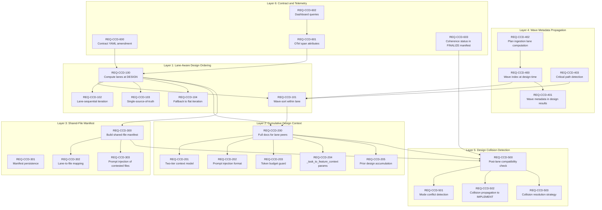

# Context Correctness by Design — Functional Requirements

**Version:** 1.0.0
**Created:** 2026-02-23
**Source:** Design-time isolation gap analysis, Mottainai audit (Gaps 17, 19, 25, 26), edit-first gate cascade analysis
**Status:** All 27 requirements planned.
**Prerequisite reading:**
- [Context Correctness by Design](../../design-princples/CONTEXT_CORRECTNESS_BY_DESIGN.md) — Design principle and theoretical foundation
- [Mottainai Design Principle](../../design-princples/MOTTAINAI_DESIGN_PRINCIPLE.md) — Gaps 17–36 (artisan internal audit)
- [Context Correctness by Construction](../../design-princples/CONTEXT_CORRECTNESS_BY_CONSTRUCTION.md) — Runtime complement
- [Artisan Requirements](ARTISAN_REQUIREMENTS.md) — AR-120 (Dual-Review), AR-124 (Cross-Task Context), AR-212 (Wave-Parallel)

---

## Overview

The artisan pipeline computes waves (`compute_waves()` at `artisan_contractor.py:~861`) and lanes (`compute_lanes()` at `artisan_contractor.py:~1070`) to prevent execution-time collisions when multiple tasks share target files. But the DESIGN phase — which creates the design documents that IMPLEMENT follows — operates with no wave or lane awareness. Tasks are iterated flat (`context_seed_handlers.py:~2335`), cross-task context is limited to 300-character first-line summaries (`context_seed_handlers.py:~2209`), and `_task_to_feature_context()` (`context_seed_handlers.py:~1635`) has no lane-awareness parameters.

This produces a cascade: incompatible designs → destructive implementations → edit-first gate catches the symptom but cannot fix the cause → wasted LLM cost on designs that were dead on arrival.

These 27 requirements close the gap between plan ingestion (which computes waves but not lanes) and the artisan wave/lane execution system (which computes both but only at IMPLEMENT time).

**Primary source files:**
- `src/startd8/contractors/context_seed_handlers.py` (~lines 1635, 1729, 2209, 2335)
- `src/startd8/contractors/artisan_contractor.py` (~lines 861, 1070)
- `src/startd8/workflows/builtin/plan_ingestion_workflow.py` (~lines 172-197)
- `src/startd8/contractors/contracts/artisan-pipeline.contract.yaml` (~lines 114-150)
- `src/startd8/contractors/edit_first_gate.py` (REQ-EFE-020–023)

### Status Dashboard

| Layer | ID Range | Total | Implemented | Planned |
|-------|----------|-------|-------------|---------|
| Lane-Aware Design Ordering | REQ-CCD-100–104 | 5 | 0 | 5 |
| Cumulative Design Context | REQ-CCD-200–205 | 6 | 0 | 6 |
| Shared-File Manifest | REQ-CCD-300–303 | 4 | 0 | 4 |
| Wave Metadata Propagation | REQ-CCD-400–403 | 4 | 0 | 4 |
| Design Collision Detection | REQ-CCD-500–503 | 4 | 0 | 4 |
| Contract and Telemetry | REQ-CCD-600–603 | 4 | 0 | 4 |
| **Total** | | **27** | **0** | **27** |

---

## Dependency Graph



---

## Layer 1: Lane-Aware Design Ordering (REQ-CCD-100–104)

Compute lanes at DESIGN time and iterate lane-by-lane in wave order, replacing the current flat `enumerate(tasks)` loop.

### REQ-CCD-100: Compute Lane Assignments at DESIGN Time

**Status:** planned
**Source files:** `context_seed_handlers.py` (~line 2335, DESIGN loop), `artisan_contractor.py` (~line 1070, `compute_lanes()`)
**Depends on:** —

Before the DESIGN phase begins iterating over tasks, compute lane assignments using `compute_lanes()` from `artisan_contractor.py`. The lane assignments determine which tasks share target files and must be designed in coordination.

**Acceptance criteria:**
- `compute_lanes()` is called with the full task list before the DESIGN iteration loop begins.
- The call uses the same `compute_lanes()` function used by `_execute_wave_lane_mode()` and `_execute_lane_parallel_mode()` — no duplicate implementation.
- Lane assignments are stored in the DESIGN phase context for downstream use (REQ-CCD-301, REQ-CCD-601).
- When `compute_lanes()` returns a single lane containing all tasks (no shared files), behavior degenerates to flat iteration with no overhead.
- Lane computation adds no LLM cost — it is purely algorithmic (Union-Find on `target_files` and `depends_on`).

---

### REQ-CCD-101: Wave-Sort Tasks Within Each Lane

**Status:** planned
**Source files:** `context_seed_handlers.py` (~line 2335)
**Depends on:** REQ-CCD-100, REQ-CCD-400

Within each lane, sort tasks by `wave_index` in ascending order. Tasks in the same wave within a lane are sorted lexicographically by `task_id` for deterministic ordering.

**Acceptance criteria:**
- Tasks within a lane are sorted by `(wave_index, task_id)` before iteration.
- Tasks with no `wave_index` (missing or None) are placed at the end of their lane.
- The sort is stable — tasks with equal `(wave_index, task_id)` maintain their input order.
- Sorting adds no LLM cost — it is a pure `sorted()` call.

---

### REQ-CCD-102: Lane-Sequential Design Iteration

**Status:** planned
**Source files:** `context_seed_handlers.py` (~line 2335, DESIGN loop)
**Depends on:** REQ-CCD-100

Replace the flat `for idx, task in enumerate(tasks)` loop with a nested loop: outer loop over lanes, inner loop over tasks within each lane (wave-sorted per REQ-CCD-101).

**Acceptance criteria:**
- The DESIGN loop iterates `for lane in lanes: for task in lane:` instead of `for task in tasks:`.
- Tasks within a lane are processed sequentially (inner loop is not concurrent).
- Lanes MAY be processed concurrently (they share no files by definition), but sequential processing is acceptable for the initial implementation.
- The `idx` counter continues to increment across lanes (not reset per lane) for progress reporting compatibility.
- All existing per-task logic (adopt-prior check, resume cache, LLM design call, error guard) is preserved inside the inner loop without modification.

---

### REQ-CCD-103: Single-Source-of-Truth Lane Computation

**Status:** planned
**Source files:** `artisan_contractor.py` (~line 1070, `compute_lanes()`)
**Depends on:** REQ-CCD-100

The DESIGN phase MUST use the same `compute_lanes()` function as the IMPLEMENT phase. No separate lane-computation implementation is permitted.

**Acceptance criteria:**
- `compute_lanes` is imported from `artisan_contractor` into `context_seed_handlers` (or accessed via a shared module).
- No alternative lane-grouping logic exists in `context_seed_handlers.py`.
- If `compute_lanes()` is refactored (e.g., moved to a utility module), both DESIGN and IMPLEMENT call sites are updated together.
- A unit test verifies that lane assignments computed at DESIGN time match those computed at IMPLEMENT time for the same task set.

---

### REQ-CCD-104: Graceful Fallback to Flat Iteration

**Status:** planned
**Source files:** `context_seed_handlers.py` (~line 2335)
**Depends on:** REQ-CCD-100

When `compute_lanes()` fails (exception) or returns degenerate results (single lane containing all tasks, or tasks lacking `target_files`), fall back to the existing flat iteration behavior. Log a warning indicating the fallback.

**Acceptance criteria:**
- If `compute_lanes()` raises any exception, catch it, log a WARNING with the exception, and proceed with flat iteration.
- If `compute_lanes()` returns a single lane with all tasks, proceed with that single lane (functionally equivalent to flat iteration but with the lane context infrastructure active).
- The fallback path produces identical results to the current (pre-CCD) behavior — no regression for pipelines without shared files.
- The fallback is logged with `get_logger()` (not `logging.getLogger()`) per SDK convention.

---

## Layer 2: Cumulative Design Context (REQ-CCD-200–205)

Replace 300-char summaries with full design documents for lane peers, inject into prompts, and guard token budget.

### REQ-CCD-200: Full Design Documents for Lane Peers

**Status:** planned
**Source files:** `context_seed_handlers.py` (~lines 2209, 2407-2411, 2537-2541)
**Depends on:** REQ-CCD-100, REQ-CCD-101

When building cross-task context for task *tᵢ* within a lane, provide the complete design document text of all prior lane tasks {*t₁, ..., tᵢ₋₁*} instead of the current 300-char first-line summaries.

**Acceptance criteria:**
- A new `lane_prior_designs: list[dict]` accumulator is maintained per lane, containing `{"task_id": str, "title": str, "design_document": str}` for each completed prior task in the lane.
- The accumulator is reset at the start of each lane (not carried across lanes).
- Each entry's `design_document` field contains the full `raw_text` of the design document — not the 300-char truncation.
- The existing `prior_summaries` accumulator continues to be populated for cross-lane context (REQ-CCD-201).
- When a design is adopted from a prior run (not freshly generated), its full document text is still added to `lane_prior_designs`.

---

### REQ-CCD-201: Two-Tier Context Model

**Status:** planned
**Source files:** `context_seed_handlers.py` (~lines 1729-1733, `additional_context["prior_designs"]`)
**Depends on:** REQ-CCD-200

Distinguish lane-internal context (full design docs) from cross-lane context (300-char summaries) when building the design prompt.

**Acceptance criteria:**
- `additional_context` gains two distinct keys:
  - `"lane_peer_designs"`: Full design documents from prior tasks in the same lane (from `lane_prior_designs`).
  - `"prior_designs"`: 300-char summaries from tasks in other lanes (existing behavior, minus lane peers to avoid duplication).
- Tasks in other lanes do NOT appear in `lane_peer_designs`.
- Tasks in the same lane do NOT appear in `prior_designs`.
- When a task is in a single-task lane (no shared files), `lane_peer_designs` is empty and `prior_designs` behaves identically to today.

---

### REQ-CCD-202: Design Prompt Injection Format

**Status:** planned
**Source files:** `context_seed_handlers.py` (~line 1729, `additional_context`), design prompt templates
**Depends on:** REQ-CCD-200

Lane-peer design documents MUST be injected into the design prompt in a structured format that enables the LLM to reason about compatibility.

**Acceptance criteria:**
- Lane-peer designs are injected with clear delimiters: task ID, title, shared files (from manifest), and full design text.
- The injection format includes an explicit instruction: "The following tasks share files with this task. Your design MUST be compatible with the design decisions in these documents, particularly regarding: class/function names, import paths, interface contracts, and data structures for the shared files."
- Each lane-peer entry identifies which specific files are shared between that peer and the current task (from shared-file manifest, REQ-CCD-303).
- The injection appears before the task-specific design instructions in the prompt, so the LLM processes compatibility context before generating.

---

### REQ-CCD-203: Token Budget Guard for Lane-Peer Context

**Status:** planned
**Source files:** `context_seed_handlers.py` (new logic near ~line 1729)
**Depends on:** REQ-CCD-200

A configurable token budget MUST cap the total lane-peer context injected into any single design prompt.

**Acceptance criteria:**
- A configuration parameter `design_lane_peer_token_budget` (default: 8000 tokens) controls the maximum token estimate for lane-peer context.
- Token estimation uses a character-based heuristic (chars / 4) — consistent with existing token estimation in the pipeline.
- When the total lane-peer context exceeds the budget, earlier lane peers are truncated to 300-char summaries (most recent peer retains full doc).
- When truncation occurs, a WARNING log is emitted: `"Lane-peer context truncated: {n} of {total} peers reduced to summaries (budget: {budget} tokens)"`.
- The budget applies only to lane-peer context — other prompt components (task description, architectural context, parameter sources) have their own budgets.

---

### REQ-CCD-204: Extend `_task_to_feature_context()` Signature

**Status:** planned
**Source files:** `context_seed_handlers.py` (~line 1635, `_task_to_feature_context()`)
**Depends on:** REQ-CCD-200

Add lane-awareness parameters to `_task_to_feature_context()`.

**Acceptance criteria:**
- The method gains three new keyword-only parameters:
  - `lane_prior_designs: list[dict] | None = None` — full design documents from prior lane tasks.
  - `shared_file_manifest: dict[str, list[str]] | None = None` — per-file map of contesting task IDs.
  - `wave_index: int | None = None` — this task's position in the dependency graph.
- All three parameters default to `None` for backward compatibility — existing call sites are not broken.
- When `lane_prior_designs` is provided and non-empty, the method uses it to build `additional_context["lane_peer_designs"]` (REQ-CCD-201).
- When `shared_file_manifest` is provided, the method uses it to annotate lane-peer entries with shared file names (REQ-CCD-202).

---

### REQ-CCD-205: Lane-Peer Design Accumulation

**Status:** planned
**Source files:** `context_seed_handlers.py` (~lines 2537-2541, post-design accumulation)
**Depends on:** REQ-CCD-200

After each task's design is completed (or adopted), accumulate its full design document into the lane-peer context for subsequent tasks in the same lane.

**Acceptance criteria:**
- After a design is generated or adopted, the task's `{"task_id", "title", "design_document"}` is appended to `lane_prior_designs`.
- For adopted designs, the `design_document` is extracted from the prior design entry in `design_results`.
- For freshly generated designs, the `design_document` is `result.design_document.raw_text`.
- The accumulation happens in the same code path where `prior_summaries.append(summary)` currently occurs — the two accumulators are updated in parallel.
- The `prior_summaries` list continues to be populated for all tasks (including lane peers) to maintain backward-compatible cross-lane context.

---

## Layer 3: Shared-File Manifest (REQ-CCD-300–303)

Build a per-task map of which files are contested and by whom.

### REQ-CCD-300: Build Shared-File Manifest

**Status:** planned
**Source files:** `context_seed_handlers.py` (new logic, before DESIGN loop at ~line 2335)
**Depends on:** REQ-CCD-100

Before the DESIGN loop begins, build a shared-file manifest: a mapping from each target file to the list of task IDs that include it in their `target_files`.

**Acceptance criteria:**
- The manifest is a `dict[str, list[str]]` where keys are target file paths and values are lists of task IDs.
- Only files appearing in 2+ tasks' `target_files` are included (files unique to one task are not "shared").
- The manifest is computed once before the DESIGN loop — not recomputed per task.
- File paths are normalized (resolved relative to `project_root`) before comparison to avoid false negatives from path format differences.
- The manifest computation is O(n×m) where n=tasks, m=avg target files per task — no LLM cost.

---

### REQ-CCD-301: Manifest Persistence in Design Context

**Status:** planned
**Source files:** `context_seed_handlers.py` (DESIGN phase context)
**Depends on:** REQ-CCD-300

The shared-file manifest MUST be persisted in the DESIGN phase context for downstream consumption.

**Acceptance criteria:**
- The manifest is stored in `context["design"]["shared_file_manifest"]`.
- The manifest is available to the IMPLEMENT phase via context propagation.
- The manifest is included in the design checkpoint (if checkpoint/recovery is active) for resume scenarios.
- When no shared files exist (all files unique to one task), the manifest is an empty dict `{}` — not omitted.

---

### REQ-CCD-302: Lane-to-File Mapping

**Status:** planned
**Source files:** `context_seed_handlers.py` (new logic)
**Depends on:** REQ-CCD-300

Compute a lane-to-file mapping: for each lane, which shared files are the basis of that lane's existence.

**Acceptance criteria:**
- The mapping is a `dict[int, list[str]]` where keys are lane indices and values are the shared file paths that caused those tasks to be grouped.
- The mapping is derivable from the shared-file manifest (REQ-CCD-300) cross-referenced with lane assignments (REQ-CCD-100).
- The mapping is stored alongside the shared-file manifest in design context.
- The mapping enables targeted logging: "Lane 2 formed because tasks PI-003, PI-007, PI-011 share `src/utils.py` and `src/config.py`".

---

### REQ-CCD-303: Prompt Injection of Contested Files

**Status:** planned
**Source files:** `context_seed_handlers.py` (~line 1635, `_task_to_feature_context()`)
**Depends on:** REQ-CCD-300

When building the design prompt for a task, inject its contested files from the shared-file manifest.

**Acceptance criteria:**
- For each of the current task's `target_files` that appears in the shared-file manifest, the prompt includes: the file path, the list of other tasks targeting it, and (if available) a brief indication of what each other task intends to do with the file (from the task title).
- The injection is placed near the lane-peer design context (REQ-CCD-202) for prompt coherence.
- When a task has no contested files (all its targets are unique), no contested-file section is injected.
- The injected text is concise — file path + task IDs + titles, not full task descriptions.

---

## Layer 4: Wave Metadata Propagation (REQ-CCD-400–403)

Propagate wave metadata from plan ingestion through DESIGN, enabling wave-sorted ordering and critical path awareness.

### REQ-CCD-400: Wave Index Available at Design Time

**Status:** planned
**Source files:** `context_seed_handlers.py` (~line 2335), `plan_ingestion_workflow.py` (~line 172)
**Depends on:** REQ-CCD-402

Each task MUST have a `wave_index` attribute available at DESIGN time.

**Acceptance criteria:**
- `SeedTask.wave_index` (or equivalent) is populated during plan ingestion or PLAN phase.
- The wave_index is available to the DESIGN loop for sorting (REQ-CCD-101).
- Tasks whose `wave_index` was computed during plan ingestion (`_assign_wave_indices()`) retain that value unchanged through PLAN to DESIGN.
- The wave_index computation uses `compute_waves()` from `artisan_contractor.py` — same function used at execution time.

---

### REQ-CCD-401: Wave Metadata in Design Results

**Status:** planned
**Source files:** `context_seed_handlers.py` (design_results serialization)
**Depends on:** REQ-CCD-400

Design results MUST include wave and lane metadata for downstream phases.

**Acceptance criteria:**
- Each task's entry in `design_results` includes: `wave_index` (int), `lane_index` (int), `lane_peer_count` (int), `shared_file_count` (int).
- The metadata is written during `_serialize_result()` alongside existing fields (`design_document`, `status`, `cost`, `design_mode`).
- IMPLEMENT can read these fields to cross-check its own lane computation (REQ-CCD-103 validation).
- When lane computation was skipped (REQ-CCD-104 fallback), `lane_index` is set to 0 and `lane_peer_count` is set to the total task count.

---

### REQ-CCD-402: Lane Computation in Plan Ingestion

**Status:** planned
**Source files:** `plan_ingestion_workflow.py` (~line 172, `_assign_wave_indices()`)
**Depends on:** —

Plan ingestion SHOULD compute lane assignments alongside wave assignments for earlier visibility.

**Acceptance criteria:**
- `_assign_wave_indices()` (or a new companion function) calls `compute_lanes()` on the task list.
- Lane assignments are stored in the seed as `lane_assignments: dict[str, int]` (task_id → lane_index).
- When `target_files` are not yet available at plan ingestion time (they may be populated later during PLAN), lane computation is deferred and the seed field is set to `null`.
- Lane assignments computed at plan ingestion are advisory — the DESIGN phase re-computes from the final task list (REQ-CCD-100) and uses the seed value only as a cross-check.

---

### REQ-CCD-403: Critical Path Detection

**Status:** planned
**Source files:** `context_seed_handlers.py` (new logic, after REQ-CCD-300)
**Depends on:** REQ-CCD-101

Tasks whose shared files appear in the most other tasks' manifests are on the critical design path. These tasks SHOULD be identified and logged.

**Acceptance criteria:**
- After computing the shared-file manifest (REQ-CCD-300), identify tasks with the highest "contention score" — the sum of other tasks contesting their target files.
- Tasks with contention score in the top 20% (or above a configurable threshold) are logged as "critical path tasks" at INFO level.
- Critical path tasks are annotated in design results (REQ-CCD-401) with `critical_path: true`.
- No behavioral change (ordering or priority) is driven by critical path detection in the initial implementation — it is purely informational. Future implementations may use it for lane-internal ordering optimization.

---

## Layer 5: Design Collision Detection (REQ-CCD-500–503)

Detect and report design collisions after each lane completes.

### REQ-CCD-500: Post-Lane Compatibility Check

**Status:** planned
**Source files:** `context_seed_handlers.py` (new logic, after inner lane loop)
**Depends on:** REQ-CCD-300, REQ-CCD-200

After all tasks in a lane have completed their designs, run a lightweight compatibility check across the lane's design documents for shared files.

**Acceptance criteria:**
- For each shared file in the lane, extract the relevant sections from each task's design document (class names, function signatures, imports).
- Check for obvious conflicts: duplicate class/function names with different signatures, incompatible import paths, conflicting interface contracts.
- The check is heuristic-based (string matching, regex extraction) — NOT an LLM call. It catches obvious conflicts, not subtle semantic incompatibilities.
- Results are stored per lane: `{"lane_index": int, "conflicts": list[dict], "status": "COHERENT" | "WARNING" | "CONFLICTING"}`.
- A lane with no detected conflicts has status `COHERENT`. A lane with potential conflicts (uncertain matches) has status `WARNING`. A lane with definite conflicts has status `CONFLICTING`.

---

### REQ-CCD-501: Design Mode Conflict Detection

**Status:** planned
**Source files:** `context_seed_handlers.py` (design_mode per task), `edit_first_gate.py` (REQ-EFE-020)
**Depends on:** REQ-CCD-500

When two tasks in the same lane have conflicting `design_mode` for the same file (one says `create`, the other says `update`), flag a design collision.

**Acceptance criteria:**
- If task A has `design_mode: "create"` for file F and task B has `design_mode: "update"` for the same file F, a conflict is recorded with severity `WARNING`.
- If task A has `design_mode: "create"` and task B also has `design_mode: "create"` for the same file F (both intend to create the file from scratch), a conflict is recorded with severity `CONFLICTING`.
- `design_mode: "update"` + `design_mode: "update"` for the same file is not inherently conflicting (both are editing an existing file) but is logged as `INFO` for awareness.
- The conflict detection integrates with the edit-first gate's size regression check (REQ-EFE-020) — conflicts detected here are forwarded as advisory context.

---

### REQ-CCD-502: Collision Propagation to IMPLEMENT

**Status:** planned
**Source files:** `context_seed_handlers.py` (IMPLEMENT phase entry)
**Depends on:** REQ-CCD-500

Design collision results MUST be available to the IMPLEMENT phase.

**Acceptance criteria:**
- Lane conflict results from REQ-CCD-500 are stored in `context["design"]["lane_conflicts"]`.
- The IMPLEMENT phase can read `lane_conflicts` to adjust behavior: tasks in `CONFLICTING` lanes may receive additional context in their implementation prompts warning about the design collision.
- The edit-first gate (REQ-EFE-020–023) can read `lane_conflicts` to lower its rejection threshold for tasks in conflicting lanes — making it more aggressive about enforcing edit-mode when designs are known to be incompatible.
- When no lane computation was performed (REQ-CCD-104 fallback), `lane_conflicts` is set to `[]`.

---

### REQ-CCD-503: Collision Resolution Strategy

**Status:** planned
**Source files:** `context_seed_handlers.py` (new logic)
**Depends on:** REQ-CCD-500

When a `CONFLICTING` collision is detected, the pipeline SHOULD take a configurable resolution action.

**Acceptance criteria:**
- Three resolution strategies are supported:
  1. `warn` (default): Log the conflict and continue. IMPLEMENT receives the advisory context.
  2. `redesign`: Re-run the conflicting task's design with the collision details injected into the prompt as a constraint. Costs one additional LLM call per conflicting task.
  3. `abort`: Fail the DESIGN phase for the conflicting lane. Other lanes continue.
- The strategy is configurable via `WorkflowConfig.design_collision_strategy` (default: `"warn"`).
- The `redesign` strategy uses the existing design LLM call path — no new LLM integration required.
- The `abort` strategy marks the lane's tasks as `design_failed` in design_results but does not halt the overall pipeline.

---

## Layer 6: Contract and Telemetry (REQ-CCD-600–603)

Amend the pipeline contract YAML, emit OTel span attributes, and enable dashboard queries.

### REQ-CCD-600: Contract YAML Amendment for DESIGN Phase

**Status:** planned
**Source files:** `artisan-pipeline.contract.yaml` (~line 114, DESIGN phase)
**Depends on:** REQ-CCD-100

The DESIGN phase section of `artisan-pipeline.contract.yaml` MUST declare lane assignments as an advisory enrichment.

**Acceptance criteria:**
- DESIGN phase `entry.enrichment` gains:
  ```yaml
  - name: lane_assignments
    type: dict
    severity: advisory
    description: "Per-task lane assignments from compute_lanes(). Advisory — DESIGN falls back to flat iteration if absent."
  - name: wave_assignments
    type: dict
    severity: advisory
    description: "Per-task wave indices for lane-internal ordering."
  ```
- DESIGN phase `exit.optional` gains:
  ```yaml
  - name: design_results.*.lane_index
    type: int
    description: "Lane index assigned to this task during DESIGN. Matches IMPLEMENT lane computation."
  - name: design_results.*.wave_index
    type: int
    description: "Wave index used for lane-internal ordering."
  - name: shared_file_manifest
    type: dict
    description: "Per-file map of contesting task IDs. Empty dict if no shared files."
  - name: lane_conflicts
    type: list
    description: "Post-lane compatibility check results. Empty list if no conflicts detected."
  ```
- Severity is `advisory` for all new fields — the DESIGN phase functions without them (REQ-CCD-104 fallback).

---

### REQ-CCD-601: OTel Span Attributes for Lane Context

**Status:** planned
**Source files:** `context_seed_handlers.py` (~line 2335, per-task span)
**Depends on:** REQ-CCD-100

Per-task OTel spans in the DESIGN phase MUST include lane-awareness attributes.

**Acceptance criteria:**
- The existing per-task span (`_phase_tracer.start_as_current_span(f"task.{task.task_id}")` at ~line 2335) gains the following attributes:
  - `task.lane_index` (int): The lane this task belongs to.
  - `task.lane_peer_count` (int): Number of other tasks in the same lane.
  - `task.shared_file_count` (int): Number of this task's target files that appear in the shared-file manifest.
  - `task.lane_prior_designs_count` (int): Number of full design documents injected as lane-peer context.
  - `task.lane_prior_designs_truncated` (bool): Whether any lane-peer context was truncated due to token budget (REQ-CCD-203).
- When lane computation was skipped (REQ-CCD-104 fallback), `task.lane_index` is set to 0 and `task.lane_peer_count` is set to -1 (sentinel for "not computed").
- Attributes follow OTel semantic conventions: lowercase dot-separated namespace.

---

### REQ-CCD-602: Grafana Dashboard Queries

**Status:** planned
**Source files:** N/A (dashboard configuration)
**Depends on:** REQ-CCD-601

OTel span attributes from REQ-CCD-601 MUST be queryable in Grafana Tempo for design coherence analysis.

**Acceptance criteria:**
- The following TraceQL queries MUST return valid results after implementation:
  - `{ span.task.lane_peer_count > 0 }` — find all tasks that were designed with lane-peer context.
  - `{ span.task.shared_file_count > 0 && span.task.lane_prior_designs_count = 0 }` — find tasks with shared files but no lane-peer context (design isolation).
  - `{ span.task.lane_prior_designs_truncated = true }` — find tasks where token budget forced truncation.
- Queries are documented in the design principle document or a companion dashboard JSON.
- No new Grafana dashboard is required — the queries work in Tempo's Explore view.

---

### REQ-CCD-603: Lane Coherence Status in FINALIZE Manifest

**Status:** planned
**Source files:** `context_seed_handlers.py` (~line 5763, FINALIZE manifest)
**Depends on:** REQ-CCD-500

The FINALIZE manifest MUST include lane coherence metadata.

**Acceptance criteria:**
- The `generation-manifest.json` gains a `design_coherence` section:
  ```json
  {
    "design_coherence": {
      "total_lanes": 5,
      "shared_file_lanes": 2,
      "coherent_lanes": 1,
      "warning_lanes": 1,
      "conflicting_lanes": 0,
      "shared_file_count": 3,
      "lane_details": [
        {
          "lane_index": 2,
          "task_ids": ["PI-003", "PI-007"],
          "shared_files": ["src/utils.py"],
          "status": "COHERENT"
        }
      ]
    }
  }
  ```
- When lane computation was not performed (REQ-CCD-104 fallback), `design_coherence` is set to `{"status": "NOT_COMPUTED", "reason": "lane computation fell back to flat iteration"}`.
- The `design_coherence` section is available to Gate 3 (post-pipeline validation) for quality assessment.

---

## Traceability Matrix

### Requirement → Mottainai Gap

| Requirement | Mottainai Gap | Description |
|-------------|---------------|-------------|
| REQ-CCD-100 | Gap 25 | `file_scope` not forwarded — lane computation provides superset of file-scope data |
| REQ-CCD-200 | Gap 19 | Design sections not serialized — full docs now forwarded to lane peers |
| REQ-CCD-300 | Gap 26 | Downstream files re-derived — manifest pre-computes shared-file analysis |
| REQ-CCD-401 | Gap 17 | Reviewer verdicts discarded — lane metadata enriches serialized design results |
| REQ-CCD-500 | Gap 18 | `extract_critical_parameters()` never called — collision check provides a path to parameter fidelity validation |

### Requirement → Context Propagation Gap

| Requirement | Context Propagation Gap | Description |
|-------------|------------------------|-------------|
| REQ-CCD-200, 201 | Intra-phase propagation gap | Cross-task design context within DESIGN is not addressed by the inter-phase propagation model |
| REQ-CCD-400 | Wave metadata not at DESIGN time | Wave indices exist at PLAN but are not surfaced to DESIGN ordering |
| REQ-CCD-402 | Plan ingestion lane gap | Plan ingestion computes waves but not lanes |
| REQ-CCD-600 | Contract YAML gap | DESIGN phase contract has no lane requirements |

### Requirement → Artisan Requirement Cross-References

| Requirement | AR-xxx | Relationship |
|-------------|--------|-------------|
| REQ-CCD-100 | AR-124 (Cross-Task Context) | REQ-CCD-100 implements the lane-aware dimension of cross-task context that AR-124 describes |
| REQ-CCD-101 | AR-212 (Wave-Parallel) | REQ-CCD-101 reuses wave ordering at DESIGN time; AR-212 uses it at IMPLEMENT time |
| REQ-CCD-103 | AR-212 | Single-source-of-truth for `compute_lanes()` ensures DESIGN and IMPLEMENT lane parity |
| REQ-CCD-200 | AR-120 (Dual-Review) | Lane-peer context enriches the dual-review design input, reducing reviewer disagreements caused by design isolation |
| REQ-CCD-300 | AR-127 (Existing File Detection) | Shared-file manifest complements existing-file detection — both identify files that need special handling |
| REQ-CCD-401 | AR-128 (design_mode Propagation) | Lane metadata extends design_mode propagation with lane_index and shared_file_count |
| REQ-CCD-500 | AR-130 (Chunk Execution) | Collision detection informs IMPLEMENT's chunk execution strategy for conflicting designs |
| REQ-CCD-501 | REQ-EFE-020 (Edit-First Size Check) | Mode conflict detection feeds into edit-first enforcement threshold adjustment |
| REQ-CCD-502 | REQ-EFE-023 (Retry Prompt) | Collision context enriches the edit-focused retry prompt when edit-first gate rejects |
| REQ-CCD-600 | AR-601 (Phase Spans) | New span attributes extend the per-task span instrumentation defined by AR-601 |
| REQ-CCD-601 | OT-300 (Per-Task Spans) | Lane attributes are added to the per-task spans defined by OT-300 in the OTel tracing requirements |
| REQ-CCD-603 | AR-161 (Manifest) | Lane coherence section extends the FINALIZE manifest defined by AR-161 |

### Requirement → Edit-First Gate

| Requirement | REQ-EFE-xxx | Relationship |
|-------------|-------------|-------------|
| REQ-CCD-500 | REQ-EFE-020 | Post-lane compatibility check provides root-cause data for edit-first size regressions |
| REQ-CCD-501 | REQ-EFE-021 | Design mode conflicts are the upstream cause of edit-first create-vs-update mismatches |
| REQ-CCD-502 | REQ-EFE-022 | Collision propagation enables edit-first gate to emit richer OTel events with lane context |
| REQ-CCD-503 | REQ-EFE-023 | `redesign` resolution strategy is the design-time analog of edit-first's retry prompt |

---

## Implementation Priority

| Phase | Requirements | Priority | Impact | Effort |
|-------|-------------|----------|--------|--------|
| **P0: Foundation** | REQ-CCD-100, 103, 104, 400 | **Critical** | Enables all other requirements. Lane computation and wave awareness at DESIGN time. | Low — reuses existing `compute_lanes()` and `wave_index`. |
| **P1: Core Value** | REQ-CCD-101, 102, 200, 201, 204, 205, 300 | **High** | Delivers the primary value: lane-aware ordering + full-doc context + shared-file manifest. | Medium — modifies the DESIGN loop and prompt construction. |
| **P2: Refinement** | REQ-CCD-202, 203, 301, 302, 303, 401, 402, 403, 500, 501, 502, 503 | **Medium** | Prompt formatting, token budget, collision detection, plan ingestion integration. | Medium-High — new logic for collision detection and manifest persistence. |
| **P3: Observability** | REQ-CCD-600, 601, 602, 603 | **Low** | Contract YAML, OTel attributes, dashboard queries, manifest enrichment. | Low — attribute additions and YAML amendments. |

Implementation order follows the dependency chain: P0 (lane computation) must land before P1 (context injection), which must land before P2 (collision detection). P3 (observability) can proceed in parallel with P2.

---

## Non-Requirements (Explicitly Out of Scope)

| Topic | Why Out of Scope |
|-------|------------------|
| Concurrent lane execution in DESIGN | Lanes MAY be processed concurrently (they share no files), but sequential processing is acceptable for the initial implementation. Concurrency optimization is a follow-up. |
| LLM-based collision detection | REQ-CCD-500 uses heuristic-based checks (string matching, regex). LLM-based semantic compatibility analysis would add cost and latency for uncertain benefit. |
| Cross-pipeline lane awareness | Lane computation applies within a single pipeline run. Cross-run lane awareness (e.g., "this file was modified in a previous pipeline run") is a different problem requiring persistent state. |
| IMPLEMENT phase lane recomputation | IMPLEMENT already computes lanes. These requirements do not change IMPLEMENT's lane logic — they mirror it at DESIGN time using the same function. |
| TEST and REVIEW lane awareness | TEST and REVIEW operate on individual task outputs. Lane awareness at these phases would require cross-task evaluation, which is a larger scope change. |
| Modifying `compute_lanes()` itself | These requirements consume `compute_lanes()` as-is. Any changes to the Union-Find algorithm or lane-splitting heuristics are separate from this document. |
| Automatic design rewriting | REQ-CCD-503's `redesign` strategy re-runs the existing design path with additional context. Automatic design merging (combining two incompatible designs) is not in scope. |

---

## Related Documents

| Document | Relationship |
|----------|-------------|
| [Context Correctness by Design](../../design-princples/CONTEXT_CORRECTNESS_BY_DESIGN.md) | Design principle — theoretical foundation and three pillars |
| [Context Correctness by Construction](../../design-princples/CONTEXT_CORRECTNESS_BY_CONSTRUCTION.md) | Runtime complement — boundary validation and propagation chains |
| [Mottainai Design Principle](../../design-princples/MOTTAINAI_DESIGN_PRINCIPLE.md) | Gaps 17, 19, 25, 26 define upstream waste caused by design isolation |
| [Artisan Requirements](ARTISAN_REQUIREMENTS.md) | AR-120, AR-124, AR-127, AR-128, AR-161, AR-212 — cross-referenced requirements |
| [OTel Full-Depth Tracing Requirements](ARTISAN_OTEL_FULL_DEPTH_TRACING_REQUIREMENTS.md) | OT-300 (per-task spans) — REQ-CCD-601 extends these spans |
| [REFINE Forwarding Requirements](../../REFINE_FORWARDING_REQUIREMENTS.md) | Format precedent — this document follows the same requirement structure |
| [Context Propagation](../../design-princples/context-propagation.md) | Propagation model — REQ-CCD adds intra-phase propagation dimension |
| [Edit-First Gate](../../../src/startd8/contractors/edit_first_gate.py) | REQ-EFE-020–023 — downstream symptom handler that benefits from design-time collision detection |

---

## Changelog

| Date | Change |
|------|--------|
| 2026-02-23 | Initial version: 27 requirements across 6 layers, dependency graph, traceability matrix, implementation priority |
