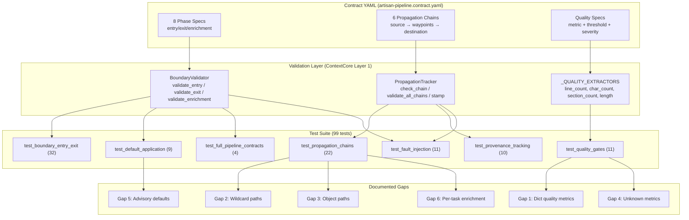

# Contract Validation Requirements

> **Version:** 1.1.0
> **Status:** Implemented (test suite + gap resolutions CV-500, CV-501, CV-301, CV-302, CV-201)
> **Date:** 2026-02-21
> **Scope:** Artisan 8-phase pipeline contract enforcement, propagation chain validation, quality gates, and provenance tracking
> **Depends on:** `ARTISAN_REQUIREMENTS.md` (AR-201, AR-128, AR-300), `PROJECT_CENTRIC_ARTISAN_REQUIREMENTS.md` (PCA-4xx)

---

## Table of Contents

1. [Design Principle](#1-design-principle)
2. [Gap Analysis](#2-gap-analysis)
3. [Requirements](#3-requirements)
   - [Layer 1: Boundary Validation (CV-1xx)](#layer-1-boundary-validation-cv-1xx)
   - [Layer 2: Enrichment Propagation (CV-2xx)](#layer-2-enrichment-propagation-cv-2xx)
   - [Layer 3: Propagation Chains (CV-3xx)](#layer-3-propagation-chains-cv-3xx)
   - [Layer 4: Provenance Tracking (CV-4xx)](#layer-4-provenance-tracking-cv-4xx)
   - [Layer 5: Quality Gates (CV-5xx)](#layer-5-quality-gates-cv-5xx)
   - [Layer 6: Fault Detection (CV-6xx)](#layer-6-fault-detection-cv-6xx)
4. [Data Flow Diagram](#4-data-flow-diagram)
5. [Traceability Matrix](#5-traceability-matrix)
6. [Contract YAML Amendments](#6-contract-yaml-amendments)
7. [Priority Phasing](#7-priority-phasing)
8. [Status Dashboard](#8-status-dashboard)
9. [Related Documents](#9-related-documents)

---

## 1. Design Principle

**The contract system must be verifiable by tests, not just declarative.**

The Artisan 8-phase pipeline passes context as a shared mutable dict between phases. The contract YAML (`artisan-pipeline.contract.yaml`) declares 6 propagation chains and per-phase entry/exit/enrichment requirements via ContextCore's Layer 1 contract system (`contracts/propagation/`). However, a declaration without enforcement is an illusion of safety. The contract system must be backed by a comprehensive test suite that serves as both a regression gate and a living specification of what the contract actually guarantees.

This document specifies requirements for:
1. **What the test suite validates** (Layers 1-4, 6) — boundary enforcement, enrichment defaults, chain integrity, provenance, and fault detection.
2. **What gaps the test suite discovered** (Layer 5, plus amendments to Layers 2-3) — quality extractors applied to wrong value types, wildcard/object path resolution failures, and unknown metric silent-skip behavior.

---

## 2. Gap Analysis

The contract validation test suite (99 tests, `tests/contract_validation/`) revealed 6 design tensions in the contract system. Each gap includes evidence from the test suite, root cause analysis, and impact assessment.

### Gap 1: Quality Metrics Applied to Dict Values

**Evidence:** `test_quality_gates.py::TestImplementEntryQuality::test_line_count_on_dict_always_low`

```
ContractValidationResult(passed=False, ...
  quality_violations=[QualityViolation(
    field='design_results', metric='line_count',
    actual=1.0, threshold=50.0, severity=blocking)])
```

The contract declares a blocking `line_count >= 50` quality gate on `design_results` at IMPLEMENT entry and a warning `section_count >= 2` on `design_results` at DESIGN exit. Both fields are dicts. The `_QUALITY_EXTRACTORS` in `validator.py` call `str(v).strip().splitlines()` (line_count) and `str(v).splitlines()` counting `##` headers (section_count). For a dict value, `str()` produces a single-line Python repr — `line_count` always returns ~1.0 and `section_count` always returns 0.0.

**Impact:** The IMPLEMENT entry quality gate is **permanently blocking** for any well-formed pipeline context. This means the contract-aware validation path (via `validate_phase_boundary()`) can never fully pass for the implement phase, even when the design documents inside the dict are substantial.

---

### Gap 2: Wildcard Path Resolution in Propagation Chains

**Evidence:** `test_propagation_chains.py::TestDesignModeToImplementChain::test_current_behavior_is_broken_due_to_wildcard_source`

Chain 5 (`design_mode_to_implement`) declares its source as `design_results.*.design_mode`. The `_resolve_field()` function splits by `.` and traverses dicts — it treats `*` as a literal key name, not a wildcard glob. Since no key `"*"` exists in `design_results`, the source never resolves.

```python
# _resolve_field() treats "*" as a literal dict key
_resolve_field(ctx, "design_results.*.design_mode")  # (False, None)
_resolve_field(ctx, "design_results.T1.design_mode")  # (True, "create") ← works
```

**Impact:** Chain 5 always reports BROKEN regardless of context quality. The contract declares intent (design_mode should flow from DESIGN to IMPLEMENT) but the resolution mechanism cannot express per-task field paths.

---

### Gap 3: Object Path Destinations in Propagation Chains

**Evidence:** `test_propagation_chains.py::TestOnboardingContextToImplementChain::test_destination_broken_due_to_object_path`

Chains 5 and 6 declare destination fields as `DevelopmentChunk.metadata.design_mode` and `DevelopmentChunk.metadata.service_metadata`. These are runtime object attribute paths, not context dict paths. `_resolve_field()` only traverses dicts — `context["DevelopmentChunk"]` does not exist and cannot exist because `DevelopmentChunk` is a class, not a context key.

**Impact:** Chains 5 and 6 always report BROKEN at the destination, even when the data is correctly propagated at runtime. The contract system cannot verify runtime object attribute flow.

---

### Gap 4: Unknown Quality Metrics Silently Skipped

**Evidence:** `test_quality_gates.py::TestUnknownQualityMetrics::test_integrate_exit_success_rate_skipped_gracefully`

The contract YAML declares three quality metrics that have no corresponding `_QUALITY_EXTRACTORS` entry:

| Metric | Phase | Direction | Threshold | Severity |
|--------|-------|-----------|-----------|----------|
| `success_rate` | integrate | exit | 0.5 | warning |
| `total_passed` | test | exit | 1 | warning |
| `total_passed` | review | exit | 1 | warning |

When the validator encounters an unknown metric, it silently skips the quality check (logged at DEBUG level). No `QualityViolation` is produced and no warning is surfaced.

**Impact:** Three quality gates declared in the contract YAML have zero enforcement. The contract appears to specify quality thresholds that are never checked, creating a false sense of coverage.

---

### Gap 5: Advisory Severity Fields with Declared Defaults

**Evidence:** `test_default_application.py::TestImplementEnrichmentDefaults::test_design_calibration_advisory_not_defaulted`

The contract YAML declares `design_calibration` at IMPLEMENT enrichment with `severity: advisory` and `default: {}`. However, advisory-severity fields are not defaulted by `BoundaryValidator.validate_enrichment()` — only `warning`-severity fields receive defaults. The declared default on an advisory field is inert.

Similarly, `architectural_context` has `severity: advisory` and `default: {}` but is never injected. The contract declares intent ("here's a reasonable default") but the severity level prevents the default from being applied.

**Impact:** The contract YAML misleads readers into thinking these fields have fallback values when they do not. The distinction between advisory (log-only) and warning (default-and-log) is not obvious from reading the YAML alone.

---

### Gap 6: Per-Task Enrichment Field Propagation

**Evidence:** `test_propagation_chains.py::TestDesignModeToImplementChain::test_logical_intent_works_with_concrete_task_path`

Chain 5 (`design_mode_to_implement`) needs to verify that `design_mode` propagates for each task individually. The enrichment field `design_results.*.design_mode` is per-task, but the enrichment system treats field paths as scalar — it can default a single value, not iterate over task entries. Task `T1` might have `design_mode: "create"` while `T2` has `design_mode: "update"`, but the contract system has no mechanism to validate or default per-task values.

**Impact:** Per-task data flow is the most common pattern in the Artisan pipeline (every phase operates on a list of tasks), but the contract system only supports scalar field paths. This limits the contract's ability to express the pipeline's actual data model.

---

## 3. Requirements

### Layer 1: Boundary Validation (CV-1xx)

Phase entry and exit boundary validation using `BoundaryValidator` against the loaded `ContextContract`.

---

#### CV-100: Phase Entry Validation for All 8 Phases

- **Priority:** P0
- **Status:** Implemented (test suite)
- **Test file:** `tests/contract_validation/test_boundary_entry_exit.py`

Each of the 8 phases (PLAN, SCAFFOLD, DESIGN, IMPLEMENT, INTEGRATE, TEST, REVIEW, FINALIZE) must have its blocking entry requirements validated by `BoundaryValidator.validate_entry()` against the contract YAML.

**Acceptance Criteria:**

1. `validate_entry(phase, context, contract)` returns `passed=True` when all blocking-severity required fields are present and non-None.
2. `validate_entry(phase, context, contract)` returns `passed=False` with the missing field name in `blocking_failures` when a required field is absent.
3. Every phase declared in the contract YAML has at least one entry test for the passing case and one for the failing case.

**Source files:** `src/startd8/contractors/contracts/artisan-pipeline.contract.yaml`, ContextCore `contracts/propagation/validator.py`

---

#### CV-101: Phase Exit Validation for All 8 Phases

- **Priority:** P0
- **Status:** Implemented (test suite)
- **Test file:** `tests/contract_validation/test_boundary_entry_exit.py`

Each of the 8 phases must have its exit requirements validated by `BoundaryValidator.validate_exit()`. Exit validation checks that all blocking-severity required output fields are present.

**Acceptance Criteria:**

1. `validate_exit(phase, context, contract)` returns `passed=True` when all blocking-severity required output fields are present.
2. `validate_exit(phase, context, contract)` returns `passed=False` with the missing field name in `blocking_failures` when a required output field is absent.
3. Quality violations (from `QualitySpec`) on exit fields are surfaced in `result.quality_violations` with correct metric, actual, and threshold values.

**Source files:** `src/startd8/contractors/contracts/artisan-pipeline.contract.yaml`, ContextCore `contracts/propagation/validator.py`

---

#### CV-102: End-to-End Boundary Sweep

- **Priority:** P0
- **Status:** Implemented (test suite)
- **Test file:** `tests/contract_validation/test_full_pipeline_contracts.py`

A fully-populated synthetic context (simulating all 8 phases' successful output) must pass all entry, exit, and enrichment validations in a single sweep.

**Acceptance Criteria:**

1. All 8 phase exits pass validation with the full pipeline context.
2. All 8 phase entries pass validation (IMPLEMENT quality gate downgraded to warning per CV-500).
3. All enrichment validations pass for phases that declare enrichment fields.
4. Propagation chain validation returns exactly 7 results: at least 6 INTACT (chains 5-6 resolved per CV-301/CV-302).

**Source files:** `tests/contract_validation/test_full_pipeline_contracts.py`

---

### Layer 2: Enrichment Propagation (CV-2xx)

Default injection for `warning`-severity enrichment fields when upstream phases fail to populate them.

---

#### CV-200: Warning-Severity Enrichment Default Injection

- **Priority:** P0
- **Status:** Implemented (test suite)
- **Test file:** `tests/contract_validation/test_default_application.py`

When a field with `severity: warning` is absent from the context, `BoundaryValidator.validate_enrichment()` must apply the declared `default` value and set the field's status to `DEFAULTED`.

**Acceptance Criteria:**

1. IMPLEMENT enrichment: `domain_summary.domain` defaults to `"unknown"` when absent.
2. IMPLEMENT enrichment: `domain_summary.prompt_constraints` defaults to `[]` when absent.
3. IMPLEMENT enrichment: `domain_summary.post_generation_validators` defaults to `[]` when absent.
4. INTEGRATE enrichment: `_staging_dir` defaults to `""` when absent.
5. TEST enrichment: `truncation_flags` defaults to `{}` when absent.
6. DESIGN enrichment: `scaffold.existing_target_files` defaults to `[]` when absent.
7. Each defaulted field has `FieldValidationResult.default_applied == True` and `status == DEFAULTED`.
8. Overall enrichment result has `passed == True` (defaults are non-blocking).

**Source files:** `src/startd8/contractors/contracts/artisan-pipeline.contract.yaml` (enrichment sections), ContextCore `contracts/propagation/validator.py`

---

#### CV-201: Advisory Severity Does Not Inject Defaults

- **Priority:** P1
- **Status:** Implemented (test suite + inert defaults removed)
- **Closes:** Gap 5
- **Test file:** `tests/contract_validation/test_default_application.py`

Fields with `severity: advisory` are logged when absent but their declared `default` value is NOT injected into the context. This is the semantic contract of advisory severity.

**Acceptance Criteria:**

1. `design_calibration` with `severity: advisory` is NOT injected into context when absent at IMPLEMENT enrichment.
2. `architectural_context` with `severity: advisory` is NOT injected when absent.
3. Enrichment validation still returns `passed=True` when advisory fields are absent.

**Resolution:** Inert `default` declarations removed from 5 advisory-severity fields in the contract YAML to avoid misleading readers:
- `implement.entry.enrichment`: `design_calibration` (was `default: {}`)
- `implement.entry.enrichment`: `architectural_context` (was `default: {}`)
- `review.entry.enrichment`: `service_metadata` (was `default: null`)
- `review.entry.enrichment`: `project_context` (was `default: {}`)
- `design.entry.enrichment`: `scaffold.staleness_classification` (was `default: {}`)

**Source files:** `src/startd8/contractors/contracts/artisan-pipeline.contract.yaml`, ContextCore `contracts/propagation/validator.py`

---

#### CV-202: Per-Task Enrichment Propagation Strategy

- **Priority:** P2
- **Status:** Planned
- **Closes:** Gap 6

The enrichment system treats field paths as scalar values, but the pipeline's primary data model is per-task dicts (e.g., `design_results["T1"]["design_mode"]`). The enrichment field `design_results.*.design_mode` cannot be defaulted per task because `*` is not resolved as a wildcard. A strategy is needed for per-task enrichment.

**Acceptance Criteria:**

1. Either: (a) the enrichment system supports wildcard field paths and iterates over all task entries to apply defaults, OR (b) per-task enrichment is explicitly excluded from the contract system with a documented rationale, and task-level defaults are enforced by the phase handlers themselves.
2. If (a): `validate_enrichment("implement", context, contract)` defaults `design_results.T1.design_mode` to `"create"` for each task entry missing the field.
3. If (b): Remove `design_results.*.design_mode` from the enrichment section and add a comment explaining that per-task defaults are handler-owned.

**Source files:** ContextCore `contracts/propagation/validator.py` (`_resolve_field`), `src/startd8/contractors/contracts/artisan-pipeline.contract.yaml`

---

### Layer 3: Propagation Chains (CV-3xx)

End-to-end field flow verification using `PropagationTracker.check_chain()` and `validate_all_chains()`.

---

#### CV-300: Propagation Chain Integrity for Simple Dict Paths

- **Priority:** P0
- **Status:** Implemented (test suite)
- **Test file:** `tests/contract_validation/test_propagation_chains.py`

The 4 chains that use simple dot-path field references (no wildcards, no object paths) must report INTACT with a fully-populated context and BROKEN/DEGRADED when fields are missing or degraded.

| Chain ID | Source | Destination | Status |
|----------|--------|-------------|--------|
| `domain_to_implement` | `domain_summary.domain` | `domain_summary.domain` | INTACT |
| `validators_to_test` | `domain_summary.post_generation_validators` | `domain_summary.post_generation_validators` | INTACT |
| `calibration_to_implement` | `design_calibration` | `design_calibration` | INTACT |
| `truncation_to_finalize` | `truncation_flags` | `truncation_flags` | INTACT |

**Acceptance Criteria:**

1. Each chain reports `ChainStatus.INTACT` when both source and destination fields are present and non-empty.
2. `domain_to_implement` reports `DEGRADED` when domain is `"unknown"` (degraded value, not verification failure).
3. `validators_to_test` reports `DEGRADED` when validators list is `[]`.
4. `calibration_to_implement` reports `DEGRADED` when calibration is `{}`.
5. All 4 chains report `BROKEN` when the source field is absent from context.
6. Waypoints are verified: chain 2 has waypoint at `implement`, chain 4 has waypoints at `test` and `review`.

**Source files:** `src/startd8/contractors/contracts/artisan-pipeline.contract.yaml` (propagation_chains), ContextCore `contracts/propagation/tracker.py`

---

#### CV-301: Wildcard Path Resolution for Chain 5

- **Priority:** P2
- **Status:** Implemented (option b)
- **Closes:** Gap 2
- **Test file:** `tests/contract_validation/test_propagation_chains.py`

Chain 5 (`design_mode_to_implement`) previously declared source `design_results.*.design_mode` using a wildcard that `_resolve_field()` could not resolve.

**Resolution:** Option (b) — replaced the wildcard source with `design_mode_summary`, a concrete `Dict[task_id, str]` set by `DesignPhaseHandler` after computing design results. Chain 5 now reports INTACT with a fully-populated context.

**Acceptance Criteria:** (resolved)

1. ~~Test verifies that chain 5 reports `BROKEN` in its current form~~ → Chain 5 now reports INTACT.
2. `DesignPhaseHandler` sets `context["design_mode_summary"]` as a `Dict[task_id, str]` derived from `design_results[tid]["status"]`.
3. Tests verify INTACT, DEGRADED, and BROKEN status for the new summary field.

**Source files:** `src/startd8/contractors/context_seed_handlers.py` (DesignPhaseHandler), `src/startd8/contractors/contracts/artisan-pipeline.contract.yaml`

---

#### CV-302: Object Path Resolution for Chains 5-6

- **Priority:** P2
- **Status:** Implemented (option a)
- **Closes:** Gap 3
- **Test file:** `tests/contract_validation/test_propagation_chains.py`

Chains 5 and 6 previously declared destination fields as runtime object attribute paths (`DevelopmentChunk.metadata.design_mode`, `DevelopmentChunk.metadata.service_metadata`). The `_resolve_field()` function only traverses dicts, so these destinations never resolved.

**Resolution:** Option (a) — replaced object-path destinations with dict-path equivalents. `ImplementPhaseHandler` now sets `output["metadata"]` with `design_mode_summary` and `service_metadata` at all three `context["implementation"] = output` sites. Chains 5-6 now report INTACT.

**Acceptance Criteria:** (resolved)

1. ~~Tests verify that chains 5 and 6 report `destination_present=False`~~ → Both now report `destination_present=True`.
2. `ImplementPhaseHandler` mirrors `design_mode_summary` and `service_metadata` into `implementation.metadata` at all output paths (dry-run, no-chunks, normal).
3. Fault injection tests verify BROKEN when `implementation.metadata` is removed.

**Source files:** `src/startd8/contractors/context_seed_handlers.py` (ImplementPhaseHandler), `src/startd8/contractors/contracts/artisan-pipeline.contract.yaml`

---

#### CV-303: Aggregate Chain Validation

- **Priority:** P0
- **Status:** Implemented (test suite)
- **Test file:** `tests/contract_validation/test_propagation_chains.py`

`PropagationTracker.validate_all_chains()` must return results for all 7 declared chains.

**Acceptance Criteria:**

1. `validate_all_chains(contract, context)` returns exactly 7 `PropagationChainResult` objects.
2. With a fully-populated context: at least 6 chains report INTACT (chains 5-6 resolved per CV-301/CV-302).
3. Each result includes `chain_id`, `status`, `source_present`, `destination_present`, `waypoints_present`, and `message`.

**Source files:** ContextCore `contracts/propagation/tracker.py`

---

### Layer 4: Provenance Tracking (CV-4xx)

`PropagationTracker.stamp()` and `stamp_evaluation()` for field origin and evaluation recording.

---

#### CV-400: Provenance Stamp Recording

- **Priority:** P0
- **Status:** Implemented (test suite)
- **Test file:** `tests/contract_validation/test_provenance_tracking.py`

`stamp(context, phase, field_path, value)` must record provenance metadata that is retrievable and durable.

**Acceptance Criteria:**

1. `stamp()` records `origin_phase` matching the phase argument.
2. `stamp()` records `set_at` as an ISO 8601 timestamp (`YYYY-MM-DDTHH:MM:SS` prefix).
3. `stamp()` records `value_hash` as an 8-character lowercase hex string (sha256 truncation).
4. After stamping, `context["_cc_propagation"]` exists and is a dict.
5. `get_provenance(context, field_path)` returns the same `FieldProvenance` record.
6. Provenance survives context mutations (adding/removing unrelated keys).

**Source files:** ContextCore `contracts/propagation/tracker.py`

---

#### CV-401: Provenance for All Simple-Path Chain Sources

- **Priority:** P1
- **Status:** Implemented (test suite)
- **Test file:** `tests/contract_validation/test_provenance_tracking.py`

All 4 chain sources with simple dict paths (chains 1-4) can be stamped and retrieved in a single context.

**Acceptance Criteria:**

1. Stamping `domain_summary.domain`, `domain_summary.post_generation_validators`, `design_calibration`, and `truncation_flags` succeeds without conflict.
2. Each field's provenance is independently retrievable via `get_provenance()`.
3. Each field's `origin_phase` matches the chain's declared source phase.

**Source files:** ContextCore `contracts/propagation/tracker.py`

---

#### CV-402: Evaluation Stamping

- **Priority:** P1
- **Status:** Implemented (test suite)
- **Test file:** `tests/contract_validation/test_provenance_tracking.py`

`stamp_evaluation()` adds evaluator identity and optional score to a field's provenance.

**Acceptance Criteria:**

1. `stamp_evaluation(context, field_path, evaluator, score)` sets `evaluated_by` and `evaluation_score` on the field's `FieldProvenance`.
2. `stamp_evaluation()` without a prior `stamp()` creates minimal provenance with `origin_phase="unknown"`.
3. `stamp_evaluation()` without a `score` argument sets `evaluation_score=None`.
4. The returned `EvaluationResult` contains `field_path`, `evaluator`, `score`, and `timestamp`.

**Source files:** ContextCore `contracts/propagation/tracker.py`

---

### Layer 5: Quality Gates (CV-5xx)

`QualitySpec` threshold enforcement via `_QUALITY_EXTRACTORS` and handling of unsupported metrics.

---

#### CV-500: Quality Metric Applicability for Dict-Typed Fields

- **Priority:** P1
- **Status:** Implemented (option c — downgrade to warning)
- **Closes:** Gap 1
- **Test file:** `tests/contract_validation/test_quality_gates.py`

The quality extractors (`line_count`, `section_count`, `char_count`, `length`) convert values to strings via `str()` before measuring. For dict values, `str()` produces a Python repr (single line, no Markdown headers). This makes `line_count` and `section_count` meaningless when applied to dict-typed fields like `design_results` and `generation_results`.

**Resolution:** Option (c) — downgraded the IMPLEMENT entry `design_results` quality gate from `on_below: blocking` to `on_below: warning`. The Pydantic exit models (`DesignPhaseOutput`, `ImplementPhaseOutput`) already validate structural completeness, so the line_count gate serves as an advisory signal only.

**Test suite reflects resolution:**
- `test_line_count_on_dict_warns_but_passes` verifies IMPLEMENT entry passes with warning violation.
- `test_section_count_on_dict_always_zero` verifies DESIGN exit warns (non-blocking, unchanged).

**Source files:** ContextCore `contracts/propagation/validator.py` (`_QUALITY_EXTRACTORS`), `src/startd8/contractors/contracts/artisan-pipeline.contract.yaml`

---

#### CV-501: Unknown Quality Metric Handling

- **Priority:** P1
- **Status:** Implemented (option a — extractors added)
- **Closes:** Gap 4
- **Test file:** `tests/contract_validation/test_quality_gates.py`

When the contract YAML declares a quality metric that has no corresponding `_QUALITY_EXTRACTORS` entry, the validator silently skips the check. Three metrics were affected: `success_rate`, `total_passed`.

**Resolution:** Option (a) — added `success_rate` and `total_passed` extractors to `_QUALITY_EXTRACTORS` in ContextCore's `validator.py`:
- `_extract_success_rate`: For dicts with `success` boolean fields, computes `count(success=True) / total`.
- `_extract_total_passed`: Reads `total_passed` key first, falls back to counting `per_task.*.passed` entries.
- Unknown metric log level upgraded from DEBUG to WARNING for visibility.

**Test suite reflects resolution:**
- `TestIntegrateExitSuccessRate`: 3 tests for success_rate enforcement (passes, warns on all-fail, warns below threshold).
- `TestTestReviewExitTotalPassed`: 2 tests for total_passed enforcement (test exit, review exit).

**Source files:** ContextCore `contracts/propagation/validator.py` (`_QUALITY_EXTRACTORS`, `_extract_success_rate`, `_extract_total_passed`), `src/startd8/contractors/contracts/artisan-pipeline.contract.yaml`

---

#### CV-502: String-Content Quality Gates Pass Correctly

- **Priority:** P0
- **Status:** Implemented (test suite)
- **Test file:** `tests/contract_validation/test_quality_gates.py`

Quality gates that operate on fields where the value type matches the metric semantics must produce correct violations.

**Acceptance Criteria:**

1. `section_count` on a string with 0-1 `##` headers produces a violation with `actual < 2.0`.
2. `line_count` on a string with <50 lines produces a blocking violation with `threshold == 50.0`.
3. `line_count` on a string with <10 lines produces a warning violation (IMPLEMENT exit).
4. Warning-severity violations do not set `passed=False`; only blocking-severity violations do.

**Source files:** ContextCore `contracts/propagation/validator.py`

---

### Layer 6: Fault Detection (CV-6xx)

Deliberate context mutation must be caught by the contract system (boundary validator + propagation tracker).

---

#### CV-600: Field Removal Detection at Phase Boundaries

- **Priority:** P0
- **Status:** Implemented (test suite)
- **Test file:** `tests/contract_validation/test_fault_injection.py`

Removing a required blocking field from the context between phases must cause the downstream phase's entry validation to fail.

**Acceptance Criteria:**

1. Removing `design_results` → IMPLEMENT entry fails with `"design_results"` in `blocking_failures`.
2. Removing `generation_results` → INTEGRATE, TEST, REVIEW, and FINALIZE entry validations all fail.
3. Removing `tasks` → SCAFFOLD, DESIGN, TEST, and FINALIZE entry validations all fail.
4. Removing `workflow_summary` → FINALIZE exit fails.

**Source files:** `tests/contract_validation/test_fault_injection.py`

---

#### CV-601: Field Degradation Detection in Propagation Chains

- **Priority:** P0
- **Status:** Implemented (test suite)
- **Test file:** `tests/contract_validation/test_fault_injection.py`

Setting a chain's source or destination to a degraded value (None, `""`, `"unknown"`, `[]`, `{}`) must cause the chain to report DEGRADED or BROKEN.

**Acceptance Criteria:**

1. Dropping `domain_summary.domain` → chain 1 reports BROKEN (source absent).
2. Setting `truncation_flags=None` → chain 4 reports DEGRADED or BROKEN.
3. Setting `service_metadata=None` → chain 6 reports DEGRADED or BROKEN.
4. Setting `post_generation_validators=[]` → chain 2 reports DEGRADED.

**Source files:** `tests/contract_validation/test_fault_injection.py`

---

#### CV-602: Unrelated Mutations Do Not Break Healthy Chains

- **Priority:** P0
- **Status:** Implemented (test suite)
- **Test file:** `tests/contract_validation/test_fault_injection.py`

Adding or removing context keys that are not part of any chain's source, destination, or waypoints must not affect the status of healthy chains.

**Acceptance Criteria:**

1. Adding arbitrary keys to context does not change any chain's status.
2. Removing `workflow_summary` (not part of any chain source) does not break chains 1-4.
3. Chains 1-4 remain INTACT after unrelated mutations.

**Source files:** `tests/contract_validation/test_fault_injection.py`

---

## 4. Data Flow Diagram



---

## 5. Traceability Matrix

| Req ID | Test File | Test Count | Status | Gaps Closed |
|--------|-----------|-----------|--------|-------------|
| CV-100 | `test_boundary_entry_exit.py` | 16 (entry) | Implemented | — |
| CV-101 | `test_boundary_entry_exit.py` | 16 (exit) | Implemented | — |
| CV-102 | `test_full_pipeline_contracts.py` | 4 | Implemented | — |
| CV-200 | `test_default_application.py` | 7 | Implemented | — |
| CV-201 | `test_default_application.py` | 2 | Implemented (defaults removed) | Gap 5 |
| CV-202 | — | 0 | Planned | Gap 6 |
| CV-300 | `test_propagation_chains.py` | 14 | Implemented | — |
| CV-301 | `test_propagation_chains.py` | 3 | Implemented | Gap 2 |
| CV-302 | `test_propagation_chains.py` | 5 | Implemented | Gap 3 |
| CV-303 | `test_propagation_chains.py` | 4 | Implemented | — |
| CV-400 | `test_provenance_tracking.py` | 6 | Implemented | — |
| CV-401 | `test_provenance_tracking.py` | 1 | Implemented | — |
| CV-402 | `test_provenance_tracking.py` | 3 | Implemented | — |
| CV-500 | `test_quality_gates.py` | 2 | Implemented | Gap 1 |
| CV-501 | `test_quality_gates.py` | 8 | Implemented | Gap 4 |
| CV-502 | `test_quality_gates.py` | 4 | Implemented | — |
| CV-600 | `test_fault_injection.py` | 5 | Implemented | — |
| CV-601 | `test_fault_injection.py` | 4 | Implemented | — |
| CV-602 | `test_fault_injection.py` | 2 | Implemented | — |
| **Total** | **7 files** | **103** | | **6 gaps** |

---

## 6. Contract YAML Amendments

The following amendments to `artisan-pipeline.contract.yaml` are recommended to resolve the documented gaps. Each references the requirement that drives it.

### Amendment A: Quality Spec Content Paths (CV-500)

Add optional `content_path` to quality specs for dict-typed fields:

```yaml
# Current (broken for dicts):
quality:
  metric: line_count
  threshold: 50
  on_below: blocking

# Proposed:
quality:
  metric: line_count
  threshold: 50
  on_below: blocking
  content_path: "*.design_doc"  # measure this nested value, not the dict
```

### Amendment B: Replace Wildcard Chain Sources (CV-301)

Replace wildcard `*` with a summary field set by the DESIGN phase:

```yaml
# Current (broken):
source:
  phase: design
  field: design_results.*.design_mode

# Proposed Option 1 — summary field:
source:
  phase: design
  field: design_mode_summary  # Dict[task_id, str] set by DESIGN phase

# Proposed Option 2 — annotate as unverifiable:
source:
  phase: design
  field: design_results.*.design_mode
  verified: false  # Declarative only — not machine-verifiable
```

### Amendment C: Replace Object-Path Destinations (CV-302)

Replace runtime object paths with context dict equivalents:

```yaml
# Current (broken):
destination:
  phase: implement
  field: DevelopmentChunk.metadata.design_mode

# Proposed:
destination:
  phase: implement
  field: implementation.metadata.design_mode  # Set by IMPLEMENT handler
```

### Amendment D: Remove Inert Advisory Defaults (CV-201)

Remove `default` declarations from advisory-severity fields, or upgrade to warning:

```yaml
# Option A: Remove inert default
- name: design_calibration
  severity: advisory
  # default removed — advisory fields are not defaulted

# Option B: Upgrade to warning (default takes effect)
- name: design_calibration
  severity: warning
  default: {}
```

---

## 7. Priority Phasing

### Phase 1: Foundation (P0) — Implemented

All P0 requirements are implemented as the test suite itself:
- CV-100, CV-101, CV-102 (boundary validation)
- CV-200 (enrichment defaults)
- CV-300, CV-303 (chain validation)
- CV-400 (provenance stamping)
- CV-502 (string quality gates)
- CV-600, CV-601, CV-602 (fault detection)

### Phase 2: Gap Documentation (P1) — Implemented

Gap documentation + resolution:
- CV-201 (advisory default semantics — inert defaults removed from contract YAML)
- CV-401 (provenance for all simple chains)
- CV-402 (evaluation stamping)
- CV-500 (dict quality metrics — downgraded IMPLEMENT entry from blocking to warning)
- CV-501 (unknown metrics — `success_rate` and `total_passed` extractors added to ContextCore)

### Phase 3: Gap Resolution (P2) — Implemented

Changes to ContextCore and contract YAML:
- CV-301 (wildcard path → `design_mode_summary` summary field, set by DesignPhaseHandler)
- CV-302 (object path → `implementation.metadata.*` mirror, set by ImplementPhaseHandler)
- CV-202 (per-task enrichment strategy — planned, not yet implemented)

---

## 8. Status Dashboard

| Layer | ID Range | Total | Implemented | Documented | Planned |
|-------|----------|-------|-------------|------------|---------|
| Boundary Validation | CV-1xx | 3 | 3 | 0 | 0 |
| Enrichment Propagation | CV-2xx | 3 | 2 | 0 | 1 |
| Propagation Chains | CV-3xx | 4 | 4 | 0 | 0 |
| Provenance Tracking | CV-4xx | 3 | 3 | 0 | 0 |
| Quality Gates | CV-5xx | 3 | 3 | 0 | 0 |
| Fault Detection | CV-6xx | 3 | 3 | 0 | 0 |
| **Total** | | **19** | **18** | **0** | **1** |

---

## 9. Related Documents

- [`ARTISAN_REQUIREMENTS.md`](ARTISAN_REQUIREMENTS.md) — AR-201 (Gate Enforcement), AR-128 (design_mode Propagation), AR-300 (Source Checksum)
- [`PROJECT_CENTRIC_ARTISAN_REQUIREMENTS.md`](PROJECT_CENTRIC_ARTISAN_REQUIREMENTS.md) — PCA-4xx (Cross-Phase Propagation), PCA-1xx (Context Injection)
- [`../../ARTISAN_WORKFLOW_GUIDE.md`](../../ARTISAN_WORKFLOW_GUIDE.md) — Workflow guide covering the 8-phase pipeline
- [`../../SDK_ARCHITECTURE_v1.md`](../../SDK_ARCHITECTURE_v1.md) — SDK architecture overview
- `src/startd8/contractors/contracts/artisan-pipeline.contract.yaml` — The contract YAML this document specifies requirements against
- `src/startd8/contractors/context_schema.py` — Pydantic models and `validate_phase_boundary()` integration point
- ContextCore `contracts/propagation/` — BoundaryValidator, PropagationTracker, ContractLoader
