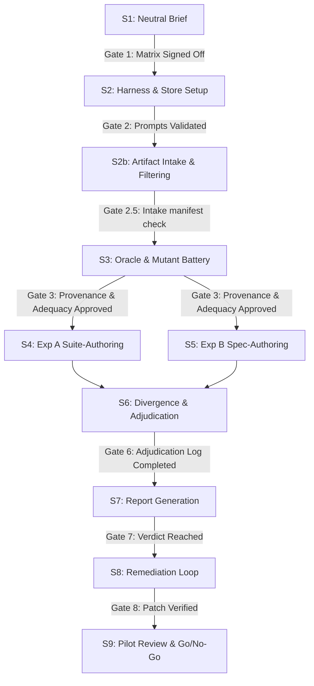

# Google Gemini & Antigravity Differential Bias Audit — Implementation Plan

**Version:** 1.0 (Google/Antigravity Bias Focus)  
**Date:** 2026-06-18  
**Tracks:** `ANTIGRAVITY_GEMINI_BIAS_AUDIT_REQUIREMENTS.md` (drives this plan)  
**Scope:** Maps the audit to concrete steps over the pricing-seed artifacts (`pricing.proto`, `requirements_text` in `seed-pricingservice.json`, `pricing_suite.py`) and the flagship runner (`scripts/run_flagship_benchmark.py`), focusing on evaluating Google Gemini & Antigravity-authorship bias.

---

## Discoveries & Experimental Adjustments

| Original Assumption | Planning Discovery | Google/Antigravity Plan Adjustment |
|---|---|---|
| Re-author all 3 artifacts at once, then diff | Conflates specification wording bias and validation suite bias. | **Factored Design (S4/S5):** Factored into Suite-Authoring (Exp-A: hold spec fixed, vary suite) and Spec-Authoring (Exp-B: hold behavior fixed, vary spec). |
| Equivalence = suites agree on a correct oracle | A correct oracle is too easy to pass; it fails to discriminate subtle edge-case interpretations. | **Mutant Reference Battery (S2.5/S3):** Measure equivalence against the correct Node oracle *plus* $K$ deliberately-faulty mutant servers. Equivalence = identical pass/fail vectors. |
| Score-impact = swapping specs changes scores | Confounded by spec clarity/quality (which shifts all model scores uniformly). | **Interaction Model (S5/S6):** Focus on the model-by-spec interaction term. The bias signal is the relative advantage a Google model has when evaluated on a Gemini/Antigravity-authored spec. |
| One sample per tool | LLMs are non-deterministic; single draws conflate run variance with systematic bias. | **Statistical Sampling (S2):** Take $N$ samples ($N \ge 3$ for pilot, $N \ge 5$ for final) per tool per artifact. Use permutation tests (FR-11) to separate tool bias from noise. |
| The brief is straightforward to write | Deriving it from the original spec pre-injects Google/Gemini bias. | **Neutral Source Derivation (S1):** Extract logic strictly from the Liferay codebase and the raw seed schema, labeling every constraint as `FIXED` vs. `OPEN`. |
| Tool access is uniformly automated | Antigravity is an interactive IDE agent, lacking a headless CLI wrapper. | **Asymmetric Capture (S2):** Automate Gemini CLI, Claude Code, and Codex CLI via subprocess. Integrate Antigravity via manual execution of a strict prompting protocol, exporting transcripts and checksums. |

---

## Step-by-Step Workflow & Phase Gates

### S1 — Neutral Task Brief (`brief/pricing-task-brief.md`)
Extract task instructions directly from the Liferay pricing capability and the bare seed schema.
* **Deliverables:**
  * Neutral brief Markdown file.
  * Source-to-brief traceability matrix (mapping each item to FIXED/OPEN, assigning a decision-owner: `source-evidence` | `schema-constraint` | `human-adjudication`, and linking direct citations).
  * Human-review checklist validating zero Google-idiom leakage (verbatim pricing fields, default precedence logic).
  * Non-Google CLI cross-review validation logs (runs of Claude Code and Codex CLI verifying brief comprehensibility).
* **Gate 1:** The brief, matrix, and cross-reviews must be committed and signed off by two reviewers before rendering any prompt templates in S2.

### S2 — Reproduction Harness & Audit Store Setup (`scripts/run_bias_reproduction.py`)
Establish the execution pipeline and structured storage for all audit runs.
* **Harness Execution:**
  * Drive headless runs for Gemini CLI, Claude Code, and Codex CLI using a subprocess runner.
  * Implement the manual integration protocol for the Antigravity IDE: executing prompts, capturing workspace logs, and checksumming files.
  * Pull secrets via Doppler (`doppler run`) to isolate API keys.
* **Prompt Templates:** Commit versioned, structured prompt packages separating the neutral brief from execution instructions.
* **Durable Storage:** Initialize an SQLite database or versioned Parquet store to record run metadata (timestamp, model version, template version, raw outputs, normalized files, seeds).
* **Model-Update Policy:** Lock all generator versions. If a model version is deprecated mid-batch, restart the affected cell.
* **Gate 2:** Successful execution of a dry-run batch generating compliant files for all tools, and verification that sandbox API calls do not cross-talk credentials.

### S2b — Artifact Intake and Normalization
Filter raw LLM outputs to isolate clean code/spec files.
* **Acceptance check:** Validate compile-ability of generated protos and gRPC syntax. Filter specs to verify they describe the required pricing functions. Ensure generated suites run against test stubs.
* **Mechanical Normalization:** Clean whitespace, normalize package/import paths, and attach standard metadata headers. Record all modifications as diffs in the audit store.
* **Catastrophic Failure Handling:** Exclude non-compiling/broken suites from semantic bias metrics, but retain their statistics in capability logs. Allow $\le 1$ automatic retry.
* **Gate 2.5:** All generated artifacts from S2 must carry a status of `accepted` or `rejected_with_reason` in the audit store manifest.

### S3 — Oracle & Mutant Battery Validation (`bias_audit/oracle/`, `bias_audit/mutants/`)
Construct the known-correct Node reference oracle and the $K$ single-fault mutant servers.
* **Oracle Validation:**
  * Document the oracle's provenance. Remove or reimplement any legacy logic derived directly from Google/Gemini-authored code without independent review.
  * Verify the oracle against the S1 matrix and Liferay code via property-based checks (monotonicity of discounts, rounding precision).
* **Mutant Adequacy Gate:**
  * Build at least 1 mutant per OPEN dimension (rounding, cap limits, tax-discount precedence, error handling).
  * Run mutants against a smoke suite to confirm they fail on the targeted logic and do not cause system-level crashes.
* **Gate 3:** Oracle and mutant adequacy gates must be signed off, producing a frozen mutant-manifest and expected-kill-matrix.

### S4 — Experiment A: Suite-Author Bias
Fix the spec to Gemini's original spec. Have each tool write the pricing test suite ($N \ge 3$).
* **Execution:** Run each accepted test suite against the S3 reference oracle and the mutant battery.
* **Deliverables:** Suite equivalence matrix (pairwise Jaccard distance of pass/fail vectors) and mutant kill matrix.
* **Gate 4:** S4 execution logs must map directly to the S2b intake manifest.

### S5 — Experiment B: Spec-Author Bias
Fix the behavior/oracle. Have each tool write the specification from the neutral brief ($N \ge 3$).
* **Score-Impact Setup:**
  * Freeze the canonical protobuf contract and test harness.
  * Wire generated specs to the flagship evaluation models (Gemini flagship, Claude flagship, GPT flagship) using mechanical adapters.
  * If a spec cannot be evaluated against the frozen contract without resolving an OPEN choice, log the mismatch as a divergence and route to S6 before scoring.
* **Deliverables:** Adapter mapping logs, spec variant packages, and raw flagship scoring sheets.
* **Gate 5:** Verification that the scoring harness maintains identical compute budgets, environment locks, and seeds across spec variants.

### S6 — Divergence Catalog & Human Adjudication
Analyze and classify spec/proto and suite divergences.
* **Cataloging:** Match all differences to S1 OPEN items, recording snippets, divergence type, and tool consistency (FR-11).
* **Adjudication Workflow:**
  * Reviewers perform double-blind evaluation of divergences where practical, mapping them to categories: `source-ambiguity`, `vendor-author-bias`, `tool-capability`, or `harness-confound`.
  * Unanimity across tool samples signifies neutrality; 2-vs-1 splits trigger formal adjudication logs.
* **Gate 6:** Adjudication logs signed off by all reviewers and committed to the audit store.

### S7 — Report Generation (`bias_audit/REPORT-pricing.md`)
Compile the complete analytical findings of the pilot.
* **Statistical Analysis:**
  * Fit the linear mixed-effects interaction model to calculate Google's Own-Vendor Advantage ($OVA_{google}$).
  * Compute confidence/credible intervals and test robustness against paired permutation tests.
  * Calculate FR-11 within-tool vs. between-tool variance.
* **Outputs:**
  * Report containing verdict (Neutral | Biased-and-Corrected | Ambiguous-Flagged).
  * Machine-readable remediation-candidate IDs.
  * Sanitized publication bundle (verified free of credentials, internal paths, and licensing violations).
* **Gate 7:** Complete report and public artifacts committed to the repository.

### S8 — Remediation Loop (FR-9)
Address identified bias or confounds.
* **Actions:**
  * If vendor-author bias is confirmed, modify the seed/spec/harness and generate remediation patches.
  * If an OPEN item is pinned, promote it to adjudicated-FIXED in the S1 matrix.
  * Re-run Experiment A/B on the modified scope.
* **Exit Criteria:** The re-audit must show no material equivalence failures and $OVA_{google}$ below the bias threshold. Halt after $\le 2$ loops.
* **Gate 8:** Remediation results logged, linking the original remediation ID to the new verification metrics.

### S9 — Pilot Review & Go/No-Go Decision
Evaluate feasibility for expanding to the full benchmark suite.
* **Deliverables:** `PILOT-GO-NOGO.md` containing cost summaries, tool reliability logs, and final recommendation.
* **Gate 9:** Strategic sign-off from project leads to proceed with or redesign the audit framework.

---

## Risk Management

1. **Interactive Asymmetry:** Antigravity's interactive runs may show lower variance and different bias profiles than the automated Gemini CLI due to human-in-the-loop steering.
   * *Mitigation:* Analyze Antigravity and Gemini CLI runs as separate tool cells; do not pool their samples when calculating tool-consistency metrics. Keep interactive calibration thoughtful but not excessively rigid, as the SDK is a readily observable application with a low likelihood of systemic bias.
2. **Credential Isolation:** The subprocess runner executes third-party code (suites).
   * *Mitigation:* Execute test suites in isolated sandboxes (Docker/gVisor) with network egress disabled and read-only access to local paths. Since overall tampering and key disclosure risks are low, if additional isolation is required later, store credentials and execution run directories in a separate folder/location to minimize risk.
3. **Statistical Power Constraints:** A small $N=3$ sample size in the pilot may result in wide confidence intervals for $OVA_{google}$, defaulting the verdict to "Ambiguous-Flagged."
   * *Mitigation:* Pre-register the analysis plan. If intervals are wide but suggest a directional signal, run a calibrated power analysis to propose a larger $N$ for the expansion phase.
4. **Mutant Equivalence:** A mutant server might be semantically identical to the oracle due to compiler optimization or unused parameters, yielding false suite-equivalence.
   * *Mitigation:* Require every mutant in the adequacy gate to fail at least one assertion in a hand-authored validator suite before exposing it to generated suites.

