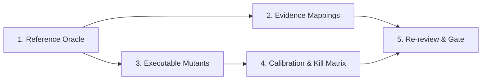

# Non-Claude Implementer Guide — Phase 3 Oracle & Mutant Battery

**Status:** All evidence artifacts are `pending`/`planned`. This guide tells you exactly what to build.
**Prerequisite:** You must **not** be Claude or a Claude-derived agent. You must disclose your identity and tool assistance.
**Repo:** `startd8-sdk` — all paths below are relative to `docs/design/benchmark-bias-audit/bias_audit_openai/`.

---

## Overview

You are building the scoring instrument for a cross-tool bias audit. Three AI coding tools (claude-code, codex-cli, gemini-cli) each authored test suites and specs. Your oracle is the yardstick that scores them all. If the oracle is biased toward any vendor, the audit is invalid.

There are **5 deliverables**, in dependency order:



---

## Deliverable 1: Reference Oracle

**What:** A correct Python implementation of the `ResolvedPriceService.AssessLines` RPC.
**Where:** Create a new file `oracle/reference_oracle.py`.
**Source of truth:** Read these three files — they are the complete canonical contract:

- `canonical/spec.md` — behavioral specification
- `canonical/pricing.proto` — message/enum shapes
- `canonical/canonicalization_decisions.md` — resolved OPEN decisions

### Key Implementation Requirements

```python
from decimal import Decimal, ROUND_HALF_EVEN, ROUND_HALF_UP, ROUND_DOWN
# MUST use decimal.Decimal — never float
```

**Core function signature** (suggested — adapt as needed):

```python
def assess_lines(request: dict) -> dict:
    """
    Pure-function oracle implementing AssessLinesRequest → AssessLinesResponse.

    Input dict mirrors the proto AssessLinesRequest.
    Output dict mirrors the proto AssessLinesResponse.
    Raises ValueError with descriptive message for INVALID_ARGUMENT cases.
    """
```

**Behavioral checklist — every one of these must be correct:**

| # | Behavior | Spec Reference |
|---|---|---|
| 1 | Parse all amounts as `Decimal` — reject NaN, Inf, currency symbols, grouping separators, float literals | Validation §, Rounding § |
| 2 | Select unit amount: use `candidate_unit_amount` only if present, > 0, AND < `unit_amount` | Service Behavior §, step 2 |
| 3 | `line_base_amount = selected_unit_amount × quantity` (exact) | Service Behavior §, step 3 |
| 4 | **CASCADE**: apply percent levels sequentially: `remaining *= (1 - level/100)` per level | Calculation Rules § |
| 5 | **SUM**: sum all percent levels, apply once: `remaining *= (1 - sum/100)` | Calculation Rules § |
| 6 | Default strategy is CASCADE when omitted/unspecified | OPEN-005 |
| 7 | Fixed amount reductions subtract after percentages, in order | Calculation Rules § |
| 8 | Reject (don't clamp) if any fixed reduction makes remaining negative | Calculation Rules §, OPEN-008 |
| 9 | `ReductionSummary.amount` = total reduction for the line | Calculation Rules § |
| 10 | `ReductionSummary.percent_total` = effective aggregate % as decimal string | Calculation Rules § |
| 11 | Price-on-request lines: echo line_key, quantity, marker; exclude from totals; increment `price_on_request_count` | Service Behavior § |
| 12 | Round monetary outputs only at response time; default scale=2, mode=HALF_EVEN | Rounding § |
| 13 | Percent outputs: up to 6 fractional digits, round only if needed | Rounding § |
| 14 | All 20+ validation rules from Validation Behavior § | Validation § |

### Update `oracle-provenance.json`

After implementing, update `oracle/oracle-provenance.json`:

```json
{
  "schema_version": "1.0",
  "status": "accepted",
  "oracle": "oracle/reference_oracle.py",
  "authorship": [
    {
      "author_id": "YOUR-STABLE-ID",
      "role": "implementer",
      "tool_assistance": "describe any tools used",
      "commits": ["commit-hash-of-oracle"],
      "claude_derived_portions": []
    }
  ],
  "independent_non_claude_review": [
    {
      "reviewer_id": "REVIEWER-ID",
      "date": "YYYY-MM-DD",
      "method": "code review / reimplementation / etc"
    }
  ]
}
```

> **CAUTION:** If you use Claude to assist with any portion, you **must** list it in `claude_derived_portions` and the affected code must be independently reimplemented or reviewed by a non-Claude party.

---

## Deliverable 2: Fixed/Open Evidence Mappings

**What:** Map every FIXED and OPEN item to source evidence, a targeted probe, and expected behavior.
**Where:** Update `oracle/fixed-open-evidence.json`.
**Input:** The source traceability already exists in `brief/source-to-brief-traceability.md` — formalize it.

### Structure

```json
{
  "schema_version": "1.0",
  "status": "accepted",
  "mappings": [
    {
      "item_id": "FIXED-001",
      "tag": "FIXED",
      "brief_item": "Pure calculator boundary",
      "source_evidence": "CommercePricingConfiguration.java:46-55 separates discovery from calculation",
      "liferay_commit": "4d9e440ee64aa31d2d60e525e20fa9837a4f4df7",
      "targeted_probe": "test_oracle_no_external_state",
      "expected_behavior": "Oracle function is pure — same inputs always produce same outputs with no I/O"
    }
  ]
}
```

**Required entries:** 10 FIXED items (FIXED-001 through FIXED-010) + 12 OPEN items (OPEN-001 through OPEN-012) = **22 mappings total**.

Each mapping needs:
- `source_evidence` — cite the Liferay file and line range (use `brief/source-bibliography.md` for paths)
- `targeted_probe` — name of a test function in your oracle test suite that exercises this behavior
- `expected_behavior` — deterministic statement of what the oracle should do

---

## Deliverable 3: Executable Mutants

**What:** 10 single-fault variants of the reference oracle, each changing exactly one material behavior.
**Where:** Create `mutants/src/` directory with one Python file per mutant.
**Input:** The fault definitions are already in `mutants/manifest.json`.

### Mutant Implementation Table

| Mutant ID | File | What to Change |
|---|---|---|
| `round-half-up-for-half-even` | `mutant_round_half_up.py` | In the output rounding step, use `ROUND_HALF_UP` instead of `ROUND_HALF_EVEN` when mode is unspecified/HALF_EVEN |
| `round-down-for-half-even` | `mutant_round_down.py` | Use `ROUND_DOWN` instead of `ROUND_HALF_EVEN` for the default |
| `sum-for-cascade` | `mutant_sum_for_cascade.py` | Sum percentage levels when strategy is CASCADE |
| `cascade-for-sum` | `mutant_cascade_for_sum.py` | Cascade percentage levels when strategy is SUM |
| `fixed-before-percent` | `mutant_fixed_before_percent.py` | Apply fixed reductions before percentage reductions |
| `candidate-any-positive` | `mutant_candidate_any_positive.py` | Select candidate when positive, even if ≥ unit_amount |
| `float-arithmetic` | `mutant_float_arithmetic.py` | Replace `Decimal` with `float` for arithmetic |
| `round-intermediate` | `mutant_round_intermediate.py` | Quantize after each arithmetic operation, not just at output |
| `clamp-fixed-overrun` | `mutant_clamp_overrun.py` | Clamp remaining to zero instead of rejecting when fixed reduction exceeds remaining |
| `price-on-request-total` | `mutant_por_total.py` | Include price-on-request lines in numeric totals |

### Rules

- Each mutant must be a **copy of the oracle** with **exactly one change**
- The change must be **material** — it must cause at least one test to produce a different result
- A harness failure (crash, import error, syntax error) is **not** a kill
- If a mutant is equivalent to the oracle (no test can distinguish them), exclude it with a reason

### Update `mutants/manifest.json`

Change `"status": "planned"` → `"status": "accepted"` and add a `"source"` field to each mutant pointing to its file.

---

## Deliverable 4: Calibration & Kill Matrix

**What:** Run the oracle and a calibration test suite against every mutant. Record results.
**Where:** Update two files:

### 4a. `mutants/expected-kill-matrix.csv`

```csv
mutant_id,targeted_open_item,oracle_expected,calibration_suite_expected,validated
round-half-up-for-half-even,rounding default,kill,kill,true
round-down-for-half-even,rounding default,kill,kill,true
sum-for-cascade,percentage strategy,kill,kill,true
cascade-for-sum,percentage strategy,kill,kill,true
fixed-before-percent,reduction ordering,kill,kill,true
candidate-any-positive,candidate selection,kill,kill,true
float-arithmetic,decimal precision,kill,kill,true
round-intermediate,output-only rounding,kill,kill,true
clamp-fixed-overrun,fixed reduction overrun,kill,kill,true
price-on-request-total,price-on-request handling,kill,kill,true
```

- `oracle_expected`: `kill` if the oracle test suite detects the mutant; `survive` if not
- `calibration_suite_expected`: same for the calibration suite
- `validated`: `true` only after actually running it
- If a mutant is equivalent, use `excluded` and add a reason column

### 4b. `mutants/adequacy-report.json`

```json
{
  "schema_version": "1.0",
  "status": "accepted",
  "calibration_runs": [
    {
      "mutant_id": "round-half-up-for-half-even",
      "oracle_result": "kill",
      "suite_result": "kill",
      "discriminating_test": "test_rounding_half_even_boundary",
      "run_date": "YYYY-MM-DD"
    }
  ],
  "coverage": [
    {
      "dimension": "rounding",
      "mutant_count": 2,
      "mutant_ids": ["round-half-up-for-half-even", "round-down-for-half-even"],
      "adequate": true
    },
    {
      "dimension": "ordering",
      "mutant_count": 1,
      "mutant_ids": ["fixed-before-percent"],
      "adequate": true
    },
    {
      "dimension": "cap/fixed-overrun",
      "mutant_count": 1,
      "mutant_ids": ["clamp-fixed-overrun"],
      "adequate": true
    },
    {
      "dimension": "decimal precision",
      "mutant_count": 2,
      "mutant_ids": ["float-arithmetic", "round-intermediate"],
      "adequate": true
    },
    {
      "dimension": "error behavior",
      "mutant_count": 1,
      "mutant_ids": ["clamp-fixed-overrun"],
      "adequate": true
    }
  ]
}
```

> **WARNING:** The howto requires ≥2 discriminating mutants for each of: **rounding, ordering, cap/fixed-overrun, decimal precision, and error behavior**. The current 10 definitions provide ≥2 for rounding (2), strategy (2), and decimal precision (2). You may need to add mutants if ordering, cap, or error have only 1 each.

### How to Run Calibration

Suggested approach (adapt to your setup):

```bash
# For each mutant:
for mutant in mutants/src/mutant_*.py; do
    # Run oracle test suite against the mutant
    python3 -m pytest oracle/test_oracle.py \
        --oracle-module="$mutant" \
        --tb=short -q

    # Record: did it kill (≥1 test failure) or survive (all pass)?
done
```

---

## Deliverable 5: Re-review & Gate Acceptance

After completing 1–4:

1. **Request re-review** from both reviewers (Codex and Gemini each recorded `blocked` sign-offs in `oracle/reviewer-signoffs.json`)
2. Both reviewers must update their sign-offs to `"decision": "accept"` after verifying the new evidence
3. Run the gate validator:

```bash
python3 scripts/validate_cross_tool_oracle_gate.py
# Should report: status: accepted (0 errors)

python3 scripts/validate_cross_tool_oracle_gate.py --sync-status
# Writes accepted status to validation-gate.json
```

> **IMPORTANT:** Do **not** hand-edit `validation-gate.json`. Only `--sync-status` should write to it.

---

## Quick Reference: File Checklist

| # | File | Current State | Target State |
|---|---|---|---|
| 1 | `oracle/reference_oracle.py` | Does not exist | **Create** — correct AssessLines implementation |
| 2 | `oracle/oracle-provenance.json` | `pending`, null oracle | `accepted`, with authorship and review |
| 3 | `oracle/fixed-open-evidence.json` | `pending`, 0 mappings | `accepted`, 22 mappings with probes |
| 4 | `mutants/manifest.json` | `planned` | `accepted`, with source paths |
| 5 | `mutants/src/*.py` | Does not exist | **Create** — 10 single-fault mutant files |
| 6 | `mutants/expected-kill-matrix.csv` | Header only | 10+ data rows with validated results |
| 7 | `mutants/adequacy-report.json` | `pending`, no runs | `accepted`, with calibration and coverage |
| 8 | `oracle/reviewer-signoffs.json` | 2 blocked sign-offs | 2 accepting sign-offs (after re-review) |

---

## Anti-Patterns to Avoid

- ❌ Using `float` anywhere in the oracle — always `Decimal`
- ❌ Copying from any Claude-authored artifact without independent reimplementation
- ❌ Treating a harness crash as a mutant kill
- ❌ Hand-editing `validation-gate.json`
- ❌ Counting an equivalent mutant as a kill
- ❌ Skipping validation rules from the spec (there are 20+)
- ❌ Rounding intermediate results instead of only at output
