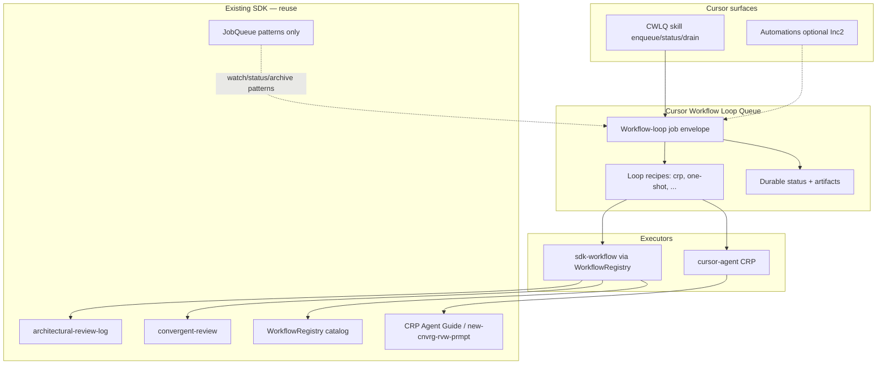

# Convergent Review Prompt

**Generated:** 2026-07-25 02:36:05 UTC
**Mode:** Dual-Document (Plan + Requirements)

> **For the human / orchestrator who generated this file (not instructions to the reviewing agent):**
>
> - This prompt asks the reviewing **agent** to **persist suggestions directly into the source documents** by appending a new **Review Round** under the document's **Appendix C (Incoming)**. The A/B/C scaffold is **pre-initialized by this generator script** (per `CONVERGENT_REVIEW_AGENT_GUIDE.md`), so the reviewer only appends. The chat reply is a short write-confirmation only — **no** in-chat numbered list.
> - **Triage is yours and MUST be persisted, not stripped:** for each suggestion record a disposition — **Accepted → Appendix A** (note where it was merged) or **Rejected → Appendix B** (with rationale) — and update the **Areas Substantially Addressed** tracker (3 accepted per area). Appendices A/B are the **cross-model memory**: later reviewers (you embed the guide telling them so) read them to avoid re-proposing settled or rejected ideas. Do **not** delete A/B after merging.
> - **Suggested separate review passes (orchestrator workflow):** 2 — e.g. run the prompt once for breadth, again for adversarial pass, then triage yourself.
> - **Triage threshold (reference):** 3 accepted suggestions per review area when you triage.
> - **Max suggestions to request from the model:** 10 (soft cap in reviewer instructions below).
> - **Reviewer must have file-write tools (Write/Edit/equivalent) and filesystem access to the source documents.** Chat-only LLMs will fail this contract.

### Source documents

| Role | Path | Size |
|------|------|------|
| **Plan** | `/Users/neilyashinsky/Documents/dev/startd8-sdk/docs/design/cursor-workflow-loop/CURSOR_WORKFLOW_LOOP_PLAN.md` | 126 lines · 940 words |
| **Requirements** | `/Users/neilyashinsky/Documents/dev/startd8-sdk/docs/design/cursor-workflow-loop/CURSOR_WORKFLOW_LOOP_REQUIREMENTS.md` | 243 lines · 3081 words |
| **CRP guide** | `/Users/neilyashinsky/Documents/dev/startd8-sdk/docs/design/arc-review/CONVERGENT_REVIEW_AGENT_GUIDE.md` | 801 lines · 6412 words |

Treat the embedded documents below as **read-only ground truth** for this review. If something conflicts between plan and requirements, call it out explicitly in suggestions and in the coverage mapping.

---

## Your Task

You are a **senior architectural reviewer** with **file-edit tools** (Write/Edit/equivalent) and filesystem access to the source documents listed above. Your job is to produce **improvement suggestions** (structured, anchored, actionable) and **persist them directly into the source documents** by appending a new **Review Round** under each reviewed document's **Appendix C (Incoming)** — see **Prior Review State** below.

**First, read the existing review state** (Appendix A/B/C) in each source doc and **avoid re-proposing** what is already settled (A) or rejected (B), and **avoid near-duplicates** of untriaged items in C (dedup rules below). Every in-scope doc already contains a `## Appendix: Iterative Review Log` with an empty A/B/C scaffold (the generator created it) — **append your round to Appendix C**; do **not** create a second scaffold.

**Do not** triage (no ACCEPT/REJECT disposition for your own or others' suggestions — that is orchestrator-side and lands in Appendix A/B), **do not** modify or rewrite existing prose, **do not** alter Appendix A/B or **prior rounds** in Appendix C, and **do not** emit a numbered suggestion list in chat — the orchestrator reads them from the files.

Optimize for **actionable, mergeable feedback** written into the right file.

### Prior Review State — read this BEFORE writing suggestions

Each source document **is** the persistent review state. Before proposing anything, parse its `## Appendix: Iterative Review Log` (if present):

- **Appendix A (Applied / Accepted)** — settled improvements. **Do not re-propose** anything here.
- **Appendix B (Rejected)** — read each **rationale**. Do **not** re-propose a rejected idea unless you explicitly cite its ID and argue why the rationale no longer holds.
- **Appendix C (Incoming)** — prior rounds, some untriaged. **Do not duplicate** a near-identical suggestion; if you agree with an untriaged item, **endorse** it (see Deliverables) instead of restating it.

**Your round number** is `R{n}` where **n = (highest existing `#### Review Round R{n}` in Appendix C) + 1**, or **1** if none exist. Put it in every suggestion ID: **R{n}-S{k}** (plan) / **R{n}-F{k}** (requirements).

**Go deeper, not wider:** prior reviewers caught the obvious issues — look for what they missed (second-order effects, cross-cutting concerns, interactions between already-accepted suggestions), and spend effort on areas with **few accepted** suggestions rather than those already **substantially addressed** (3+ accepted).

### Mode: Dual-Document Review

You have been given **two documents**: a project plan and a feature requirements document. Use **dual-document** perspective (plan ↔ requirements consistency) to inform your **suggestions only**—do not run full CRP phase/triage automation in this chat.

- Generate **S-prefix** suggestions targeting the **plan** (gaps, sequencing, risks, interfaces, validation strategy).
- Generate **F-prefix** suggestions targeting the **requirements** (ambiguity, missing acceptance criteria, inconsistencies, untestable statements).
- Optionally include a **Requirements coverage** table (each major requirement ID or section → plan section/task → **Covered / Partial / Gap**) as *observations* to inform the orchestrator—still **suggestions / analysis**, not triage.
- Use suggestion IDs so the orchestrator can map items to plan vs requirements later.

**Dual-document quality bar:** At least **three** F-prefix suggestions must cite a **specific sentence or table row** in the requirements; at least **three** S-prefix suggestions must cite a **specific section or task ID** in the plan. **Deprioritize** generic suggestions without anchors.


### Configuration (for structuring your suggestions)

| Parameter | Value |
|-----------|-------|
| Max suggestions (soft cap) | 10 |
| Review areas to consider | Architecture, Interfaces, Data, Risks, Validation, Ops, Security |

### Reviewer contract — suggestion quality and anti-slop rules

Every **suggestion you list** should be written so the orchestrator could **merge it as-is** if they agree (their adopt/decline step is **not** your task here). Aim for:

1. **Actionable** — A human could turn it into an edit, a new task, or a test without further clarification meetings.
2. **Anchored** — Include a **verbatim fragment** (short quote) or **heading path** from the document under review so the author can find the locus quickly.
3. **Scoped** — One primary issue per suggestion; use multiple suggestions instead of bundling unrelated concerns.
4. **Testable when relevant** — For requirements changes, state **how** acceptance could be verified (criterion, automated check, or explicit manual step).

**Reviewer attribution:** use your model identifier exactly as you would self-identify (e.g., `claude-opus-4-7-1m`, `claude-sonnet-4-6`, `claude-haiku-4-5`, `gpt-5`). Do not invent.

**Length budget:** target roughly **500–1500 words** total across the appended appendix sections (adjust up slightly if the focus file has many numbered asks). Quality over volume.

**Self-filter (do not label as triage):** Omit vague praise (“looks good”), duplicate issues, and purely stylistic nits unless they block comprehension. **Also omit near-duplicates of suggestions already in Appendix A/B/C** — endorse or extend the existing ID instead (see Deliverables). If something **contradicts stated project constraints**, frame it as a **scope trade-off** suggestion rather than as a mandate.

**Deliverables (mandatory — persist to source files, not chat):**

1. **Append a `#### Review Round R{n} — <your-model-id> — <UTC date>`** block under **Appendix C (Incoming)** of each source document you reviewed (plan suggestions → plan file; requirements suggestions → requirements file). The `## Appendix: Iterative Review Log` scaffold already exists (generator-created) — append to its Appendix C. Use Write/Edit; do **not** modify existing prose, Appendix A/B, or prior rounds.
2. **Inside your round block**, include:
   - **Executive summary** — at most **10 bullets**: top risks, opportunities, blocking gaps (no triage tables).
   - **Numbered suggestions** — full list with **R{n}-S{k}** / **R{n}-F{k}** IDs. Optional "first pass" / "adversarial pass" subsections — **no** ACCEPT/REJECT columns.
3. **Endorsements & Disagreements (do this if you have tokens remaining):** after your suggestions, react to **untriaged** prior items (in Appendix C, not yet in A/B):
   - `**Endorsements**` — prior IDs you agree with, one-line reason each.
   - `**Disagreements**` — untriaged prior IDs you would reject, one-line reason (so triage can weigh it).
   This builds the cross-model consensus signal the orchestrator uses during triage.
4. **(Dual mode only)** Append a `## Requirements Coverage Matrix — R{n}` section at the **end of the plan file** mapping each major requirement ID/section → plan section/task → **Covered / Partial / Gap**. Analysis only.
5. **Chat reply** — a **short write-confirmation** (1-3 lines) with your round number, file paths, and counts (e.g. `Round R2: 6 S-suggestions → plan.md, 4 F → requirements.md, 3 endorsements`). **Do not** repeat suggestion content in chat.

**Suggestion ID reminder (dual mode):** Plan → **R{n}-S{k}**; Requirements → **R{n}-F{k}** (n = your round, computed from Appendix C; the orchestrator triages your items into Appendix A/B afterward).

### Optional second-pass suggestions (inside the appended appendix, still no triage)

If you still have budget under the max-suggestions cap after your first list, you may add a `### Stress-test / adversarial pass` subheading **inside your round block**, with **additional** numbered suggestions (continue **R{n}-S\*** / **R{n}-F\*** numbering within the same round — do not fabricate a separate round). Try to break your own prior conclusions where it genuinely helps; skip if redundant. **Still no in-chat list** — keep the chat reply to the short write-confirmation.


---

### Pre-flight (before drafting suggestions)

1. **Optionally expand** the protocol guide `<details>` block below and skim **quality norms** (anchoring, scope, security). You are **not** executing full CRP phase/triage automation—use the guide as reference only.
2. Read the **Document Under Review** section(s) once for structure; read again while drafting suggestions.
3. Note **explicit out-of-scope** lines — do not file suggestions that only restate excluded work unless you flag a **dependency risk** (why exclusion threatens delivery).

---

### Protocol guide — optional reference (norms for good suggestions)

**Important:** Some chat clients or models collapse `<details>` by default. Expand if you need **deeper** CRP vocabulary; this prompt does **not** require you to run guide phases 5–7 (triage, appendix merge, final document emit).

If anything in the guide seems to conflict with **this prompt’s “suggestions only” scope**, **this prompt wins** for what you must deliver in-chat; the orchestrator reconciles with the guide afterward.


### Scope lock (normative — overrides conflicting text in the guide below)

The long **Protocol guide** block below (wrapped in an HTML **details** element) embeds the **full** CRP guide, including instructions for **triage**, **appendix edits**, and **document rewrites**. For **this** assignment:

**You MUST:**

- First **read** each source doc's Appendix A/B/C and **avoid re-proposing** settled (A) or rejected (B) items; **dedup** against untriaged C.
- Use file-edit tools to **append a `#### Review Round R{n}` block** under **Appendix C** of each reviewed doc, computing **n** = highest existing round + 1 (or 1). The `## Appendix: Iterative Review Log` scaffold is **pre-initialized by the generator** — append to it; do not recreate it.
- In dual mode, also append a `## Requirements Coverage Matrix — R{n}` section to the end of the plan file.
- If tokens remain, add an **Endorsements & Disagreements** block on untriaged prior suggestions.

**You MUST NOT:**

- Triage (no ACCEPT/REJECT disposition for your own or others' suggestions) — that is orchestrator-side and lands in Appendix A/B.
- Modify, rewrite, reorder, or delete existing prose, **populated** Appendix A/B, or **prior rounds** in Appendix C. (The A/B/C scaffold is generator-created — do **not** add a second one.)
- Execute **Phase 5–7** (triage/merge) from the guide, or output a **rewritten** document body.
- Reproduce the full numbered suggestion list in chat — chat output is a **short write-confirmation** only.

Treat the guide as **optional reference** for vocabulary, risk lenses, and quality norms only — not as a second execution checklist.

## Convergent Review Protocol — Agent Execution Guide

<details>
<summary><strong>Expand: full CRP protocol guide</strong> (you append your round to Appendix C; triage into Appendix A/B is orchestrator-side)</summary>

# Convergent Review Protocol (CRP) — Agent Execution Guide

**Purpose:** Step-by-step instructions for any AI agent to run the Convergent Review Protocol on a document. Covers first-encounter initialization, document formatting, review rounds, triage, and convergence tracking.

**Protocol source:** `ARCHITECTURAL_REVIEW_REQUIREMENTS.md` (76 requirements, RV-100 through RV-807)

---

## How This Process Works: Multi-Agent Iterative Review

**You are not the only reviewer.** This document undergoes multiple sequential review rounds, each performed by a different agent (or the same agent in a later pass). The CRP is designed so that each reviewer builds on the cumulative work of all prior reviewers — not by re-reading their raw suggestions, but by reading the **triaged outcomes** persisted in the document itself.

### What You Inherit From Prior Reviewers

When you receive a document that has already been through CRP rounds, the appendix structure contains the full review history:

- **Appendix A (Applied)** — Suggestions that prior reviewers proposed and that were accepted during triage. These are the "settled" improvements. **Do not re-propose anything that already appears here.**
- **Appendix B (Rejected)** — Suggestions that were explicitly rejected with rationale. **Read the rejection rationale carefully.** If you believe a rejected idea should be reconsidered, you must explicitly reference its ID and argue why the original rationale no longer applies. Do not silently re-propose rejected ideas.
- **Appendix C (Incoming)** — Raw suggestion tables from each prior round, plus any endorsement blocks. Contains both triaged and untriaged suggestions. Your job is to add a new round here, not modify existing rounds.
- **Areas Substantially Addressed / Areas Needing Further Review** — Coverage tracking sections that tell you which areas have enough accepted suggestions and which still need attention.

### Your Role as Reviewer R{n}

Each review pass should be **sharper than the last**. You are not starting from scratch — you are working from the foundation laid by R1 through R{n-1}. Your job is to:

1. **Go deeper, not wider** — Prior reviewers handled the obvious issues. Look for what they missed: second-order effects, unstated assumptions, cross-cutting concerns, and interactions between already-accepted suggestions.
2. **Challenge, don't repeat** — If prior rounds covered an area well, do not generate more suggestions in that area unless you find a genuine gap. Redundant suggestions waste triage effort.
3. **Endorse good untriaged work** — If a prior reviewer proposed something valuable that hasn't been triaged yet, endorse it rather than proposing a duplicate. Endorsements build consensus signal.
4. **Respect rejections** — Rejected suggestions were dismissed for a reason. Read the rationale. Only revisit if circumstances have changed or the rationale was flawed.

### The Document Is the State

There is no external database or API tracking review state. The document's appendix structure **is** the persistent state. Round numbers, applied/rejected decisions, coverage counts, and endorsement signals are all derived by parsing the document. This means:

- If the document is passed to you with Appendices A/B/C populated, prior rounds happened.
- If Appendix A is empty and Appendix C has no rounds, you are the first reviewer.
- If coverage sections show 5 of 7 areas addressed, the review is in its middle-to-late phase.
- Your output is appended to the document and becomes part of the state for the next reviewer.

---

## Quick Reference

| Concept | Value |
|---------|-------|
| Review areas | Architecture, Interfaces, Data, Risks, Validation, Ops, Security |
| Severities | critical, high, medium, low |
| Suggestion ID format | `R{round}-S{n}` (plan), `R{round}-F{n}` (feature requirements) |
| Table columns (7) | ID, Area, Severity, Suggestion, Rationale, Proposed Placement, Validation Approach |
| Substantially addressed threshold | 3 accepted suggestions per area (configurable) |
| Appendix A | Applied suggestions (accepted and integrated) |
| Appendix B | Rejected suggestions (with rationale) |
| Appendix C | Incoming suggestions (untriaged, append-only) |

---

## Phase 0: First-Encounter Initialization

When you receive a document for review **for the first time** (no appendix structure exists), you must prepare it before generating any review suggestions.

### Step 0a: Detect Whether Initialization Is Needed

Search the document for this heading:

```
## Appendix: Iterative Review Log (Applied / Rejected Suggestions)
```

- **If found:** The document has been through CRP before. Skip to Phase 1.
- **If not found:** This is a first encounter. Continue with Step 0b.

### Step 0b: Append the Appendix Structure

Append the following template **verbatim** to the end of the document, separated from the body by a horizontal rule (`---`):

```markdown
---

## Appendix: Iterative Review Log (Applied / Rejected Suggestions)

This appendix is intentionally **append-only**. New reviewers (human or model) should add suggestions to Appendix C, and then once validated, record the final disposition in Appendix A (applied) or Appendix B (rejected with rationale).

### Reviewer Instructions (for humans + models)

- **Before suggesting changes**: Scan Appendix A and Appendix B first. Do **not** re-suggest items already applied or explicitly rejected.
- **When proposing changes**: Append them to Appendix C using a unique suggestion ID (`R{round}-S{n}`).
- **When endorsing prior suggestions**: If you agree with an untriaged suggestion from a prior round, list it in an **Endorsements** section after your suggestion table. This builds consensus signal — suggestions endorsed by multiple reviewers should be prioritized during triage.
- **When validating**: For each suggestion, append a row to Appendix A (if applied) or Appendix B (if rejected) referencing the suggestion ID. Endorsement counts inform priority but do not auto-apply suggestions.
- **If rejecting**: Record **why** (specific rationale) so future models don't re-propose the same idea.

### Appendix A: Applied Suggestions

| ID | Suggestion | Source | Implementation / Validation Notes | Date |
|----|------------|--------|----------------------------------|------|
| (none yet) |  |  |  |  |

### Appendix B: Rejected Suggestions (with Rationale)

| ID | Suggestion | Source | Rejection Rationale | Date |
|----|------------|--------|---------------------|------|
| (none yet) |  |  |  |

### Appendix C: Incoming Suggestions (Untriaged, append-only)
```

### Step 0c: Save the Initialized Document

Write the document back with the appendix appended. **Do not modify the document body.** The initialization is purely additive.

---

## Phase 1: Pre-Review Analysis

Before generating suggestions, analyze the current state of the document.

### Step 1a: Parse Existing State

1. **Scan Appendix A** — collect all applied suggestion IDs and their areas.
2. **Scan Appendix B** — collect all rejected suggestion IDs. Read rejection rationale to understand what has already been considered and dismissed.
3. **Scan Appendix C** — find the highest existing round number by searching for `#### Review Round R{n}` headings. Your round number is `max(existing) + 1`, or `1` if no rounds exist.
4. **Collect untriaged suggestions** — any suggestions in Appendix C whose IDs do not appear in Appendix A or B.

### Step 1b: Compute Area Coverage

For each of the 7 review areas, count how many suggestions have been **accepted** (appear in Appendix A):

| Area | Accepted Count | Addressed? (>= 3) | Gap |
|------|---------------|-------------------|-----|
| Architecture | ? | ? | ? |
| Interfaces | ? | ? | ? |
| Data | ? | ? | ? |
| Risks | ? | ? | ? |
| Validation | ? | ? | ? |
| Ops | ? | ? | ? |
| Security | ? | ? | ? |

An area is **substantially addressed** when it has >= 3 accepted suggestions (the default threshold; configurable per run).

#### Understanding "Substantially Addressed"

This threshold is a **steering mechanism**, not a quality certification. An area with 3 accepted suggestions is not "done" — it means the review process has invested enough attention there that additional suggestions in that area should only come from genuine insight, not routine scanning. The threshold exists to prevent late-round reviewers from piling more suggestions into areas that are already well-covered while neglecting areas with zero coverage.

**How it affects your behavior:**

| Coverage State | Your Priority | What to Do |
|----------------|--------------|------------|
| 0 accepted in an area | Highest | This area has been completely overlooked. Allocate suggestion slots here first. |
| 1–2 accepted in an area | High | Below threshold. Prioritize but check what's already accepted to avoid overlap. |
| 3+ accepted in an area | Low | Substantially addressed. Only propose if you find something the prior 3+ suggestions genuinely missed. |
| All 7 areas at 3+ | Shift focus | Enter gap-hunting mode. Stop thinking in terms of individual areas and look for cross-cutting concerns, low-hanging opportunities, and design principle alignment. |

**Key insight:** The coverage table in Step 1b is your primary decision tool for allocating review effort. Do not distribute suggestions evenly across areas — concentrate on the gaps.

### Step 1c: Determine Review Mode

Based on coverage analysis:

- **Some areas below threshold** — Enter **two-tier priority mode** (Phase 2a). Focus your suggestion slots on uncovered areas.
- **All areas at or above threshold** — Enter **gap-hunting and opportunity mode** (Phase 2b). Shift from area coverage to deeper analysis, cross-cutting concerns, and high-value opportunities.
- **Most areas addressed (5–6 of 7)** — Use two-tier mode but recognize you are in a late-phase review. For the 1–2 remaining gaps, be precise. For addressed areas, consider whether the plan/requirements create natural opportunities for low-effort, high-value improvements (see Phase 2b, Lens 1).

---

## Phase 2a: Two-Tier Priority Review

When uncovered areas exist, structure your review to prioritize them.

### Tier 1: Priority Areas (uncovered)

List each area below the substantially addressed threshold. For each:
- Note how many accepted suggestions it has
- Note the gap (threshold minus count)
- Allocate **at least `max_suggestions - 1`** of your suggestion slots to these areas

### Tier 2: Addressed Areas (secondary)

For areas already substantially addressed:
- Only propose suggestions if you find a **genuine gap** that the existing accepted suggestions missed
- Do not rehash topics already well-covered
- Consider whether accepted suggestions in addressed areas **enable low-effort extensions** — if so, these belong in your Tier 2 slots (see Phase 2b, Lens 1)

### Transitional State (5–6 of 7 areas addressed)

When only 1–2 areas remain below threshold, you are in a **transitional state** between two-tier and gap-hunting modes. Handle this by:

1. Allocating 2–3 suggestion slots to the remaining uncovered areas (Tier 1)
2. Using the rest of your slots for gap-hunting and opportunity suggestions across the already-addressed areas (Tier 2, using the Phase 2b lenses)
3. Paying special attention to interactions between the uncovered area(s) and the well-covered areas — these cross-cutting blind spots are the most common late-phase misses

### Generate Your Suggestions

Produce a review round following the output format in Phase 3.

---

## Phase 2b: Gap-Hunting and Opportunity Mode

When all 7 areas are substantially addressed (or nearly so — 5–6 of 7 with the remainder close), shift from area coverage to deeper analysis and value discovery.

**Mindset shift:** In early rounds, reviewers are scanning for problems — missing sections, unaddressed risks, gaps in coverage. By the time all areas are substantially addressed, the obvious problems have been found. Your job now is different: find what the plan/requirements **make possible but don't yet exploit**, and surface cross-cutting issues that only become visible after the foundational suggestions are in place.

### Gap-Hunting and Opportunity Lenses

Evaluate the document through these lenses, in order of priority:

**1. Low-hanging fruit: high-value improvements enabled by the plan**

The most valuable late-round suggestions are often not about what's *wrong* but what's *almost there*. Read the plan and requirements together and ask: given what is already committed to, what low-effort additions would deliver outsized value?

- **Capabilities that are 80% built** — The plan describes infrastructure (an event bus, a validation layer, an API gateway) that could serve additional use cases with minimal extension. Call these out specifically: "Since you are already building X, adding Y is ~N lines of additional work and enables Z."
- **Data already flowing that isn't being captured** — The plan may route data through a pipeline without persisting intermediate results that would be valuable for debugging, analytics, or audit. If the data is already in hand, storing it is low effort.
- **Configuration that could be externalized** — Hard-coded values, thresholds, or feature flags mentioned in the plan that could be made configurable with minimal overhead, enabling runtime tuning without redeployment.
- **Reusable building blocks** — A component built for one task that could serve 2–3 other tasks if its interface were slightly generalized. The plan already pays the cost of building it — generalizing it captures compound value.
- **Test infrastructure synergies** — Test fixtures, mock services, or validation harnesses described for one feature that could be shared across features with minor refactoring.

**Framing:** These suggestions should emphasize the **effort-to-value ratio**. "Since the plan already does A, extending it to also do B requires [specific low effort] and yields [specific high value]." Avoid vague "it would be nice" suggestions — quantify the lift and the payoff where possible.

**2. Gaps and cross-cutting concerns**
- Contradictions between areas (e.g., an ops process that conflicts with an architecture decision)
- Assumptions that were never validated
- Second-order effects of accepted suggestions — do any of the previously accepted changes create new risks or interactions?
- Edge cases or failure modes not yet addressed
- Interactions between accepted suggestions from different rounds that were reviewed independently

**3. Missed opportunities to leverage platform capabilities**
- Data or artifacts already available from upstream pipeline stages that the design ignores
- Deterministic computations being deferred to stochastic LLM inference
- Existing infrastructure (OTel, ContextCore contracts, capability index) that could replace hand-rolled solutions
- Reusable components or shared utilities that would reduce duplication

**4. Design principle violations**

Evaluate against these three principles:

- **Mottainai** (waste aversion) — Are artifacts from earlier pipeline stages being discarded or regenerated instead of forwarded? Is deterministic data being re-derived via LLM? Does the design inventory what exists before generating?

- **Context Correctness by Construction** (declare-and-verify) — Does the design declare what context must flow between phases and verify it at boundaries? Are there silent degradation paths where missing context falls through to defaults without signaling? Are contracts prescriptive (declare and verify) rather than descriptive (collect and hope)?

- **Context Contracts** (boundary validation) — Do phase boundaries validate required fields with appropriate severity (BLOCKING/WARNING/ADVISORY)? Is provenance tracked so data can be traced to its source? Can the design degrade gracefully when upstream data is missing rather than failing silently?

### Prioritizing Late-Round Suggestions

When you are in gap-hunting and opportunity mode, prioritize your suggestion slots in this order:

1. **Low-effort, high-value opportunities** (Lens 1) — These are the most actionable and most likely to be accepted during triage because they build on decisions already made.
2. **Cross-cutting gaps** (Lens 2) — Issues that span multiple areas are the ones most likely to have been missed by area-focused early rounds.
3. **Platform leverage** (Lens 3) — Concrete opportunities to replace custom work with existing infrastructure.
4. **Principle violations** (Lens 4) — Important but more abstract; triage may defer these if the other suggestions are more immediately actionable.

---

## Phase 3: Generate the Review Round

### Output Format (strict)

Your output must be **only** an appendable markdown snippet. Do not rewrite the document. Do not modify Appendix A or Appendix B.

```markdown
#### Review Round R{n}

- **Reviewer**: {your name or model identifier}
- **Date**: {YYYY-MM-DD HH:MM:SS UTC}
- **Scope**: {brief description of review focus}

| ID | Area | Severity | Suggestion | Rationale | Proposed Placement | Validation Approach |
| ---- | ---- | ---- | ---- | ---- | ---- | ---- |
| R{n}-S1 | {area} | {severity} | {suggestion text} | {why this matters} | {where in the doc} | {how to verify} |
| R{n}-S2 | ... | ... | ... | ... | ... | ... |
```

### Output Rules

1. **Round heading** — Must be `#### Review Round R{n}` with the correct round number.
2. **Metadata block** — Must include Reviewer, Date (UTC), and Scope.
3. **Table columns** — Must use exactly these 7 headers: `ID`, `Area`, `Severity`, `Suggestion`, `Rationale`, `Proposed Placement`, `Validation Approach`. Plain text headers only (no bold, no italic).
4. **Suggestion IDs** — Must follow `R{round}-S{n}` format, numbered sequentially starting at 1.
5. **Area values** — Must be one of: `Architecture`, `Interfaces`, `Data`, `Risks`, `Validation`, `Ops`, `Security`. Use title case.
6. **Severity values** — Must be one of: `critical`, `high`, `medium`, `low`. Use lowercase.
7. **Suggestion count** — At least 1, at most 10 (configurable; default 10).
8. **Pipe escaping** — If suggestion text contains `|`, escape it as `\|` to preserve table structure.
9. **No appendix modification** — Output must NOT contain `### Appendix A` or `### Appendix B` headings.
10. **No document rewriting** — Output the snippet only, not the entire document.

### Endorsements (optional)

If you agree with untriaged suggestions from prior rounds (in Appendix C but NOT in Appendix A or B), append an endorsement block after your table:

```markdown
**Endorsements** (prior untriaged suggestions this reviewer agrees with):
- R{prior_round}-S{n}: {one-sentence reason you agree}
- R{prior_round}-S{m}: {one-sentence reason you agree}
```

Only endorse suggestions you genuinely believe should be implemented. Do not endorse your own suggestions from the current round.

---

## Phase 4: Append the Review Round

Append your generated snippet to the end of the document, after all existing content in Appendix C. Do not insert it anywhere else.

---

## Phase 5: Triage

After all review rounds for this session are complete, triage all untriaged suggestions.

### Step 5a: Collect Untriaged Suggestions

Parse Appendix C for all suggestion rows whose IDs do **not** appear in Appendix A or Appendix B.

### Step 5b: Classify Each Suggestion

For each untriaged suggestion, decide:

- **ACCEPT** — The suggestion is valuable and should be integrated into the document. Move a row into Appendix A.
- **REJECT** — The suggestion is not worth implementing. Move a row into Appendix B **with a specific rationale** explaining why.

Consider endorsement counts: suggestions endorsed by multiple reviewers across rounds carry stronger consensus signal.

### Step 5c: Route Decisions to Appendices

**For ACCEPT decisions**, insert a row into Appendix A:

```markdown
| R{n}-S{m} | {suggestion summary} | {source reviewer} | {implementation/validation notes} | {YYYY-MM-DD} |
```

**For REJECT decisions**, insert a row into Appendix B:

```markdown
| R{n}-S{m} | {suggestion summary} | {source reviewer} | {specific rejection rationale} | {YYYY-MM-DD} |
```

Replace the `(none yet)` placeholder rows when inserting the first real entry.

### Step 5d: Partial Triage Is Acceptable

You do not need to triage every suggestion in a single pass. Suggestions not covered remain untriaged in Appendix C for the next triage pass.

---

## Phase 6: Update Coverage Sections

After triage, update (or insert) two coverage tracking sections in the document. These go **inside** the appendix, before Appendix A.

### Step 6a: Areas Substantially Addressed

Insert or update this section:

```markdown
### Areas Substantially Addressed

- **Architecture**: {count} suggestions applied ({id1}, {id2}, ...)
- **Interfaces**: {count} suggestions applied ({id1}, {id2}, ...)
- ...
```

Only list areas that have reached the threshold (>= 3 accepted).

### Step 6b: Areas Needing Further Review

Insert or update this section (after "Areas Substantially Addressed"):

```markdown
### Areas Needing Further Review

- **Data**: {count}/{threshold} suggestions accepted (need {gap} more)
- **Security**: {count}/{threshold} suggestions accepted (need {gap} more)
- ...
```

Only list areas below the threshold.

---

## Phase 7: Verify Protocol Invariants

Before finishing, verify these invariants hold:

1. **Append-only** — Appendix C content from prior rounds was not modified. Only new rounds were appended.
2. **Monotonic rounds** — Your round number is strictly greater than all existing round numbers.
3. **No body modification** — The document body (everything before the appendix `---` separator) was not changed by the review process (only by explicit triage-driven integration, if applicable).
4. **Domain exhaustiveness** — All 7 review areas were considered during your review. None were skipped.
5. **ID uniqueness** — Your suggestion IDs do not collide with any existing IDs in the document.

---

## Dual-Document Mode: Plan + Requirements Combo Evaluation

When you are given both a **plan document** and a **feature requirements document**, you operate in dual-document mode. This mode adds requirements traceability, a second suggestion stream, and cross-document routing on top of the standard CRP phases.

### When to Enter Dual-Document Mode

Enter dual-document mode when **both** of these are true:

1. You have a plan/design document (the primary review target)
2. You have a separate feature requirements document that the plan is supposed to implement

If you only have a plan with no separate requirements doc, use standard single-document mode (Phases 0–7 above).

### Quick Reference (Dual-Document Additions)

| Concept | Value |
|---------|-------|
| Plan suggestion IDs | `R{n}-S1`, `R{n}-S2`, ... (S-prefix) |
| Requirements suggestion IDs | `R{n}-F1`, `R{n}-F2`, ... (F-prefix) |
| Extra output section | `#### Feature Requirements Suggestions` table |
| Extra output section | `#### Requirements Coverage` mapping table |
| Routing | S-prefix → plan doc appendices; F-prefix → requirements doc appendices |

---

### Phase 0-DD: Initialize Both Documents

Both documents must have the three-appendix structure. Run Phase 0 (Steps 0a–0c) independently on **each** document:

1. **Plan document** — check for `## Appendix: Iterative Review Log` heading. If missing, append the full appendix template (Phase 0b).
2. **Requirements document** — check for the same heading. If missing, append the same appendix template.

Both documents are now ready for CRP review rounds.

---

### Phase 1-DD: Pre-Review Analysis (Both Documents)

Extend Phase 1 to cover both documents:

1. **Parse plan document state** — Appendix A/B/C, round number, coverage (same as Phase 1a–1c).
2. **Parse requirements document state** — Appendix A/B/C of the requirements doc. Track accepted/rejected F-prefix IDs separately.
3. **Read the requirements document body** — identify each requirement section/heading. You will need these for the coverage mapping.

### Phase 2-DD: Review With Traceability

Your review must cover three concerns simultaneously:

1. **Plan quality** — the same 7-area architectural review (Phases 2a/2b apply as normal). These produce S-prefix suggestions targeting the plan document.
2. **Requirements quality** — are the requirements themselves ambiguous, conflicting, incomplete, or missing acceptance criteria? These produce F-prefix suggestions targeting the requirements document.
3. **Plan-to-requirements traceability** — does the plan adequately address every requirement? This produces the Requirements Coverage table.

---

### Phase 3-DD: Generate the Review Round (Dual-Document Output)

Your output must contain **three sections** in this order:

#### Section 1: Plan Suggestions (S-prefix)

The standard 7-column table, identical to single-document mode:

```markdown
#### Review Round R{n}

- **Reviewer**: {your name or model identifier}
- **Date**: {YYYY-MM-DD HH:MM:SS UTC}
- **Scope**: {brief description of review focus}

| ID | Area | Severity | Suggestion | Rationale | Proposed Placement | Validation Approach |
| ---- | ---- | ---- | ---- | ---- | ---- | ---- |
| R{n}-S1 | {area} | {severity} | {plan suggestion} | {why} | {where in plan} | {how to verify} |
| R{n}-S2 | ... | ... | ... | ... | ... | ... |
```

**Rules:** Same as Phase 3 output rules (7 columns, area/severity enums, max 10 S-prefix suggestions per round).

#### Section 2: Feature Requirements Suggestions (F-prefix)

A **separate** table under its own heading for issues found in the requirements document itself:

```markdown
#### Feature Requirements Suggestions

| ID | Area | Severity | Suggestion | Rationale | Proposed Placement | Validation Approach |
| ---- | ---- | ---- | ---- | ---- | ---- | ---- |
| R{n}-F1 | {area} | {severity} | {requirements issue} | {why} | {where in requirements doc} | {how to verify} |
| R{n}-F2 | ... | ... | ... | ... | ... | ... |
```

**When to generate F-prefix suggestions:**

- A requirement is **ambiguous** — could be interpreted multiple ways by an implementer
- A requirement is **conflicting** — contradicts another requirement or a plan decision
- A requirement is **incomplete** — missing acceptance criteria, boundary conditions, or error cases
- A requirement is **missing** — the plan reveals a need that no requirement covers
- A requirement is **untestable** — no clear way to verify it was implemented correctly

**If the requirements are clean**, you may omit this section entirely (or include it with zero rows). Do not invent issues.

#### Section 3: Requirements Coverage Mapping

A traceability table mapping each requirement section to plan coverage:

```markdown
#### Requirements Coverage

| Requirement Section | Plan Step(s) | Coverage | Gaps |
| ---- | ---- | ---- | ---- |
| {requirement heading or ID} | {plan section(s) that address it} | Full | — |
| {requirement heading or ID} | {plan section(s) that address it} | Partial | {what's missing from the plan} |
| {requirement heading or ID} | (none) | Missing | {the plan does not address this requirement} |
```

**Coverage values:**

| Value | Meaning |
|-------|---------|
| `Full` | The plan fully addresses this requirement with clear implementation steps |
| `Partial` | The plan mentions it but is missing detail, edge cases, or implementation specifics |
| `Missing` | The plan does not address this requirement at all |

**Rules:**

- Every requirement section in the requirements document must appear in this table. Do not skip any.
- When Coverage is `Partial` or `Missing`, the Gaps column must explain specifically what is lacking.
- `Partial` coverage with gaps should generate a corresponding S-prefix suggestion in Section 1 (proposing the plan addition).
- `Missing` coverage should generate a corresponding S-prefix suggestion in Section 1 (proposing plan coverage for the requirement).

---

### Phase 4-DD: Append and Route

After generating your output:

1. **Plan suggestions (S-prefix)** — Append the full round snippet (Section 1 + Section 3) to the **plan document's** Appendix C.
2. **Feature suggestions (F-prefix)** — If Section 2 is non-empty, wrap it in a round heading with metadata and append it to the **requirements document's** Appendix C:

```markdown
#### Review Round R{n}

- **Reviewer**: {your name or model identifier}
- **Date**: {YYYY-MM-DD HH:MM:SS UTC}
- **Scope**: {scope} (Feature Requirements)

#### Feature Requirements Suggestions
{the F-prefix table from Section 2}
```

**Do not mix S-prefix and F-prefix suggestions in the same document's appendix.**

---

### Phase 5-DD: Triage (Both Documents)

Triage handles both prefixes:

1. **Collect all untriaged suggestions** — S-prefix from the plan doc's Appendix C, F-prefix from the requirements doc's Appendix C.
2. **Classify each suggestion** — ACCEPT or REJECT, same as Phase 5.
3. **Route decisions by prefix:**
   - S-prefix ACCEPT → plan document Appendix A
   - S-prefix REJECT → plan document Appendix B
   - F-prefix ACCEPT → requirements document Appendix A
   - F-prefix REJECT → requirements document Appendix B

---

### Phase 6-DD: Update Coverage (Both Documents)

Update the "Areas Substantially Addressed" and "Areas Needing Further Review" sections in **both** documents independently, based on each document's own Appendix A counts.

---

### Phase 7-DD: Verify Invariants (Both Documents)

Verify all Phase 7 invariants on **both** documents:

- Append-only, monotonic rounds, no body modification, domain exhaustiveness, ID uniqueness
- **Additional invariant:** No S-prefix IDs in the requirements document's appendix; no F-prefix IDs in the plan document's appendix

---

### Worked Example: First Dual-Document Review

**Scenario:** You receive `IMPLEMENTATION_PLAN.md` and `FEATURE_REQUIREMENTS.md`, neither has appendix structure.

#### 1. Initialize Both

Append the appendix template to both documents (Phase 0-DD).

#### 2. Analyze

- Plan: empty appendices, Round 1, all areas at 0/3
- Requirements: empty appendices
- Requirements doc body has 5 sections: Authentication, Rate Limiting, Data Export, Audit Logging, Error Handling

#### 3. Generate Round R1

**Section 1 (Plan suggestions):**

```markdown
#### Review Round R1

- **Reviewer**: Claude Opus 4.6 (claude-opus-4-6)
- **Date**: 2026-02-28 20:00:00 UTC
- **Scope**: Full architectural review with requirements traceability

| ID | Area | Severity | Suggestion | Rationale | Proposed Placement | Validation Approach |
| ---- | ---- | ---- | ---- | ---- | ---- | ---- |
| R1-S1 | Architecture | high | Add rate limiting middleware layer | Plan has no rate limiting implementation despite REQ-RL-001 | Section 3: API Design | Load test with rate limit thresholds |
| R1-S2 | Security | critical | Add JWT token rotation strategy | Authentication section lacks token lifecycle management | Section 2: Authentication | Security audit of token flow |
| R1-S3 | Data | medium | Define data export pagination | Export endpoint will timeout on large datasets | Section 4: Data Export | Test export with 100k+ records |
| R1-S4 | Ops | high | Add structured audit log format | Audit logging requirement has no log schema in plan | Section 5: Audit Logging | Verify log entries match schema |
```

**Section 2 (Requirements suggestions):**

```markdown
#### Feature Requirements Suggestions

| ID | Area | Severity | Suggestion | Rationale | Proposed Placement | Validation Approach |
| ---- | ---- | ---- | ---- | ---- | ---- | ---- |
| R1-F1 | Validation | medium | Add rate limit thresholds to REQ-RL-001 | Requirement says "rate limiting" but specifies no limits (requests/sec, burst) | Rate Limiting section | Verify numeric thresholds are specified |
| R1-F2 | Interfaces | medium | Add error response format to Error Handling | Requirement specifies "graceful error handling" but no response schema | Error Handling section | Verify JSON error schema is defined |
```

**Section 3 (Coverage mapping):**

```markdown
#### Requirements Coverage

| Requirement Section | Plan Step(s) | Coverage | Gaps |
| ---- | ---- | ---- | ---- |
| Authentication | Section 2: Authentication | Partial | Missing token rotation and session management |
| Rate Limiting | (none) | Missing | No rate limiting section in the plan |
| Data Export | Section 4: Data Export | Partial | No pagination or timeout strategy |
| Audit Logging | Section 5: Observability | Partial | Mentioned but no structured log format |
| Error Handling | Section 6: Error Handling | Full | — |
```

#### 4. Route

- Append the full snippet (Sections 1 + 3) to `IMPLEMENTATION_PLAN.md` Appendix C
- Wrap Section 2 in a round heading and append to `FEATURE_REQUIREMENTS.md` Appendix C

#### 5. Triage

- Accept R1-S1, R1-S2, R1-S4 → plan Appendix A
- Reject R1-S3 (pagination is handled by framework) → plan Appendix B
- Accept R1-F1 → requirements Appendix A
- Accept R1-F2 → requirements Appendix A

#### 6. Update Coverage

Plan: Architecture=1, Security=1, Ops=1 — all below threshold. Requirements: track F-prefix accepted counts separately.

---

## Area Aliases

LLMs sometimes use synonyms for area names. Normalize them:

| Synonym | Canonical Area |
|---------|---------------|
| design, structure, modularity, scalability, maintainability, extensibility, clarity, readability, documentation | Architecture |
| api, apis, contracts, integration | Interfaces |
| data model, data models, storage, database, persistence | Data |
| risk, reliability, resilience, fault tolerance, error handling | Risks |
| testing, testability, test, quality, completeness | Validation |
| operations, deployment, observability, monitoring, performance, infrastructure | Ops |
| auth, authentication, authorization | Security |

---

## Column Aliases

LLMs sometimes use different column headers. Normalize them:

| Synonym | Canonical Column |
|---------|-----------------|
| #, No, No., Number, Item, Ref, Suggestion ID | ID |
| Category, Domain, Focus Area, Topic | Area |
| Level, Priority, Impact, Sev | Severity |
| Recommendation, Finding, Issue, Description, Detail, Details | Suggestion |
| Reasoning, Justification, Reason, Explanation, Why | Rationale |
| Placement, Location, File, File Path, Where | Proposed Placement |
| Validation, Test, Testing, How to Validate, Verification | Validation Approach |

---

## Worked Example: First Review of a New Document

**Scenario:** You receive `IMPLEMENTATION_PLAN.md` with no appendix structure.

### 1. Initialize

Detect: no `## Appendix: Iterative Review Log` heading found. Append the full appendix template (Phase 0b).

### 2. Analyze

- Appendix A: empty (no applied suggestions)
- Appendix B: empty (no rejected suggestions)
- Appendix C: empty (no prior rounds)
- Round number: 1 (no existing rounds)
- Coverage: all areas at 0/3, all below threshold

### 3. Review (Two-Tier Priority)

All 7 areas are uncovered, so all are Tier 1 priority. Generate up to 10 suggestions spread across the areas with the largest gaps.

### 4. Output

```markdown
#### Review Round R1

- **Reviewer**: Claude Opus 4.6 (claude-opus-4-6)
- **Date**: 2026-02-28 18:00:00 UTC
- **Scope**: Full architectural review — initial pass across all 7 areas

| ID | Area | Severity | Suggestion | Rationale | Proposed Placement | Validation Approach |
| ---- | ---- | ---- | ---- | ---- | ---- | ---- |
| R1-S1 | Architecture | high | Add dependency injection for service layer | Improves testability and decouples components | Section 3: Architecture | Unit test coverage of isolated services |
| R1-S2 | Security | critical | Add input validation at API boundary | Prevents injection attacks (OWASP A03) | Section 5: API Design | OWASP ZAP scan + fuzz testing |
| R1-S3 | Data | medium | Define schema migration strategy | Avoids breaking changes on deployment | Section 4: Data Model | Dry-run migration against staging DB |
| R1-S4 | Risks | high | Add circuit breaker for external API calls | Prevents cascade failures under load | Section 6: Integration | Load test with upstream service unavailable |
| R1-S5 | Validation | medium | Add contract tests for API consumers | Catches breaking changes before deployment | Section 5: API Design | Run contract test suite in CI |
| R1-S6 | Ops | high | Define health check endpoints | Required for orchestrator liveness probes | Section 7: Deployment | Verify probe responses under load |
| R1-S7 | Interfaces | medium | Version the REST API from day one | Avoids breaking consumers on iteration | Section 5: API Design | Integration test with versioned routes |
```

### 5. Append

Append the snippet after `### Appendix C: Incoming Suggestions (Untriaged, append-only)`.

### 6. Triage

Evaluate each suggestion. For this example, accept R1-S1 through R1-S4 and reject none:

Insert into Appendix A:
```markdown
| R1-S1 | Add dependency injection for service layer | Claude Opus 4.6 | Restructured service layer with DI container | 2026-02-28 |
| R1-S2 | Add input validation at API boundary | Claude Opus 4.6 | Added Pydantic validators on all endpoints | 2026-02-28 |
| R1-S3 | Define schema migration strategy | Claude Opus 4.6 | Added Alembic migration section to data model | 2026-02-28 |
| R1-S4 | Add circuit breaker for external API calls | Claude Opus 4.6 | Added resilience section with circuit breaker pattern | 2026-02-28 |
```

### 7. Update Coverage

After triage, compute new coverage and insert sections:

```markdown
### Areas Substantially Addressed

(No areas have reached the threshold of 3 accepted suggestions yet.)

### Areas Needing Further Review

- **Architecture**: 1/3 suggestions accepted (need 2 more)
- **Interfaces**: 0/3 suggestions accepted (need 3 more)
- **Data**: 1/3 suggestions accepted (need 2 more)
- **Risks**: 1/3 suggestions accepted (need 2 more)
- **Validation**: 0/3 suggestions accepted (need 3 more)
- **Ops**: 0/3 suggestions accepted (need 3 more)
- **Security**: 1/3 suggestions accepted (need 2 more)
```

### 8. Next Round

The next reviewer (Round R2) will see the applied IDs (R1-S1 through R1-S4), the untriaged suggestions (R1-S5 through R1-S7), and the coverage gaps. They will prioritize areas with the largest gaps (Interfaces, Validation, Ops) and may endorse untriaged suggestions from Round 1.

---

## Convergence Criteria

The review process converges naturally as areas cross the substantially addressed threshold. Each phase has a distinct character:

### Phase Progression

| Phase | Typical Rounds | Coverage State | Reviewer Focus | Suggestion Character |
|-------|---------------|----------------|----------------|---------------------|
| **Early** | R1–R2 | 0–2 areas addressed | Broad scanning across all 7 areas | Foundational: missing sections, unaddressed risks, structural gaps |
| **Middle** | R2–R3 | 3–5 areas addressed | Two-tier priority steering toward remaining gaps | Targeted: filling specific coverage gaps, building on prior accepted work |
| **Late** | R3–R5 | 6–7 areas addressed | Gap-hunting + opportunity discovery | Refined: cross-cutting concerns, low-hanging fruit, high-value extensions |
| **Converged** | R5+ | All areas addressed, diminishing returns | Consider stopping | If fewer than 2–3 novel suggestions emerge, the document has likely converged |

### How to Tell Where You Are

When you receive a document for review, the coverage state tells you which phase the review is in:

- **Empty Appendix A + no prior rounds** — You are the first reviewer (early phase). Cast a wide net.
- **Some applied IDs, some areas still at 0** — Middle phase. Prior reviewers started the work but significant gaps remain. Be targeted.
- **Most or all areas at threshold, with untriaged suggestions pending** — Late phase. Prior reviewers covered the breadth. Your value-add is depth: cross-cutting issues, interactions between accepted suggestions, and opportunities that only become visible once the foundation is laid.
- **All areas addressed, few untriaged suggestions, and prior gap-hunting rounds exist** — The document may be converged. Only generate a round if you find genuinely novel insights. It is acceptable to produce a round with fewer than the maximum suggestion count, or to note that the document appears well-converged.

### Convergence Signals

The review is likely converged when:

1. All 7 areas are substantially addressed (3+ accepted suggestions each)
2. Gap-hunting rounds produce fewer than 2–3 novel suggestions
3. New suggestions are increasingly low-severity (medium/low) rather than high/critical
4. Endorsements outnumber new suggestions (reviewers agree with existing untriaged work rather than finding new issues)
5. The Requirements Coverage table (in dual-document mode) shows Full coverage across all requirement sections

### When Not to Stop

Even if coverage looks complete, continue if:

- Accepted suggestions from different rounds have **interactions that haven't been examined** (e.g., a caching strategy from R1 and a consistency requirement from R3 that may conflict)
- The plan describes infrastructure that **enables valuable extensions** not yet proposed (Lens 1 — low-hanging fruit)
- Rejection rationale in Appendix B reveals **recurring themes** suggesting a deeper architectural issue that individual suggestions have been working around rather than addressing directly

There is no fixed number of rounds required. A typical run uses 2–5 review rounds, but complex documents with many requirements may warrant more.

</details>

---

## Document Under Review: Project Plan

**Path:** `/Users/neilyashinsky/Documents/dev/startd8-sdk/docs/design/cursor-workflow-loop/CURSOR_WORKFLOW_LOOP_PLAN.md`  ·  **Size:** 126 lines · 940 words

```markdown
# Cursor Workflow Loop Queue — Implementation Plan

**Version:** 0.2 (Aligned with Requirements v0.3.1)
**Date:** 2026-07-24
**Status:** Draft — pre-implementation
**Requirements:** `CURSOR_WORKFLOW_LOOP_REQUIREMENTS.md`

---

## 1. Approach

Build a **sibling** of `JobQueue`: same operational feel (folder, status, priority, sequential drain), new envelope that addresses `WorkflowRegistry` / loop recipes. Cursor v1 surface is a skill that enqueues and drains; first recipe is CRP with `cursor-agent` executor.

**Code home (recommended):** `src/startd8/workflows/loop_queue/` — keeps “loop queue” next to workflows, avoids overloading `job_queue.py` or `agents/agentic.py` (lessons: overloaded-term).

---

## 2. Increment 0 — Envelope + disk

| Step | Work | Maps to |
|------|------|---------|
| 0a | Pydantic models: `WorkflowLoopJob`, `LoopJobStatus`, `LoopExecutor`, `LoopQueueConfig` | FR-1, FR-3 |
| 0b | Atomic JSON write/read; status sidecar; archive helpers (reuse `utils/file_operations.atomic_write_json`) | FR-2, FR-3 |
| 0c | `enqueue(job)` validates schema; if `workflow_id` set → `WorkflowRegistry.discover()` + input validation | FR-5, FR-6 |
| 0d | CLI stub: `startd8 wloop status` / `enqueue` (or `startd8 workflow-loop …`) | FR-4 CLI half |
| 0e | Unit tests: round-trip, unknown workflow fail-closed, missing path fail-closed | FR-1, FR-5, FR-6 |

**Default path (OQ-7 lean):** `.startd8/workflow-loop-queue/` under project root — isolates from prompt jobs.

---

## 3. Increment 1 — CRP cursor-agent + skill

| Step | Work | Maps to |
|------|------|---------|
| 1a | `LoopRecipe` protocol + `crp` recipe registration | FR-7 |
| 1b | Derive next round / A/B ID lists — prefer reusing helpers from `architectural_review_log_helpers.py` (`_max_review_round`, `_extract_table_ids`, `_ensure_appendix_exists`) rather than re-parsing | FR-11, Mottainai |
| 1c | Prompt generation: shell out to or import the same inputs as `new-cnvrg-rvw-prmpt.sh` / embed guide path; cache under job artifact dir keyed by content hash | FR-8, FR-14 |
| 1d | Drain step machine: `pending → processing → awaiting_triage | pending(next round) → completed` | FR-12, FR-13 |
| 1e | Cursor skill under `.cursor/skills/` or user skills: `enqueue-crp`, `wloop-status`, `wloop-run-next` with clear agent instructions (append Appendix C only; no self-triage) | FR-4, FR-8 |
| 1f | Fixture + integration test: temp markdown → R1 append → R2 | FR-8, FR-11, FR-14 |

---

## 4. Increment 1.1 — CRP sdk-workflow executor

| Step | Work | Maps to |
|------|------|---------|
| 1.1a | Map job config → `convergent-review` / `architectural-review-log` inputs | FR-9 |
| 1.1b | Drain via `WorkflowRegistry.run_workflow` (in-process) with progress → status updates | FR-9 |
| 1.1c | Mock-agent path for CI | FR-9 acceptance |

---

## 5. Increment 2 — Catalog + deps

| Step | Work | Maps to |
|------|------|---------|
| 2a | `one-shot` recipe: any `workflow_id` + config | FR-15 |
| 2b | Priority list: critical-review, design-polish, doc-enhancement, plain-language, policy-analysis | FR-15 |
| 2c | `depends_on` resolution + cycle detection at enqueue | FR-16 |
| 2d | Optional: MCP tool wrappers if `user-startd8` healthy; optional Automation draft | FR-4 Inc2, OQ-9 |

---

## 6. Increment 3 — Harden

| Step | Work | Maps to |
|------|------|---------|
| 3a | OTel spans / structured logs | FR-17 |
| 3b | Budget wiring for sdk-workflow | FR-18 |
| 3c | Experimental API export + docs | FR-19 |
| 3d | Resolve OQ-5 (lease TTL) and OQ-6 (reflective-reqs recipe) | OQs |

---

## 7. Risks

| Risk | Mitigation |
|------|------------|
| Cursor-agent CRP quality varies by model | Keep sdk-workflow executor; Capability-Delivery Loop already proved Cursor CRP when grounded |
| Helper reuse from architectural_review_log pulls private `_` APIs | Promote a small public parse/derive module if needed (Keiyaku boundary) |
| Dual CRP paths drift | Single recipe owns completion predicates; both executors write the same appendix shape |
| Skill sprawl | One skill with subcommands > many one-off skills |

---

## 8. Settled / do-not-relitigate (for CRP)

- Prompt `JobQueue` stays; CWLQ is sibling envelope.
- Agentic tool-use loop is out of scope.
- CRP 7-column schema / A/B/C owned upstream — cite only.
- Prime/cap-dev-pipe not replaced in v1.
- Cursor Automations not a v1 dependency.

---

*Plan v0.2 — tracks Requirements v0.3.1. Ready for dual-doc CRP.*

---

## Appendix: Iterative Review Log (Applied / Rejected Suggestions)

This appendix is intentionally **append-only**. New reviewers (human or model) add suggestions to Appendix C; once validated, the orchestrator records the final disposition in Appendix A (applied) or Appendix B (rejected with rationale). **Do not delete A/B** — they are the cross-model memory that stops later reviewers from re-proposing settled or rejected ideas.

### Reviewer Instructions (for humans + models)

- **Before suggesting changes**: Scan Appendix A and Appendix B first. Do **not** re-suggest items already applied or explicitly rejected.
- **When proposing changes**: Append a `#### Review Round R{n}` block under Appendix C (n = highest existing round + 1, or 1), with unique suggestion IDs `R{n}-S{k}` (plan) / `R{n}-F{k}` (requirements).
- **When endorsing prior suggestions**: If you agree with an untriaged item from a prior round, list it in an **Endorsements** section instead of restating it. Multi-reviewer endorsements raise triage priority.
- **When validating (orchestrator)**: For each suggestion, append a row to Appendix A (applied) or Appendix B (rejected) referencing the suggestion ID.
- **If rejecting**: Record **why** (specific rationale) so future reviewers don't re-propose the same idea.

### Appendix A: Applied Suggestions

| ID | Suggestion | Source | Implementation / Validation Notes | Date |
|----|------------|--------|-----------------------------------|------|
| (none yet) |  |  |  |  |

### Appendix B: Rejected Suggestions (with Rationale)

| ID | Suggestion | Source | Rejection Rationale | Date |
|----|------------|--------|---------------------|------|
| (none yet) |  |  |  |  |

### Appendix C: Incoming Suggestions (Untriaged, append-only)
```

---

## Document Under Review: Requirements

**Path:** `/Users/neilyashinsky/Documents/dev/startd8-sdk/docs/design/cursor-workflow-loop/CURSOR_WORKFLOW_LOOP_REQUIREMENTS.md`  ·  **Size:** 243 lines · 3081 words

```markdown
# Cursor Workflow Loop Queue — Requirements

**Version:** 0.3.1 (Post planning + lessons + design-principle hardening)
**Date:** 2026-07-24
**Status:** Draft — ready for CRP review
**Author:** Neil Yashinsky (drafted with agent assist)
**Companion plan:** `CURSOR_WORKFLOW_LOOP_PLAN.md` (to be written / updated with this doc)

---

## 0. Planning Insights (Self-Reflective Update)

> What changed between the naïve v0.1 framing (“a Cursor loop like CRP”) and the
> code-grounded v0.2. Planning against the real SDK surfaced **7 discoveries**.

| v0.1 Assumption | Planning Discovery (file / fact) | Impact |
|-----------------|----------------------------------|--------|
| Need a new queue substrate | `job_queue.py` + `JobFile`/`JobQueueConfig` already provide file-based pending→processing→completed jobs (`models.py:631+`), CLI `startd8 queue *`, TUI mixin | **Extend / specialize**, do not greenfield a second file-watcher. But JobFile is **prompt-only** — no `workflow_id`. |
| “Connect workflows to the existing job queue” is enough | `JobQueue` runs `prompt → agent.generate()`; it never calls `WorkflowRegistry` (`job_queue.py` has zero `workflow_id` references) | New **job kind** (or parallel envelope) whose drain path is `WorkflowRegistry.run_workflow` / `startd8 workflow run`, not the prompt path. |
| CRP-in-Cursor = the SDK CRP workflow | Two parallel CRP executors exist: (1) SDK `architectural-review-log` + orchestrator `convergent-review` (provider LLM, appends via workflow code); (2) Cursor skill `/new-cnvrg-rvw-prmpt` → agent with Write tools appends Appendix C (Capability-Delivery Loop path) | Queue must name **two CRP adapters** and pick a v1 default. Cursor-native CRP is the “run using Cursor” path; SDK workflow is the headless/API path. |
| Agentic-loop requirements cover this | `docs/design/agentic-loop/` is a **tool-use runtime** (`AgenticSession`); OQ-2 there already says it does **not** merge with contractor/workflow pipelines | Explicit NR: this queue is **not** the agentic tool-use loop. |
| “Loop” = one new runtime | Capability-Delivery Loop (`CAPABILITY_DELIVERY_LOOP.md`) is a **process standard** (reflective-reqs → CRP → ship), not an executable queue | This feature **executes** named loop recipes; the process standard remains normative guidance for *when* to enqueue CRP. |
| MCP/gateway already wires Cursor | `mcp/gateway.py` has `list_workflows` / `execute_workflow`; CLI has `startd8 workflow run`; Cursor MCP server currently flaky in-session | Cursor surface v1 = **skill + CLI drain** (durable, offline-friendly). MCP enqueue is Increment 2 if the server is healthy. |
| All 16 workflows are equally “loopable” | Some are multi-step convergent (`convergent-review`); most are single-shot (`plan-ingestion`, `plain-language`, …). Prime/contractor are heavy and already have cap-dev-pipe orchestration | v1: **CRP loop recipe** + generic **one-shot workflow job**. Heavy contractor loops stay out of v1 (NR). |

**Resolved open questions (from planning):**
- **OQ-1 → Extend JobQueue patterns, new job envelope.** Reuse watch-folder / status / archive semantics; do **not** overload `prompt.content` to smuggle workflow configs.
- **OQ-2 → Two CRP adapters; v1 default = Cursor-agent CRP.** SDK `convergent-review` / `architectural-review-log` as optional `executor: sdk-workflow` from day one of the schema (even if drain lands in Increment 1.1).
- **OQ-3 → Not the agentic loop.** Separate module/docs namespace: `cursor-workflow-loop` / `workflow_loop_queue`.
- **OQ-4 → Catalog plug-in via `workflow_id` + validated config.** Schema validates against `WorkflowRegistry.get_workflow_info` input list; unknown ids fail closed at enqueue.

---

### 0.1 Lessons-Learned Hardening (v0.3)

> Applied Design_Docs / SDK lessons before CRP. Each changed the draft:

- **[Phantom-reference audit]** — Named only symbols verified present: `WorkflowRegistry.run_workflow`, `JobFile`/`JobStatus`, `convergent-review`, `architectural-review-log`, `startd8 workflow run`, `gateway.execute_workflow`. Cursor Automations / a non-existent `WorkflowLoop` class are **not** claimed as shipped substrate. → FR-1/FR-2 reference-audit table (§5).
- **[Overloaded-term co-location]** — “Loop” already means agentic tool-use loop, Capability-Delivery Loop, and CRP rounds. → Product name **Cursor Workflow Loop Queue (CWLQ)**; code home must not land inside `agents/agentic.py` or `job_queue.py` as a second meaning of those modules’ primary nouns (plan: new package or `workflows/loop_queue/`).
- **[Single-source vocabulary]** — CRP suggestion schema / Appendix A/B/C owned by `ARCHITECTURAL_REVIEW_REQUIREMENTS.md` + CRP Agent Guide. This doc **cites**, does not restate, the 7-column schema. → FR-10.
- **[CRP steering memory]** — Least-reviewed artifact will be **this requirements doc + plan**; settled do-not-relitigate: JobQueue stays prompt-jobs; agentic loop stays separate; CRP protocol schema is owned upstream.

### 0.2 Design-Principle Hardening (v0.3.1)

> Checked against `docs/design-princples/`. Each changed the draft:

- **[Mottainai]** — Do not regenerate CRP prompts or re-run rounds that already produced Appendix C blocks; queue must persist round artifacts and skip completed rounds on resume. → FR-12, FR-14.
- **[Genchi Genbutsu]** — Enqueue validation binds to **live** `WorkflowRegistry` metadata (real inputs), not a hand-maintained allowlist of workflow ids. → FR-5.
- **[Accidental-Complexity anti-principle]** — One job envelope + executor tag beats separate queues per workflow family. → FR-1 (single schema).
- **[Context-Correctness-by-Construction]** — A job’s required inputs (paths, agents, rounds) are declared + validated at enqueue; drain must fail closed if artifacts vanished — no silent `None` path into CRP. → FR-6, FR-13.
- **[Hitsuzen]** — Next round number, coverage tier, and “substantially addressed” sets are **derived** from the target doc’s existing Appendix A/B/C (as the SDK workflow already does), not re-asked of the LLM or the Cursor agent. → FR-11.
- **[Mujō / continuity]** — Queue state + per-job status files are the durable continuity signals across Cursor sessions (session dies; queue does not). → FR-3, FR-15.

---

## 1. Problem Statement

The SDK already has:

| Component | What it does today | Gap for “run via Cursor” |
|-----------|-------------------|---------------------------|
| **WorkflowRegistry** (~16 workflows) | Discover / describe / `run` via CLI + MCP gateway | No durable **queue** of workflow jobs a Cursor session can enqueue and drain across turns/sessions |
| **CRP workflows** (`architectural-review-log`, `convergent-review`) | Full CRP mechanics when invoked with API keys | Not wired into a Cursor-orchestrated multi-job / multi-round queue |
| **Cursor CRP skill** (`/new-cnvrg-rvw-prmpt`) | Generates a paste-ready prompt; human/agent runs rounds ad hoc | No queue, no resume, no batch of docs, no shared job status with other workflows |
| **JobQueue** (`startd8 queue`) | File-based prompt→agent jobs | Cannot address a `workflow_id` or carry workflow config |
| **Capability-Delivery Loop** | Process standard: reflective-reqs → CRP → ship | Not executable; assumes manual CRP |
| **Agentic loop** (design) | Multi-turn tool-use runtime | Different problem; must not be conflated |

**What should exist:** a **Cursor Workflow Loop Queue (CWLQ)** — a durable, file-based queue of *workflow / loop jobs* that Cursor (skill, and later Automation) can enqueue and drain, starting with a first-class **CRP loop recipe**, and designed so most catalog workflows plug in as one-shot (or thin-loop) jobs without a redesign.

---

## 2. Requirements

### Queue core

- **FR-1 — Workflow-loop job envelope.** Define a versioned job schema (suggested filename pattern `*_startd8_wloop.json` or equivalent, distinct from `*_startd8_job.json`) with at least: `schema_version`, `job_id`, `loop_id` (recipe name, e.g. `crp`), `executor` (`cursor-agent` \| `sdk-workflow`), `workflow_id` (optional when executor is cursor-agent; required when `sdk-workflow`), `config` (dict matching the target workflow’s inputs **or** the loop recipe’s inputs), `priority`, `status`, `created_at`, `depends_on[]`, `budget` (optional max USD / max rounds), `metadata`. *Acceptance:* invalid schema fails at enqueue with a typed error; valid jobs round-trip JSON ↔ model.

- **FR-2 — Reuse JobQueue operational patterns, not JobFile semantics.** Watch folder, status sidecar, archive-on-complete, priority ordering, and sequential drain (`max_concurrent_jobs` default 1) SHOULD match `JobQueue` UX (`startd8 queue status|run|watch`). Implementation MUST NOT overload `JobFile.prompt` for workflow configs. *Acceptance:* a prompt job and a workflow-loop job can coexist in the same watch tree or sibling trees without cross-interpretation.

- **FR-3 — Durable status across Cursor sessions.** Status transitions `pending → processing → completed | failed | cancelled | blocked` persist on disk. A new Cursor chat can `status` / `run-next` without prior conversation memory. *Acceptance:* kill mid-job → job is `failed` or resumable `processing` with a clear lease/heartbeat rule (OQ-5).

- **FR-4 — Cursor enqueue / drain surface (v1 skill).** A Cursor skill (or skill group) supports: `enqueue` (from paths + loop/workflow id), `status`, `run-next` / `drain` (N jobs), `cancel`. Drain for `executor: cursor-agent` means the skill instructs the **current** agent how to perform the next step (and what to write back to the job status). Drain for `executor: sdk-workflow` means invoke `WorkflowRegistry.run_workflow` / `startd8 workflow run` (subprocess or in-process). *Acceptance:* documented happy path: enqueue CRP on a requirements(+plan) pair → `run-next` completes one round → status shows remaining work or completion.

- **FR-5 — Catalog-validated workflow jobs (Genchi).** When `workflow_id` is set, enqueue MUST validate `config` against live `WorkflowRegistry` metadata (`get_workflow_info` / declared `WorkflowInput`s). Unknown workflow ids fail closed. No parallel hand-maintained id allowlist as source of truth. *Acceptance:* unit test with a fake registered workflow accepts required fields and rejects missing ones.

- **FR-6 — Fail-closed missing artifacts.** Path-typed inputs (requirements/plan/code roots) MUST exist and be readable at enqueue **and** re-checked at drain start. Missing/moved files → `blocked` or `failed` with a named reason — never a silent empty review. *Acceptance:* delete target mid-queue → drain does not invent content.

### CRP loop recipe (v1 flagship)

- **FR-7 — Loop recipe registry.** CWLQ ships a small registry of **loop recipes** (not the full WorkflowRegistry). v1 recipe: `crp`. Each recipe declares: inputs, steps/phases, which executors it supports, completion predicate, and how it maps to zero-or-more `workflow_id`s when using `sdk-workflow`. *Acceptance:* `list-loops` shows `crp` with both executors documented.

- **FR-8 — CRP Cursor-agent executor (v1 default).** For `loop_id=crp` + `executor=cursor-agent`, the drain path MUST: (a) derive next round number and prior A/B memory from the target doc(s); (b) produce or reuse a CRP prompt (Mottainai: reuse `new-cnvrg-rvw-prmpt` / guide rather than reinvent); (c) instruct the Cursor agent to append a `#### Review Round R{n}` block under Appendix C (initialize A/B/C scaffold if absent); (d) record write confirmation + suggestion counts on the job status; (e) leave **triage** as an explicit follow-up step (orchestrator or human) — reviewer must not self-triage into A/B. *Acceptance:* running against a fixture doc with no appendix creates scaffold + R1; second `run-next` produces R2 without duplicating R1.

- **FR-9 — CRP SDK-workflow executor.** For `loop_id=crp` + `executor=sdk-workflow`, drain MUST invoke `convergent-review` (dual-doc) or `architectural-review-log` (single-doc) via the registry with config mapped from the job envelope. *Acceptance:* dry-run / mock-agent path completes and mutates the fixture the same way a direct `startd8 workflow run` would.

- **FR-10 — Cite, don’t fork, CRP protocol.** Suggestion schema, areas, severities, and Appendix A/B/C rules remain owned by `docs/design/arc-review/ARCHITECTURAL_REVIEW_REQUIREMENTS.md` and `CONVERGENT_REVIEW_AGENT_GUIDE.md`. CWLQ requirements MUST NOT redefine the 7-column table. *Acceptance:* this doc links §-refs only; CRP Agent Guide is the reviewer contract.

- **FR-11 — Derive round / coverage (Hitsuzen).** Next `R{n}`, applied/rejected ID lists, and priority-area steering MUST be derived from the on-disk document state (same family of helpers the SDK workflow uses, or equivalent parse). Cursor agents MUST NOT be asked to invent the round number. *Acceptance:* after manual R1 append, enqueue+drain uses R2.

- **FR-12 — Multi-round + stop conditions.** A CRP job supports `max_rounds` (default aligned with skill defaults, e.g. 2), optional `substantially_addressed_threshold`, and optional `$` / turn budget. Completion when rounds exhausted **or** recipe-defined convergence signal (for sdk-workflow: workflow result success + configured rounds). *Acceptance:* `max_rounds=1` never schedules a second review step.

- **FR-13 — Triage handoff is a first-class step.** After each review round (or after N rounds), the job MAY enter `awaiting_triage`. A `triage` action (Cursor skill or sdk helper) moves Accepted→Appendix A / Rejected→Appendix B and clears Appendix C items per CRP rules. v1 MAY allow human-in-the-loop triage outside the queue, but the status MUST still reflect “suggestions untriaged” vs “triaged.” *Acceptance:* status distinguishes `awaiting_triage` from `completed`.

- **FR-14 — Resume / Mottainai.** Re-draining a CRP job MUST NOT regenerate a completed round’s Appendix C block. Completed rounds are skipped; only pending work runs. Prompt files generated for a job are cached under the job’s artifact dir and reused unless inputs change (content hash). *Acceptance:* second drain after successful R1 is a no-op or advances only R2.

### Catalog expansion (design now, implement incrementally)

- **FR-15 — Generic one-shot workflow jobs.** Any registered workflow MAY be enqueued as `loop_id=one-shot` (or omit loop and set `workflow_id` only) with `executor=sdk-workflow`. v1 implementation priority after CRP: review-adjacent family (`critical-review`, `design-polish`, `doc-enhancement`, `plain-language`, `policy-analysis`). *Acceptance:* enqueue+run `plain-language` with a fixture config succeeds under mock agents where the workflow allows.

- **FR-16 — Dependency DAG (light).** `depends_on: [job_id, …]` blocks drain until dependencies are `completed`. Cycles fail at enqueue. *Acceptance:* CRP job B depending on reflective-reqs job A does not start until A completes. (Reflective-requirements itself may remain a Cursor skill, not an SDK workflow — OQ-6.)

- **FR-17 — Observability.** Emit OTel spans or structured logs for enqueue, drain start/end, executor, workflow_id/loop_id, cost (when sdk-workflow), status transition. Reuse `get_logger` / existing workflow span patterns. *Acceptance:* a drain produces a span/log line searchable by `job_id`.

- **FR-18 — Budget fail-closed.** Optional per-job and per-queue `$` / round caps checked before sdk-workflow re-entry (wire to `costs/budget.py` when executor spends). Cursor-agent executor: enforce `max_rounds` and surface “this will spend Cursor/model budget” in the skill banner. *Acceptance:* zero-dollar budget with sdk-workflow refuses to start.

- **FR-19 — Public experimental API.** Queue models + `enqueue`/`drain` functions are **experimental** pre-1.0; import path documented (suggested: `startd8.workflows.loop_queue`). *Acceptance:* smoke import test.

---

## 3. Non-Requirements

- **NR-1 — Not the agentic tool-use loop.** Does not implement or depend on `AgenticSession` / `agenerate_tools` for v1.
- **NR-2 — Not a replacement for prompt JobQueue.** `*_startd8_job.json` prompt jobs remain; CWLQ is a sibling envelope.
- **NR-3 — Not a rewrite of CRP protocol.** No new suggestion schema, areas, or appendix semantics.
- **NR-4 — Not Prime/Artisan/cap-dev-pipe orchestration in v1.** `prime-contractor`, `plan-ingestion` *may* be enqueued as one-shot later; CWLQ does not replace `.cap-dev-pipe/` scripts.
- **NR-5 — Not Cursor Automations as a v1 hard dependency.** Skill + CLI are sufficient; Automation is an optional Increment 2 consumer of the same on-disk queue.
- **NR-6 — Not autonomous merge/push.** Queue does not commit, open PRs, or apply triage without an explicit triage action / human confirmation.
- **NR-7 — Not a second WorkflowRegistry.** Loop recipes are thin; catalog ownership stays with entry points in `pyproject.toml`.

---

## 4. Open Questions

- **OQ-5.** Lease/heartbeat for abandoned `processing` jobs — auto-fail after TTL vs require explicit `requeue`?
- **OQ-6.** Should reflective-requirements become a first-class `loop_id=reflective-requirements` recipe (Cursor-agent only), or stay an external skill that merely enqueues a follow-on CRP job?
- **OQ-7.** Same watch folder as prompt jobs vs dedicated `.startd8/workflow-loop-queue/` — UX unity vs isolation?
- **OQ-8.** For Cursor-agent CRP, is the reviewing agent always the *current* chat agent, or should the skill spawn a distinct subagent / Task tool run (blind review) by default?
- **OQ-9.** MCP `execute_workflow` as an enqueue/drain backend in Increment 2 — gate on `user-startd8` MCP reliability, or always shell out to CLI?

---

## 5. Reference Audit (phantom-check)

| Symbol / path | Exists? | Role in this spec |
|---------------|---------|-------------------|
| `WorkflowRegistry.run_workflow` / `arun_workflow` | Yes — `workflows/registry.py` | sdk-workflow drain |
| `startd8 workflow run` | Yes — `cli_workflow.py` | CLI drain |
| `gateway.list_workflows` / `execute_workflow` | Yes — `mcp/gateway.py` | Increment 2 optional |
| `JobQueue` / `JobFile` / `*_startd8_job.json` | Yes — `job_queue.py`, `models.py` | Pattern reuse only |
| `architectural-review-log` | Yes — entry point + workflow module | CRP sdk single-doc |
| `convergent-review` | Yes — wraps architectural-review-log | CRP sdk dual-doc |
| `/new-cnvrg-rvw-prmpt` + `CONVERGENT_REVIEW_AGENT_GUIDE.md` | Yes — skill + guide | Cursor-agent CRP prompt substrate |
| `CAPABILITY_DELIVERY_LOOP.md` | Yes | Process when to enqueue CRP |
| `agents/agentic.py` AgenticSession | Design / partial spike — **not** CWLQ substrate | Explicitly out of scope (NR-1) |
| Cursor Automations API | Product surface; not an SDK module | Optional Increment 2 only (NR-5) |

---

## 6. Suggested increments (planning snapshot)

| Increment | Delivers | Unlocks |
|-----------|----------|---------|
| **0** | Job envelope + disk status + validate-against-registry | Enqueue without execution |
| **1** | Cursor skill + CRP `cursor-agent` executor (FR-8, FR-11–14) | First Cursor-executable loop |
| **1.1** | CRP `sdk-workflow` executor (FR-9) | Headless / CI CRP via same queue |
| **2** | Generic one-shot workflows (FR-15) + deps (FR-16) + optional MCP/Automation | Catalog leverage |
| **3** | Budgets/OTel polish (FR-17–18); optional `reflective-requirements` recipe (OQ-6) | Production hardening |

---

## 7. Relationship map



---

*v0.3.1 — Post planning + lessons-learned + design-principle hardening. Ready for CRP review. Central decisions: sibling job envelope (not JobFile overload); CRP as first loop recipe with dual executors (Cursor-agent default); catalog plug-in via live WorkflowRegistry validation; agentic loop / prompt JobQueue / cap-dev-pipe explicitly out of v1 scope.*

---

## Appendix: Iterative Review Log (Applied / Rejected Suggestions)

This appendix is intentionally **append-only**. New reviewers (human or model) add suggestions to Appendix C; once validated, the orchestrator records the final disposition in Appendix A (applied) or Appendix B (rejected with rationale). **Do not delete A/B** — they are the cross-model memory that stops later reviewers from re-proposing settled or rejected ideas.

### Reviewer Instructions (for humans + models)

- **Before suggesting changes**: Scan Appendix A and Appendix B first. Do **not** re-suggest items already applied or explicitly rejected.
- **When proposing changes**: Append a `#### Review Round R{n}` block under Appendix C (n = highest existing round + 1, or 1), with unique suggestion IDs `R{n}-S{k}` (plan) / `R{n}-F{k}` (requirements).
- **When endorsing prior suggestions**: If you agree with an untriaged item from a prior round, list it in an **Endorsements** section instead of restating it. Multi-reviewer endorsements raise triage priority.
- **When validating (orchestrator)**: For each suggestion, append a row to Appendix A (applied) or Appendix B (rejected) referencing the suggestion ID.
- **If rejecting**: Record **why** (specific rationale) so future reviewers don't re-propose the same idea.

### Appendix A: Applied Suggestions

| ID | Suggestion | Source | Implementation / Validation Notes | Date |
|----|------------|--------|-----------------------------------|------|
| (none yet) |  |  |  |  |

### Appendix B: Rejected Suggestions (with Rationale)

| ID | Suggestion | Source | Rejection Rationale | Date |
|----|------------|--------|---------------------|------|
| (none yet) |  |  |  |  |

### Appendix C: Incoming Suggestions (Untriaged, append-only)
```

---

## Begin

Produce your **suggestions** now and **append them to the source files** via Write/Edit (see **Your Task**, **Deliverables**, and **Scope lock** above). Source file paths are in the **Source documents** table at the top of this prompt.

Checklist before your **final** chat reply:

- [ ] Read each source file's Appendix A/B/C; did not re-propose settled (A) or rejected (B) items, nor near-duplicate untriaged (C).
- [ ] Appended a `#### Review Round R{n}` block under **Appendix C** of each source file in scope (the A/B/C scaffold is generator-created — appended to it, did not recreate it).
- [ ] Round block contains: executive summary (≤10 bullets) + numbered suggestions (**R{n}-S\*** / **R{n}-F\***); optional adversarial subsection; optional Endorsements & Disagreements block.
- [ ] Did not modify existing prose, populated Appendix A/B, or prior rounds in C.
- [ ] Appended `## Requirements Coverage Matrix — R{n}` section to the end of the **plan** file (after your round block).
- [ ] Chat reply is a **short** (1–3 line) write-confirmation listing file paths and suggestion counts — **not** the suggestion content.

**Stop after persisting** — do not triage, do not emit merged documents in chat or in the files, do not modify existing prose, populated Appendix A/B, or prior rounds in Appendix C (the A/B/C scaffold is generator-created — do not add another).
