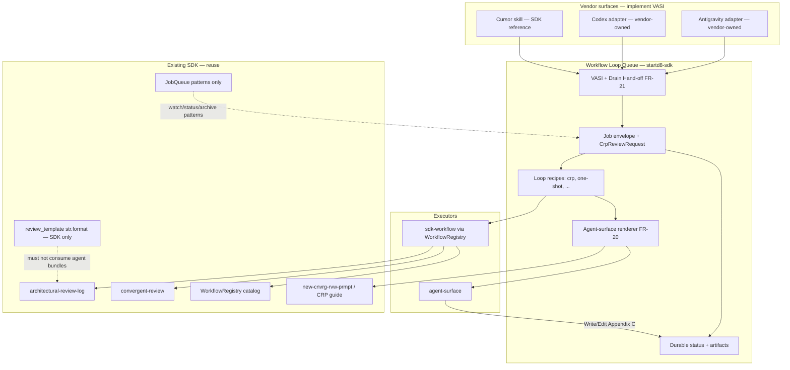

# Workflow Loop Queue (WLQ) — Requirements

**Version:** 0.5 (Multi-vendor agent surfaces — Cursor reference + Codex / Antigravity interface)
**Date:** 2026-07-24
**Status:** Increments 0, 0.5, and 1 implemented; Cursor is v1 reference surface
**Author:** Neil Yashinsky (drafted with agent assist)
**Companion plan:** `CURSOR_WORKFLOW_LOOP_PLAN.md`
**Doc folder note:** Path `docs/design/cursor-workflow-loop/` is historical (Cursor-first spike). Product name is **Workflow Loop Queue (WLQ)**; “CWLQ” means the Cursor reference surface only.

---

## 0. Planning Insights (Self-Reflective Update)

> What changed between the naïve v0.1 framing (“a Cursor loop like CRP”) and the
> code-grounded v0.2. Planning against the real SDK surfaced **7 discoveries**.

| v0.1 Assumption | Planning Discovery (file / fact) | Impact |
|-----------------|----------------------------------|--------|
| Need a new queue substrate | `job_queue.py` + `JobFile`/`JobQueueConfig` already provide file-based pending→processing→completed jobs (`models.py:631+`), CLI `startd8 queue *`, TUI mixin | **Extend / specialize**, do not greenfield a second file-watcher. But JobFile is **prompt-only** — no `workflow_id`. |
| “Connect workflows to the existing job queue” is enough | `JobQueue` runs `prompt → agent.generate()`; it never calls `WorkflowRegistry` (`job_queue.py` has zero `workflow_id` references) | New **job kind** (or parallel envelope) whose drain path is `WorkflowRegistry.run_workflow` / `startd8 workflow run`, not the prompt path. |
| CRP-in-Cursor = the SDK CRP workflow | Two parallel CRP executors exist: (1) SDK `architectural-review-log` + orchestrator `convergent-review` (provider LLM, appends via workflow code); (2) Cursor skill `/new-cnvrg-rvw-prmpt` → agent with Write tools appends Appendix C (Capability-Delivery Loop path) | Queue must name **two CRP adapters** and pick a v1 default. Cursor-native CRP is the “run using Cursor” path; SDK workflow is the headless/API path. |
| Agentic-loop requirements cover this | `docs/design/agentic-loop/` is a **tool-use runtime** (`AgenticSession`); OQ-2 there already says it does **not** merge with contractor/workflow pipelines | Explicit NR: this queue is **not** the agentic tool-use loop. |
| “Loop” = one new runtime | Capability-Delivery Loop (`CAPABILITY_DELIVERY_LOOP.md`) is a **process standard** (reflective-reqs → CRP → ship), not an executable queue | This feature **executes** named loop recipes; the process standard remains normative guidance for *when* to enqueue CRP. |
| MCP/gateway already wires Cursor | `mcp/gateway.py` has `list_workflows` / `execute_workflow`; CLI has `startd8 workflow run`; Cursor MCP server currently flaky in-session | Cursor surface v1 = **skill + CLI drain** (durable, offline-friendly). MCP enqueue is Increment 2 if the server is healthy. |
| All 16 workflows are equally “loopable” | Some are multi-step convergent (`convergent-review`); most are single-shot (`plan-ingestion`, `plain-language`, …). Prime/contractor are heavy and already have cap-dev-pipe orchestration | v1: **CRP loop recipe** + generic **one-shot workflow job**. Heavy contractor loops stay out of v1 (NR). |

**Resolved open questions (from planning):**
- **OQ-1 → Extend JobQueue patterns, new job envelope.** Reuse watch-folder / status / archive semantics; do **not** overload `prompt.content` to smuggle workflow configs.
- **OQ-2 → Two CRP adapters; v1 default = Cursor-agent CRP.** SDK `convergent-review` / `architectural-review-log` as optional `executor: sdk-workflow` from day one of the schema (even if drain lands in Increment 1.1).
- **OQ-3 → Not the agentic loop.** Separate module/docs namespace: `cursor-workflow-loop` / `workflow_loop_queue`.
- **OQ-4 → Catalog plug-in via `workflow_id` + validated config.** Schema validates against `WorkflowRegistry.get_workflow_info` input list; unknown ids fail closed at enqueue.

---

### 0.1 Lessons-Learned Hardening (v0.3)

> Applied Design_Docs / SDK lessons before CRP. Each changed the draft:

- **[Phantom-reference audit]** — Named only symbols verified present: `WorkflowRegistry.run_workflow`, `JobFile`/`JobStatus`, `convergent-review`, `architectural-review-log`, `startd8 workflow run`, `gateway.execute_workflow`. Cursor Automations / a non-existent `WorkflowLoop` class are **not** claimed as shipped substrate. → FR-1/FR-2 reference-audit table (§5).
- **[Overloaded-term co-location]** — “Loop” already means agentic tool-use loop, Capability-Delivery Loop, and CRP rounds. → Product name **Workflow Loop Queue (WLQ)** (Cursor surface = reference); code home must not land inside `agents/agentic.py` or `job_queue.py` (plan: `workflows/loop_queue/`).
- **[Single-source vocabulary]** — CRP suggestion schema / Appendix A/B/C owned by `ARCHITECTURAL_REVIEW_REQUIREMENTS.md` + CRP Agent Guide. This doc **cites**, does not restate, the 7-column schema. → FR-10.
- **[CRP steering memory]** — Least-reviewed artifact will be **this requirements doc + plan**; settled do-not-relitigate: JobQueue stays prompt-jobs; agentic loop stays separate; CRP protocol schema is owned upstream.

### 0.2 Design-Principle Hardening (v0.3.1)

> Checked against `docs/design-princples/`. Each changed the draft:

- **[Mottainai]** — Do not regenerate CRP prompts or re-run rounds that already produced Appendix C blocks; queue must persist round artifacts and skip completed rounds on resume. → FR-12, FR-14.
- **[Genchi Genbutsu]** — Enqueue validation binds to **live** `WorkflowRegistry` metadata (real inputs), not a hand-maintained allowlist of workflow ids. → FR-5.
- **[Accidental-Complexity anti-principle]** — One job envelope + executor tag beats separate queues per workflow family. → FR-1 (single schema).
- **[Context-Correctness-by-Construction]** — A job’s required inputs (paths, agents, rounds) are declared + validated at enqueue; drain must fail closed if artifacts vanished — no silent `None` path into CRP. → FR-6, FR-13.
- **[Hitsuzen]** — Next round number, coverage tier, and “substantially addressed” sets are **derived** from the target doc’s existing Appendix A/B/C (as the SDK workflow already does), not re-asked of the LLM or the Cursor agent. → FR-11.
- **[Mujō / continuity]** — Queue state + per-job status files are the durable continuity signals across Cursor sessions (session dies; queue does not). → FR-3, FR-15.

### 0.3 CRP Executor Spike (v0.3.2)

> A bounded spike on 2026-07-24 generated the dual-document
> `CRP_PROMPT_R1.md`, dry-ran `architectural-review-log` against the same plan +
> requirements, and ran the focused workflow tests.

| Probe | Result | Requirement impact |
|-------|--------|--------------------|
| `/new-cnvrg-rvw-prmpt` dual-doc generation | **PASS** — 85,881-byte / 1,351-line bundle; initialized A/B/C scaffolds in both source docs | Confirms the Cursor-agent executor artifact in FR-8. |
| `startd8 workflow run architectural-review-log --dry-run` with `document_path` + `feature_requirements` | **PASS** — registry accepted the dual-doc config and produced an execution/cost plan | Confirms the SDK executor mapping in FR-9. |
| Feed generated bundle to workflow `review_template` | **INCOMPATIBLE by contract** — `_build_prompt(... template_override=bundle)` fails `KeyError: 'n'`; workflow templates use Python `str.format`, while the self-contained bundle intentionally contains CRP braces such as `R{n}` | FR-8 and FR-9 are parallel renderers from one canonical review request; the SDK executor MUST NOT consume the generated Cursor prompt. |
| Focused architectural-review tests | **PASS** — 168 tests, including dual-doc routing, triage, appendices, and machine-file corruption guards | Existing workflow is safe enough to reuse behind an adapter. |

**Resolved spike question:** the integration seam is **typed review intent**, not
prompt chaining. A CRP job carries source paths, scope, rounds, threshold, suggestion
cap, agents/provider policy, and triage/apply policy. The Cursor executor renders a
self-contained prompt bundle; the SDK executor maps the same fields to
`architectural-review-log` / `convergent-review`.

### 0.4 Agent-surface review-template workflow (v0.4)

> The spike proved we need a **working template path an IDE/agent surface can execute**.
> That path is **not** `architectural-review-log.review_template` (Python `str.format`).
> It is a **pre-rendered markdown review bundle** an agent opens and follows with
> filesystem write tools.

| Decision | Normative rule |
|----------|----------------|
| Template medium | Markdown file on disk (`new-cnvrg-rvw-prmpt` shape, or a project template rendered into that shape) |
| Slot substitution | Done **before** the agent sees the file. Agent-facing templates MAY use safe `{{slot}}` / mustache-style placeholders only. Literal CRP braces (`R{n}`, `{round}`) MUST appear only in **already-rendered** body text — never as live Python `str.format` fields |
| Drain contract | Surface points the agent at the absolute path of the rendered bundle + source doc paths; agent appends Appendix C; chat reply = write-confirmation only |
| SDK `review_template` | Remains an **SDK-executor-only** customization seam. WLQ MUST fail closed if a job tries to pass an agent-surface bundle as `review_template` |
| Shared seam | Typed `CrpReviewRequest` (FR-1a) feeds renderers; templates are not a second source of truth for paths/rounds |

### 0.5 Multi-vendor agent surfaces (v0.5)

> WLQ is **vendor-neutral at the queue + interface layer**. Cursor is the **v1 reference
> surface**. Codex, Antigravity, and future vendors implement their own downstream
> connections (skills, plugins, CLI wrappers, automations) against a documented
> **Vendor Agent Surface Interface (VASI)** — the SDK does not ship those connectors.

| Layer | Owner | Examples |
|-------|-------|----------|
| Queue + schemas + CLI + recipes + renderers | **startd8-sdk (this repo)** | job envelope, `CrpReviewRequest`, `startd8 wloop *`, CRP renderer |
| VASI contract (documented) | **startd8-sdk** | FR-21: ops, artifacts, status write-back, capabilities |
| Surface adapter (downstream) | **vendor / integrator** | Cursor skill, Codex plugin/skill, Antigravity connector |
| SDK workflow executor | **startd8-sdk** | `executor=sdk-workflow` — no IDE required |

**Settled:** do not hardcode a closed vendor enum in the core schema beyond a
recommended registry of known `surface_id`s; unknown surfaces are allowed if they
declare VASI conformance. v1 ships a Cursor reference adapter; Codex / Antigravity
are **documented targets**, not SDK deliverables (NR-9).

---

## 1. Problem Statement

The SDK already has:

| Component | What it does today | Gap |
|-----------|-------------------|-----|
| **WorkflowRegistry** (~16 workflows) | Discover / describe / `run` via CLI + MCP gateway | No durable **queue** of workflow jobs an IDE/agent session can enqueue and drain across turns/sessions |
| **CRP workflows** (`architectural-review-log`, `convergent-review`) | Full CRP mechanics when invoked with API keys | Not wired into a multi-surface orchestrated multi-job / multi-round queue |
| **Cursor CRP skill** (`/new-cnvrg-rvw-prmpt`) | Generates a paste-ready prompt; human/agent runs rounds ad hoc | No queue, no resume, no batch of docs, no shared job status; Cursor-only, not a vendor interface |
| **SDK `review_template`** | Optional Python `str.format` override for `architectural-review-log` | **Incompatible** with agent-surface CRP bundles (`KeyError: 'n'`); no agent-executable template workflow |
| **JobQueue** (`startd8 queue`) | File-based prompt→agent jobs | Cannot address a `workflow_id` or carry workflow config |
| **Capability-Delivery Loop** | Process standard: reflective-reqs → CRP → ship | Not executable; assumes manual CRP |
| **Agentic loop** (design) | Multi-turn tool-use runtime | Different problem; must not be conflated |
| **Other agent IDEs** (Codex, Antigravity, …) | No shared startd8 loop contract | Need a **documented interface** so each vendor implements its own drain/enqueue without forking the queue |

**What should exist:** a **Workflow Loop Queue (WLQ)** — a durable, file-based queue of *workflow / loop jobs* with (1) an **`sdk-workflow` executor**, (2) an **`agent-surface` executor** driven by a published **Vendor Agent Surface Interface** (Cursor as reference; Codex / Antigravity / others as downstream adapters), starting with a first-class **CRP loop recipe** and a **pre-rendered review-template workflow**, designed so most catalog workflows plug in as one-shot jobs without a redesign.

---

## 2. Requirements

### Queue core

- **FR-1 — Workflow-loop job envelope.** Define a versioned job schema (suggested filename pattern `*_startd8_wloop.json` or equivalent, distinct from `*_startd8_job.json`) with at least: `schema_version`, `job_id`, `loop_id` (recipe name, e.g. `crp`), `executor` (`agent-surface` \| `sdk-workflow`), `surface_id` (required when `executor=agent-surface`; recommended known values: `cursor`, `codex`, `antigravity`; open string for future vendors), `workflow_id` (optional when `agent-surface`; required when `sdk-workflow`), `config`, `priority`, `status` ∈ {`pending`, `processing`, `awaiting_triage`, `completed`, `failed`, `cancelled`, `blocked`}, `created_at`, `depends_on[]`, `budget`, `metadata`. Alias `executor=cursor-agent` MAY be accepted as deprecated synonym for `agent-surface` + `surface_id=cursor`. *Acceptance:* invalid schema fails at enqueue; valid jobs round-trip; unknown `surface_id` is allowed if VASI fields present (FR-21). **[R1-F1 / §0.5]**

- **FR-1a — Canonical CRP review-intent (`CrpReviewRequest`).** When `loop_id=crp`, `config` MUST carry a typed object with at least: `plan_path` and/or `requirements_path` (dual-doc needs both), `scope`, `max_rounds`, `substantially_addressed_threshold`, `max_suggestions`, optional `focus_file`, optional `agents` / provider policy, `enable_triage` / `enable_apply` (sdk-workflow), optional `agent_template_path` (project override for agent-surface renderer; alias `cursor_template_path` accepted). Unknown required keys fail closed at enqueue. **[R1-F2 / §0.3–0.5]** *Acceptance:* unit test rejects CRP enqueue missing required intent keys; all executors/surfaces consume one request instance.

- **FR-2 — Reuse JobQueue operational patterns, not JobFile semantics.** Watch folder, status sidecar, archive-on-complete, priority ordering, and sequential drain (`max_concurrent_jobs` default 1) SHOULD match `JobQueue` UX (`startd8 queue status|run|watch`). Implementation MUST NOT overload `JobFile.prompt` for workflow configs. *Acceptance:* a prompt job and a workflow-loop job can coexist in the same watch tree or sibling trees without cross-interpretation.

- **FR-3 — Durable status across sessions / surfaces.** Status transitions `pending → processing → awaiting_triage | completed | failed | cancelled | blocked` persist on disk. A new agent session (any conforming surface) can `status` / `run-next` without prior conversation memory. Kill-mid-job lease/heartbeat is **Increment 3 / OQ-5** — until then, abandoned `processing` is recoverable via explicit `requeue` / `cancel` (v1 interim). **[R1-F3]** *Acceptance:* after a completed review round, status is `awaiting_triage` (if triage deferred) or advances per FR-12/13; lease TTL not required for Inc 1 ship.

- **FR-4 — Vendor-neutral enqueue / drain CLI + reference Cursor skill.** WLQ ships CLI ops: `enqueue`, `status`, `run-next` / `drain`, `cancel`, `list-loops`, `list-surfaces`, and for CRP: `triage` / `render`. These are the **canonical ops** every vendor surface must map to (FR-21). v1 also ships a **Cursor reference skill** that invokes those ops. Drain for `executor=agent-surface`: ensure a **rendered review-template bundle** exists (FR-8 / FR-20), hand the surface a **Drain Hand-off** (FR-21) pointing at the absolute bundle path; surface’s agent executes Write/Edit; write confirmation + suggestion counts back to job status. Drain for `executor=sdk-workflow`: `WorkflowRegistry.run_workflow` / `startd8 workflow run`. *Acceptance:* Cursor happy path documented; a fixture “mock surface” that only implements VASI hand-off ops can drain without Cursor-specific code.

- **FR-5 — Catalog-validated workflow jobs (Genchi).** When `workflow_id` is set, enqueue MUST validate `config` against live `WorkflowRegistry` metadata (`get_workflow_info` / declared `WorkflowInput`s). Unknown workflow ids fail closed. No parallel hand-maintained id allowlist as source of truth. *Acceptance:* unit test with a fake registered workflow accepts required fields and rejects missing ones.

- **FR-6 — Fail-closed missing artifacts.** Path-typed inputs MUST exist and be readable at enqueue **and** re-checked at drain start. **Rule:** missing at enqueue → **reject enqueue** (typed validation error); vanished between enqueue and drain → status `blocked` with named reason (retryable when path restored); unreadable / wrong type (e.g. non-markdown for CRP targets) → `failed`. **[R1-F4]** *Acceptance:* delete-before-enqueue fails closed; delete-after-enqueue yields `blocked` with reason.

### Vendor Agent Surface Interface (multi-vendor)

- **FR-21 — Vendor Agent Surface Interface (VASI).** The SDK MUST publish a versioned interface document at [`VENDOR_AGENT_SURFACE_INTERFACE.md`](VENDOR_AGENT_SURFACE_INTERFACE.md) (schema_version aligned with the job envelope) that vendors implement **downstream**. VASI is the only required integration contract. It MUST specify:

  | Concern | Contract (minimum) |
  |---------| | ------------------ |
  | **Identity** | Stable `surface_id` string; human `display_name`; optional `vendor` / homepage |
  | **Capabilities** | Declared set from `{enqueue, status, drain, cancel, triage, render}`; CRP agent-surface requires at least `{status, drain}` plus filesystem write to source docs |
  | **Ops mapping** | How the surface invokes WLQ CLI and/or Python API for each capability (command examples + exit codes) |
  | **Drain Hand-off** | On `run-next` for `agent-surface`, WLQ emits a machine-readable hand-off (JSON sidecar and/or stdout) with: `job_id`, `surface_id`, `bundle_path` (absolute), `source_paths[]`, `round_number`, `success_criteria`, `status_writeback` instructions (where to write confirmation JSON: suggestion counts, paths written, errors) |
  | **Agent execution contract** | Agent MUST have filesystem read + write to source docs; MUST append Appendix C only; MUST NOT triage A/B; chat/UI reply = short confirmation |
  | **Status write-back** | Schema for post-drain confirmation (counts, paths, exit status); fail-closed if missing after claimed success |
  | **Non-goals** | Vendors own UX (skills, panels, automations); SDK does not embed vendor SDKs |

  **Known targets (documented, not shipped by SDK):** `cursor` (reference, shipped), `codex` (downstream), `antigravity` (downstream). *Acceptance:* VASI doc exists with schema_version; Cursor reference skill conforms; a contract test validates Drain Hand-off JSON against the schema; Codex/Antigravity sections list required ops with “implementer: vendor” ownership.

- **FR-22 — Surface registry (advisory, not closed).** WLQ MAY ship `list-surfaces` listing known `surface_id`s and which are SDK-shipped vs external. Registration of a new surface MUST NOT require a startd8 release if the surface only uses CLI/API + VASI (open extension). Optional entry-point group (e.g. `startd8.loop_queue.surfaces`) MAY exist later for in-process helpers — not required for Codex/Antigravity. *Acceptance:* `list-surfaces` shows at least `cursor` (shipped) and documents `codex` / `antigravity` as external.

### CRP loop recipe + agent-surface review-template (v1 flagship)

- **FR-7 — Loop recipe registry.** WLQ ships a small registry of **loop recipes** (not the full WorkflowRegistry). v1 recipe: `crp`. Each recipe declares: inputs, steps/phases, which executors it supports, completion predicate, and how it maps to zero-or-more `workflow_id`s when using `sdk-workflow`. *Acceptance:* `list-loops` shows `crp` with `agent-surface` and `sdk-workflow` documented.

- **FR-8 — CRP agent-surface executor (v1 default) = review-template drain.** For `loop_id=crp` + `executor=agent-surface`, the drain path MUST: (a) derive next round number and prior A/B memory from the target doc(s); (b) **render or reuse** an agent-surface review-template bundle per FR-20 (default renderer: `new-cnvrg-rvw-prmpt` / guide); (c) emit a VASI Drain Hand-off (FR-21) so the named `surface_id`’s agent executes the bundle — append a `#### Review Round R{n}` block under Appendix C (initialize A/B/C scaffold if absent); (d) record write confirmation + suggestion counts on the job status; (e) leave **triage** as an explicit follow-up step — reviewer must not self-triage into A/B. The rendered bundle is never fed to SDK `review_template`. *Acceptance:* fixture → scaffold + R1; second `run-next` → R2; status records S/F counts; works with `surface_id=cursor` reference and a mock surface fixture.

- **FR-9 — CRP SDK-workflow executor.** For `loop_id=crp` + `executor=sdk-workflow`, drain MUST invoke `convergent-review` (dual-doc) or `architectural-review-log` (single-doc) via the registry with config mapped from `CrpReviewRequest` (FR-1a). It MUST NOT pass an agent-surface review-template bundle as `review_template`. Optional SDK-native `review_template` overrides remain allowed only under the SDK `str.format` contract. *Acceptance:* dry-run / scripted-agent path mutates the fixture like a direct `startd8 workflow run`; contract test: both executors accept one `CrpReviewRequest`; setting `review_template` to an agent-surface bundle fails closed.

- **FR-10 — Cite, don’t fork, CRP protocol.** Suggestion schema, areas, severities, and Appendix A/B/C rules remain owned by `docs/design/arc-review/ARCHITECTURAL_REVIEW_REQUIREMENTS.md` and `CONVERGENT_REVIEW_AGENT_GUIDE.md`. WLQ requirements MUST NOT redefine the 7-column table. *Acceptance:* this doc links §-refs only; CRP Agent Guide is the reviewer contract.

- **FR-11 — Derive round / coverage (Hitsuzen).** Next `R{n}`, applied/rejected ID lists, and priority-area steering MUST be derived from the on-disk document state and **injected into the rendered agent-surface bundle before drain**. Agents MUST NOT invent the round number. *Acceptance:* after manual R1 append, enqueue+drain uses R2.

- **FR-12 — Multi-round + stop conditions.** A CRP job supports `max_rounds` (default aligned with skill defaults, e.g. 2), optional `substantially_addressed_threshold`, and optional `$` / turn budget. Completion when rounds exhausted **or** recipe-defined convergence signal (for sdk-workflow: workflow result success + configured rounds). *Acceptance:* `max_rounds=1` never schedules a second review step.

- **FR-13 — Triage handoff is a first-class step.** After each review round (or after N rounds), the job MAY enter `awaiting_triage`. A `triage` action (any VASI-capable surface or SDK CLI helper) records Accepted→Appendix A / Rejected→Appendix B per CRP rules. **Appendix C round history remains append-only**; triage updates A/B and job status, not deletion of C. v1 MAY allow human-in-the-loop triage outside the queue, but status MUST distinguish `awaiting_triage` from `completed`. *Acceptance:* status distinguishes `awaiting_triage` from `completed`; A/B gain disposition rows without erasing C.

- **FR-14 — Resume / Mottainai.** Re-draining a CRP job MUST NOT regenerate a completed round’s Appendix C block. Completed rounds are skipped; only pending work runs. Rendered agent-surface review-template bundles are cached under the job’s artifact dir and reused unless `CrpReviewRequest` inputs change (content hash). *Acceptance:* second drain after successful R1 is a no-op or advances only R2.

- **FR-20 — Agent-surface review-template workflow (normative for `executor=agent-surface`).** WLQ MUST support a vendor-agnostic review-template workflow with these properties:
  1. **Output:** a self-contained markdown bundle on disk (absolute path recorded on the job + Drain Hand-off).
  2. **Renderer:** default = `new-cnvrg-rvw-prmpt` (or equivalent). Optional project override via `agent_template_path` — markdown with **safe `{{slot}}` placeholders only**. Substitution at render time; agent never sees unsubstituted required slots.
  3. **Forbidden:** Python `str.format` / single-brace `{name}` on agent-facing CRP text (spike `KeyError: 'n'`).
  4. **Agent contract (all surfaces):** filesystem read/write to source docs; append Appendix C (+ dual-doc coverage matrix to plan); no A/B triage; short confirmation reply.
  5. **Queue integration:** `run-next` for `agent-surface` emits VASI Drain Hand-off; success = append detected + status write-back.
  6. **Surface independence:** bundle format is identical for Cursor, Codex, Antigravity; only the surface’s UX for opening/running the bundle differs (vendor-owned).
  *Acceptance:* (a) default renderer produces a runnable bundle; (b) `{{slot}}` override fixture; (c) bundle rejected as SDK `review_template`; (d) Cursor reference e2e; (e) mock non-Cursor surface drains via hand-off alone.

### Catalog expansion (design now, implement incrementally)

- **FR-15 — Generic one-shot workflow jobs.** Any registered workflow MAY be enqueued as `loop_id=one-shot` (or omit loop and set `workflow_id` only) with `executor=sdk-workflow`. v1 implementation priority after CRP: review-adjacent family (`critical-review`, `design-polish`, `doc-enhancement`, `plain-language`, `policy-analysis`). *Acceptance:* enqueue+run `plain-language` with a fixture config succeeds under mock agents where the workflow allows.

- **FR-16 — Dependency DAG (light).** `depends_on: [job_id, …]` blocks drain until dependencies are `completed`. Cycles fail at enqueue. *Acceptance:* CRP job B depending on reflective-reqs job A does not start until A completes. (Reflective-requirements may remain an agent-surface skill, not an SDK workflow — OQ-6.)

- **FR-17 — Observability.** Emit OTel spans or structured logs for enqueue, drain start/end, `executor`, `surface_id`, workflow_id/loop_id, cost (when sdk-workflow), status transition. Reuse `get_logger` / existing workflow span patterns. *Acceptance:* a drain produces a span/log line searchable by `job_id` and `surface_id`.

- **FR-18 — Budget fail-closed.** Optional per-job and per-queue `$` / round caps checked before sdk-workflow re-entry (wire to `costs/budget.py` when executor spends). Agent-surface executor: enforce `max_rounds` and surface a budget warning in the Drain Hand-off / skill banner (vendor UX may rephrase). *Acceptance:* zero-dollar budget with sdk-workflow refuses to start.

- **FR-19 — Public experimental API.** Queue models + `enqueue`/`drain`/hand-off helpers are **experimental** pre-1.0; import path documented (suggested: `startd8.workflows.loop_queue`). VASI schema published alongside. *Acceptance:* smoke import + schema fixture test.

---

## 3. Non-Requirements

- **NR-1 — Not the agentic tool-use loop.** Does not implement or depend on `AgenticSession` / `agenerate_tools` for v1.
- **NR-2 — Not a replacement for prompt JobQueue.** `*_startd8_job.json` prompt jobs remain; WLQ is a sibling envelope.
- **NR-3 — Not a rewrite of CRP protocol.** No new suggestion schema, areas, or appendix semantics. Do not strip Appendix C round history on triage.
- **NR-4 — Not Prime/Artisan/cap-dev-pipe orchestration in v1.** `prime-contractor`, `plan-ingestion` *may* be enqueued as one-shot later; WLQ does not replace `.cap-dev-pipe/` scripts.
- **NR-5 — Not vendor Automations as a v1 hard dependency.** CLI + one reference Cursor skill are sufficient; Cursor Automations / Codex schedulers / Antigravity automations are optional Increment 2+ consumers of the same on-disk queue (vendor-owned).
- **NR-6 — Not autonomous merge/push.** Queue does not commit, open PRs, or apply triage without an explicit triage action / human confirmation.
- **NR-7 — Not a second WorkflowRegistry.** Loop recipes are thin; catalog ownership stays with entry points in `pyproject.toml`.
- **NR-8 — Not unifying agent-surface bundles with SDK `review_template`.** v1 does **not** migrate `architectural-review-log.review_template` off `str.format`. Agent-surface uses FR-20; SDK custom templates stay on the existing SDK contract.
- **NR-9 — Not shipping Codex or Antigravity connectors in startd8-sdk.** Those vendors (or integrators) implement VASI downstream. SDK delivers the interface doc, schemas, CLI, reference Cursor adapter, and contract tests — not vendor plugins.

---

## 4. Open Questions

- **OQ-5.** Lease/heartbeat for abandoned `processing` jobs — auto-fail after TTL vs require explicit `requeue`? *(v1 interim: explicit `requeue`/`cancel` only — see FR-3.)*
- **OQ-6.** Should reflective-requirements become a first-class `loop_id=reflective-requirements` recipe (`agent-surface` only), or stay an external skill that merely enqueues a follow-on CRP job?
- **OQ-7.** Same watch folder as prompt jobs vs dedicated `.startd8/workflow-loop-queue/` — UX unity vs isolation?
- **OQ-8.** For agent-surface CRP, is the reviewing agent always the *current* chat agent, or should the surface spawn a distinct subagent / Task tool run (blind review) by default? *(May differ per vendor — VASI should allow either.)*
- **OQ-9.** MCP `execute_workflow` as an enqueue/drain backend in Increment 2 — gate on `user-startd8` MCP reliability, or always shell out to CLI?
- **OQ-10.** Should optional `agent_template_path` project overrides live in-repo (versioned) or under `.startd8/` (local-only)? Default lean: in-repo under `docs/design/**/templates/` or `.startd8/review-templates/`.
- **OQ-11.** Should Drain Hand-off be JSON-only, or also a short human markdown “run this” card for chat-paste vendors?

---

## 5. Reference Audit (phantom-check)

| Symbol / path | Exists? | Role in this spec |
|---------------|---------|-------------------|
| `WorkflowRegistry.run_workflow` / `arun_workflow` | Yes — `workflows/registry.py` | sdk-workflow drain |
| `startd8 workflow run` | Yes — `cli_workflow.py` | CLI drain |
| `gateway.list_workflows` / `execute_workflow` | Yes — `mcp/gateway.py` | Increment 2 optional |
| `JobQueue` / `JobFile` / `*_startd8_job.json` | Yes — `job_queue.py`, `models.py` | Pattern reuse only |
| `architectural-review-log` | Yes — entry point + workflow module | CRP sdk single-doc |
| `architectural-review-log.review_template` | Yes — `str.format` override | **SDK-only**; not agent-surface path (NR-8) |
| `convergent-review` | Yes — wraps architectural-review-log | CRP sdk dual-doc |
| `/new-cnvrg-rvw-prmpt` + `CONVERGENT_REVIEW_AGENT_GUIDE.md` | Yes — skill + guide | Default agent-surface review-template renderer (FR-20) |
| `CAPABILITY_DELIVERY_LOOP.md` | Yes | Process when to enqueue CRP |
| `agents/agentic.py` AgenticSession | Design / partial spike — **not** WLQ substrate | Explicitly out of scope (NR-1) |
| Cursor Automations API | Product surface; not an SDK module | Optional vendor consumer (NR-5) |
| Codex / Antigravity connectors | **External** | Implement VASI (FR-21); not shipped here (NR-9) |
| `CrpReviewRequest` / `{{slot}}` templates | **To-be-created** | FR-1a / FR-20 |
| `VENDOR_AGENT_SURFACE_INTERFACE.md` | Yes (draft 0.1) | FR-21 contract for Cursor / Codex / Antigravity |

---

## 6. Suggested increments (planning snapshot)

| Increment | Delivers | Unlocks |
|-----------|----------|---------|
| **0** | Job envelope + `surface_id` + `CrpReviewRequest` + disk status + validate-against-registry | Enqueue without execution |
| **0.5** | Publish VASI doc + Drain Hand-off schema + `list-surfaces` | Codex / Antigravity can start adapters |
| **1** | Agent-surface review-template (FR-20) + Cursor reference skill + mock-surface contract test + triage | First multi-vendor-capable CRP loop (Cursor ships) |
| **1.1** | CRP `sdk-workflow` executor (FR-9) | Headless / CI CRP via same queue |
| **2** | Generic one-shot workflows (FR-15) + deps (FR-16) + optional MCP | Catalog leverage |
| **3** | Budgets/OTel + lease policy (OQ-5) + optional reflective-reqs recipe (OQ-6) | Production hardening |

---

## 7. Relationship map

---

*v0.5 — Multi-vendor: product is Workflow Loop Queue (WLQ); `executor=agent-surface` + `surface_id`; VASI (FR-21) is the documented interface Codex / Antigravity implement downstream; Cursor remains the shipped reference surface; NR-9 forbids shipping those connectors in-SDK. Agent-surface review-template remains FR-20.*

---

## Appendix: Iterative Review Log (Applied / Rejected Suggestions)

This appendix is intentionally **append-only**. New reviewers (human or model) add suggestions to Appendix C; once validated, the orchestrator records the final disposition in Appendix A (applied) or Appendix B (rejected with rationale). **Do not delete A/B** — they are the cross-model memory that stops later reviewers from re-proposing settled or rejected ideas.

### Reviewer Instructions (for humans + models)

- **Before suggesting changes**: Scan Appendix A and Appendix B first. Do **not** re-suggest items already applied or explicitly rejected.
- **When proposing changes**: Append a `#### Review Round R{n}` block under Appendix C (n = highest existing round + 1, or 1), with unique suggestion IDs `R{n}-S{k}` (plan) / `R{n}-F{k}` (requirements).
- **When endorsing prior suggestions**: If you agree with an untriaged item from a prior round, list it in an **Endorsements** section instead of restating it. Multi-reviewer endorsements raise triage priority.
- **When validating (orchestrator)**: For each suggestion, append a row to Appendix A (applied) or Appendix B (rejected) referencing the suggestion ID.
- **If rejecting**: Record **why** (specific rationale) so future reviewers don't re-propose the same idea.

### Appendix A: Applied Suggestions

| ID | Suggestion | Source | Implementation / Validation Notes | Date |
|----|------------|--------|-----------------------------------|------|
| R1-F1 | Status vocabulary includes `awaiting_triage` | CRP R1 | Merged into FR-1 / FR-3 | 2026-07-24 |
| R1-F2 | Normative `CrpReviewRequest` intent fields | CRP R1 | New FR-1a + §0.4 | 2026-07-24 |
| R1-F3 | Defer lease TTL; interim requeue/cancel | CRP R1 | FR-3 Inc-3 / OQ-5; v1 explicit requeue | 2026-07-24 |
| R1-F4 | `blocked` vs `failed` rule for missing paths | CRP R1 | FR-6 decision rule | 2026-07-24 |
| spike-template | Cursor-compatible review template path | Spike §0.3/0.4 | FR-8 rewritten + FR-20 + NR-8 | 2026-07-24 |
| multi-vendor | Support Cursor + Codex + Antigravity via documented interface | Product ask | §0.5, FR-1 `surface_id`, FR-21 VASI, FR-22, NR-9; rename WLQ | 2026-07-24 |

### Appendix B: Rejected Suggestions (with Rationale)

| ID | Suggestion | Source | Rejection Rationale | Date |
|----|------------|--------|---------------------|------|
| (implicit) Feed Cursor CRP bundle as SDK `review_template` | Spike | Incompatible `str.format` / `KeyError: 'n'`; would corrupt Cursor path. NR-8. | 2026-07-24 |

### Appendix C: Incoming Suggestions (Untriaged, append-only)

#### Review Round R1 — composer-2.5 — 2026-07-25

- **Reviewer**: composer-2.5
- **Date**: 2026-07-25 02:40:00 UTC
- **Scope**: Dual-doc first pass — requirements ambiguity, FR cross-conflicts, untestable acceptance (Feature Requirements)

**Executive summary**

- FR-1 status vocabulary omits `awaiting_triage` that FR-13 and the plan drain machine require.
- FR-1 `config` dict is underspecified relative to §0.3’s resolved typed review-intent fields.
- FR-3 acceptance depends on a lease rule while OQ-5 remains open → untestable as written.
- FR-6 leaves `blocked` vs `failed` for missing artifacts without a decision rule.
- FR-13 “clears Appendix C items” tensions with CRP append-only / NR-3 cite-don’t-fork.
- Header still says companion plan “to be written”; plan is v0.3 — stale metadata.

| ID | Area | Severity | Suggestion | Rationale | Proposed Placement | Validation Approach |
| ---- | ---- | ---- | ---- | ---- | ---- | ---- |
| R1-F1 | Data | high | Extend FR-1’s required status vocabulary to include `awaiting_triage` (and keep `blocked`/`cancelled`) so the envelope matches FR-13. | FR-1 lists transitions implicitly via fields `status` but the enumerated set in FR-3 is “`pending → processing → completed \| failed \| cancelled \| blocked`” with no `awaiting_triage`, while FR-13 says “the job MAY enter `awaiting_triage`” and acceptance requires distinguishing it from `completed`. | §2 Queue core, FR-1 and FR-3 status sentences | Acceptance checklist: enqueue→round→status is `awaiting_triage` before triage action |
| R1-F2 | Architecture | high | Normatively name the canonical CRP review-intent fields inside FR-1/`config` (or a nested typed object): source paths, scope, rounds, threshold, max suggestions, agent/provider policy, triage/apply policy — matching §0.3 spike resolution. | §0.3 states “A CRP job carries source paths, scope, rounds, threshold, suggestion cap, agents/provider policy, and triage/apply policy,” but FR-1 only says `config` (dict matching … loop recipe’s inputs) — implementers lack a fail-closed field list. | §2 FR-1 after the field list; cross-link §0.3 | Schema unit test rejects CRP enqueue missing required intent keys |
| R1-F3 | Risks | high | Either pick a v1 default for OQ-5 in FR-3 acceptance, or mark the lease clause as “Increment 3 / OQ-5” so FR-3 is not falsely shippable earlier. | FR-3 acceptance: “kill mid-job → job is `failed` or resumable `processing` with a clear lease/heartbeat rule (OQ-5)” while §4 still lists OQ-5 unresolved — acceptance is untestable. | §2 FR-3 *Acceptance* sentence; optionally lean under §4 OQ-5 | With chosen default: kill-drain integration asserts exact terminal/resumable status |
| R1-F4 | Interfaces | medium | Specify when missing/moved path artifacts yield `blocked` vs `failed` (e.g. missing at enqueue = reject; vanished at drain = `blocked` retryable vs `failed` terminal). | FR-6: “Missing/moved files → `blocked` or `failed` with a named reason” offers both without a rule, so drain behavior will diverge across executors. | §2 FR-6 after the MUST sentence | Two tests: delete-before-enqueue fails closed; delete-after-enqueue yields the chosen status with named reason |
