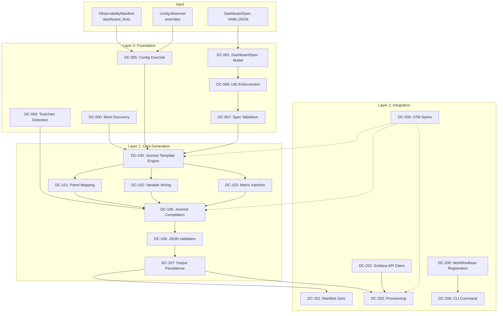
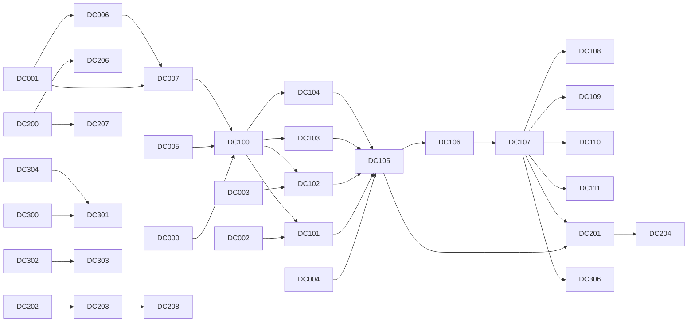

# Dashboard Creator (dbrd-cr8r) — Functional Requirements

**Version:** 0.1.0
**Created:** 2026-03-01
**Status:** DRAFT
**Tracking prefix:** DC

## 1. Overview

The StartD8 SDK ships a full `startd8-mixin/` monitoring-mixins library (16 panel constructors, 9 variable builders, 5 dashboards, alert rules, recording rules) but no workflow wraps it. Users must run `make` commands and write Jsonnet manually. The Dashboard Creator (`dbrd-cr8r`) workflow provides a `WorkflowBase`-compliant workflow that accepts declarative dashboard specs, generates Jsonnet from the mixin library, compiles to Grafana JSON, and optionally provisions to Grafana via API.

### Design Principles

1. **Spec-Driven** — Dashboards are defined as declarative YAML/JSON specs (`DashboardSpec`), not imperative code.
2. **Mixin-Native** — Generated Jsonnet reuses the existing `startd8-mixin/` panel constructors, variable builders, and config indirection. No parallel abstraction.
3. **Progressive Complexity** — Simple dashboards require only a title and panel list. Advanced features (provisioning, batch, manifest sync) are opt-in.
4. **Deterministic Output** — Identical specs produce byte-identical JSON artifacts. No timestamps, random values, or unstable key ordering.

### Status Dashboard

| Layer | ID Range | Total | Implemented | Partial | Planned |
|-------|----------|-------|-------------|---------|---------|
| Foundation | DC-0xx | 8 | 0 | 0 | 8 |
| Core Generation | DC-1xx | 12 | 0 | 0 | 12 |
| Integration | DC-2xx | 9 | 0 | 0 | 9 |
| Advanced | DC-3xx | 7 | 0 | 0 | 7 |
| **Total** | | **36** | **0** | **0** | **36** |

## 2. Architecture

### 2.1 Architecture Flowchart



### 2.2 Dependency Graph



### 2.3 Artifact-Flow Table

| Artifact | Producer | Consumer | Persistence Target |
|----------|----------|----------|-------------------|
| `DashboardSpec` (parsed) | DC-001 (Pydantic model) | DC-007 (validation), DC-100 (template engine) | In-memory; source YAML/JSON in user's project |
| `dashboard-spec.schema.json` | DC-001 (`.model_json_schema()`) | External tooling (editors, CI) | `docs/schemas/dashboard-spec.schema.json` |
| `config.libsonnet` overrides | DC-005 (config merge) | DC-100 (template engine) | `startd8-mixin/config.libsonnet` (user overlay) |
| Generated `.libsonnet` | DC-100 (Jsonnet template engine) | DC-105 (compiler), DC-204 (aggregator update) | `startd8-mixin/dashboards/{name}.libsonnet` |
| Compiled dashboard JSON | DC-105 (Jsonnet compilation) | DC-106 (validation), DC-107 (persistence), DC-203 (provisioning) | `.startd8/dashboards/{uid}.json` |
| `DashboardRef` | DC-201 (manifest sync) | `ObservabilityManifest`, downstream tooling | `observability-manifest.yaml` |
| Grafana API response | DC-203 (provisioning) | DC-206 (CLI output), DC-111 (batch report) | Logged; not persisted |
| `dashboard-create-report.json` | DC-111 (batch run) | CI pipelines, operators | `.startd8/reports/dashboard-create-report.json` |

## 3. Layer 0: Foundation (DC-0xx)

Foundation requirements establish the data models, toolchain detection, and validation that all downstream layers depend on.

### DC-000: Mixin Library Discovery

**Status:** planned
**Priority:** P0
**Depends on:** —

Locate and validate the `startd8-mixin/` directory relative to the SDK installation or project root. Confirm the expected structure exists: `lib/panels.libsonnet`, `lib/variables.libsonnet`, `config.libsonnet`, `dashboards/`, `mixin.libsonnet`. Also validate that `vendor/` exists with grafonnet dependencies.

**Acceptance criteria:**
1. Discovery checks `startd8-mixin/` in the SDK package root and the current working directory.
2. Raises `ConfigurationError` with a descriptive message listing missing files if the mixin directory is incomplete.
3. Raises `ConfigurationError` with `"missing dependencies: run 'jb install' in startd8-mixin/"` if `vendor/` directory is missing or empty.
4. Returns a `MixinContext` dataclass with resolved paths: `mixin_dir`, `panels_path`, `variables_path`, `config_path`, `vendor_dir`.

---

### DC-001: DashboardSpec Pydantic Model

**Status:** planned
**Priority:** P0
**Depends on:** —

Define the primary input model `DashboardSpec` using Pydantic v2. This model captures everything needed to generate a single Grafana dashboard from the mixin library.

**Fields:**

| Field | Type | Required | Default | Description |
|-------|------|----------|---------|-------------|
| `title` | `str` | Yes | — | Dashboard title |
| `uid` | `Optional[str]` | No | Auto-generated from title (DC-006) | Grafana dashboard UID |
| `description` | `str` | No | `""` | Dashboard description |
| `tags` | `List[str]` | No | `[]` | Grafana tags |
| `panels` | `List[PanelSpec]` | Yes | — | Panel definitions (DC-002) |
| `variables` | `List[VariableSpec]` | No | `[]` | Template variable definitions (DC-003) |
| `datasources` | `Dict[str, str]` | No | `{}` | Datasource name → UID overrides |
| `refresh` | `Optional[str]` | No | From config (DC-005) | Auto-refresh interval |
| `timezone` | `Optional[str]` | No | From config (DC-005) | Dashboard timezone |
| `time_from` | `Optional[str]` | No | From config (DC-005) | Default time range start |
| `time_to` | `Optional[str]` | No | From config (DC-005) | Default time range end |
| `config_overrides` | `Dict[str, Any]` | No | `{}` | Overrides merged into `config.libsonnet` |

**Canonical YAML example:**

```yaml
# Required fields
title: "Agent Performance Overview"            # required
panels:                                         # required — at least one panel
  - type: timeseries                            # required — must match panels.libsonnet constructor
    title: "Request Latency P99"                # required
    targets:                                    # required for multi-target panels
      - expr: "histogram_quantile(0.99, rate(${metrics.responseTimeMs}[$__rate_interval]))"
        legendFormat: "p99"
    unit: ms                                    # optional — Grafana unit ID
  - type: stat
    title: "Active Sessions"
    expr: "${metrics.activeSessions}"           # required for single-target panels
    unit: short

# Optional fields
uid: "cc-startd8-agent-perf"                   # optional — auto-generated if omitted (DC-006)
description: "Agent request latency and session health"
tags: ["startd8", "agents"]
variables:
  - type: prometheusDatasource                 # must match variables.libsonnet builder
    name: datasource
    label: "Prometheus"
  - type: modelVariable
    name: model
    label: "Model"
    metric: "${metrics.requestsTotal}"          # metric reference via config indirection
datasources:                                    # override config.libsonnet datasource UIDs
  mimir: "grafanacloud-prom"
refresh: "30s"
timezone: "browser"
config_overrides:                               # merged into config.libsonnet._config
  metrics:
    responseTimeMs: "custom_latency_metric"
```

**Canonical JSON equivalent:**

```json
{
  "title": "Agent Performance Overview",
  "uid": "cc-startd8-agent-perf",
  "panels": [
    {
      "type": "timeseries",
      "title": "Request Latency P99",
      "targets": [
        {"expr": "histogram_quantile(0.99, rate(${metrics.responseTimeMs}[$__rate_interval]))", "legendFormat": "p99"}
      ],
      "unit": "ms"
    },
    {
      "type": "stat",
      "title": "Active Sessions",
      "expr": "${metrics.activeSessions}",
      "unit": "short"
    }
  ],
  "description": "Agent request latency and session health",
  "tags": ["startd8", "agents"],
  "variables": [
    {"type": "prometheusDatasource", "name": "datasource", "label": "Prometheus"},
    {"type": "modelVariable", "name": "model", "label": "Model", "metric": "${metrics.requestsTotal}"}
  ],
  "datasources": {"mimir": "grafanacloud-prom"},
  "refresh": "30s",
  "timezone": "browser",
  "config_overrides": {"metrics": {"responseTimeMs": "custom_latency_metric"}}
}
```

**Acceptance criteria:**
1. `DashboardSpec` is a Pydantic `BaseModel` with the fields listed above.
2. `DashboardSpec.model_json_schema()` produces a valid JSON Schema exported to `docs/schemas/dashboard-spec.schema.json`.
3. The canonical YAML example above validates successfully against the model.
4. `title` and `panels` are required; all other fields have defaults.
5. `panels` must contain at least one `PanelSpec`.

---

### DC-002: PanelSpec Model

**Status:** planned
**Priority:** P0
**Depends on:** DC-001

Define `PanelSpec` as a Pydantic model mapping to the 16 panel constructors in `panels.libsonnet`.

**Panel types (mapped to `panels.libsonnet` constructors):**

| PanelSpec `type` | Constructor | Key Parameters |
|------------------|-------------|----------------|
| `stat` | `panels.stat()` | `expr`, `unit`, `thresholds`, `instant` |
| `gauge` | `panels.gauge()` | `expr`, `unit`, `min`, `max`, `thresholds` |
| `timeseries` | `panels.timeseries()` | `targets`, `unit`, `overrides`, `fillOpacity`, `lineWidth` |
| `table` | `panels.table()` | `targets`, `overrides`, `transformations` |
| `barchart` | `panels.barchart()` | `targets`, `unit`, `orientation`, `stacking` |
| `barGauge` | `panels.barGauge()` | `expr`, `unit`, `min`, `max`, `thresholds` |
| `piechart` | `panels.piechart()` | `targets`, `unit`, `pieType` |
| `histogram` | `panels.histogram()` | `targets`, `unit` |
| `logs` | `panels.logs()` | `expr`, `maxLines` |
| `row` | `panels.row()` | `collapsed` |
| `traceqlStat` | `panels.traceqlStat()` | `query`, `thresholds`, `calcs` |
| `traceqlTable` | `panels.traceqlTable()` | `query`, `overrides` |
| `traceqlTimeseries` | `panels.traceqlTimeseries()` | `targets`, `unit`, `overrides` |
| `traceqlGauge` | `panels.traceqlGauge()` | `query`, `unit`, `min`, `max`, `thresholds` |
| `traces` | `panels.traces()` | `query` |
| `text` | `panels.text()` | `content` |

**Acceptance criteria:**
1. `PanelSpec.type` is validated against the 16 supported types via a `Literal` union or string enum.
2. Each panel type's required parameters match the corresponding `panels.libsonnet` constructor signature.
3. Optional `gridPos` field (`{h, w, x, y}`) allows explicit placement; omission triggers auto-layout (DC-109).
4. Optional `group` field assigns the panel to a row (DC-108).
5. Panels requiring a single expression use `expr`; panels requiring multiple targets use `targets: List[TargetSpec]`.

---

### DC-003: VariableSpec Model

**Status:** planned
**Priority:** P0
**Depends on:** DC-001

Define `VariableSpec` as a Pydantic model mapping to the 9 variable builders in `variables.libsonnet`.

**Variable types (mapped to `variables.libsonnet` builders):**

| VariableSpec `type` | Builder | Key Parameters |
|---------------------|---------|----------------|
| `prometheusDatasource` | `variables.prometheusDatasource()` | `name`, `label` |
| `tempoDatasource` | `variables.tempoDatasource()` | `name`, `label` |
| `lokiDatasource` | `variables.lokiDatasource()` | `name`, `label` |
| `serviceNameVariable` | `variables.serviceNameVariable()` | `name`, `label` |
| `modelVariable` | `variables.modelVariable()` | `metric`, `name`, `label` |
| `agentVariable` | `variables.agentVariable()` | `metric`, `name`, `label` |
| `projectVariable` | `variables.projectVariable()` | `metric`, `name`, `label` |
| `customVariable` | `variables.customVariable()` | `name`, `label`, `query`, `multi` |
| `constantVariable` | `variables.constantVariable()` | `name`, `value` |

**Acceptance criteria:**
1. `VariableSpec.type` is validated against the 9 supported types.
2. Each variable type's required parameters match the corresponding `variables.libsonnet` builder signature.
3. Metric references in `modelVariable`, `agentVariable`, and `projectVariable` support `${metrics.*}` indirection syntax.

---

### DC-004: Jsonnet Toolchain Detection

**Status:** planned
**Priority:** P0
**Depends on:** —

Detect an available Jsonnet compilation toolchain. The workflow supports two paths: the `jsonnet` CLI binary (preferred) or the `_gojsonnet` Python package as a fallback.

**Acceptance criteria:**
1. Checks for `jsonnet` on `$PATH` via `shutil.which("jsonnet")`.
2. Falls back to `import _gojsonnet` if the binary is not found.
3. Returns a `ToolchainInfo` dataclass with `backend: Literal["binary", "python"]` and `version: str`.
4. Raises `ConfigurationError` listing installation options (`brew install jsonnet`, `pip install gojsonnet`) if neither is available.

---

### DC-005: Config Libsonnet Override

**Status:** planned
**Priority:** P1
**Depends on:** DC-000, DC-001

Merge user-provided `config_overrides` from `DashboardSpec` into the base `config.libsonnet` structure. The override mechanism deep-merges user values over the base config, preserving unmodified defaults. Also hydrate missing optional spec fields (`datasource` UIDs, `refresh`, `timezone`, `time_from`, `time_to`) from the config defaults when the spec omits them.

**Acceptance criteria:**
1. Deep-merge follows Jsonnet `+:` semantics: user values override base values at the leaf level.
2. Unknown override keys raise a `ValidationError` listing valid config paths.
3. The merged config is written as a temporary `.libsonnet` file for the Jsonnet compiler.
4. When `DashboardSpec.refresh` is `None`, it is hydrated from `_config.dashboardRefresh`.
5. When `DashboardSpec.timezone` is `None`, it is hydrated from `_config.dashboardTimezone` (defaulting to `"browser"`).
6. When `DashboardSpec.datasources` is empty, datasource UIDs from `_config.datasources` are used.

---

### DC-006: UID Convention Enforcement

**Status:** planned
**Priority:** P0
**Depends on:** DC-001

Enforce the `cc-{pack}-{kebab-name}` UID convention for all generated dashboards. When `DashboardSpec.uid` is omitted, auto-generate a conforming UID from the title.

**Acceptance criteria:**
1. UIDs matching `^cc-[a-z0-9]+-[a-z0-9-]+$` pass validation.
2. Non-conforming UIDs raise `ValidationError` with a suggestion showing the corrected format.
3. When `uid` is `None`, auto-generate from `title`: lowercase, replace spaces/underscores with hyphens, strip non-alphanumeric characters, prepend `cc-startd8-`.
4. Example: title `"My Dashboard"` → uid `"cc-startd8-my-dashboard"`.
5. Generated UIDs are truncated to 40 characters to stay within Grafana's UID length limit.

---

### DC-007: Spec Validation

**Status:** planned
**Priority:** P0
**Depends on:** DC-001, DC-002, DC-003, DC-006

Cross-field validation of a fully-resolved `DashboardSpec` before Jsonnet generation. Implemented as a `_custom_validate()` method on the workflow (following `WorkflowBase` convention).

**Acceptance criteria:**
1. Every `PanelSpec.type` has a matching constructor in `panels.libsonnet`.
2. Every `VariableSpec.type` has a matching builder in `variables.libsonnet`.
3. `${metrics.*}` and `${selectors.*}` references in expressions resolve to keys in `config.libsonnet`.
4. Panels using `targets` have at least one target; panels using `expr` have a non-empty expression.
5. No duplicate panel titles within a single dashboard.
6. Validation errors are collected (not fail-fast) and returned as a list of structured error objects.

## 4. Layer 1: Core Generation (DC-1xx)

Core generation transforms a validated `DashboardSpec` into compiled Grafana dashboard JSON.

### DC-100: Jsonnet Template Engine

**Status:** planned
**Priority:** P0
**Depends on:** DC-000, DC-005, DC-007

Transform a validated `DashboardSpec` into a `.libsonnet` file that follows the composition pattern established in `dashboards/overview.libsonnet`. The generated Jsonnet imports `config`, `panels`, `variables`, and `dashboards` from the mixin library and composes a dashboard using `dashboards.dashboard()` + `dashboards.withPanels()`.

**Acceptance criteria:**
1. Generated `.libsonnet` imports `../config.libsonnet`, `../lib/panels.libsonnet`, `../lib/variables.libsonnet`, and `../lib/dashboards.libsonnet`.
2. Extracts `local m = config.metrics`, `local ds = config.datasources`, `local sel = config.selectors` following the mixin convention.
3. Calls `dashboards.dashboard(title, uid, description, tags)` to create the base dashboard.
4. Calls `dashboards.withPanels(baseDashboard, [...])` with the panel array.
5. Generated Jsonnet is syntactically valid (parseable by `jsonnet fmt --test`).
6. Template engine is stateless — no side effects beyond returning the Jsonnet string.

---

### DC-101: Panel Mapping

**Status:** planned
**Priority:** P0
**Depends on:** DC-002, DC-100

Map each `PanelSpec` to the corresponding `panels.*()` constructor call in the generated Jsonnet.

**Acceptance criteria:**
1. Each of the 16 panel types maps to its constructor with correct parameter names.
2. Optional parameters are omitted from the Jsonnet call when not specified in the spec (relies on Jsonnet defaults).
3. `TargetSpec` objects are rendered as Jsonnet object literals `{expr: '...', legendFormat: '...'}`.
4. Expression strings containing `${metrics.*}` are rendered as Jsonnet variable references (`m.responseTimeMs`), not string interpolation.
5. `gridPos` is emitted per-panel when explicitly specified.

---

### DC-102: Variable Wiring

**Status:** planned
**Priority:** P0
**Depends on:** DC-003, DC-100

Map each `VariableSpec` to the corresponding `variables.*()` builder call in the generated Jsonnet templating list.

**Acceptance criteria:**
1. Each of the 9 variable types maps to its builder with correct parameter names.
2. Variables are emitted in the `templating.list` array of the base dashboard.
3. Metric references (`${metrics.*}`) in variable definitions are rendered as Jsonnet variable references.

---

### DC-103: Metric Reference Injection

**Status:** planned
**Priority:** P1
**Depends on:** DC-100

Replace `${metrics.*}` tokens in panel expressions and variable definitions with `config.metrics.*` Jsonnet references, maintaining config indirection.

**Acceptance criteria:**
1. `${metrics.requestsTotal}` → `m.requestsTotal` in the generated Jsonnet.
2. `${selectors.serviceName}` → `sel.serviceName`.
3. Unresolvable references (not in config) raise `ValidationError` at generation time (not compilation time).
4. Literal `$` characters (e.g., `$__rate_interval`) are preserved without transformation.

---

### DC-104: Selector Reference Injection

**Status:** planned
**Priority:** P1
**Depends on:** DC-100

Replace `${selectors.*}` tokens with `config.selectors.*` Jsonnet references for label-based filtering.

**Acceptance criteria:**
1. `${selectors.model}` → `sel.model` in the generated Jsonnet.
2. Follows the same resolution and error handling as DC-103.

---

### DC-105: Jsonnet Compilation

**Status:** planned
**Priority:** P0
**Depends on:** DC-004, DC-100, DC-101, DC-102, DC-103, DC-104

Compile the generated `.libsonnet` file into Grafana dashboard JSON using the detected toolchain (DC-004).

**Acceptance criteria:**
1. Binary backend: `jsonnet -J vendor/ -J lib/ <file>.libsonnet` with configurable timeout (default: 30s).
2. Python backend: `_gojsonnet.evaluate_file()` with `jpathdir=[vendor_dir, lib_dir]`.
3. Compilation errors are captured as structured `CompilationError` with the Jsonnet error message, file path, and line number.
4. Output is valid JSON (parseable by `json.loads()`).
5. Compilation timeout raises `TimeoutError` with the configured limit.

---

### DC-106: JSON Validation

**Status:** planned
**Priority:** P0
**Depends on:** DC-105

Validate the compiled JSON against Grafana dashboard structure requirements.

**Acceptance criteria:**
1. Required top-level keys present: `title`, `uid`, `panels`, `templating`, `schemaVersion`.
2. `uid` matches the value from the original `DashboardSpec`.
3. `schemaVersion` is within the supported range (currently 39, pinned to the grafonnet version in `vendor/`).
4. Panel count matches the expected count from the spec (excluding auto-generated rows).
5. Validation errors are returned as structured objects, not raised as exceptions.

---

### DC-107: Output Persistence

**Status:** planned
**Priority:** P0
**Depends on:** DC-106

Write the validated dashboard JSON and optionally the generated `.libsonnet` source to disk.

**Acceptance criteria:**
1. Dashboard JSON is written to `.startd8/dashboards/{uid}.json`.
2. Generated `.libsonnet` source is written to `startd8-mixin/dashboards/{name}.libsonnet` when `persist_source=True`.
3. Output JSON uses deterministic formatting: `json.dumps(sort_keys=True, indent=2)` with a trailing newline for byte-identical output on identical input.
4. Parent directories are created if they don't exist.
5. Existing files are overwritten (upsert semantics).

---

### DC-108: Row Auto-Grouping

**Status:** planned
**Priority:** P1
**Depends on:** DC-107

Automatically insert `panels.row()` elements to group panels when `PanelSpec.group` is specified.

**Acceptance criteria:**
1. Panels sharing the same `group` value are preceded by a `panels.row(title=group)` element.
2. Groups are emitted in the order of first appearance.
3. Panels without a `group` are placed before all grouped rows.
4. Row panels have `collapsed: false` by default; `collapsed: true` when the group starts with `"+"` prefix.

---

### DC-109: GridPos Auto-Layout

**Status:** planned
**Priority:** P1
**Depends on:** DC-107

Automatically calculate `gridPos` for panels that don't specify explicit positioning, using `dashboards.withPanels()` auto-layout.

**Acceptance criteria:**
1. Panels without `gridPos` are laid out left-to-right, top-to-bottom in a 24-column grid.
2. Default panel size: `{h: 8, w: 12}` (half-width).
3. Panels with explicit `gridPos` are placed at the specified position; auto-layout fills around them.
4. Row panels span the full width (`w: 24`) and reset the Y cursor.

---

### DC-110: Dry-Run Mode

**Status:** planned
**Priority:** P1
**Depends on:** DC-100, DC-105, DC-107

Generate and optionally compile Jsonnet without writing output files or provisioning to Grafana.

**Acceptance criteria:**
1. `dry_run=True` generates the Jsonnet source and returns it in the `WorkflowResult.artifacts` dict without writing to disk.
2. `check=True` mode runs full validation + Jsonnet compilation but writes no files and performs no provisioning. Returns pass/fail with structured errors.
3. `check` mode exits with code `0` on success, `1` on validation or compilation failure.
4. Dry-run and check modes are mutually exclusive; specifying both raises `ConfigurationError`.

---

### DC-111: Multi-Dashboard Batch

**Status:** planned
**Priority:** P1
**Depends on:** DC-100, DC-107

Process a list of `DashboardSpec` objects with per-dashboard error isolation.

**Acceptance criteria:**
1. Accepts a list of specs or a directory path containing YAML/JSON spec files.
2. Each dashboard is processed independently; a failure in one does not abort others.
3. Produces a structured run report at `.startd8/reports/dashboard-create-report.json` with per-dashboard entries:
   ```json
   {
     "timestamp": "2026-03-01T12:00:00Z",
     "total": 3,
     "succeeded": 2,
     "failed": 1,
     "dashboards": [
       {"uid": "cc-startd8-overview", "status": "success", "duration_ms": 1200, "output_path": ".startd8/dashboards/cc-startd8-overview.json"},
       {"uid": "cc-startd8-costs", "status": "success", "duration_ms": 800, "output_path": ".startd8/dashboards/cc-startd8-costs.json"},
       {"uid": "cc-startd8-broken", "status": "failure", "duration_ms": 50, "error": "Panel type 'invalid' not supported"}
     ]
   }
   ```
4. Exit-code contract: `0` = all succeeded, `2` = partial success, `1` = all failed.
5. Progress callback emits per-dashboard progress (`current/total`).

---

### DC-112: Query-Language-Aware Datasource Resolution

**Status:** planned
**Priority:** P1
**Depends on:** DC-101

**Problem.** Panel-to-datasource assignment (`_datasource_for_panel`) currently routes solely by
**panel type**: only the explicit `traceql*`/`traces` types map to Tempo, `logs` maps to Loki, and
everything else defaults to Mimir/Prometheus. So a panel authored with a plain `stat`/`gauge`/
`timeseries`/`piechart` **type** but a **TraceQL-metrics query** is silently wired to a
Prometheus-typed datasource, which cannot execute TraceQL — the panel renders no data. This is a
latent trap for every TraceQL dashboard: the author must know to use the `traceql*` panel types, and
nothing warns them otherwise. (Observed on the Agentic Loop Observability dashboard — 14 TraceQL
panels emitted against a `prometheus` datasource.)

> **Planning insight (pre-implementation).** `PanelSpec` has **no** `datasource` field today (only
> `TargetSpec.datasource` exists, and it is already rendered per-target). So the explicit-override
> rung below is a **new, optional** `PanelSpec.datasource` field — a friendly datasource selector
> (`tempo` | `mimir` | `prometheus` | `loki`) mapped to the corresponding jsonnet datasource local —
> not the honoring of an existing-but-ignored field.

**Requirement.** Resolve a panel's datasource by a **priority ladder**, not panel type alone:

1. **Explicit override wins.** If the new optional `PanelSpec.datasource` selector is set
   (`tempo`/`mimir`/`prometheus`/`loki`), use the corresponding datasource; it overrides all inference.
2. **Explicit datasource-bound panel type wins next.** `traceql*`/`traces` → Tempo, `logs` → Loki.
   These types *are* the author's datasource intent, so they take precedence over the query
   heuristic — a `logs` panel is never re-routed to Tempo because its LogQL selector happens to
   contain a `name`-like label (a false-positive the testing pass caught).
3. **Query language (the fix, for generic types).** Else, if any of the panel's targets is a
   **TraceQL** query (a target `queryType == "traceql"`, or an expression with the TraceQL-metrics
   shape — a `{ … }` selector piped into a TraceQL metrics function such as `count_over_time()`/
   `rate()`/`sum_over_time()`/`quantile_over_time()`, or referencing `span.`/`resource.` attributes
   or the `name` intrinsic matched on a **word boundary** so `service_name=` etc. do not false-fire),
   route to `tempoDatasource`.
4. **Default** → Mimir.

**Acceptance criteria:**
1. A `timeseries`/`stat`/`gauge`/`piechart`/`table` panel whose target is a TraceQL query is emitted
   with a **Tempo** datasource (`type: tempo`, uid `${tempo}`); no `prometheus`-typed datasource
   appears on a TraceQL panel.
2. A panel with the new `PanelSpec.datasource` selector (`tempo`/`mimir`/`prometheus`/`loki`) is
   emitted with exactly that datasource, overriding both query-language and panel-type inference.
3. **Backward compatibility (byte-identical):** a panel with a PromQL query and a non-traceql type
   keeps the Mimir datasource — existing PromQL specs regenerate unchanged.
4. Panels with `traceql*`/`traces`/`logs` types keep their current Tempo/Loki mapping regardless of
   query text.
5. TraceQL detection does not false-positive on PromQL (which does not start with `{`); LogQL log
   queries (`|=`/`|~`/`| json`/`| logfmt`) are not misrouted to Tempo.

**Non-goals.** LogQL-vs-PromQL auto-routing for `{ … }` log queries (Loki panels use the `logs`
type); a `traceqlPiechart` panel type (a piechart with a TraceQL query is handled by rule 2, keeping
the piechart visualization on a Tempo datasource).

## 5. Layer 2: Integration (DC-2xx)

Integration requirements wire the generation pipeline into the SDK's workflow system, CLI, observability, and Grafana API.

### DC-200: WorkflowBase Registration

**Status:** planned
**Priority:** P0
**Depends on:** —

Register `DashboardCreatorWorkflow` as a `WorkflowBase` subclass with entry point discovery.

**Acceptance criteria:**
1. `DashboardCreatorWorkflow` extends `WorkflowBase` and implements `_execute()`.
2. `metadata` returns `WorkflowMetadata` with `name="dashboard-create"`, `description`, `version`, and `inputs` list.
3. Entry point registered in `pyproject.toml` under `[project.entry-points."startd8.workflows"]`: `dashboard-create = "startd8.dashboard_creator.workflow:DashboardCreatorWorkflow"`.
4. `validate_config()` delegates to `_custom_validate()` (DC-007).
5. Supports both `run()` (sync) and `arun()` (async) execution.

---

### DC-201: ObservabilityManifest Sync

**Status:** planned
**Priority:** P1
**Depends on:** DC-105, DC-107

Create or update a `DashboardRef` entry in the project's `ObservabilityManifest` after successful dashboard compilation.

**Acceptance criteria:**
1. Creates a `DashboardRef` with `uid`, `title`, `file_path` (relative to project root), `datasources`, and `metrics_used`.
2. `metrics_used` is populated from `${metrics.*}` references resolved during generation.
3. Appends the `DashboardRef` to `observability-manifest.yaml` without duplicating existing entries (upsert by UID).
4. Tags from `DashboardSpec.tags` are propagated to the `DashboardRef` and to the Grafana dashboard `tags` field.
5. Manifest sync is skipped when the manifest file doesn't exist (no error).

---

### DC-202: Grafana API Client

**Status:** planned
**Priority:** P1
**Depends on:** —

Minimal `httpx`-based Grafana HTTP API client for dashboard provisioning.

**Acceptance criteria:**
1. Supports three operations: `upsert_dashboard(json)`, `get_dashboard(uid)`, `search_dashboards(query)`.
2. Authentication via `GRAFANA_API_TOKEN` environment variable only. Token is never logged, stored in spec files, or included in error messages.
3. Requires HTTPS endpoints by default. Non-HTTPS URLs are rejected unless `--allow-insecure` is explicitly passed, which logs a warning: `"WARNING: Using insecure HTTP connection to Grafana. Use only for local development."`.
4. Supports Grafana HTTP API v9+. On API version mismatch (detected via `/api/health`), raises `ConfigurationError` with the detected version and minimum required version.
5. Returns structured response objects, not raw `httpx.Response`.
6. Handles 401/403 with a descriptive error message: `"Grafana authentication failed. Verify GRAFANA_API_TOKEN is set and has dashboard write permissions."`.
7. Connection timeout: 10s. Request timeout: 30s.

---

### DC-203: Dashboard Provisioning

**Status:** planned
**Priority:** P1
**Depends on:** DC-202, DC-107

Opt-in push of compiled dashboard JSON to a Grafana instance via the API client.

**Acceptance criteria:**
1. Provisioning is opt-in via `--provision` CLI flag or `provision=True` in workflow config.
2. `grafana_url` is sourced from `GRAFANA_URL` environment variable or `--grafana-url` flag.
3. `grafana_token` is sourced from `GRAFANA_API_TOKEN` environment variable only. Log redaction is enforced — token never appears in logs, errors, or reports.
4. Uses `upsert_dashboard()` to create or update the dashboard.
5. On success, prints a clickable Grafana URL to terminal: `Dashboard provisioned: {grafana_url}/d/{uid}`.
6. On failure, the compiled JSON is still persisted locally (DC-107); provisioning failure does not discard generation results.
7. Provisioning errors include the HTTP status code and Grafana error message.

---

### DC-204: Mixin.libsonnet Auto-Update

**Status:** planned
**Priority:** P2
**Depends on:** DC-201

Automatically add a new dashboard import to `mixin.libsonnet` when a new `.libsonnet` file is generated.

**Acceptance criteria:**
1. Adds `'{name}.json': (import 'dashboards/{name}.libsonnet'),` to the `grafanaDashboards+::` block.
2. Does not duplicate existing entries.
3. Preserves the existing formatting and trailing comma style.
4. Skip when `persist_source=False` (no `.libsonnet` written).

---

### DC-205: OTel Span Emission

**Status:** planned
**Priority:** P1
**Depends on:** —

Emit OpenTelemetry spans for key workflow operations with custom attributes.

**Acceptance criteria:**
1. Root span: `dashboard_creator.execute` with attributes `dashboard.uid`, `dashboard.title`, `dashboard.panel_count`.
2. Child spans: `dashboard_creator.generate` (Jsonnet generation), `dashboard_creator.compile` (compilation), `dashboard_creator.provision` (API push).
3. `dashboard_creator.compile` span includes `compilation.duration_ms` and `compilation.backend` (binary/python).
4. Error spans set `otel.status_code = ERROR` with the error message.
5. Spans are emitted via `_create_workflow_span()` from `WorkflowBase`.

---

### DC-206: CLI Command

**Status:** planned
**Priority:** P0
**Depends on:** DC-200

Register `startd8 dashboard create` as a Typer CLI command.

**Interface contract:**

```
startd8 dashboard create [OPTIONS] SPEC_FILE

Arguments:
  SPEC_FILE              Path to DashboardSpec YAML/JSON file, or directory for batch mode

Required flags: (none — SPEC_FILE is the only required argument)

Optional flags:
  --provision            Push to Grafana after compilation (requires GRAFANA_URL + GRAFANA_API_TOKEN)
  --grafana-url URL      Grafana instance URL (overrides GRAFANA_URL env var)
  --allow-insecure       Allow HTTP (non-HTTPS) Grafana endpoints (local dev only)
  --dry-run              Generate Jsonnet without compiling or writing output
  --check                Validate + compile without writing or provisioning (for CI)
  --persist-source       Write generated .libsonnet to startd8-mixin/dashboards/
  --output-dir DIR       Override output directory (default: .startd8/dashboards/)
  --config PATH          Path to config.libsonnet override file
  --print-template       Print a canonical DashboardSpec YAML skeleton and exit
  --verbose / -v         Enable verbose output

Flag → DashboardSpec mapping:
  SPEC_FILE          → parsed as DashboardSpec (YAML or JSON)
  --provision        → workflow config: provision=True
  --grafana-url      → workflow config: grafana_url=URL
  --allow-insecure   → workflow config: allow_insecure=True
  --dry-run          → workflow config: dry_run=True
  --check            → workflow config: check=True
  --persist-source   → workflow config: persist_source=True
  --output-dir       → workflow config: output_dir=DIR
  --config           → merged into DashboardSpec.config_overrides

Exit codes:
  0  Success (all dashboards generated/provisioned)
  1  Failure (all dashboards failed, or validation/compilation error in single mode)
  2  Partial success (batch mode: some succeeded, some failed)
```

**Acceptance criteria:**
1. `startd8 dashboard create spec.yaml` generates and compiles a dashboard.
2. `startd8 dashboard create --print-template` outputs a valid YAML skeleton to stdout and exits.
3. `--dry-run` and `--check` are mutually exclusive; specifying both exits with error.
4. `--provision` without `GRAFANA_API_TOKEN` set exits with a clear error message.
5. Exit codes follow the contract: 0/1/2.
6. Rich console output shows progress, panel count, output path, and (on provision) clickable URL.

---

### DC-207: ContextCore Project Context

**Status:** planned
**Priority:** P2
**Depends on:** DC-200, DC-205

Enrich OTel spans and `DashboardRef` with ContextCore project metadata.

**Acceptance criteria:**
1. If `.contextcore.yaml` exists, extract `project.id` and `project.name`.
2. Set `CONTEXTCORE_PROJECT_ID` and `CONTEXTCORE_PROJECT_NAME` span attributes on the root span.
3. Include `project_id` in the `DashboardRef` metadata.
4. Graceful degradation: if `.contextcore.yaml` is absent, skip enrichment without error.

---

### DC-208: Dashboard Deletion/Retirement

**Status:** planned
**Priority:** P2
**Depends on:** DC-202, DC-203

Remove a dashboard from Grafana, local files, and the observability manifest.

**Acceptance criteria:**
1. `startd8 dashboard delete <uid>` removes the dashboard from Grafana via API (if provisioned).
2. Deletes the local JSON file at `.startd8/dashboards/{uid}.json`.
3. Removes the corresponding `DashboardRef` from `observability-manifest.yaml`.
4. Optionally removes the `.libsonnet` source from `startd8-mixin/dashboards/` with `--remove-source`.
5. Requires confirmation (`--yes` to skip) before deletion.
6. Grafana API failure (404, auth error) logs a warning but proceeds with local cleanup.

## 6. Layer 3: Advanced (DC-3xx)

Advanced requirements extend the core workflow with LLM-assisted generation, alert co-generation, and template libraries. These are deferred from the initial implementation and not required for v1.

### DC-300: Manifest-Driven Dashboard Generation

**Status:** planned
**Priority:** P2
**Depends on:** DC-100, DC-201

Auto-generate `DashboardSpec` objects from `MetricDescriptor.dashboard_hints` in the observability manifest.

**Acceptance criteria:**
1. Reads `dashboard_hints` from each `MetricDescriptor` in the manifest.
2. Groups metrics by hint-specified dashboard (or creates one dashboard per metric group).
3. Selects panel type from `dashboard_hints.panel_type` or infers from `MetricDescriptor.instrument` (counter → timeseries, gauge → gauge/stat, histogram → histogram).
4. Generated specs pass DC-007 validation.

---

### DC-301: LLM-Assisted Spec Generation

**Status:** planned
**Priority:** P2
**Depends on:** DC-001, DC-300

Natural language → `DashboardSpec` via an LLM agent.

**Acceptance criteria:**
1. Accepts a natural-language description (e.g., `"Show me agent latency and error rates"`).
2. Uses an agent (via `resolve_agent_spec()`) to generate a `DashboardSpec` YAML.
3. Provides the 16 panel constructor signatures and 9 variable builder signatures as context to the agent.
4. Generated spec passes DC-007 validation before proceeding.
5. Returns the spec for user review before generation (interactive confirmation).

---

### DC-302: Alert Rule Co-Generation

**Status:** planned
**Priority:** P2
**Depends on:** DC-100

Generate Prometheus alert rules alongside dashboards using `alerts.libsonnet`.

**Acceptance criteria:**
1. Optional `alerts` field on `DashboardSpec` defines alert conditions.
2. Alert rules reference the same `config.metrics.*` indirection as panels.
3. Generated alert rules are appended to `startd8-mixin/alerts/startd8.libsonnet`.
4. Alert thresholds use `config.alertThresholds.*` indirection.

---

### DC-303: Recording Rule Co-Generation

**Status:** planned
**Priority:** P2
**Depends on:** DC-302

Generate Prometheus recording rules for expensive queries alongside dashboards.

**Acceptance criteria:**
1. Optional `recording_rules` field on `DashboardSpec` defines pre-computed expressions.
2. Recording rules are appended to `startd8-mixin/rules/startd8.libsonnet`.
3. Panel expressions referencing recorded metrics use the recorded metric name instead of the raw query.

---

### DC-304: Template Library

**Status:** planned
**Priority:** P2
**Depends on:** DC-001

Pre-built `DashboardSpec` YAML templates for common monitoring scenarios.

**Acceptance criteria:**
1. Ships 5 templates: `overview`, `cost-tracking`, `agent-performance`, `workflow-status`, `project-health`.
2. Templates are stored in `src/startd8/dashboard_creator/templates/`.
3. `startd8 dashboard create --template overview` generates a dashboard from the template.
4. Templates use `${metrics.*}` indirection — not hardcoded metric names.
5. Each template includes inline comments explaining customization points.

---

### DC-305: Incremental Update

**Status:** planned
**Priority:** P2
**Depends on:** DC-107

Panel-level diff and merge for updating existing dashboards without full regeneration.

**Acceptance criteria:**
1. Detects panels added, removed, or modified between the current spec and the existing JSON.
2. Merge strategy: add new panels, update modified panels, optionally remove deleted panels.
3. Preserves manual Grafana UI edits to panels not in the spec (unless `--force-overwrite`).
4. Shows a diff summary before applying changes.

---

### DC-306: Smoke Test Generation

**Status:** planned
**Priority:** P2
**Depends on:** DC-107

Generate a Jsonnet smoke test for each new dashboard to validate compilation in CI.

**Acceptance criteria:**
1. Generates a test file at `startd8-mixin/tests/{name}_test.jsonnet`.
2. Test asserts: file compiles, output is valid JSON, `uid` matches, `panels` array is non-empty.
3. Test is compatible with `jsonnet-test` or `jsonnet` + `std.assertEqual`.

## 7. Delivery Sequencing

| Phase | Scope | Entry Criteria | Exit Criteria |
|-------|-------|----------------|---------------|
| **MVP** | DC-000–DC-007 (Layer 0) + DC-100–DC-107 (core generation) + DC-200 (registration) | Mixin library exists; jsonnet toolchain available | Single dashboard generates + compiles from YAML spec; workflow registered |
| **Provisioning** | DC-202, DC-203, DC-206, DC-208 | MVP complete | Dashboard pushed to Grafana via `startd8 dashboard create --provision` |
| **Polish** | DC-108–DC-111, DC-201, DC-204, DC-205, DC-207 | Provisioning complete | Batch mode, auto-layout, row grouping, manifest sync, OTel spans |
| **Advanced** | DC-300–DC-306 (Layer 3) | Polish complete | Deferred; not required for v1 |

## 8. Risk Register

| Risk | Impact | Mitigation | Owner Req |
|------|--------|------------|-----------|
| Jsonnet binary not on PATH | Blocks compilation | `_gojsonnet` Python fallback + clear install guide in error message | DC-004 |
| Grafana auth failure (401/403) | Provisioning fails silently | Token validation on workflow start + descriptive error with remediation steps | DC-202 |
| UID collision across projects | Dashboard overwrite in Grafana | UID convention enforcement (`cc-{pack}-{kebab}`) + duplicate check before provisioning | DC-006 |
| Grafana schema version drift | Compiled JSON rejected by Grafana API | `schemaVersion` check in DC-106 + pinned grafonnet version in `vendor/` | DC-106 |
| Provisioning partial failure (batch) | Some dashboards missing from Grafana | Per-dashboard error isolation + aggregate report + exit code 2 for partial | DC-111, DC-203 |

## 9. Open Questions

1. **Jsonnet-in-Python (`_gojsonnet`) vs subprocess** — Should the Python fallback be the primary compilation path (simpler, no binary dependency) or remain a fallback only? Tradeoff: Python package may lag behind the binary in features/performance.

2. **Mixin vendoring scope** — Should the workflow require a full `vendor/` directory (from `jb install`) or support a standalone mode with vendored grafonnet bundled in the SDK? Standalone simplifies setup but increases SDK package size.

3. **LLM panel selection context** — For DC-301 (LLM-assisted spec generation), should the agent receive raw constructor signatures from `panels.libsonnet` or curated natural-language descriptions of each panel type? Signatures are precise but verbose; descriptions are compact but may lose parameter details.

4. **Cross-project dashboard tracking** — Should `DashboardRef` entries participate in ContextCore cross-project state files for multi-project dashboard discovery? Requires `upstream_projects` in `.contextcore.yaml` (REQ-8, not yet implemented).

## 10. Related Documents

| Document | Relationship |
|----------|-------------|
| `startd8-mixin/README.md` | Mixin library documentation |
| `docs/SDK_ARCHITECTURE_v1.md` | SDK architecture overview |
| `docs/ARTISAN_WORKFLOW_GUIDE.md` | Artisan workflow guide (reference pipeline) |
| `docs/design/artisan/ARTISAN_REQUIREMENTS.md` | Requirements format reference |
| `src/startd8/workflows/base.py` | WorkflowBase protocol |
| `src/startd8/observability/manifest.py` | DashboardRef + MetricDescriptor |

---

## Appendix: Iterative Review Log

This appendix is intentionally **append-only**. New reviewers (human or model) should add suggestions to Appendix C, then once validated, record the final disposition in Appendix A (applied) or Appendix B (rejected with rationale).

### Reviewer Instructions (for humans + models)

- **Before suggesting changes**: Scan Appendix A and Appendix B first. Do **not** re-suggest items already applied or explicitly rejected.
- **When proposing changes**: Append them to Appendix C using a unique suggestion ID (`R{round}-S{n}`).
- **When endorsing prior suggestions**: If you agree with an untriaged suggestion from a prior round, list it in an **Endorsements** section after your suggestion table. This builds consensus signal — suggestions endorsed by multiple reviewers should be prioritized during triage.
- **When validating**: For each suggestion, append a row to Appendix A (if applied) or Appendix B (if rejected) referencing the suggestion ID. Endorsement counts inform priority but do not auto-apply suggestions.
- **If rejecting**: Record **why** (specific rationale) so future models don't re-propose the same idea.

### Appendix A: Applied Suggestions

| ID | Suggestion | Source | Implementation / Validation Notes | Date |
|----|------------|--------|----------------------------------|------|
| R1-S1 | CLI interface contract | Codex R1 | Added to DC-206 — full flag spec with mapping to DashboardSpec | 2026-03-01 |
| R1-S2 | Canonical DashboardSpec example | Codex R1 | Added to DC-001 — YAML + JSON example with required/optional annotations | 2026-03-01 |
| R1-S3 | Artifact-flow table | Codex R1 | Added as Section 2.3 | 2026-03-01 |
| R1-S4 | Risk register | Codex R1 | Added Section 8 with 5 risks | 2026-03-01 |
| R1-S5 | Expand verification | Codex R1 | Replaced with 10-point quality gate checklist | 2026-03-01 |
| R1-S6 | Delivery sequencing | Codex R1 | Added Section 7 with 4 phases | 2026-03-01 |
| R1-S7 | Security / credential handling | Codex R1 | Strengthened DC-202, DC-203 acceptance criteria | 2026-03-01 |
| R1-S8 | Grafana API versioning | Codex R1 | Folded into DC-202 (v9+ support, version mismatch error) | 2026-03-01 |
| R2-S4 | Dashboard Deletion | Antigravity R2 | Added DC-208 to Layer 2 (P2) | 2026-03-01 |
| R2-S5 | Manifest tags to Grafana | Antigravity R2 | Folded into DC-201 acceptance criteria | 2026-03-01 |
| R3-S1 | Auto-generate UID from title | Antigravity R3 | Folded into DC-006 — auto-generate when UID omitted | 2026-03-01 |
| R3-S2 | Clickable Grafana URL | Antigravity R3 | Folded into DC-203 — print `{grafana_url}/d/{uid}` on success | 2026-03-01 |
| R3-S3 | Pre-compilation vendor/ check | Antigravity R3 | Folded into DC-000 acceptance criteria | 2026-03-01 |
| R4-S1 | JSON Schema export from Pydantic | Codex R4 | Folded into DC-001 — `.model_json_schema()` artifact | 2026-03-01 |
| R4-S2 | `--print-template` CLI mode | Codex R4 | Folded into DC-206 | 2026-03-01 |
| R4-S3 | Default-field hydration from config | Codex R4 | Folded into DC-005 — reuse override plumbing for defaults | 2026-03-01 |
| R4-S4 | `--check` mode (validate+compile, no write) | Codex R4 | Folded into DC-110 + DC-206 | 2026-03-01 |
| R4-S5 | Structured run report artifact | Codex R4 | Folded into DC-111 — `dashboard-create-report.json` | 2026-03-01 |
| R4-S6 | Batch exit-code contract (0/2/1) | Codex R4 | Folded into DC-111 / DC-206 | 2026-03-01 |
| R4-S7 | HTTPS-by-default for Grafana | Codex R4 | Folded into DC-202 — `--allow-insecure` for local dev | 2026-03-01 |
| R4-S8 | Deterministic output normalization | Codex R4 | Folded into DC-107 — stable key ordering | 2026-03-01 |

### Appendix B: Rejected Suggestions (with Rationale)

| ID | Suggestion | Source | Rejection Rationale | Date |
|----|------------|--------|---------------------|------|
| R2-S1 | Mixin versioning policy | Antigravity R2 | Mixin is in the same repo — breaking changes handled by normal code review. A compatibility matrix for an internal library is over-engineering at this stage. | 2026-03-01 |
| R2-S2 | Fallback behavior for DC-004 | Antigravity R2 | Already covered — DC-004 acceptance criteria specifies `ConfigurationError` with installation options when neither toolchain is available. | 2026-03-01 |
| R2-S3 | Dry-run JSON diff | Antigravity R2 | Conflates dry-run (local, no side effects) with Grafana API access. Diffing against Grafana state requires an API call, contradicting dry-run semantics. DC-305 (Incremental Update) covers the diff use case. | 2026-03-01 |
| R3-S4 | Validate-only flag via Grafana API | Antigravity R3 | `/api/dashboards/calculate-diff` is not stable across Grafana versions. R4-S4's `--check` mode (compile without write/provision) is the better preflight approach — no API dependency. | 2026-03-01 |
| R3-S5 | Auto-detect schemaVersion from API | Antigravity R3 | Creates runtime dependency on Grafana API for local-only generation flows. schemaVersion should be pinned to the grafonnet version (currently 39), not dynamically fetched. Static is simpler and more predictable. | 2026-03-01 |

### Appendix C: Incoming Suggestions (Untriaged, append-only)

#### Review Round R5

- **Reviewer**: codex (gpt-5)
- **Date**: 2026-03-01 23:41:38 UTC
- **Scope**: Requirements-quality gap review for deterministic behavior, operational resilience, and secure artifact handling

#### Feature Requirements Suggestions

| ID | Area | Severity | Suggestion | Rationale | Proposed Placement | Validation Approach |
| ---- | ---- | ---- | ---- | ---- | ---- | ---- |
| R5-F1 | Architecture | high | Define explicit provisioning idempotency semantics for Grafana version-conflict responses (for example HTTP 412), including whether the workflow retries with overwrite semantics or fails with a prescriptive remediation path. | DC-203 specifies upsert behavior but does not define conflict handling, which can lead to inconsistent behavior under concurrent updates or stale revisions. | DC-203 acceptance criteria (new criterion after current #7) | Add integration tests that simulate concurrent writes and assert deterministic create/update/fail behavior. |
| R5-F2 | Interfaces | medium | Add a normative precedence contract for overlapping configuration sources: CLI flags, environment variables, spec fields, and config defaults. | The document lists sources for several settings (`--grafana-url`, `GRAFANA_URL`, `DashboardSpec`, config defaults) but not a single conflict-resolution order, leaving behavior ambiguous. | DC-005, DC-203, DC-206 (new shared precedence note) | Add table-driven tests proving precedence for each overlapping field (`grafana_url`, `output_dir`, refresh/time settings). |
| R5-F3 | Data | medium | Promote `dashboard-create-report.json` from example-only shape to a versioned contract with required fields and enumerated status/error codes. | DC-111 includes an example payload, but CI and downstream tooling need a stable schema contract (`schema_version`, required keys, enum values) to parse reports safely over time. | DC-111 acceptance criteria (new schema/version criterion) | Validate report files against a JSON Schema and add backward-compatibility tests for minor-version evolution. |
| R5-F4 | Risks | high | Specify retry classification and bounded exponential backoff with jitter for Grafana API operations (retry on 429/5xx/timeouts, no retry on auth/permission errors). | Current requirements define timeout values and auth errors but not transient-failure resilience, which is a primary reliability risk in provisioning flows. | DC-202 and DC-203 acceptance criteria | Add unit tests with mocked responses (`429`, `500`, timeout, `401`) and assert retry/non-retry behavior and max-attempt bounds. |
| R5-F5 | Validation | medium | Add an explicit deterministic panel identity policy so compiled JSON remains byte-stable across identical input and stable panel ordering/layout operations. | Deterministic output is required (DC-107), but the requirements do not define how panel IDs are assigned; implicit or runtime-generated IDs can break byte-identical guarantees. | DC-101/DC-107 or a new deterministic panel-id requirement in Layer 1 | Run repeated generation on identical specs and assert byte-identical output, including panel `id` stability. |
| R5-F6 | Ops | medium | Require atomic file writes for dashboard JSON/libsonnet/report artifacts (temp file + fsync + rename), including partial-write rollback semantics on crash/interruption. | Overwrite semantics are specified, but non-atomic writes can leave truncated artifacts that poison later runs or CI checks. | DC-107 and DC-111 acceptance criteria | Simulate interruption during write and verify either the old file remains intact or the new file is fully valid, never partial. |
| R5-F7 | Security | high | Add output-path confinement requirements to prevent path traversal in write/delete operations (`uid`, `name`, and user-provided output dirs must resolve inside approved roots unless explicitly opted out). | Current file-path requirements focus on locations but not boundary enforcement; malformed identifiers or misconfigured paths could target unintended files. | DC-107 and DC-208 acceptance criteria | Add security tests for traversal attempts (`../`, absolute-path injection, symlink escape) and assert hard failure with clear diagnostics. |

#### Review Round R6

- **Reviewer**: codex (gpt-5)
- **Date**: 2026-03-01 23:50:58 UTC
- **Scope**: Extra-high pass for requirements clarity, determinism, and operational safety

#### Feature Requirements Suggestions

| ID | Area | Severity | Suggestion | Rationale | Proposed Placement | Validation Approach |
| ---- | ---- | ---- | ---- | ---- | ---- | ---- |
| R6-F1 | Architecture | high | Add explicit Grafana folder targeting to the spec/provisioning flow (for example `folder_uid` or `folder_id` with a defined precedence and default root behavior). | Without a folder contract, teams cannot control dashboard placement and will end up with inconsistent or manual organization in Grafana. | DC-001 (DashboardSpec fields) + DC-203 acceptance criteria | Provision a dashboard with a folder set and assert it appears under the correct folder; default behavior should land in root. |
| R6-F2 | Interfaces | medium | Define an escape syntax for literal `${metrics.*}` and `${selectors.*}` tokens so users can include them without substitution (for example `$${metrics.foo}` renders `${metrics.foo}`). | Today every `${metrics.*}` token is replaced, which prevents legitimate literal usage in labels or annotations and creates surprising behavior. | DC-103/DC-104 acceptance criteria | Add tests with escaped tokens and verify the generated Jsonnet preserves the literal string. |
| R6-F3 | Data | medium | Specify list/array merge semantics for `config_overrides` (replace vs concatenate) and require deterministic ordering for merged arrays. | Deep-merge rules are defined for objects but not for lists, which can lead to inconsistent overrides and nondeterministic output. | DC-005 acceptance criteria | Add tests covering list overrides and assert deterministic output order. |
| R6-F4 | Risks | high | Add duplicate UID handling for batch mode: detect duplicate UIDs (including auto-generated ones) before writing or provisioning and fail with a clear error. | Two specs resolving to the same UID will silently overwrite outputs or provisioned dashboards, a high-impact operational failure. | DC-006 or DC-111 acceptance criteria | Batch test with two specs producing the same UID should fail before persistence/provisioning. |
| R6-F5 | Validation | medium | Require deterministic batch processing order (sorted paths) and deterministic ordering in the batch report. | Filesystem iteration order is not stable across platforms, which makes reports and CI results non-reproducible. | DC-111 acceptance criteria | Run batch on the same directory across runs and verify report ordering is identical. |
| R6-F6 | Ops | medium | Define behavior when `observability-manifest.yaml` exists but is invalid or read-only (warn and skip vs fail-fast) and require a structured error classification. | Current requirements only address the missing-file case; invalid manifests are common in early adoption and need deterministic behavior. | DC-201 acceptance criteria | Tests for invalid YAML and permission denied should assert the documented behavior. |
| R6-F7 | Security | medium | Require redaction of credentials embedded in Grafana URLs (basic auth or query tokens) in logs, errors, and reports. | Even if tokens are not explicitly logged, URLs can embed secrets that leak through error messages. | DC-202/DC-203 acceptance criteria | Use a URL containing credentials and verify all logs/errors strip or mask secrets. |
