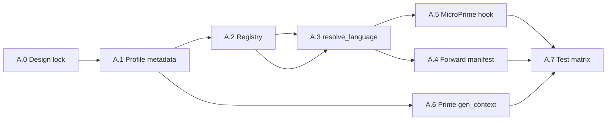

# Implementation plan — Phase A: JavaScript host + dialect abstraction (REQ-JSF-001 … 010)

**Status:** Draft (synced to parent REQ **v0.2** — profile-first routing, `ForwardFileSpec.language` as override)  
**Parent requirements:** [REQ_JS_HOST_FRAMEWORKS_AND_VUE.md](REQ_JS_HOST_FRAMEWORKS_AND_VUE.md) — Part A only  
**Out of scope for Phase A:** Vue `LanguageProfile`, SFC extraction, Vue MicroPrime path (Part B/C). Phase A MAY use **stubs or feature flags** so Part B registers `.vue` without further registry surgery.

---

## 1. Objectives

| ID | Objective |
|----|-----------|
| O-1 | **Single conceptual model**: one JS **host**, multiple **dialects**; plain Node is dialect 0 (REQ-JSF-001, REQ-JSF-002). |
| O-2 | **Zero regression** for existing `nodejs` manifests, seeds, and tests (REQ-JSF-003). |
| O-3 | **Deterministic discovery** and **unique** extension → owning dialect/language mapping (REQ-JSF-004, REQ-JSF-005). |
| O-4 | **`resolve_language`** (and context inference) are **dialect-aware** and ready for `.vue`-only features without Python fallback (REQ-JSF-006) — *behavior proven with a temporary test dialect or mocked `vue` stub if `.vue` is not registered until Part B*. |
| O-5 | **`ForwardFileSpec.language`** threads through resolution / MicroPrime as the override (REQ-JSF-007); no new manifest fields unless proven necessary. |
| O-6 | **MicroPrime** receives **`LanguageProfile`** (+ host/dialect metadata) for routing; avoid a second parallel parser-id dimension on day one (REQ-JSF-008). |
| O-7 | **Prime Contractor** `gen_context` exposes stable `language_id` plus `js_host_id` / `js_dialect_id` where applicable (REQ-JSF-009). |
| O-8 | **Test matrix** for registry order, uniqueness, mixed batches, backward compatibility (REQ-JSF-010). |

---

## 2. Guiding design choices (decide in A.0, document in ADR snippet)

Pick **one** primary pattern and stick to it for Phase A (minimize churn before Part B):

| Option | Description | Tradeoff |
|--------|-------------|----------|
| **A (recommended)** | Extend `LanguageProfile` with **optional** read-only properties: `js_host_id: Optional[str]`, `js_dialect_id: Optional[str]`. Plain Node profile returns e.g. `javascript_node`, `plain`. Future `vue` returns same host, `vue_sfc`. | Small surface change; no new top-level registry type. |
| **B** | Introduce `JavaScriptDialectRegistry` separate from `LanguageRegistry`; `resolve_language` consults both. | More moving parts; clearer separation. |

**Deliverable A.0:** One short subsection in this plan (or `docs/design/languages/ADR_JS_HOST_OPTION.md`) stating the chosen option and migration rule for third-party language entry points.

---

## 3. Work breakdown

### Milestone A.0 — Design lock (0.5–1 day)

| Task | Description | Output |
|------|-------------|--------|
| A.0.1 | Confirm Option A vs B with team; document canonical IDs (`javascript_node` / `plain` / future `vue_sfc`). | ADR snippet or section §2 filled in |
| A.0.2 | List call sites of `resolve_language`, `LanguageRegistry.get_extension_map`, `_is_non_python_file`, `_language_id_from_path`, `ForwardFileSpec`, **`detect_language`** (`micro_prime/lang_detect.py`). | Checklist in PR description |

---

### Milestone A.1 — Host + dialect metadata on profiles (REQ-JSF-001, 002, 003)

| Task | Description | Primary files |
|------|-------------|---------------|
| A.1.1 | Add optional protocol fields (or base mixin) for `js_host_id` / `js_dialect_id`; default `None` for non-JS languages. | `src/startd8/languages/protocol.py` |
| A.1.2 | Implement on `NodeLanguageProfile`: host = `javascript_node` (or chosen name), dialect = `plain`. | `src/startd8/languages/nodejs.py` |
| A.1.3 | **Prefer deferring** a new `javascript_host.py` until Vue lands: if duplication is still trivial, keep shared strings as **module-level constants** imported by Node (and later Vue). **Promote** to `javascript_host.py` only when the second dialect copies the same block twice. | `nodejs.py` (+ optional new file) |
| A.1.4 | Run full existing language / prime / micro_prime tests; fix any import cycles. | CI |

**Exit:** All non-JS profiles unchanged; `nodejs` reports non-`None` host/dialect in a unit test.

---

### Milestone A.2 — Registry: uniqueness + load order (REQ-JSF-004, 005)

| Task | Description | Primary files |
|------|-------------|---------------|
| A.2.1 | When building extension map, **assert** each extension maps to exactly one `language_id` (dev-time or `LanguageRegistry.discover()` warning → hard error in tests). | `src/startd8/languages/registry.py` |
| A.2.2 | Document **deterministic** registration order: built-ins first (`python`, `go`, …, `nodejs`), then entry points sorted by entry name or distribution name. | `CLAUDE.md`, `registry.py` docstring |
| A.2.3 | Ensure `package.json` / lockfiles remain **host-level** hints only (no dialect flip without source extension) — audit `resolution.py` `_infer_language_from_context` and build_map usage. | `src/startd8/languages/resolution.py` |

**Exit:** New unit test: registering two profiles claiming `.ts` fails or last-writer is explicitly disallowed.

---

### Milestone A.3 — `resolve_language` + context inference (REQ-JSF-006)

| Task | Description | Primary files |
|------|-------------|---------------|
| A.3.1 | Extend counting logic so **dialect-specific** extensions (when Part B adds `.vue`) participate in `Counter` without falling through to empty → Python. For Phase A, add **internal test profile** or `pytest` `conftest` fake dialect with `.vuetest` to prove algorithm without shipping Vue. | `resolution.py`, `tests/unit/languages/` |
| A.3.2 | Update `_infer_language_from_context` to consider **all** dialect extensions in `ext_map` (already generic once `.vue` is in map); add tests: neutral file + only `.vue` neighbors → future vue `language_id`. | `resolution.py`, tests |
| A.3.3 | Optional: return type extended to `tuple[LanguageProfile, ResolutionMeta]` **or** attach `resolution_meta` on a thread-local / wrapper — **prefer** minimal change: keep `LanguageProfile` return, encode dialect on profile (A.1). | `resolution.py` |
| A.3.4 | When introducing a **stub dialect** for tests (or `.vue` in Part B), update **`detect_language`** / `Language` typing in `lang_detect.py` so registry-backed IDs are not stuck as `unknown` (REQ-JSF-006 consistency). | `micro_prime/lang_detect.py` |

**Exit:** Test file proving “only unknown extension X with registered profile Y resolves to Y, not python.”

---

### Milestone A.4 — Forward manifest overrides (REQ-JSF-007)

| Task | Description | Primary files |
|------|-------------|---------------|
| A.4.1 | **Use existing `ForwardFileSpec.language`** (FR-DFA-009). Document allowed values aligned with `language_id`. **Do not** add `language_hint` / `js_dialect_hint` unless `language` proves insufficient after one iteration. | `forward_manifest.py` docstrings; emitter docs |
| A.4.2 | Thread `file_spec.language` into **`resolve_language`** (batch aggregation honors per-path override) and any seed/manifest consumers that currently ignore it. Optional `file_hints: dict[path, str]` only if frozen specs cannot carry language for a path. | `resolution.py`, plan-ingestion emitters |
| A.4.3 | Unit tests: `language="vue"` (or stub dialect) forces profile even when extension alone would be ambiguous. | `tests/unit/` |

**Exit:** REQ-JSF-007 satisfied without Pydantic schema churn.

---

### Milestone A.5 — MicroPrime routing API (REQ-JSF-008)

| Task | Description | Primary files |
|------|-------------|---------------|
| A.5.1 | Pass **`LanguageProfile`** (already available in several pipelines) into `MicroPrimeEngine` / `_get_microprime_extensions` / prime_adapter branches so **dialect** (`js_dialect_id` or `language_id`) can select behavior **without** a parallel `get_parser_id` API until two parsers per `language_id` exist. | `engine.py`, `prime_adapter.py` |
| A.5.2 | For Phase A, **`nodejs` behavior identical** to pre-Phase-A. Optional: internal helper `parser_kind(profile) -> str` **derived from** profile fields only if it reduces branching clutter. | `micro_prime/` |
| A.5.3 | Document Part B hook: Vue path = `language_id == "vue"` or `js_dialect_id == vue_sfc` + SFC module. | Comment + REQ cross-link |

**Exit:** Single integration test: engine receives `nodejs` profile with dialect `plain` and takes same code path as today.

---

### Milestone A.6 — Prime Contractor `gen_context` (REQ-JSF-009)

| Task | Description | Primary files |
|------|-------------|---------------|
| A.6.1 | After `resolve_language`, set `gen_context["js_host_id"]` and `gen_context["js_dialect_id"]` from profile properties when non-`None`. | `src/startd8/contractors/prime_contractor.py` |
| A.6.2 | Ensure prompt builders / YAML templates ignore unknown keys safely (no format explosions). | Prompt pipeline files |
| A.6.3 | Unit test: `gen_context` keys present for `nodejs`, absent or `None` for `python`. | `tests/unit/` |

**Exit:** REQ-JSF-009 satisfied; downstream Part B can branch on `js_dialect_id == "vue_sfc"`.

---

### Milestone A.7 — Tests and fixtures (REQ-JSF-010)

| Task | Description |
|------|-------------|
| A.7.1 | **Registry:** load order snapshot test (golden list of `language_id` order). |
| A.7.2 | **Uniqueness:** duplicate extension registration raises or fails CI suite. |
| A.7.3 | **resolve_language:** matrix — Node-only batch; mixed `.js`/`.ts`; neutral + sibling; **stub** second JS dialect if `.vue` not yet registered. |
| A.7.4 | **Regression:** run existing `tests/unit` for `languages`, `micro_prime`, `prime_contractor` related to Node. |

---

## 4. Sequencing and dependencies

**Parallelism:** After A.2, **A.4** (manifest) and **A.5** (MicroPrime) can proceed in parallel with **A.6** (Prime) once A.1 is done. **A.7** closes the phase.

---

## 5. Success criteria (Phase A complete when)

- [ ] ADR / §2 records host + dialect ID scheme and registry option (A vs B).  
- [ ] `NodeLanguageProfile` exposes host + dialect; shared host module exists where agreed.  
- [ ] Extension map uniqueness enforced; discovery order documented.  
- [ ] `resolve_language` tests prove no Python default for a batch that only contains a **registered** second-dialect extension (stub acceptable).  
- [ ] `ForwardFileSpec` carries optional hint; at least one unit test forces resolution.  
- [ ] MicroPrime has explicit dialect/parser hook; `nodejs` unchanged.  
- [ ] `gen_context` includes `js_host_id` / `js_dialect_id` for JS profiles.  
- [ ] CI green on full relevant test slice; no change required for existing consumer repos using `nodejs` only.

---

## 6. Risks and mitigations

| Risk | Mitigation |
|------|------------|
| Protocol change breaks third-party `LanguageProfile` plugins | All new fields **optional** with defaults; runtime_checkable relaxed. |
| `resolve_language` API signature churn | Prefer profile properties over tuple return. |
| Scope creep into Vue parsing | Phase A closes with **stub dialect** or `.vuetest` in tests only; **no** `.vue` in production registry until Part B. |
| Performance regression counting files | Keep O(n) over `target_files`; no repeated disk walks beyond current behavior. |

---

## 7. Follow-on (not Phase A)

- **Part B:** [PLAN_PHASE_B_VUE_BASIC.md](PLAN_PHASE_B_VUE_BASIC.md) — Vue profile, extraction, dialect-routed MicroPrime, basic validation, fixture.  
- **Part C:** [PLAN_PHASE_C_VUE_PARITY.md](PLAN_PHASE_C_VUE_PARITY.md) — REQ-VUE-P-001 … P-016 parity and deprecation of Part B MVP shortcuts.  
- Update [REQ_JS_HOST_FRAMEWORKS_AND_VUE.md](REQ_JS_HOST_FRAMEWORKS_AND_VUE.md) status from Draft → **Phase A complete** with link to this plan’s merge commit.

---

*Estimated calendar time: ~1 week engineering for one developer, assuming Option A and no major Prime refactor.*
