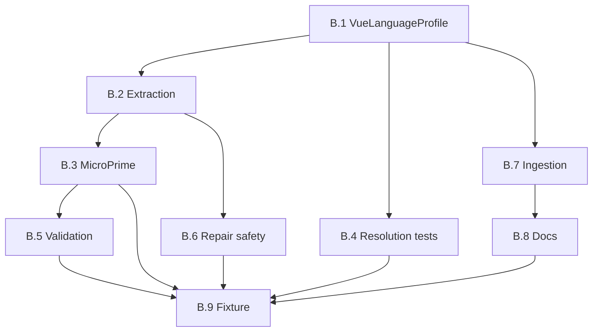

# Implementation plan — Phase B: Vue basic (REQ-VUE-B-001 … B-009)

**Status:** Draft (synced to parent REQ **v0.2**)  
**Parent requirements:** [REQ_JS_HOST_FRAMEWORKS_AND_VUE.md](REQ_JS_HOST_FRAMEWORKS_AND_VUE.md) — Part B  
**Prerequisite:** [PLAN_PHASE_A_JS_HOST_ABSTRACTION.md](PLAN_PHASE_A_JS_HOST_ABSTRACTION.md) complete (REQ-JSF-001 … 010).

---

## 1. Objectives

| ID | Objective |
|----|-----------|
| O-B-1 | Ship **`VueLanguageProfile`** with **`language_id` `vue`**, `.vue` on the extension map, and **`js_host_id` / `js_dialect_id`** aligned with Node (REQ-VUE-B-001). |
| O-B-2 | Deliver **SFC script extraction** (`<script setup>` / `<script>`, `lang="ts"`) as the logical edit unit (REQ-VUE-B-002). |
| O-B-3 | Wire **MicroPrime** through Phase A **dialect routing** for `vue_sfc` without corrupting template/style (REQ-VUE-B-003). |
| O-B-4 | Lock in **Vue-only resolution** regression tests (REQ-VUE-B-004; normative behavior remains REQ-JSF-006). |
| O-B-5 | Provide **basic validation** or an explicit **`None` + gap** path toward Part C (REQ-VUE-B-005). |
| O-B-6 | **Repair** never runs Python AST / whole-file TS validation on raw SFC (REQ-VUE-B-006). |
| O-B-7 | **Plan ingestion** surfaces `vue` and sets **`ForwardFileSpec.language="vue"`** on `.vue` paths (REQ-VUE-B-007 / REQ-JSF-007). |
| O-B-8 | **Documentation** + **acceptance fixture** (REQ-VUE-B-008, B-009). |

---

## 2. Milestones and tasks

### Milestone B.1 — `VueLanguageProfile` + registry (REQ-VUE-B-001)

| Task | Description | Primary files |
|------|-------------|---------------|
| B.1.1 | Add `VueLanguageProfile` (new module or `languages/vue.py`) implementing `LanguageProfile`; register in built-ins / entry points per existing pattern. | `languages/`, `registry.py` |
| B.1.2 | Set `js_host_id` identical to `NodeLanguageProfile`; `js_dialect_id = vue_sfc` (canonical strings from Phase A ADR). | `vue.py`, `nodejs.py` (reference) |
| B.1.3 | Compose `coding_standards` / role text: reuse **shared constants** from Node module (or `javascript_host.py` if Phase A promoted it) + SFC-specific supplements. | `vue.py`, `nodejs.py` |
| B.1.4 | Unit test: extension map contains `.vue` → `vue`; uniqueness with `nodejs` preserved. | `tests/unit/languages/` |

**Exit:** REQ-VUE-B-001 acceptance met.

---

### Milestone B.2 — SFC extraction (REQ-VUE-B-002)

**Single module:** Prefer **`src/startd8/languages/vue_sfc.py`** (or one agreed path) owning **extract + re-inject** so MicroPrime does not scatter ad-hoc string surgery.

| Task | Description | Primary files |
|------|-------------|---------------|
| B.2.1 | Implement `extract_vue_script(source: str) -> ExtractResult` (block text, offset metadata, `lang`). | `languages/vue_sfc.py` |
| B.2.2 | Define precedence for multiple `<script>` blocks; document in module docstring. | Same |
| B.2.3 | Stub **`reinject_vue_script(...)`** API (even if MVP delegates to simple replace) **in the same module** for B.3. | Same |
| B.2.4 | Unit tests: `setup`, default `lang`, `lang="ts"`, edge cases (empty script, no script). | `tests/unit/` |

**Exit:** REQ-VUE-B-002; module consumed by B.3.

---

### Milestone B.3 — MicroPrime dialect path (REQ-VUE-B-003)

| Task | Description | Primary files |
|------|-------------|---------------|
| B.3.1 | Route `js_dialect_id == vue_sfc` to Vue pipeline: load SFC → extract script → existing or wrapped `nodejs_parser` on script text. | `engine.py`, `prime_adapter.py` |
| B.3.2 | Implement **re-splice** minimal path via **`vue_sfc.reinject_*`** (B.2.3); engine only orchestrates. | `languages/vue_sfc.py`, callers |
| B.3.3 | If MVP uses **full-file LLM fallback**, gate with env/flag, log once, reference REQ-VUE-P-016. | Config + logs |
| B.3.4 | Integration test: round-trip one element on fixture SFC. | `tests/unit/` or `tests/integration/` |

**Exit:** REQ-VUE-B-003.

---

### Milestone B.4 — Resolution regression tests (REQ-VUE-B-004)

| Task | Description | Primary files |
|------|-------------|---------------|
| B.4.1 | Tests: `.vue`-only `target_files` → `vue` profile. | `tests/unit/languages/test_resolution.py` (or new) |
| B.4.2 | Tests: `.vue` + `.ts` tie-break policy documented + asserted. | Same |
| B.4.3 | Tests: neutral file + `.vue` siblings → inferred `vue`. | Same |

**Exit:** REQ-VUE-B-004.

---

### Milestone B.5 — Basic validation (REQ-VUE-B-005)

| Task | Description | Primary files |
|------|-------------|---------------|
| B.5.1 | Choose `vue-tsc` or `eslint`+vue plugin; wire `syntax_check_command` or document `None` + gap link to REQ-VUE-P-005. | `vue.py` |
| B.5.2 | CI doc snippet for optional tools. | `CLAUDE.md` or `docs/design/languages/` |

**Exit:** REQ-VUE-B-005.

---

### Milestone B.6 — Repair safety (REQ-VUE-B-006)

| Task | Description | Primary files |
|------|-------------|---------------|
| B.6.1 | Audit repair steps for file-path language detection; branch `language_id == "vue"` → script-only or skip. | `repair/` |
| B.6.2 | Unit test: `.vue` path does not trigger `ast.parse` on whole file. | `tests/unit/repair/` |

**Exit:** REQ-VUE-B-006.

---

### Milestone B.7 — Plan ingestion & hints (REQ-VUE-B-007)

| Task | Description | Primary files |
|------|-------------|---------------|
| B.7.1 | Ensure language summary includes `vue` when `.vue` in task targets. | Plan-ingestion workflow / seed builders |
| B.7.2 | Set **`ForwardFileSpec.language="vue"`** on emitted specs for `.vue` paths (and document colocated-TS ambiguity policy). | `plan_ingestion_emitter.py`, `forward_manifest` builders |

**Exit:** REQ-VUE-B-007; aligns with REQ v0.2 (no parallel hint keys).

---

### Milestone B.8 — Documentation (REQ-VUE-B-008)

| Task | Description |
|------|-------------|
| B.8.1 | User/dev doc: Part B scope, limits on template/style, link to Part C plan. |

**Exit:** REQ-VUE-B-008.

---

### Milestone B.9 — Acceptance fixture (REQ-VUE-B-009)

| Task | Description |
|------|-------------|
| B.9.1 | Add minimal fixture under `tests/fixtures/` or `docs/design/languages/fixtures/vue-basic/`. |
| B.9.2 | Smoke test: register → resolve (B.4) → extract (B.2) → MicroPrime (B.3) → validate per B.5. |

**Exit:** REQ-VUE-B-009.

---

## 3. Sequencing

**Critical path:** B.1 → B.2 → B.3 → B.9. **B.4** can start after B.1. **B.6** after B.2. **B.5** after B.3 if validation needs generated output.

---

## 4. Phase B complete when

- [ ] Phase A checklist satisfied.  
- [ ] REQ-VUE-B-001 … B-009 acceptance criteria met or explicitly deferred with tickets to Part C (only where REQ allows, e.g. B-005 gap).  
- [ ] No regression in Node-only tests.  
- [ ] REQ doc Part B traceability matrix still accurate.

---

## 5. Risks

| Risk | Mitigation |
|------|------------|
| SFC round-trip corrupts templates | Golden-file tests on fixture; minimal diff policy. |
| `nodejs_parser` on script misses Vue macros | Document `defineProps` in Part C P-002; stub in B if needed. |
| Scope creep (Nuxt, CSS preprocessors) | Enforce [REQ doc non-goals](REQ_JS_HOST_FRAMEWORKS_AND_VUE.md#non-goals-this-draft). |

---

## 6. Follow-on

- **Phase C:** [PLAN_PHASE_C_VUE_PARITY.md](PLAN_PHASE_C_VUE_PARITY.md)  
- Update REQ doc status when B merges.

---

*Estimate: ~1.5–2.5 weeks for one engineer after Phase A, depending on splice MVP complexity.*
