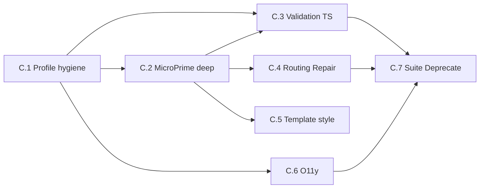

# Implementation plan — Phase C: Vue / Node parity (REQ-VUE-P-001 … P-016)

**Status:** In progress — **C.1**–**C.4** landed (§2 streams C.1–C.4). **C.4** (P-008, P-009): complexity classifier comment + test that ``.vue`` uses full analysis when registered; repair ``route_failures`` treats ``vue`` like ``nodejs``; ``vue_sfc_repair`` projection for JS steps (contamination, dedup, var/const, shebang, eslint phase2, ``js_syntax_validate``); ``RepairConfig`` semantic categories for ``vue``; engine docstring for registry discover. **C.5**+ follow §3 sequencing.  
**Parent requirements:** [REQ_JS_HOST_FRAMEWORKS_AND_VUE.md](REQ_JS_HOST_FRAMEWORKS_AND_VUE.md) — Part C  
**Prerequisites:**

- [PLAN_PHASE_A_JS_HOST_ABSTRACTION.md](PLAN_PHASE_A_JS_HOST_ABSTRACTION.md) — complete  
- [PLAN_PHASE_B_VUE_BASIC.md](PLAN_PHASE_B_VUE_BASIC.md) — complete (see REQ doc **C.0** for minimum Part B deliverables; **recommended** B-007/B-008 before production-scale runs)

---

## 1. Objectives

| ID | Objective |
|----|-----------|
| O-C-1 | **LanguageProfile parity** for Vue vs Node: blast radius, framework imports, cleanup, commands (P-001, P-006, P-007, P-005). |
| O-C-2 | **MicroPrime parity**: parser coverage, splice quality, explicit non-bypass, idempotent extract/splice (P-002, P-003, P-010, P-013). |
| O-C-3 | **TypeScript-in-SFC** rigor matched to Node TS validation, with **no** Part B validation gap (P-004, P-005). |
| O-C-4 | **Complexity routing** and **repair** equivalence vs `nodejs` on comparable tasks (P-008, P-009). |
| O-C-5 | **Template/style** policy implemented or guardrailed (P-011). |
| O-C-6 | **Observability + security** prompts aligned with Node (P-012, P-014). |
| O-C-7 | **Regression suite** + **MVP deprecation** (P-015, P-016). |

---

## 2. Workstreams (map to REQ-VUE-P-*)

### Stream C.1 — Project hygiene & profile completeness

**REQs:** P-001, P-006, P-007, P-014 (partial: coding_standards security notes)

| Milestone | Tasks | Primary areas |
|-----------|-------|----------------|
| **C.1.1** | Implement `blast_radius_extensions` for Vue + colocated `.ts` conventions; document in profile. | `vue.py` |
| **C.1.2** | Expand `framework_imports` for Vue 3 ecosystem (router, pinia, testing). | `vue.py` |
| **C.1.3** | Add `cleanup_patterns` for `dist/`, `.vite/`, etc.; avoid duplicating host-level entries from `javascript_host`. | `vue.py`, host module |
| **C.1.4** | Extend `coding_standards` with XSS / template safety; cross-check Node security parity. | `vue.py`, prompts |

**Exit:** P-001, P-006, P-007, P-014 (standards slice) satisfied.

---

### Stream C.2 — MicroPrime: parser, splice, non-bypass, performance

**REQs:** P-002, P-003, P-010, P-013

| Milestone | Tasks | Primary areas |
|-----------|-------|----------------|
| **C.2.1** | Achieve `nodejs_parser` parity on extracted script for listed constructs; document `defineProps` / compiler macros in/out of scope. | `nodejs_parser.py` reuse, `vue` adapter |
| **C.2.2** | Harden splice in **`languages/vue_sfc.py`** (single module): stable block order, preserve attributes, minimal formatting normalization; golden tests. | `vue_sfc.py` |
| **C.2.3** | Prove **explicit** Vue path in `MicroPrimeCodeGenerator` (no unknown-extension bypass); parity tests vs Node happy path. | `prime_adapter.py`, `engine.py` |
| **C.2.4** | Idempotent extract + element checksum strategy; CRLF/LF tests. | Extractor + engine |

**Exit:** P-002, P-003, P-010, P-013 satisfied.

---

### Stream C.3 — Validation & TypeScript

**REQs:** P-004, P-005

| Milestone | Tasks | Primary areas |
|-----------|-------|----------------|
| **C.3.1** | Ensure `lang="ts"` paths use same rigor as `NodeLanguageProfile` TS validation (temp file or `vue-tsc` project mode). | `vue.py`, validation utils |
| **C.3.2** | Non-`None` `syntax_check_command` / lint; `test_command` parity with Node or documented Vite/vitest default + manifest hinting. | `vue.py`, config |

**Exit:** P-004, P-005 satisfied; **closes** REQ-VUE-B-005 optional gap (syntax + validate paths documented; lint opt-in).

---

### Stream C.4 — Complexity & repair

**REQs:** P-008, P-009

| Milestone | Tasks | Primary areas |
|-----------|-------|----------------|
| **C.4.1** | Align complexity tier thresholds for `.vue` with Node policy (same or documented delta + tests). | `complexity/`, prime config |
| **C.4.2** | For each language-aware repair step touching `.ts`/`.js`, add Vue branch on **extracted script** or Vue-specific step with same violation taxonomy. | `repair/` |
| **C.4.3** | **Opportunistic debt (only if touching same files):** reduce reliance on **`_language_id_from_path`** (`engine.py`) defaulting unknown → `python` — prefer **`LanguageRegistry` / profile** resolution aligned with REQ v0.2 §0.1. | `engine.py`, `repair/` |

**Exit:** P-008, P-009 satisfied (routing + script projection + classifier test + semantic parity).

---

### Stream C.5 — Template & style (optional tier)

**REQs:** P-011

| Milestone | Tasks |
|-----------|-------|
| **C.5.1** | Document support level (LLM-only vs structured). |
| **C.5.2** | Implement guardrails OR sub-block extraction for template/style (choose per product priority). |

**Exit:** P-011 satisfied.

---

### Stream C.6 — Observability

**REQs:** P-012

| Milestone | Tasks |
|-----------|-------|
| **C.6.1** | Audit spans/logs/metrics for `language_id=vue` and `js_dialect_id`; eliminate “unknown”. |

**Exit:** P-012 satisfied.

---

### Stream C.7 — Regression suite & deprecation

**REQs:** P-015, P-016

| Milestone | Tasks |
|-----------|-------|
| **C.7.1** | Expand tests beyond B-009: multi-component, TS SFC, failure injection, repair + prime integration. |
| **C.7.2** | Remove B-003 full-file LLM fallback flags; remove B-005 `None` validation escape hatches; changelog + migration note. |

**Exit:** P-015, P-016 satisfied.

---

## 3. Sequencing

**Suggested order:** **C.1** and **C.2** in parallel after Part B → **C.3** (depends on C.2 for realistic outputs) → **C.4** → **C.6** anytime after C.1 → **C.5** can lag → **C.7** last.

---

## 4. Phase C complete when

- [ ] REQ-VUE-P-001 … P-016 acceptance satisfied.  
- [ ] Part B MVP exceptions removed or promoted per P-016.  
- [ ] Node-only regression suite still green.  
- [ ] REQ doc **C.1** refactoring table still accurate.

---

## 5. Risks

| Risk | Mitigation |
|------|------------|
| `vue-tsc` requires full project context | Document workspace mode or temp `tsconfig` for CI. |
| Repair parity explodes scope | Triage P-009 by matching Node repair **taxonomy** first, behavior second. |
| Template editing security | Ship P-011 guardrails before structured template edits. |

---

## 6. Estimation

*Rough order: 2–4 weeks after Part B for one engineer, highly dependent on P-011 scope and P-009 repair matrix.*

---

*Link parent REQ traceability matrix in [REQ_JS_HOST_FRAMEWORKS_AND_VUE.md](REQ_JS_HOST_FRAMEWORKS_AND_VUE.md#traceability-matrix-summary).*
