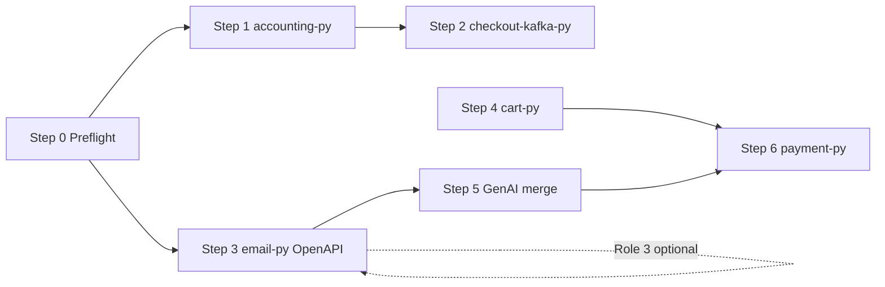

# OTel Demo Python Rebuild (Steps 1–6) — OpenAPI-Leveraged Implementation Plan

**Version:** 0.1 (Pre-planning — paired with Requirements v0.1)
**Date:** 2026-06-19
**Status:** Planned — ready for cap-dev-pipe / CRP
**Requirements:** [OTEL_PYTHON_REBUILD_OPENAPI_REQUIREMENTS.md](./OTEL_PYTHON_REBUILD_OPENAPI_REQUIREMENTS.md)
**Implementation branch:** `feat/otel-python-rebuild-openapi`
**Base branch:** `feat/otel-demo-corpus` (includes OpenAPI Role 1+2 merge `6d9814bd`)

---

## 1. Worktree & branch setup

| Location | Branch | Status at planning | Action |
| --- | --- | --- | --- |
| `~/Documents/dev/startd8-sdk` | `feat/otel-python-rebuild-openapi` | **Created** — docs land here first | Primary implementation clone |
| `~/Documents/dev/startd8-openapi-role1` | `feat/openapi-role3-context` | **Behind** `origin/main` by 6 commits | `git fetch && git merge origin/main` before Role 3 consumer work (Step 3 FR-3.7) |
| `~/Documents/dev/startd8-sdk` | `feat/otel-demo-corpus` | Ahead of origin; uncommitted capability-index artifacts | Merge or rebase rebuild branch back when steps land |

**Recommended:** implement Steps 1–6 on `feat/otel-python-rebuild-openapi`. Merge OpenAPI Role 3
(M1–M2) into this branch before Step 3 consumer hardening if `contexts.yaml` is ready.

```bash
cd ~/Documents/dev/startd8-sdk
git checkout feat/otel-python-rebuild-openapi

# Optional: fresh worktree (after committing branch tip)
# git worktree add ../startd8-otel-python-rebuild feat/otel-python-rebuild-openapi
```

---

## 2. Architecture overview

```
opentelemetry-demo tag 2.2.0 (read-only reference)
        │
        ▼
fixtures/otel-demo/                    seeds / capability resolver
├── accounting-py/      Step 1         kafka + SQLAlchemy
├── checkout-kafka-py/  Step 2         producer fixture (no cell)
├── email-py/           Step 3  ──────▶ schema.prisma + api.yaml
│       │                              startd8 generate backend
│       ├── app/openapi_contract.py    Role 1 OPENAPI_SPEC + ROUTE_MANIFEST
│       ├── clients/http_client.py     Role 1 ApiClient
│       └── user_routers.py            bucket 3 Sinatra port
├── cart-py/            Step 4         gRPC + redis
├── product-reviews/    Step 5         + AskProductAIAssistant
└── payment-py/         Step 6         leaf gRPC → behavioral seed

SDK harness integration
├── scripts/analyze_otel_demo_python_coverage.py  (--fixture-root)
├── scripts/gen_otel_benchmark_seeds.py           (step 5/6 seed flags)
├── docs/design/python-capability-index/          (coverage delta)
└── docs/design/model-benchmark/seeds-otel/       (payment-py seed)
```

**OpenAPI touchpoints by step**

| Step | Role 1 | Role 2 | Role 3 |
| ---: | --- | --- | --- |
| 1 | optional `/health` in contract | — | — |
| 2 | — | — | — |
| 3 | **contract + tests + client** | **`api.yaml` overlay** | `contexts.yaml` checkout→email |
| 4 | — | — | — |
| 5 | optional llm HTTP overlay | summary routes | — |
| 6 | — | — | — |

---

## 3. Implementation steps

### Step 0 — Preflight (0.5 day) → FR-X1–X4

| Task | Output |
| --- | --- |
| Create `fixtures/otel-demo/README.md` with port provenance template | Index doc |
| Add `--fixture-root` to `analyze_otel_demo_python_coverage.py` | Resolver scans fixtures |
| Tighten HTTP pattern match: require HTTP library import OR decorator hit for `PY-OTEL-5.1-HTTP` | Wave 0.2; fixes false `.get(` |
| Commit uncommitted capability-index artifacts on rebuild branch | Clean baseline |

**Tests:** extend `test_python_capability_resolver.py` for import-gated HTTP.

---

### Step 1 — accounting-py (3–5 days) → FR-1.1–FR-1.5

**Reference sources:** `src/accounting/Consumer.cs`, `Entities.cs`, `Program.cs`

| Sub | Work |
| --- | --- |
| 1a | Scaffold `fixtures/otel-demo/accounting-py/` — pyproject, Dockerfile stub, README |
| 1b | Kafka consumer loop — `confluent_kafka.Consumer`, topic `orders`, protobuf decode (`demo_pb2`) |
| 1c | SQLAlchemy models + session — mirror EF entities; env-gated DB (no DB ⇒ skip persist) |
| 1d | OTel traces/metrics hooks (optional counters mirroring C# ActivitySource) |
| 1e | Append kafka/sqlalchemy lines to `derivation-handoff.md` |

**OpenAPI:** optional minimal FastAPI health-only wireframe for `/health` in contract (Role 1 only).

**Acceptance:** resolver shows `PY-OTEL-5.4-MESSAGING` + deepened `PY-OTEL-5.5-DATABASE`; no benchmark cell.

---

### Step 2 — checkout-kafka-py (2–3 days) → FR-2.1–FR-2.4

**Reference sources:** `src/checkout/main.go` (producer), `src/checkout/kafka/`

| Sub | Work |
| --- | --- |
| 2a | `fixtures/otel-demo/checkout-kafka-py/producer.py` — publish OrderResult to `orders` |
| 2b | Span attributes aligned with Go checkout (`messaging.system`, `messaging.destination.name`) |
| 2c | Unit tests with mock producer / recorded payload fixture |
| 2d | Docstring: pattern fixture only (NR-2) |

**OpenAPI:** none.

**Acceptance:** messaging producer signatures in resolver; Tier 1 NR-2 unchanged.

---

### Step 3 — email-py (4–6 days) → FR-3.1–FR-3.7 ★ OpenAPI core

**Reference sources:** `src/email/email_server.rb`

| Sub | Work |
| --- | --- |
| 3a | Wireframe inputs: `assembly-inputs.yaml` with minimal schema + **`api.yaml`** overlay |

```yaml
# fixtures/otel-demo/email-py/api.yaml (sketch)
paths:
  /send_order_confirmation:
    post:
      operationId: sendOrderConfirmation
      requestBody:
        required: true
        content:
          application/json:
            schema:
              $ref: '#/components/schemas/OrderConfirmationRequest'
      responses:
        '200':
          description: Confirmation accepted
components:
  schemas:
    OrderConfirmationRequest:
      type: object
      required: [order]
      properties:
        order:
          type: object
          properties:
            order_id: { type: string }
            email: { type: string }
```

| Sub | Work |
| --- | --- |
| 3b | Run `startd8 generate backend` → `openapi_contract.py`, routers, `test_openapi_contract.py` |
| 3c | Bucket 3: port Sinatra handler — flagd, `app.confirmation.counter`, trace attrs on order id |
| 3d | `startd8 generate backend --check --gate` on fixture |
| 3e | Generate/export client; add `tests/integration/test_email_client.py` using ApiClient |
| 3f | Update locust fixture OR locust snippet to call ApiClient (Wave 0.3) |
| 3g | (When Role 3 ready) `contexts.yaml`: producer checkout HTTP/gRPC + consumer email |

**Files touched (SDK):**
- `fixtures/otel-demo/email-py/*` (new)
- `tests/unit/backend_codegen/` — regression unchanged
- `scripts/python_capability_resolver.py` — HTTP import gate (Step 0)
- optional `docs/design/deterministic-openapi/` — cross-link OTel email as Role 2 exemplar

**Acceptance:** A2, A3; HTTP pattern detected via `fastapi`/`starlette`; no false-positive-only `.get(`.

---

### Step 4 — cart-py (4–5 days) → FR-4.1–FR-4.4

**Reference sources:** `src/cart/src/services/CartService.cs`, `ValkeyCartStore.cs`

| Sub | Work |
| --- | --- |
| 4a | gRPC `CartService` servicer — AddItem, GetCart, EmptyCart |
| 4b | Redis/Valkey store class — connect, get/set cart JSON |
| 4c | Flagd integration (cart uses flags in demo) |
| 4d | Draft `seed-cart-py.json` spec (structural-only); do not replace C# seed without explicit flag |

**OpenAPI:** none on critical path (gRPC).

**Acceptance:** `PY-OTEL-5.5` redis import hits; RPC depth score ≥ recommendation server.

---

### Step 5 — llm → product-reviews merge (2–4 days) → FR-5.1–FR-5.4

**Reference sources:** `src/llm/app.py`, `src/product-reviews/product_reviews_server.py`

| Sub | Work |
| --- | --- |
| 5a | Add `AskProductAIAssistant` RPC handler to product-reviews fixture |
| 5b | Share summary JSON + flagd logic from llm |
| 5c | `gen_otel_benchmark_seeds.py --include-genai-rpc` (default off) |
| 5d | Optional: sibling `llm-py/` with `api.yaml` for Flask routes as OpenAPI exemplar |

**Acceptance:** GenAI pattern depth; seed flag documented in `contamination-otel.md`.

---

### Step 6 — payment-py (3–5 days) → FR-6.1–FR-6.5

**Reference sources:** `src/payment/charge.js`, `src/payment/index.js`

| Sub | Work |
| --- | --- |
| 6a | Python grpcio `PaymentService.Charge` — leaf server |
| 6b | FlagdProvider equivalent — `@openfeature/flagd-provider` behavior in Python |
| 6c | New seed `seed-payment-py.json` targeting fixture; `behavioral_eligible: true` |
| 6d | Wire `charge_suite.py` to Python startup block in `startup-capture.json` or fixture-local startup |
| 6e | Matrix dry-run: one cell Track-2 functional term non-degraded |

**OpenAPI:** none (gRPC proto path).

**Acceptance:** A5 — first behavioral Python OTel seed.

---

## 4. Sequencing & dependencies



| Phase | Steps | Calendar | Milestone |
| --- | --- | --- | --- |
| **M0** | 0 | 0.5 d | Resolver + fixture root |
| **M1** | 1, 2 | 1 w | Messaging index closed |
| **M2** | 3 | 1 w | OpenAPI exemplar + HTTP depth |
| **M3** | 4, 5 | 1 w | Redis + GenAI |
| **M4** | 6 | 1 w | Behavioral Python seed |

Total **~4–5 weeks** serial; Steps 1 and 3 can parallelize after M0.

---

## 5. Prime Contractor & Plan Ingestion wiring

### Prime Contractor (cap-dev-pipe)

| Step | Seed / task impact |
| --- | --- |
| 3 | New HTTP fixture task optional (`OTEL-EMAIL-PY`) — structural; uses OpenAPI overlay in requirements |
| 5 | Extended product-reviews task with optional GenAI RPC |
| 6 | **`OTEL-PAYMENT-PY`** — behavioral-eligible; prioritize in pilot matrix |

Pass order: DATA MODEL (fixture `schema.prisma` / proto) → deterministic generate (Step 3) →
integration pass (handlers) → RETROSPECTIVE (capability delta).

### Plan Ingestion

| Step | Query Prime / enrichment |
| --- | --- |
| 1 | Kafka + SQLAlchemy import patterns → handoff JSON |
| 3 | FastAPI route paths from `ROUTE_MANIFEST` → HTTP query tier hints |
| 4 | Redis client patterns |
| 6 | gRPC handler patterns (existing proto tier) |

---

## 6. Validation matrix

| Check | When | Command |
| --- | --- | --- |
| Capability delta | Each step | `python3 scripts/analyze_otel_demo_python_coverage.py --fixture-root fixtures/otel-demo` |
| OpenAPI drift | Step 3 | `startd8 generate backend --check --gate` in email-py |
| Resolver unit | Step 0, 3 | `pytest tests/unit/test_python_capability_resolver.py` |
| Seed drift | 5, 6 | `python3 scripts/gen_otel_benchmark_seeds.py --check` |
| Contamination | 6 | firewall probe on payment-py seed text |
| Behavioral | 6 | matrix dry-run on payment-py cell |

---

## 7. Risks

| Risk | Mitigation |
| --- | --- |
| Role 3 not merged before Step 3 consumer hash | Step 3 ships with Role 1 client; Role 3 is upgrade |
| Kafka fixtures tempt benchmark cell scope creep | NR-2 in requirements; code review checklist |
| email-py Prisma spine awkward for single route | Minimal DTO schema; validation-only overlay mode |
| payment behavioral fails sandbox | Reuse charge_suite ground truth; leaf-only deps |
| Fixture drift from upstream demo | Pin tag 2.2.0; provenance block in each README |

---

## 8. Deliverables checklist

- [ ] `OTEL_PYTHON_REBUILD_OPENAPI_REQUIREMENTS.md` (this pair)
- [ ] `OTEL_PYTHON_REBUILD_OPENAPI_PLAN.md`
- [ ] `fixtures/otel-demo/{accounting,checkout-kafka,email,cart,payment}-py/`
- [ ] Step 3: committed `api.yaml` + generated contract module
- [ ] Updated `otel-demo-python-coverage.json` showing ≥65% after M3
- [ ] `seed-payment-py.json` + `gen_otel_benchmark_seeds.py` flag for GenAI
- [ ] CRP prompt R1 (optional next artifact)

---

*OpenAPI Role 1+2 review sourced from merge commits `c2b65f4`..`1b9169f` on `feat/otel-demo-corpus`. Role 3 status from `startd8-openapi-role1` worktree.*
