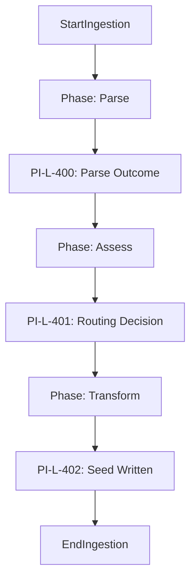

# Plan Ingestion Logging — Requirements

> **Version:** 1.0.0
> **Status:** DRAFT (Mirroring Artisan Logging Standards)
> **Date:** 2026-02-27
> **Scope:** Structured logging requirements for the `PlanIngestionWorkflow` — specifically for plan parsing, complexity assessment, routing decisions, and result caching/forwarding.
> **Complements:** `PLAN_INGESTION_OTEL_FULL_DEPTH_TRACING_REQUIREMENTS.md` (traces) — logs provide searchable, Loki-queryable visibility for auditing and diagnostics.

---

## 1. Motivation

The `PlanIngestionWorkflow` is the entry point for all contractor activity. As it scales to support complex project onboarding, logging must:

- **Enable Auditing**: Track which plans were ingested, by whom (correlation), and what routing decisions were made.
- **Support Diagnostics**: Provide visibility into LLM parsing failures and the deterministic fallbacks that follow.
- **Monitor Performance**: Capture timing for heavy operations like feature decomposition and manifest registry lookups.
- **Link to Traces**: Ensure every log carry the `trace_id` to allow seamless navigation from a log entry in Loki to its parent span in Tempo.

---

## 2. Design Principles

| Principle | Source Document | Compliance |
| :--- | :--- | :--- |
| Standard Logger Acquisition | AL-100 / `logging_config.py` | PI-L-100 mandates `get_logger(__name__)` to ensure logs reach the OTel bridge and Loki. |
| Lifecycle Parallelism | Artisan Logging Docs | Phase entry/exit logs must mirror the OTEL span hierarchy (PI-OT-1xx). |
| Descriptive Error Context | `CONTEXT_CORRECTNESS_BY_CONSTRUCTION.md` | PI-L-4xx requires logging specific validation error details (e.g., YAML line numbers). |
| Loki Cardinality Optimization | `LOKI_SETUP_GUIDE.md` | Only stable, low-cardinality fields are used as labels; dynamic data stays in the JSON body. |

---

## 3. Requirements

### Layer 1: Logger Acquisition (PI-L-1xx)

#### PI-L-100: get_logger() Usage

**Status:** implemented  
All code under `src/startd8/workflows/builtin/plan_ingestion_workflow.py` MUST use `from startd8.logging_config import get_logger`.

---

### Layer 2: Phase-Lifecycle Logging (PI-L-2xx)

#### PI-L-200: Phase Entry/Exit

**Status:** planned  
Log at INFO when each major logical phase starts and ends (Parse, Assess, Transform).

**Acceptance criteria:**

1. INFO: `"Starting plan ingestion phase: {phase_name}"`.
2. INFO: `"Completed plan ingestion phase: {phase_name} (success={bool})"`.
3. `extra` includes: `phase`, `workflow_id`.

#### PI-L-201: Sub-workflow Invocations

**Status:** planned  
Log when nested workflows (e.g., `DomainPreflightWorkflow`) are invoked.

---

### Layer 3: Contract and Preflight Logging (PI-L-3xx)

#### PI-L-300: Preflight Results

**Status:** planned  
Log the summary of the plan preflight (Gate 1 equivalent).

**Acceptance criteria:**

1. INFO: `"Plan preflight passed: {task_count} tasks identified"`.
2. WARNING: `"Plan preflight issues found: {issue_summary}"`.

#### PI-L-301: Seed Coverage Advisory

**Status:** planned  
Log when optional context fields (onboarding, manifest) are missing from the plan but handled gracefully.

---

### Layer 4: Operational Logging (PI-L-4xx)

#### PI-L-400: LLM Outcome (Parsing/Assessment)

**Status:** planned  
Log metrics and success status for LLM-based plan parsing.

**Acceptance criteria:**

1. INFO: `"Plan parsing succeeded (cost=${cost_usd}, tokens={tokens})"`.
2. `extra` includes: `cost_usd`, `input_tokens`, `output_tokens`, `model`.

#### PI-L-401: Routing Decision

**Status:** planned  
Log the final routing decision (PRIME vs ARTISAN).

**Acceptance criteria:**

1. INFO: `"Plan routed to {route} (complexity_score={score})"`.
2. `extra` includes: `route`, `score`, `routing_reason`.

#### PI-L-402: Artifact Write Status

**Status:** implemented  
Log when the context seed or enriched seed is written to disk.

---

### Layer 5: Loki Correlation (PI-L-5xx)

#### PI-L-500: Trace-Log Linkage

**Status:** implemented  
Every log emitted by the workflow MUST carry `trace_id` and `span_id` when OTel is active.

---

### Layer 6: Structured Logging Conventions (PI-L-6xx)

#### PI-L-600: Field Naming

**Status:** planned  
Standardized keys for `extra`: `plan_id`, `route`, `task_count`, `feature_count`.

---

### Layer 7: Graceful Degradation (PI-L-7xx)

#### PI-L-700: Telemetry Safety

**Status:** implemented  
If OTel or file-logging handlers fail to initialize, the workflow MUST fall back to console logging and NOT crash.

---

## 4. Log Flow Diagram



---

## 5. Traceability Matrix

| Requirement | Implementation Site |
| :--- | :--- |
| PI-L-100 | `plan_ingestion_workflow.py` imports |
| PI-L-400 | `_heuristic_parse_plan` vs LLM path |
| PI-L-401 | `_heuristic_assess_complexity` |
| PI-L-500 | OTel span context propagation |

---

## 6. Verification

### LogQL Sample

```logql
{job="startd8"} | json | route="ARTISAN" | level="INFO"
```

---

## 7. Related Documents

- `docs/design/artisan/ARTISAN_LOGGING_REQUIREMENTS.md`
- `docs/design/plan-ingestion/PLAN_INGESTION_OTEL_FULL_DEPTH_TRACING_REQUIREMENTS.md`
- `src/startd8/workflows/builtin/plan_ingestion_workflow.py`
