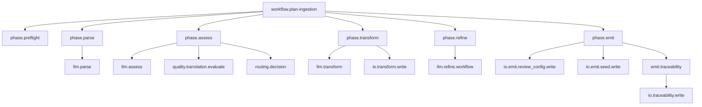

# Plan Ingestion Full-Depth OTel Tracing — Requirements

> **Version:** 1.0.0
> **Status:** Partial baseline implemented (PI-OT-000); Planned (PI-OT-1xx through PI-OT-7xx)
> **Date:** 2026-02-27
> **Scope:** Full-depth OpenTelemetry span instrumentation for `PlanIngestionWorkflow` (`preflight → parse → assess → transform → refine → emit`) including phase spans, per-LLM-call spans, artifact write spans, translation-quality/routing decision spans, and traceability correlation spans
> **Depends on:** `WorkflowBase` FR-400 root span behavior (`workflow.{workflow_id}`), FR-402 project-context attribute enrichment
> **Primary source:** `src/startd8/workflows/builtin/plan_ingestion_workflow.py`

---

## Table of Contents

1. [Motivation](#1-motivation)
2. [Design Principles](#2-design-principles)
3. [Requirements](#3-requirements)
   - [Layer 0: Baseline (PI-OT-000)](#layer-0-baseline-pi-ot-000)
   - [Layer 1: Phase Boundary Spans (PI-OT-1xx)](#layer-1-phase-boundary-spans-pi-ot-1xx)
   - [Layer 2: LLM Call Spans (PI-OT-2xx)](#layer-2-llm-call-spans-pi-ot-2xx)
   - [Layer 3: Artifact I/O Spans (PI-OT-3xx)](#layer-3-artifact-io-spans-pi-ot-3xx)
   - [Layer 4: Quality and Routing Spans (PI-OT-4xx)](#layer-4-quality-and-routing-spans-pi-ot-4xx)
   - [Layer 5: Correlation Metadata (PI-OT-5xx)](#layer-5-correlation-metadata-pi-ot-5xx)
   - [Layer 6: Graceful Degradation (PI-OT-6xx)](#layer-6-graceful-degradation-pi-ot-6xx)
   - [Layer 7: Infrastructure and Dashboards (PI-OT-7xx)](#layer-7-infrastructure-and-dashboards-pi-ot-7xx)
4. [Span Hierarchy](#4-span-hierarchy)
5. [Data Flow Diagram](#5-data-flow-diagram)
6. [Traceability Matrix](#6-traceability-matrix)
7. [Status Dashboard](#7-status-dashboard)
8. [Verification](#8-verification)
9. [Related Documents](#9-related-documents)

---

## 1. Motivation

`PlanIngestionWorkflow` currently has a root `workflow.plan-ingestion` span via `WorkflowBase.run()`/`arun()` (FR-400), but internal operations are opaque: preflight checks, parse/assess/transform LLM calls, refine sub-workflow invocation, seed writes, and traceability emission are not represented as child spans.

This prevents precise answers to operational questions such as:
- Which phase dominates latency and cost?
- Did low-quality routing override fire, and why?
- Which specific LLM call failed (parse/assess/transform/review)?
- How long did seed assembly vs. file I/O vs. review execution take?

Full-depth tracing closes that gap while preserving current behavior when OTel is unavailable.

---

## 2. Design Principles

| Principle | Source | Application |
|-----------|--------|-------------|
| Reuse existing root span contract | `src/startd8/workflows/base.py` (FR-400/FR-402) | Child spans must nest under `workflow.plan-ingestion` with no change to base behavior |
| Single degradation strategy | `artisan_contractor.py` `_NoOpTracer` / `_NoOpSpan` pattern | Span creation in plan ingestion must never fail when OTel is absent |
| Observable routing decisions | `plan_ingestion_workflow.py` (`_evaluate_translation_quality`, assess override logic) | Route bias/fail decisions become queryable span attributes/events |
| Deterministic artifact correlation | `plan_ingestion_workflow.py` (`_phase_emit`, `_write_traceability_artifact`) | Artifact writes emit stable attributes (`path`, `route`, checksum-related fields) |
| No functional regression | Existing parse/assess/transform/refine/emit output contracts | Instrumentation cannot alter routing, outputs, or low-quality policy semantics |

---

## 3. Requirements

### Layer 0: Baseline (PI-OT-000)

#### PI-OT-000: Root Workflow Span Baseline

**Status:** implemented  
**Source:** `src/startd8/workflows/base.py` (`run`, `arun`, `_create_workflow_span`)

The workflow execution MUST remain rooted at `workflow.plan-ingestion`.

**Acceptance criteria:**
1. `PlanIngestionWorkflow.run()` executes within `workflow.plan-ingestion`.
2. Child spans introduced by PI-OT-1xx+ are descendants of the root span.
3. Existing `workflow.success` behavior remains unchanged.

---

### Layer 1: Phase Boundary Spans (PI-OT-1xx)

#### PI-OT-100: Module-Level Tracer With No-Op Fallback

**Status:** planned  
**Source:** `src/startd8/workflows/builtin/plan_ingestion_workflow.py`

Define a dedicated tracer for plan ingestion phase spans with graceful fallback.

**Acceptance criteria:**
1. A module-level tracer is created for plan ingestion (e.g., `startd8.workflow.plan_ingestion`).
2. If OTel imports fail, span creation paths are safe no-ops.
3. No instrumentation path raises due solely to missing OTel packages.

#### PI-OT-101: Preflight Span

**Status:** planned  
**Source:** `_execute`, `_preflight_export_contract`

Wrap PREFLIGHT contract validation in `phase.preflight`.

**Acceptance criteria:**
1. Span includes attributes: `phase.name=preflight`, `preflight.min_export_coverage`.
2. Span records onboarding availability and pass/fail outcome.
3. Preflight errors set span status to ERROR before workflow failure return.

#### PI-OT-102: Parse Phase Span

**Status:** planned  
**Source:** `_execute`, `_phase_parse`

Wrap PARSE phase in `phase.parse`.

**Acceptance criteria:**
1. Span attributes include parsed feature count and parse fallback usage.
2. Parse JSON extraction/validation failures are recorded on the span.
3. Successful parse sets `phase.success=true`.

#### PI-OT-103: Assess Phase Span

**Status:** planned  
**Source:** `_execute`, `_phase_assess`

Wrap ASSESS phase in `phase.assess`.

**Acceptance criteria:**
1. Span attributes include `complexity.composite`, threshold, and selected route.
2. Forced route and low-quality override decisions are captured.
3. Fail-fast policy (`low_quality_policy=fail`) is represented as error status.

#### PI-OT-104: Transform Phase Span

**Status:** planned  
**Source:** `_execute`, `_phase_transform`

Wrap TRANSFORM phase in `phase.transform`.

**Acceptance criteria:**
1. Span includes route (`prime`/`artisan`) and output filename.
2. YAML validation failure (prime route) records exception and ERROR status.
3. Heuristic transform fallback is captured via span attribute/event.

#### PI-OT-105: Refine Phase Span

**Status:** planned  
**Source:** `_execute`, `_phase_refine`

Wrap REFINE phase in `phase.refine`.

**Acceptance criteria:**
1. Span includes configured rounds, rounds completed, and refine cost.
2. `skip_arc_review=true` emits a deterministic skip marker.
3. Review workflow failure is captured without masking returned errors.

#### PI-OT-106: Emit Phase Span

**Status:** planned  
**Source:** `_execute`, `_phase_emit`

Wrap EMIT phase in `phase.emit`.

**Acceptance criteria:**
1. Span includes route, seed emission mode, and output artifact paths.
2. Seed schema validation warnings are attached as span events.
3. Failures during seed construction/write set ERROR status.

#### PI-OT-107: Traceability Emission Span

**Status:** planned  
**Source:** `_execute`, `_build_traceability_artifact`, `_write_traceability_artifact`

Traceability artifact generation must be visible as a child span.

**Acceptance criteria:**
1. Span name `emit.traceability` (or equivalent) is emitted.
2. Attributes include mapping counts and unresolved counts.
3. Output path is attached as span attribute.

---

### Layer 2: LLM Call Spans (PI-OT-2xx)

#### PI-OT-200: Parse LLM Call Span

**Status:** planned  
**Source:** `_phase_parse`

Wrap `agent.generate(prompt)` in parse with `llm.parse`.

**Acceptance criteria:**
1. Span captures `llm.model`, `llm.agent_name`, prompt size, latency.
2. Token/cost attributes are recorded when usage data exists.
3. Exceptions set span status to ERROR and record exception.

#### PI-OT-201: Assess LLM Call Span

**Status:** planned  
**Source:** `_phase_assess`

Wrap assess `agent.generate(prompt)` with `llm.assess`.

**Acceptance criteria:**
1. Same token/cost/latency capture as PI-OT-200.
2. Route disagreement (`llm_route` vs computed route) is captured as span event.
3. JSON parse failures are error-attributed.

#### PI-OT-202: Transform LLM Call Span

**Status:** planned  
**Source:** `_phase_transform`

Wrap transform `agent.generate(prompt)` with `llm.transform`.

**Acceptance criteria:**
1. Span includes route and output format (`yaml`/`markdown`).
2. Invalid transform output (e.g., YAML parse error) is recorded on span.
3. Span closes cleanly on all return paths.

#### PI-OT-203: Refine Workflow Invocation Span

**Status:** planned  
**Source:** `_phase_refine`

Wrap `review_wf.run(review_config)` with `llm.refine.workflow`.

**Acceptance criteria:**
1. Span attributes include `reviewer_count`, `quality_tier`, and `enable_apply`.
2. Success/failure and aggregate review cost are captured.
3. Child relationship to `phase.refine` is preserved.

#### PI-OT-204: LLM Error Semantics Consistency

**Status:** planned  
**Source:** `_phase_parse`, `_phase_assess`, `_phase_transform`, `_phase_refine`

All LLM-span paths must use consistent error recording semantics.

**Acceptance criteria:**
1. On exception: `record_exception(...)` and ERROR status are both set.
2. Error messages in spans and `StepResult.error` are consistent.
3. No swallowed exceptions in tracing paths.

---

### Layer 3: Artifact I/O Spans (PI-OT-3xx)

#### PI-OT-300: Transform Output Write Span

**Status:** planned  
**Source:** `_phase_transform` (`atomic_write`)

Emit `io.transform.write` around transformed doc write.

**Acceptance criteria:**
1. Attributes include `io.path`, `io.bytes`, `route`.
2. Write errors are recorded as span exceptions.
3. Span is emitted for both prime and artisan outputs.

#### PI-OT-301: Review Config Write Span

**Status:** planned  
**Source:** `_phase_emit` (`review-config.json`)

Emit `io.emit.review_config.write` around `atomic_write_json`.

**Acceptance criteria:**
1. Span includes config path and reviewer_count.
2. Write success/failure is attributable in traces.
3. Emission is route-agnostic.

#### PI-OT-302: Context Seed Write Spans

**Status:** planned  
**Source:** `_phase_emit` (`artisan-context-seed.json`, `prime-context-seed.json`)

Emit per-seed write spans.

**Acceptance criteria:**
1. Distinct spans for artisan and prime seed writes.
2. Attributes include route, task count, and context enrichment presence flags.
3. Schema validation advisory warnings are attached to the same span tree.

#### PI-OT-303: State/Report Artifact Spans

**Status:** planned  
**Source:** `_save_state`, `_write_preflight_report`, `_write_traceability_artifact`

Persisted debug/audit artifacts must be traced.

**Acceptance criteria:**
1. State persistence span: `io.state.write`.
2. Preflight report span: `io.preflight_report.write`.
3. Traceability report span: `io.traceability.write`.

---

### Layer 4: Quality and Routing Spans (PI-OT-4xx)

#### PI-OT-400: Translation Quality Evaluation Span

**Status:** planned  
**Source:** `_evaluate_translation_quality`, `_execute`

Emit `quality.translation.evaluate`.

**Acceptance criteria:**
1. Span attributes include requirements/artifact coverage percentages and conflict count.
2. Unmapped requirement/artifact counts are captured.
3. Span is emitted even when no requirements docs are supplied.

#### PI-OT-401: Routing Decision Span

**Status:** planned  
**Source:** `_execute` assess section

Emit `routing.decision`.

**Acceptance criteria:**
1. Attributes include forced route flag, threshold, composite score, final route.
2. Low-quality override emits explicit reason list.
3. Policy path (`bias_artisan` vs `fail`) is queryable.

#### PI-OT-402: Preflight Checksum Verification Span

**Status:** planned  
**Source:** `_preflight_export_contract`

Emit checksum verification details in preflight tracing.

**Acceptance criteria:**
1. Span attributes include expected/actual checksum presence flags.
2. Source checksum verification result is explicitly represented.
3. Mismatch is recorded as ERROR status with descriptive event.

---

### Layer 5: Correlation Metadata (PI-OT-5xx)

#### PI-OT-500: Standard Attribute Contract

**Status:** planned  
**Source:** `plan_ingestion_workflow.py` tracing additions

Define a stable attribute contract for phase and llm spans.

**Acceptance criteria:**
1. Phase spans consistently include `phase.name`, `phase.success`, `phase.duration_ms`.
2. LLM spans include `llm.model`, `llm.input_tokens`, `llm.output_tokens`, `llm.cost_usd`.
3. Route-aware spans include `route.selected` and `route.threshold`.

#### PI-OT-501: Artifact Correlation Attributes

**Status:** planned  
**Source:** `_phase_emit`, `_build_traceability_artifact`

Trace spans must correlate with generated artifact files and seed structure.

**Acceptance criteria:**
1. Spans include artifact paths for plan doc, review config, seed, and traceability report.
2. Traceability span includes mapping/unresolved counters.
3. Seed write spans include `seed.task_count`.

---

### Layer 6: Graceful Degradation (PI-OT-6xx)

#### PI-OT-600: No-OTel Runtime Safety

**Status:** planned  
**Source:** `plan_ingestion_workflow.py` tracing additions

When OTel is unavailable, workflow behavior must remain unchanged.

**Acceptance criteria:**
1. No new ImportError/AttributeError when tracing packages are absent.
2. Output artifacts and step results are identical to non-instrumented behavior.
3. Tracing code paths are side-effect free in no-op mode.

#### PI-OT-601: Span API Safety

**Status:** planned  
**Source:** `plan_ingestion_workflow.py` tracing additions

Span API calls must be safe on both real and no-op spans.

**Acceptance criteria:**
1. `set_attribute`, `set_status`, and `record_exception` never crash execution.
2. No `None` span object dereference on no-op paths.
3. All spans close on every return/exception path.

#### PI-OT-602: Exception Handling Contract

**Status:** planned  
**Source:** `_execute` + all phase methods

Tracing must not alter failure semantics.

**Acceptance criteria:**
1. Existing `_fail(...)` behavior is preserved.
2. Span status reflects errors before returning failed `WorkflowResult`.
3. Tracing never swallows exceptions that current logic surfaces.

---

### Layer 7: Infrastructure and Dashboards (PI-OT-7xx)

#### PI-OT-700: OTel Descriptor Coverage

**Status:** planned  
**Source:** `plan_ingestion_workflow.py`

Expose observability descriptors for plan ingestion span patterns.

**Acceptance criteria:**
1. Descriptor includes root + phase + llm + io span patterns.
2. Attribute lists match PI-OT-500 contract.
3. Descriptor generation has zero runtime overhead.

#### PI-OT-701: Tempo Query Cookbook

**Status:** planned  
**Source:** this document + dashboard config

Provide operational TraceQL queries for ingestion diagnostics.

**Acceptance criteria:**
1. Query for phase latency percentiles per route.
2. Query for top cost LLM spans (`llm.cost_usd`).
3. Query for failed preflight checksum validations.

---

## 4. Span Hierarchy

---

## 5. Data Flow Diagram

```mermaid
flowchart LR
    I["Inputs (plan, context files, onboarding, requirements)"] --> P["Preflight Span"]
    P --> PA["Parse Span + llm.parse"]
    PA --> AS["Assess Span + llm.assess + quality/routing spans"]
    AS --> TR["Transform Span + llm.transform + output write span"]
    TR --> RF["Refine Span + review workflow span"]
    RF --> EM["Emit Span + seed/review-config write spans"]
    EM --> TA["Traceability Build/Write Spans"]
    TA --> O["Outputs (plan doc, review-config, seed, ingestion-traceability)"]
```

---

## 6. Traceability Matrix

| Requirement | Primary Implementation Target | Verification Target |
|-------------|-------------------------------|---------------------|
| PI-OT-000 | `src/startd8/workflows/base.py` | unit tests for `WorkflowBase` span nesting |
| PI-OT-100..107 | `src/startd8/workflows/builtin/plan_ingestion_workflow.py` | new plan-ingestion tracing unit tests |
| PI-OT-200..204 | parse/assess/transform/refine methods | mocked agent call tests with span assertions |
| PI-OT-300..303 | transform/emit helper write paths | artifact write tracing tests |
| PI-OT-400..402 | assess + preflight logic | quality/routing/preflight tracing tests |
| PI-OT-500..501 | shared tracing helper layer | schema/attribute contract tests |
| PI-OT-600..602 | no-OTel + error paths | dependency-missing and exception path tests |
| PI-OT-700..701 | descriptor + docs/dashboard assets | descriptor snapshot + query validation |

---

## 7. Status Dashboard

| Layer | ID Range | Total | Implemented | Planned |
|-------|----------|-------|-------------|---------|
| Baseline | PI-OT-000 | 1 | 1 | 0 |
| Phase Boundaries | PI-OT-100..107 | 8 | 0 | 8 |
| LLM Calls | PI-OT-200..204 | 5 | 0 | 5 |
| Artifact I/O | PI-OT-300..303 | 4 | 0 | 4 |
| Quality/Routing | PI-OT-400..402 | 3 | 0 | 3 |
| Correlation Metadata | PI-OT-500..501 | 2 | 0 | 2 |
| Degradation | PI-OT-600..602 | 3 | 0 | 3 |
| Infra/Dashboard | PI-OT-700..701 | 2 | 0 | 2 |
| **Total** |  | **28** | **1** | **27** |

---

## 8. Verification

Add tracing-focused tests (mocked agents, no external exporters required):

1. `tests/unit/test_plan_ingestion_workflow.py`:
   - phase span emission for parse/assess/transform/refine/emit
   - llm span token/cost attribute capture
   - error status + exception recording on failure paths
2. No-OTel mode tests:
   - simulate missing OTel imports and verify successful workflow completion
3. Artifact span tests:
   - verify spans for `review-config.json`, seed JSON, `ingestion-traceability.json`, and state writes
4. Quality/routing spans:
   - low-quality override vs fail policy coverage
   - checksum mismatch preflight error coverage

---

## 9. Related Documents

- `docs/design/artisan/ARTISAN_OTEL_FULL_DEPTH_TRACING_REQUIREMENTS.md`
- `docs/PLAN_INGESTION_REQUIREMENTS.md`
- `docs/REFINE_FORWARDING_REQUIREMENTS.md`
- `docs/PLAN_INGESTION_IN_PLACE_PROVENANCE_REQUIREMENTS.md`
- `src/startd8/workflows/base.py`
- `src/startd8/workflows/builtin/plan_ingestion_workflow.py`

