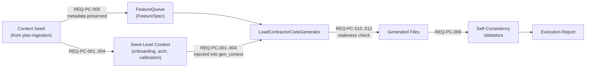

# Prime Contractor Workflow — Functional Requirements

**Version:** 1.0.0
**Created:** 2026-02-20
**Source:** Run 2 post-mortem, Mottainai fix plan (Gaps 9–14), pipeline requirements audit

---

## Overview

This document defines functional requirements for the Prime Contractor workflow. The prime contractor is a code generation route that uses a FeatureQueue → LeadContractorCodeGenerator → PrimeContractorWorkflow pattern, simpler than the artisan's 8-phase workflow but with fewer quality gates.

The Run 2 post-mortem and Mottainai analysis identified that the prime contractor has **worse context propagation** than the artisan — no onboarding injection, no architectural context, no design calibration, and no post-generation validation. These requirements close those gaps.

### Status Dashboard

| Layer | ID Range | Total | Implemented | Planned |
|-------|----------|-------|-------------|---------|
| Context Injection | REQ-PC-001–004 | 4 | 0 | 4 |
| Queue Boundary Integrity | REQ-PC-005–006 | 2 | 0 | 2 |
| Generation Quality | REQ-PC-007–009 | 3 | 0 | 3 |
| Result Caching and Staleness | REQ-PC-010–012 | 3 | 0 | 3 |
| Observability | REQ-PC-013–014 | 2 | 0 | 2 |
| Micro Prime Escalation Reliability | REQ-PC-015–017 | 3 | 0 | 3 |
| **Total** | | **17** | **0** | **17** |

---

## Data Flow

---

## Layer 1: Context Injection (REQ-PC-001–004)

### REQ-PC-001: Onboarding Metadata Injection

**Status:** planned
**Closes:** Mottainai Gap 10
**Source files:** `src/startd8/contractors/prime_contractor.py` (~line 399), `scripts/run_prime_workflow.py`

The prime code generator's `gen_context` MUST include onboarding metadata fields from the context seed.

**Acceptance criteria:**
- `gen_context` MUST include `project_objectives` from onboarding metadata
- `gen_context` MUST include `semantic_conventions` (naming patterns, import conventions)
- If onboarding metadata is absent from the seed, the prime contractor MUST log a warning and continue with an empty context (graceful degradation)
- The injected fields MUST be available to the code generation prompt template

---

### REQ-PC-002: Architectural Context Injection

**Status:** planned
**Closes:** Mottainai Gap 11
**Source files:** `src/startd8/contractors/prime_contractor.py`, `scripts/run_prime_workflow.py`

The prime code generator's `gen_context` MUST include `architectural_context` derived from the plan and manifest.

**Acceptance criteria:**
- `gen_context` MUST include `architectural_context` when present in the seed
- The seed MUST include `architectural_context` for the prime route (requires REQ-PI-003)
- `architectural_context` MUST NOT be null when the artisan route's equivalent is non-null (route parity per REQ-PI-011)

---

### REQ-PC-003: Design Calibration

**Status:** planned
**Closes:** Mottainai Gap 12
**Source files:** `src/startd8/contractors/prime_contractor.py`, `scripts/run_prime_workflow.py`

The prime code generator MUST use `design_calibration` hints for token budgets and generation depth.

**Acceptance criteria:**
- `implement_max_output_tokens` from design calibration MUST be applied to the code generator's token budget
- If design calibration specifies depth hints per artifact type, the prime contractor MUST use them to calibrate generation verbosity
- Missing calibration data MUST fall back to default token budgets (no failure)

---

### REQ-PC-004: Plan Document Context

**Status:** planned
**Closes:** Mottainai Gap 13
**Source files:** `scripts/run_prime_workflow.py`

The prime code generator MUST inject token-bounded plan document text into `gen_context`.

**Acceptance criteria:**
- The plan document MUST be read from `artifacts.plan_document_path` in the seed
- Plan text MUST be bounded to a configurable token limit (default: 4000 tokens) to avoid context overflow
- The injected plan text MUST be feature-specific: extract the section relevant to the current feature, not the entire plan
- If the plan document is not found, log a warning and continue without it

---

## Layer 2: Queue Boundary Integrity (REQ-PC-005–006)

### REQ-PC-005: FeatureSpec Metadata Preservation

**Status:** planned
**Closes:** Mottainai Gap 9
**Source files:** `src/startd8/contractors/queue.py` (~line 39)

`FeatureSpec` MUST preserve enrichment data across the queue boundary.

**Acceptance criteria:**
- `FeatureSpec` dataclass MUST include a `metadata: Dict[str, Any]` field (default: empty dict)
- When `add_features_from_seed` creates FeatureSpec instances, it MUST capture: `_enrichment`, `artifact_types_addressed`, `design_doc_sections`, `estimated_loc` into the metadata dict
- The metadata MUST survive FeatureQueue serialization and deserialization

---

### REQ-PC-006: FeatureSpec Serialization Fidelity

**Status:** planned
**Source files:** `src/startd8/contractors/queue.py`

`FeatureSpec.to_dict()` and `from_dict()` MUST round-trip all metadata fields.

**Acceptance criteria:**
- `to_dict()` MUST include `metadata` in the output dict
- `from_dict()` MUST restore `metadata` from the input dict, defaulting to empty dict if absent
- Round-trip test: `FeatureSpec.from_dict(spec.to_dict()) == spec` for all fields

---

## Layer 3: Generation Quality (REQ-PC-007–009)

### REQ-PC-007: Service Metadata Awareness

**Status:** planned
**Source files:** `src/startd8/contractors/prime_contractor.py`

The prime code generator MUST include `service_metadata` in `gen_context` for protocol-aware code generation.

**Acceptance criteria:**
- When `service_metadata` is present in the seed, it MUST be available in `gen_context`
- The code generation prompt MUST reference service_metadata when generating Dockerfiles or service implementations
- If service_metadata is absent, log a warning (do not fail)

---

### REQ-PC-008: Scope Boundary Enforcement

**Status:** planned
**Defect reference:** DEV-R2-003 (artisan added incomplete OTel to HTTP service)
**Source files:** `src/startd8/contractors/prime_contractor.py`

Generated code MUST NOT introduce libraries, features, or instrumentation patterns not specified in the requirements/plan.

**Acceptance criteria:**
- The code generation prompt MUST include a scope boundary instruction: "Generate only what is specified in the requirements. Do not add libraries, patterns, or features beyond the specification."
- If the generator adds a library not in requirements, it MUST be flagged in the generation log
- Partial implementations (e.g., TracerProvider without exporter) MUST be flagged as incomplete

---

### REQ-PC-009: Post-Generation Validation

**Status:** planned
**Source files:** `src/startd8/contractors/prime_contractor.py`

The prime contractor MUST run self-consistency validators after code generation, equivalent to the artisan's Gate 3b (AR-143 through AR-149).

**Acceptance criteria:**
- After code generation, run:
  - AR-143 equivalent: import/dependency cross-validation
  - AR-144 equivalent: protocol fidelity (requires service_metadata)
  - AR-146 equivalent: placeholder detection
  - AR-147 equivalent: Dockerfile/service coherence
  - AR-148 equivalent: function call parameter completeness
  - AR-149 equivalent: Dockerfile runtime dependency validation
- Validation results MUST be logged with severity (critical/warning/info)
- Validation results MUST be included in the execution report
- Validation is advisory by default; `--strict-validation` flag makes critical issues blocking

---

## Layer 4: Result Caching and Staleness (REQ-PC-010–012)

### REQ-PC-010: Generation Result Caching

**Status:** planned (partially exists)
**Closes:** Mottainai Gap 14
**Source files:** `src/startd8/contractors/prime_contractor.py` (~line 413)

Before generating code, the prime contractor MUST check if the feature's generated files already exist.

**Acceptance criteria:**
- If `feature.generated_files` exist on disk and are non-empty, skip generation
- Log the reuse decision with file paths and sizes
- The `FeatureQueue` state (`generated_files`, `status=GENERATED`) MUST be respected

---

### REQ-PC-011: Staleness Detection

**Status:** planned
**Source files:** `src/startd8/contractors/prime_contractor.py`

Cached files MUST be validated against the current workflow's provenance before reuse.

**Acceptance criteria:**
- Before reusing a cached file, compare its provenance against the current run:
  - Read `generation-manifest.json` from the output directory (if present)
  - Compare `source_checksum` and `workflow_id` from the manifest against the current seed
- If provenance matches: reuse (log as "current")
- If provenance mismatches: regenerate (log as "stale")
- If no manifest exists: treat as unknown provenance, warn and regenerate
- This prevents the Run 2 problem where 11 Prime files were reused by the artisan run

---

### REQ-PC-012: Force Regeneration

**Status:** planned
**Source files:** `scripts/run_prime_workflow.py`

A `--force-regenerate` flag MUST bypass the cache and regenerate all files.

**Acceptance criteria:**
- When `--force-regenerate` is set, skip all caching checks (REQ-PC-010, REQ-PC-011)
- Delete pre-existing generated files before regeneration
- Document the distinction: `--all` = "all tasks" (no filter), `--force-regenerate` = "overwrite existing"

---

## Layer 5: Observability (REQ-PC-013–014)

### REQ-PC-013: Cost Reporting

**Status:** planned
**Source files:** `src/startd8/contractors/prime_contractor.py`

Per-feature generation cost MUST be tracked and reported.

**Acceptance criteria:**
- Each feature's generation cost (USD) MUST be recorded in the execution report
- Total cost across all features MUST be summarized
- Cost MUST include both generation and validation passes

---

### REQ-PC-014: Context Injection Logging

**Status:** planned
**Source files:** `src/startd8/contractors/prime_contractor.py`

The prime contractor MUST log which onboarding fields were injected and which were missing.

**Acceptance criteria:**
- At generation start, log: "Injected X/Y context fields: [list of present fields]"
- For each missing field, log: "Missing context field: {field_name} — using default"
- Log format MUST be consistent with artisan's `DESIGN: forwarded X/6 onboarding inventory fields into context`

---

## Layer 6: Micro Prime Escalation Reliability (REQ-PC-015–017)

These requirements apply only when `enable_micro_prime()` is active and the Prime workflow routes generation through `MicroPrimeCodeGenerator`.

### REQ-PC-015: Configurable Cloud Escalation Retries

**Status:** planned
**Source files:** `src/startd8/micro_prime/prime_adapter.py`, `src/startd8/micro_prime/models.py`

When an element is escalated to cloud generation (element-level escalation), the system SHALL retry the direct cloud generation call up to a configurable maximum.

**Acceptance criteria:**
- A new Micro Prime configuration value `cloud_escalation_max_attempts` MUST control the maximum attempts (default: 1).
- Retries are per element and only trigger on: empty response, code extraction failure, or splice failure.
- Retries MUST NOT re-run local Ollama generation or decomposition for the same element.
- If all attempts fail, the element remains escalated and the workflow continues (no crash).

### REQ-PC-016: Cache-Friendly Retry Strategy

**Status:** planned
**Source files:** `src/startd8/micro_prime/prime_adapter.py`, `src/startd8/micro_prime/models.py`

Retry behavior SHALL support a cache-friendly prompt strategy while allowing error-informed retries when requested.

**Acceptance criteria:**
- A new configuration value `cloud_escalation_retry_strategy` MUST support at least:
  - `same_prompt` (default): prompt and system prompt are byte-for-byte identical across attempts.
  - `append_error`: a bounded failure summary and attempt number are appended for attempts >= 2.
- If `same_prompt` is selected, no attempt-specific tokens are added that would defeat provider caching.
- If `append_error` is selected, the added retry context MUST be capped to a fixed character budget (default: 512 chars) to avoid prompt bloat.

### REQ-PC-017: Retry Telemetry and Repair Sequencing

**Status:** planned
**Source files:** `src/startd8/micro_prime/prime_adapter.py`, `src/startd8/micro_prime/models.py`

The system SHALL record retry outcomes and ensure post-generation repair runs after the final splice.

**Acceptance criteria:**
- Per-element metadata MUST include: `cloud_retry_attempts`, `cloud_retry_success`, `cloud_retry_strategy`, and `cloud_retry_last_error` (if any).
- `element_escalation_count` and cost accounting MUST reflect only successful cloud attempts.
- Post-generation file repair (`_run_post_generation_repair`) MUST run once after the final retry/splice pass, not after each attempt.

## Traceability Matrix

### Requirement → Source File

| Requirement | Primary Source File | Secondary Files |
|-------------|-------------------|-----------------|
| REQ-PC-001..004 | `src/startd8/contractors/prime_contractor.py` | `scripts/run_prime_workflow.py` |
| REQ-PC-005..006 | `src/startd8/contractors/queue.py` | |
| REQ-PC-007..009 | `src/startd8/contractors/prime_contractor.py` | `artisan_phases/self_consistency.py` (shared validators) |
| REQ-PC-010..012 | `src/startd8/contractors/prime_contractor.py` | `scripts/run_prime_workflow.py` |
| REQ-PC-013..014 | `src/startd8/contractors/prime_contractor.py` | |
| REQ-PC-015..017 | `src/startd8/micro_prime/prime_adapter.py` | `src/startd8/micro_prime/models.py` |

### Requirement → Mottainai Gap

| Requirement | Mottainai Gap | Description |
|-------------|---------------|-------------|
| REQ-PC-001 | G10 | Onboarding not in prime gen_context |
| REQ-PC-002 | G11 | Architectural context null for prime |
| REQ-PC-003 | G12 | Design calibration null for prime |
| REQ-PC-004 | G13 | REFINE suggestions not forwarded |
| REQ-PC-005 | G9 | Seed enrichment discarded at queue boundary |
| REQ-PC-010 | G14 | Generation result caching (partial) |
| REQ-PC-011 | G18 | Staleness detection (new, from Run 2) |

---

## Implementation Priority

| Phase | Requirements | Priority | Impact |
|-------|-------------|----------|--------|
| 1. Queue boundary | REQ-PC-005, 006 | **High** | Prerequisite for all context injection |
| 2. Context injection | REQ-PC-001, 002, 003, 004 | **High** | Closes Mottainai G10-G13 |
| 3. Validation | REQ-PC-007, 008, 009 | **High** | Parity with artisan Gate 3b |
| 4. Caching + staleness | REQ-PC-010, 011, 012 | **Medium** | Prevents mixed-provenance output |
| 5. Observability | REQ-PC-013, 014 | **Low** | Logging and cost tracking |
| 6. Micro Prime escalation reliability | REQ-PC-015, 016, 017 | **Medium** | Improves cloud fallback success for escalated elements |

---

## Related Documents

| Document | Relationship |
|----------|-------------|
| [`ARTISAN_REQUIREMENTS.md`](ARTISAN_REQUIREMENTS.md) | Artisan contractor requirements (114 reqs, shared validators AR-143..AR-149) |
| [`PLAN_INGESTION_REQUIREMENTS.md`](PLAN_INGESTION_REQUIREMENTS.md) | Upstream seed construction (REQ-PI-001..016) |
| [`MOTTAINAI_FIX_PLAN.md`](../../../Processes/cap-dev-pipe-test/MOTTAINAI_FIX_PLAN.md) | Phase 3 remediation plan for Gaps 9-14 |
| [`ARTISAN_RUN2_POSTMORTEM.md`](../../../Processes/cap-dev-pipe-test/design/ARTISAN_RUN2_POSTMORTEM.md) | Run 2 defect analysis (source for staleness and scope requirements) |
| [`PIPELINE_REQUIREMENTS_INDEX.md`](../../../Processes/cap-dev-pipe-prod/PIPELINE_REQUIREMENTS_INDEX.md) | Pipeline requirements master index |
| [`MICRO_PRIME_REQUIREMENTS.md`](../micro-prime/MICRO_PRIME_REQUIREMENTS.md) | Micro Prime subsystem requirements (local/escalation behavior) |
| [`SEED_UNIFICATION_REQUIREMENTS.md`](../SEED_UNIFICATION_REQUIREMENTS.md) | Architectural anchor: REQ-SU-200 consolidates REQ-PC-009 with REQ-RFL-100/105/115 — implementing RFL I1 delivers PC-009 |
