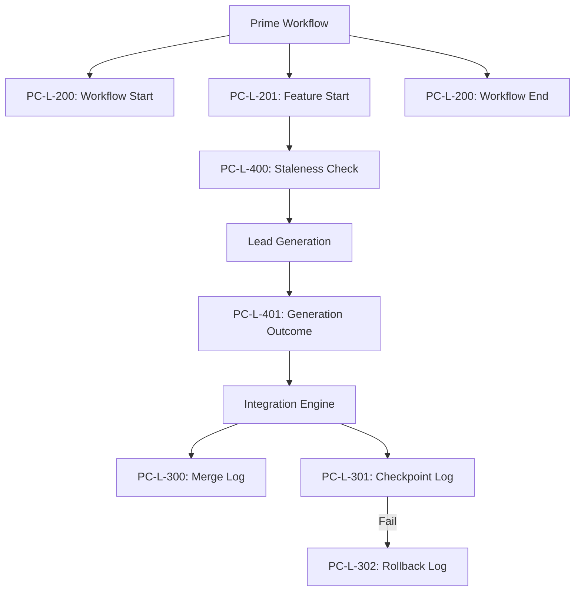

# Prime Contractor Logging — Requirements

> **Version:** 1.0.0
> **Status:** DRAFT (Mirroring Artisan/Plan Ingestion Standards)
> **Date:** 2026-02-27
> **Scope:** Structured logging requirements for the `PrimeContractorWorkflow` and `IntegrationEngine` — workflow/feature lifecycle, staleness checks, LLM generation, integration/rollbacks, and Loki correlation.
> **Extends:** `PRIME_CONTRACTOR_REQUIREMENTS.md`
> **Complements:** `PRIME_OTEL_FULL_DEPTH_TRACING_REQUIREMENTS.md` (traces) — logs provide searchable, Loki-queryable visibility.
> **Depends on:** PC-OT-1xx (lifecycle spans), PC-OT-2xx (generation spans), PC-OT-3xx (integration spans).

---

## 1. Motivation

The `PrimeContractorWorkflow` is the high-velocity code generation route. To ensure reliability and observability, logging must:

- **Trace Feature Progress**: Provide high-visibility logs for each feature as it moves through selection, generation, and integration.
- **Clarify Reuse Decisions**: Explicitly log why a file was reused (staleness check) or regenerated.
- **Audit Integration Safety**: Log every merge attempt, checkpoint outcome, and rollback event with enough detail to diagnose failures without re-running.
- **Cost Visibility**: Report per-feature and aggregate USD costs for the entire run.

---

## 2. Design Principles

| Principle | Source Document | Compliance |
| :--- | :--- | :--- |
| Standard Logger Acquisition | AL-100 / `logging_config.py` | PI-L-100 mandates `get_logger(__name__)` across all prime/integration modules. |
| Feature-Centric Context | PC-OT-1xx | Every log emitted during feature processing must include `feature_id`. |
| Integration Reliability | `integration_engine.py` | Log every side-effect (file write, git stashing, rollback) to ensure 100% auditability of filesystem changes. |
| Loki-Friendly | `LOKI_SETUP_GUIDE.md` | Use structured JSON for all file logs. |

---

## 3. Requirements

### Layer 1: Logger Acquisition (PC-L-1xx)

#### PC-L-100: get_logger() Usage

**Status:** implemented  
All code under `src/startd8/contractors/prime_contractor.py`, `integration_engine.py`, and `queue.py` must use `from startd8.logging_config import get_logger`.

---

### Layer 2: Workflow and Feature Lifecycle (PC-L-2xx)

#### PC-L-200: Workflow Entry/Exit

**Status:** planned  
Log at INFO when the Prime workflow starts and ends.

**Acceptance criteria:**

1. INFO: `"Starting PrimeContractorWorkflow (mode={mode}, dry_run={dry_run})"`.
2. INFO: `"PrimeContractorWorkflow completed. Summary: {processed}/{total} features processed, total_cost=${cost_usd}"`.
3. `extra` includes: `workflow_id`, `mode`, `dry_run`.

#### PC-L-201: Feature Lifecycle Logs

**Status:** planned  
Log at INFO at each stage of the `process_feature` loop.

**Acceptance criteria:**

1. INFO: `"Processing feature: {feature_id} ({name})"`.
2. INFO: `"Feature {feature_id} successfully integrated"`.
3. WARNING: `"Feature {feature_id} failed: {reason}"`.
4. `extra` includes: `feature_id`, `feature_name`, `target_files_count`.

---

### Layer 3: Integration and Verification (PC-L-3xx)

#### PC-L-300: Merge Operations

**Status:** planned  
Log every file merge operation within the `IntegrationEngine`.

**Acceptance criteria:**

1. INFO: `"Merging {source_path} -> {target_path} (strategy={strategy})"`.
2. WARNING: `"Merge skipped for {target_path} (reason={reason})"`.
3. `extra` includes: `source`, `target`, `strategy`.

#### PC-L-301: Checkpoint Results

**Status:** planned  
Log the outcome of every checkpoint (e.g., lint, test) run during integration.

**Acceptance criteria:**

1. INFO: `"Checkpoint {checkpoint_name} passed"`.
2. ERROR: `"Checkpoint {checkpoint_name} failed — triggering rollback"`.
3. `extra` includes: `checkpoint_name`, `exit_code`, `strict_mode`.

#### PC-L-302: Rollback/Safety Logs

**Status:** planned  
Log all safety operations (git stash, recovery from backup).

**Acceptance criteria:**

1. INFO: `"Created safety snapshot: {snapshot_id}"`.
2. WARNING: `"Rolling back changes for feature {feature_id} due to {failure_reason}"`.

---

### Layer 4: Operational Logging (PC-L-4xx)

#### PC-L-400: Staleness/Reuse Decisions

**Status:** planned (partial)  
Log why a feature was regenerated or reused.

**Acceptance criteria:**

1. INFO: `"Reusing cached generation for {feature_id} (provenance: {workflow_id})"`.
2. INFO: `"Regenerating {feature_id} (reason: {reason})"`.
3. `reason` patterns: `stale_checksum`, `missing_manifest`, `forced`.

#### PC-L-401: LLM Call Outcome (Prime)

**Status:** planned  
Log metrics for the nested `LeadContractorWorkflow` call.

**Acceptance criteria:**

1. INFO: `"LeadContractor generation succeeded for {feature_id} (cost=${cost_usd}, tokens={tokens})"`.
2. `extra` includes: `cost_usd`, `input_tokens`, `output_tokens`, `model`.

---

#### PC-L-402: Micro Prime Cloud Escalation Retry Logs

**Status:** planned  
Log each cloud escalation retry attempt when Micro Prime is enabled.

**Acceptance criteria:**
1. INFO per retry attempt: "Cloud escalation retry for {feature_id}.{element_name} (attempt {n}/{max}, strategy={strategy})".
2. `extra` includes: `feature_id`, `file_path`, `element_name`, `attempt`, `max_attempts`, `strategy`, `reason`.
3. WARNING on retry exhaustion with `reason` and `last_error` (if available).
4. INFO on retry success with `attempt` and `splice_success`.


### Layer 5: Loki Correlation (PC-L-5xx)

#### PC-L-500: Trace-Log Invariant

**Status:** implemented  
All Prime logs must carry `trace_id` for correlation with `workflow.prime-contractor` spans.

---

### Layer 6: Structured Logging Conventions (PC-L-6xx)

#### PC-L-600: Field Naming

**Status:** planned  
Mandatory fields in `extra`: `workflow_id`, `feature_id`, `integration_stage`.

---

### Layer 7: Graceful Degradation (PC-L-7xx)

#### PC-L-700: Safety Snapshot Resilience

**Status:** implemented  
If git is unavailable for snapshots, log a WARNING and fall back to manual backup logging.

---

## 4. Log Flow Diagram



---

## 5. Traceability Matrix

| Requirement | Implementation Site |
| :--- | :--- |
| PC-L-200 | `prime_contractor.py:run()` |
| PC-L-201 | `prime_contractor.py:process_feature()` |
| PC-L-300/301 | `integration_engine.py:integrate()` |
| PC-L-400 | `prime_contractor.py:develop_feature()` |
| PC-L-402 | `micro_prime/prime_adapter.py:_escalate_elements_to_cloud()` |

---

## 6. Verification

### LogQL Test

```logql
{job="startd8"} | json | feature_id="PI-001" | level="INFO"
```

---

## 7. Related Documents

- `docs/design/artisan/ARTISAN_LOGGING_REQUIREMENTS.md`
- `docs/design/prime/PRIME_OTEL_FULL_DEPTH_TRACING_REQUIREMENTS.md`
- `src/startd8/contractors/prime_contractor.py`
