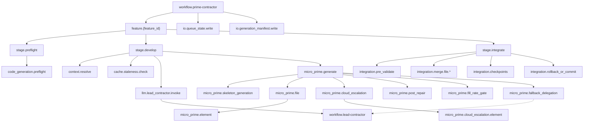
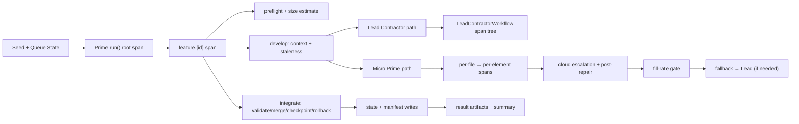

# Prime Workflow Full-Depth OTel Tracing — Requirements

> **Version:** 1.2.0
> **Status:** Rebuilt for Prime workflow scope; Partial baseline implemented (PC-OT-000 through PC-OT-003); Planned (PC-OT-1xx through PC-OT-8xx)
> **Date:** 2026-03-05
> **Scope:** Full-depth OpenTelemetry span instrumentation for `PrimeContractorWorkflow` feature lifecycle (`run → process_feature → develop_feature → integrate_feature`) including generation (Lead Contractor and Micro Prime paths), staleness, merge/checkpoint, state/manifest writes, Prime→Lead trace correlation, and Micro Prime engine-depth tracing (element classification, local/cloud generation, post-repair, fill-rate gating)
> **Extends:** `PRIME_CONTRACTOR_REQUIREMENTS.md` Layer 5 (REQ-PC-013, REQ-PC-014)
> **Complements:** `PRIME_LOGGING_REQUIREMENTS.md` (logs) and `PLAN_INGESTION_OTEL_FULL_DEPTH_TRACING_REQUIREMENTS.md` (upstream ingestion tracing)
> **Primary sources:** `src/startd8/contractors/prime_contractor.py`, `src/startd8/contractors/integration_engine.py`, `src/startd8/contractors/adapters/contextcore.py`, `src/startd8/contractors/adapters/standalone.py`, `src/startd8/micro_prime/prime_adapter.py`, `src/startd8/micro_prime/engine.py`

---

## Table of Contents

1. [Motivation](#1-motivation)
2. [Design Principles](#2-design-principles)
3. [Requirements](#3-requirements)
   - [Layer 0: Current Baseline (PC-OT-000)](#layer-0-current-baseline-pc-ot-000)
   - [Layer 1: Workflow and Feature Lifecycle Spans (PC-OT-1xx)](#layer-1-workflow-and-feature-lifecycle-spans-pc-ot-1xx)
   - [Layer 2: Generation and LLM Spans (PC-OT-2xx)](#layer-2-generation-and-llm-spans-pc-ot-2xx)
   - [Layer 3: IntegrationEngine Spans (PC-OT-3xx)](#layer-3-integrationengine-spans-pc-ot-3xx)
   - [Layer 4: Artifact and State I/O Spans (PC-OT-4xx)](#layer-4-artifact-and-state-io-spans-pc-ot-4xx)
   - [Layer 5: Correlation Attribute Contract (PC-OT-5xx)](#layer-5-correlation-attribute-contract-pc-ot-5xx)
   - [Layer 6: Graceful Degradation and Backend Safety (PC-OT-6xx)](#layer-6-graceful-degradation-and-backend-safety-pc-ot-6xx)
   - [Layer 7: Infrastructure and Verification (PC-OT-7xx)](#layer-7-infrastructure-and-verification-pc-ot-7xx)
   - [Layer 8: Micro Prime Generation Path (PC-OT-8xx)](#layer-8-micro-prime-generation-path-pc-ot-8xx)
4. [Span Hierarchy](#4-span-hierarchy)
5. [Data Flow Diagram](#5-data-flow-diagram)
6. [Traceability Matrix](#6-traceability-matrix)
7. [Status Dashboard](#7-status-dashboard)
8. [Verification](#8-verification)
9. [Related Documents](#9-related-documents)

---

## 1. Motivation

Prime currently emits observability signals via the `Instrumentor` protocol (`emit_span`, `emit_event`, `emit_metric`, `emit_insight`), but coverage is shallow:
- only one explicit span call in `pre_flight_validation()`
- no root workflow span in `PrimeContractorWorkflow.run()`
- no per-feature child span hierarchy for generation/integration/checkpoint stages
- no deterministic trace correlation between Prime orchestration and nested `LeadContractorWorkflow.run()`

Additionally, when Micro Prime is enabled (`enable_micro_prime()`), the generation path replaces `LeadContractorCodeGenerator` with `MicroPrimeCodeGenerator`, introducing a deep per-file/per-element processing tree (classify → template/Ollama → repair → splice → cloud escalation → post-repair → fill-rate gate) that is invisible to traces.

This makes it hard to answer operational questions:
- Which feature or sub-stage dominated cost/latency?
- Was generation skipped by staleness reuse or force-regenerate?
- Did integration fail at pre-validate, merge, checkpoint, or rollback?
- Which mode (`standalone` vs `pipeline`) produced the trace and with what context depth?
- When Micro Prime is active: which elements were local vs cloud? What was the fill rate? Did post-repair fix lint issues? Why did success=False despite files being written?

Full-depth tracing closes these gaps while preserving current runtime behavior when OTel/ContextCore is unavailable.

---

## 2. Design Principles

| Principle | Source | Application |
|-----------|--------|-------------|
| Observe the full feature lifecycle | `prime_contractor.py` (`run`, `process_feature`, `develop_feature`, `integrate_feature`) | Every feature stage must be represented as a trace subtree |
| Preserve no-ContextCore operability | `adapters/standalone.py` | Instrumentation must degrade to logs/no-op behavior without breaking execution |
| Prime→Lead trace continuity | `generators/lead_contractor.py`, `workflows/base.py` | Lead workflow spans must correlate to their parent Prime feature spans |
| Integration as first-class telemetry | `integration_engine.py` | Merge/checkpoint/rollback paths must be queryable, not inferred from logs |
| Micro Prime engine depth | `micro_prime/engine.py`, `micro_prime/prime_adapter.py` | Per-element tier routing, local/cloud decisions, repair, and fill-rate gating must be trace-queryable |
| No functional regression | Prime mode/state/caching contracts | Tracing additions cannot change queue behavior, staleness decisions, or outputs |

---

## 3. Requirements

### Layer 0: Current Baseline (PC-OT-000)

#### PC-OT-000: Instrumentor Protocol Baseline

**Status:** implemented  
**Source:** `src/startd8/contractors/protocols.py` (`Instrumentor`)

Prime observability MUST continue to be routed through the `Instrumentor` abstraction.

**Acceptance criteria:**
1. Prime workflow remains backend-agnostic (`logging` or `contextcore` instrumentor).
2. `emit_span`, `emit_event`, `emit_metric`, `emit_insight` contract remains stable.
3. Existing non-OTel runs continue to function unchanged.

#### PC-OT-001: Preflight Span Emission Baseline

**Status:** implemented  
**Source:** `prime_contractor.py` (`pre_flight_validation`)

Prime currently emits a preflight span signal via instrumentor.

**Acceptance criteria:**
1. `code_generation.preflight` emission remains present.
2. Preflight estimate and decision events remain emitted.
3. Existing log-based observability remains intact.

#### PC-OT-002: Insight and Metric Baseline

**Status:** implemented  
**Source:** `prime_contractor.py` (`process_feature`, `run`, `develop_feature`)

Prime insight and metric signals MUST continue to be emitted.

**Acceptance criteria:**
1. `workflow_started` and `workflow_completed` insights are emitted.
2. `feature_selected` insight is emitted per processed feature.
3. `prime_contractor.feature_cost` metric is emitted on successful generation.

#### PC-OT-003: Lead Workflow Root Span Baseline

**Status:** implemented  
**Source:** `workflows/base.py`, `generators/lead_contractor.py`

`LeadContractorWorkflow.run()` emits its own root workflow span when OTel is available.

**Acceptance criteria:**
1. Lead workflow root span behavior remains unchanged.
2. Prime tracing enhancements must not disable Lead workflow span emission.
3. Correlation improvements must be additive (no behavior regressions).

---

### Layer 1: Workflow and Feature Lifecycle Spans (PC-OT-1xx)

#### PC-OT-100: Prime Module Tracer with Safe Fallback

**Status:** planned  
**Source:** `prime_contractor.py`

Add a module-level tracer for Prime workflow spans with graceful fallback.

**Acceptance criteria:**
1. Prime root/feature spans use a dedicated tracer namespace.
2. Missing OTel dependencies do not raise runtime errors.
3. Fallback behavior remains compatible with existing instrumentor usage.

#### PC-OT-101: Root Workflow Span

**Status:** planned  
**Source:** `PrimeContractorWorkflow.run`

Wrap `run()` in a root Prime workflow span.

**Acceptance criteria:**
1. Span name `workflow.prime-contractor` (or equivalent stable pattern).
2. Attributes include mode, dry_run, auto_commit, stop_on_failure, max_cost_usd.
3. Workflow summary stats (`processed`, `succeeded`, `failed`, `total_cost_usd`) are recorded on completion.

#### PC-OT-102: Per-Feature Parent Span

**Status:** planned  
**Source:** `process_feature`

Each feature MUST run under a parent feature span.

**Acceptance criteria:**
1. Span name pattern `feature.{feature_id}`.
2. Attributes include `feature.id`, `feature.name`, status at selection, target_files count.
3. Span status reflects final feature outcome (success/fail/blocked).

#### PC-OT-103: Stage Boundary Child Spans

**Status:** planned  
**Source:** `process_feature`, `develop_feature`, `integrate_feature`

Feature stage boundaries MUST be explicit child spans.

**Acceptance criteria:**
1. Child spans for preflight, develop, integrate stages.
2. Branches for dry-run, decomposition, and regeneration are trace-visible.
3. Span closure is guaranteed on all exit paths.

#### PC-OT-104: Queue Status Transition Events

**Status:** planned  
**Source:** `queue.start_feature`, `queue.complete_feature`, `queue.fail_feature`

Queue state transitions MUST be represented as span events.

**Acceptance criteria:**
1. Transition events include old/new status and feature ID.
2. Failed transition paths attach failure reason.
3. Events are attached to the active feature span.

#### PC-OT-105: Budget and Stop Conditions

**Status:** planned  
**Source:** `run` main loop

Workflow stop reasons MUST be observable.

**Acceptance criteria:**
1. Cost-budget stop emits explicit span event with budget and current spend.
2. Max retries exceeded emits event with feature ID and attempt count.
3. `stop_on_failure` path emits deterministic stop reason.

---

### Layer 2: Generation and LLM Spans (PC-OT-2xx)

#### PC-OT-200: Preflight Estimation Span Upgrade

**Status:** planned  
**Source:** `pre_flight_validation`

Preflight MUST emit a structured duration span (not just fire-and-forget).

**Acceptance criteria:**
1. Attributes include estimated lines/tokens/complexity/confidence.
2. Decomposition-required decisions are attached as span events.
3. Strict checkpoint preflight failures mark span as ERROR.

#### PC-OT-201: Context Resolution Span

**Status:** planned  
**Source:** `_resolve_context`, `develop_feature`

Context strategy resolution MUST be instrumented.

**Acceptance criteria:**
1. Attributes include strategy mode, context key count, fallback usage.
2. Strategy fallback emits explicit warning event in span.
3. Invalid resolved context path is trace-visible.

#### PC-OT-202: Staleness and Reuse Decision Span

**Status:** planned  
**Source:** `_check_staleness`, `_check_file_provenance`, `develop_feature`

Caching/reuse decisions MUST be queryable.

**Acceptance criteria:**
1. Span includes decision category (`force_regenerate`, `current`, `stale`, `missing`).
2. Checksum comparison results are captured.
3. Reuse short-circuit path is explicitly marked.

#### PC-OT-203: Code Generation Invocation Span

**Status:** planned
**Source:** `develop_feature`, `LeadContractorCodeGenerator.generate`, `MicroPrimeCodeGenerator.generate`

Prime code generation invocation MUST be wrapped by a parent span regardless of which code generator is active.

**Acceptance criteria:**
1. Parent span exists per generation attempt.  When Lead Contractor is active, span name is `llm.lead_contractor.invoke`; when Micro Prime is active, span name is `micro_prime.generate` (see PC-OT-801).
2. Attributes include the generator type (`lead_contractor` or `micro_prime`) so traces can be filtered by generation path.
3. Lead Contractor: attributes include lead/drafter agent specs and max_iterations; child Lead workflow spans are trace-correlated to the parent feature span.
4. Micro Prime: child spans follow the PC-OT-8xx hierarchy (per-file, per-element, cloud escalation, post-repair, fill-rate gate).

#### PC-OT-204: Generation Result Attributes

**Status:** planned
**Source:** `develop_feature`, `MicroPrimeCodeGenerator.generate`

Generation output metrics MUST be attached to the generation span.

**Acceptance criteria:**
1. Capture `cost_usd`, `input_tokens`, `output_tokens`, model, generated file count.
2. Failed generation records error and exception context.
3. Retry-with-prior-error path emits a dedicated retry event.
4. When Micro Prime is active, additionally capture: `effective_file_count`, `incomplete_files`, `micro_prime_only`, `element_escalation_count`, `template_count`, `ollama_count`, `repaired_count`.

#### PC-OT-205: Walkthrough Prompt Persistence Span

**Status:** planned  
**Source:** `_persist_walkthrough_prompts`, walkthrough branch in `develop_feature`

Walkthrough mode MUST be represented in spans.

**Acceptance criteria:**
1. Prompt persistence emits dedicated span with output directory and file count.
2. Walkthrough short-circuit is visible as non-LLM generation path.
3. Errors in prompt persistence record exception and continue behavior.

---

### Layer 3: IntegrationEngine Spans (PC-OT-3xx)

#### PC-OT-300: Integration Parent Span

**Status:** planned  
**Source:** `integrate_feature`, `IntegrationEngine.integrate`

Integration MUST run under a dedicated parent span.

**Acceptance criteria:**
1. Parent span includes feature ID, attempt number, dry_run flag.
2. Success/failure outcome is set as span attributes.
3. Parent covers the entire integrate lifecycle.

#### PC-OT-301: Pre-Merge Validation Span

**Status:** planned  
**Source:** `IntegrationEngine.integrate` pre-validate section

Pre-merge checkpoint validation MUST be traced.

**Acceptance criteria:**
1. Span includes number of generated paths validated.
2. Validation gate failures are marked as errors with checkpoint summary.
3. Gate contract emission failures are logged as span events.

#### PC-OT-302: Per-File Merge Spans

**Status:** planned  
**Source:** `IntegrationEngine.integrate` merge loop

Each source→target merge MUST be represented as a child span.

**Acceptance criteria:**
1. Attributes include source path, target path, merge strategy, edit-mode skip merge flag.
2. Merge conflicts/errors set ERROR status.
3. Successful merges include bytes/line counts when available.

#### PC-OT-303: Checkpoint Run Spans

**Status:** planned  
**Source:** `IntegrationEngine.integrate` checkpoint run section

Checkpoint execution MUST be fully traced.

**Acceptance criteria:**
1. Parent checkpoint span plus per-checkpoint child events/spans.
2. Attributes include checkpoint names, outcomes, strict_checkpoints behavior.
3. Failed checkpoints are correlated to rollback path.

#### PC-OT-304: Rollback and Commit Spans

**Status:** planned  
**Source:** `IntegrationEngine.integrate` failure and auto-commit branches

Rollback/commit side effects MUST be traced.

**Acceptance criteria:**
1. Rollback span emitted when integration fails after merge attempt.
2. Auto-commit span emitted with commit scope/details.
3. Snapshot cleanup span emitted after success/failure completion.

#### PC-OT-305: Manifest Diff Spans

**Status:** planned  
**Source:** `IntegrationEngine._manifest_pre_merge_diff`, `_manifest_post_merge_refresh`

Manifest diff and refresh operations MUST be trace-visible.

**Acceptance criteria:**
1. Pre-merge diff span includes removed/added/changed signature counts.
2. Breaking change and retention-threshold outcomes are emitted as events.
3. Post-merge refresh span includes files refreshed and failures count.

---

### Layer 4: Artifact and State I/O Spans (PC-OT-4xx)

#### PC-OT-400: Queue State Write Span

**Status:** planned  
**Source:** `_save_queue_state_with_mode`, `FeatureQueue.save_state`

Writes to `.prime_contractor_state.json` MUST be traced.

**Acceptance criteria:**
1. Span includes path and feature count.
2. `execution_mode` injection into state is recorded.
3. Write failures are surfaced as warning/error events.

#### PC-OT-401: Generation Manifest Write Span

**Status:** planned  
**Source:** `_write_generation_manifest`

Manifest writes MUST have explicit spans.

**Acceptance criteria:**
1. Span includes `source_checksum`, mode, total cost/token summary.
2. 0o600 permission set result is captured.
3. Write failures are recorded without altering workflow outcome semantics.

#### PC-OT-402: Result Artifact Span (Runner Script)

**Status:** planned  
**Source:** `scripts/run_prime_workflow.py` result write path

Result JSON writes from runner MUST be traceable when OTel is active.

**Acceptance criteria:**
1. Span includes output path and success/aborted flags.
2. Dry-run skip path is represented as a skip event.
3. Task-filter context is attached when present.

#### PC-OT-403: Recovery Snapshot Spans

**Status:** planned  
**Source:** `create_safety_snapshot`, `recover_from_stash`, snapshot helpers

Safety snapshot and recovery operations MUST be traced.

**Acceptance criteria:**
1. Snapshot create/pop operations emit spans with git command outcome.
2. Restore-from-backup path emits file-level recovery events.
3. Recovery failure paths set ERROR status.

---

### Layer 5: Correlation Attribute Contract (PC-OT-5xx)

#### PC-OT-500: Standard Prime Span Attributes

**Status:** planned  
**Source:** Prime + Integration tracing additions

Define stable attributes for Prime spans.

**Acceptance criteria:**
1. Workflow spans include `prime.mode`, `prime.dry_run`, `prime.auto_commit`.
2. Feature spans include `feature.id`, `feature.name`, `feature.target_file_count`.
3. Integration spans include `integration.attempt`, `integration.result`.

#### PC-OT-501: Generation Metrics Attributes

**Status:** planned
**Source:** `develop_feature`, `LeadContractorCodeGenerator.generate`, `MicroPrimeCodeGenerator.generate`

Generation spans MUST expose consistent cost/token/model labels.

**Acceptance criteria:**
1. `llm.cost_usd`, `llm.input_tokens`, `llm.output_tokens`, `llm.model` are present.
2. Cache-hit paths include `llm.skipped=true`.
3. Retry attempts include attempt index and prior-error hash/marker.
4. Micro Prime spans include `micro_prime.tier` (element tier), `micro_prime.template_used`, `micro_prime.repair_steps` where applicable.
5. Micro Prime element-level cloud escalation spans include `micro_prime.escalation_reason`, `micro_prime.cloud_agent_spec`.

#### PC-OT-502: Prime→Lead Correlation Keys

**Status:** planned  
**Source:** Prime generation invocation + lead workflow config

Prime and Lead traces MUST share correlation metadata.

**Acceptance criteria:**
1. Feature ID is propagated to Lead workflow span attributes.
2. Prime trace ID or equivalent correlation key is recorded in Lead run context.
3. Cross-trace querying by feature ID is supported.

#### PC-OT-503: Artifact and Provenance Correlation

**Status:** planned  
**Source:** manifest/state/result write paths

Trace data MUST correlate to persisted artifacts.

**Acceptance criteria:**
1. Artifact spans include file paths and checksum/version fields where relevant.
2. Manifest feature entries can be traced back to feature spans.
3. State snapshot spans include queue progress at write time.

#### PC-OT-504: Prime→Micro Prime→Fallback Correlation

**Status:** planned
**Source:** `MicroPrimeCodeGenerator.generate`, `_escalate_elements_to_cloud`, `_delegate_to_fallback`

When Micro Prime delegates to its fallback generator (Lead Contractor), trace correlation MUST be maintained.

**Acceptance criteria:**
1. Feature ID is propagated from the Prime feature span into all Micro Prime child spans.
2. Fallback delegation spans carry a link to the parent Micro Prime generation span.
3. Element-level cloud escalation spans include the escalation reason and element name for per-element querying.
4. The `micro_prime.generate` span's `generator.type=micro_prime` attribute enables filtering Micro Prime traces from Lead Contractor traces in Tempo.

---

### Layer 6: Graceful Degradation and Backend Safety (PC-OT-6xx)

#### PC-OT-600: OTel Optionality Safety

**Status:** planned  
**Source:** adapters + Prime tracing additions

Prime MUST operate correctly when OTel is unavailable.

**Acceptance criteria:**
1. No ImportError/AttributeError from tracing paths without OTel.
2. LoggingInstrumentor remains a fully supported backend.
3. Behavior parity is preserved between instrumented and non-instrumented runs.

#### PC-OT-601: Instrumentor Failure Isolation

**Status:** planned  
**Source:** Prime and adapter callsites

Instrumentation failures MUST not crash core workflow paths.

**Acceptance criteria:**
1. Instrumentation exceptions are caught and downgraded to warnings where appropriate.
2. Core generation/integration state transitions remain intact on instrumentor errors.
3. Failure telemetry includes backend type and failed call type.

#### PC-OT-602: Span Lifecycle Correctness

**Status:** planned  
**Source:** adapter implementations (`contextcore.py`, `standalone.py`)

Span lifecycle semantics MUST support meaningful duration and parent-child nesting.

**Acceptance criteria:**
1. Span start and end boundaries encompass real work duration.
2. Event emission can target active stage spans deterministically.
3. No zero-duration auto-close behavior for long-running stage spans.

#### PC-OT-603: Exception Recording Contract

**Status:** planned  
**Source:** Prime + Integration tracing additions

Error semantics MUST be consistent across all traced stages.

**Acceptance criteria:**
1. Exceptions are recorded on the active span.
2. Error status is set before propagating/handling failure.
3. Tracing does not swallow functional exceptions.

---

### Layer 7: Infrastructure and Verification (PC-OT-7xx)

#### PC-OT-700: Prime OTel Descriptor Coverage

**Status:** planned  
**Source:** Prime/integration modules

Add observability descriptor coverage for Prime span patterns.

**Acceptance criteria:**
1. Descriptor includes workflow, feature, generation, integration, and I/O span patterns.
2. Attribute contract aligns with PC-OT-500..503.
3. Descriptor generation has no runtime side effects.

#### PC-OT-701: Tempo Query Cookbook

**Status:** planned  
**Source:** this document + dashboard assets

Provide query patterns for Prime operational diagnostics.

**Acceptance criteria:**
1. Query for top-cost features by `llm.cost_usd`.
2. Query for integration failures grouped by stage (`pre_validate`, `merge`, `checkpoint`, `rollback`).
3. Query for cache hit vs regenerate decisions.
4. Query for Micro Prime element fill rates by file (`micro_prime.fill_rate_gate` spans).
5. Query for element-level routing breakdown: template vs Ollama vs cloud escalation.
6. Query for post-repair activity: files with diagnostics found, repair success rate.
7. Query for Micro Prime vs Lead Contractor generation path comparison (filter by `generator.type`).

#### PC-OT-702: Automated Trace Verification Harness

**Status:** planned  
**Source:** tests/scripts

Add automated checks for Prime span hierarchy and required attributes.

**Acceptance criteria:**
1. Verification script/test validates required spans on a deterministic sample run.
2. Missing critical spans fail verification.
3. Validation supports both dry-run and live (mocked generator) modes.

---

### Layer 8: Micro Prime Generation Path (PC-OT-8xx)

When `enable_micro_prime()` is active, `MicroPrimeCodeGenerator` replaces `LeadContractorCodeGenerator` as the code generator in `develop_feature()`.  The Micro Prime path has a fundamentally different span tree: per-file processing with per-element tier routing, local Ollama generation, template matching, element-level cloud escalation, post-generation file repair, and fill-rate success gating.  Lead Contractor may still run as the fallback for file-level escalations.

#### PC-OT-800: Micro Prime Module Tracer

**Status:** planned
**Source:** `micro_prime/prime_adapter.py`, `micro_prime/engine.py`

Micro Prime modules MUST use a dedicated tracer namespace with safe fallback.

**Acceptance criteria:**
1. Tracer namespace `startd8.micro_prime` (distinct from Prime's `startd8.prime` namespace).
2. Missing OTel dependencies do not raise `ImportError` — graceful no-op fallback.
3. Existing `_elements_local_counter`, `_elements_escalated_counter`, `_template_hits_counter` OTel metrics (REQ-MP-705) continue to function alongside trace spans.

#### PC-OT-801: Micro Prime Root Generation Span

**Status:** planned
**Source:** `MicroPrimeCodeGenerator.generate`

The `generate()` entry point MUST emit a root generation span covering the full Micro Prime lifecycle.

**Acceptance criteria:**
1. Span name `micro_prime.generate`.
2. Start attributes: `target_file_count`, `ollama_available`, `micro_prime.model`, `micro_prime.templates_enabled`, `micro_prime.repair_enabled`, `micro_prime.min_element_fill_rate`.
3. Completion attributes: `effective_file_count`, `incomplete_files`, `local_element_count`, `escalated_element_count`, `template_count`, `ollama_count`, `decomposed_count`, `element_escalation_count`, `cost_usd`.
4. Span status reflects the final `success` outcome (based on fill-rate gating, not just file count).
5. Early-exit paths (no manifest → fallback, Ollama unavailable → fallback, dry-run) emit events before span close.

#### PC-OT-802: Per-File Processing Spans

**Status:** planned
**Source:** `MicroPrimeCodeGenerator.generate` per-file loop, `MicroPrimeEngine.process_file`

Each target file MUST produce a child span under the root generation span.

**Acceptance criteria:**
1. Span name pattern `micro_prime.file` with attribute `file.path={relative_path}`.
2. Start attributes: `element_count` (from `ForwardFileSpec`), `skeleton_lines`.
3. Completion attributes: `success_count`, `escalated_count`, `filled_skeleton_lines`.
4. Size-regression escalation emits a `size_regression_guard` event with `filled_lines`, `existing_lines`, `ratio` before the file is delegated to fallback.
5. File-level escalation (zero local successes) emits a `file_escalated` event.

#### PC-OT-803: Per-Element Processing Spans

**Status:** planned
**Source:** `MicroPrimeEngine._process_element_with_tier`

Each element within a file MUST produce a child span under the file span.

**Acceptance criteria:**
1. Span name pattern `micro_prime.element` with attribute `element.name={name}`.
2. Start attributes: `element.tier`, `element.classification_reason`, `element.parent_class` (if method).
3. Routing events (exactly one per element):
   - `cache_hit` — element skipped due to success cache (R3-S4).
   - `circuit_breaker` — element escalated without attempt due to open circuit.
   - `template_match` — TRIVIAL element resolved by template registry.
   - `ollama_generation` — SIMPLE/TRIVIAL element generated via local Ollama.
   - `decomposition` — MODERATE element decomposed into sub-elements (REQ-MP-908).
   - `tier_escalation` — MODERATE/COMPLEX element passed through for cloud handling.
4. Completion attributes: `success`, `template_used`, `generation_time_ms`, `input_tokens`, `output_tokens`.
5. Repair events: `repair_applied` with step names when element-level repair (Phase 0) runs.
6. Splice events: `splice_success` or `splice_failed` when body is merged into skeleton.
7. Escalation: when element is escalated, `escalation` event with `reason` and `detail`.

#### PC-OT-804: Element-Level Cloud Escalation Spans

**Status:** planned
**Source:** `MicroPrimeCodeGenerator._escalate_elements_to_cloud`, `_direct_cloud_generate`

Per-element direct cloud LLM calls for partially-filled files MUST be individually traced.

**Acceptance criteria:**
1. Parent span `micro_prime.cloud_escalation` per file with escalated elements.
2. Attributes: `file.path`, `escalated_element_count`, `cloud_agent_spec`.
3. Per-element child span `micro_prime.cloud_escalation.element` with `element.name`, `escalation_reason`, `last_error`.
4. Completion per element: `input_tokens`, `output_tokens`, `splice_success` (whether body was spliced back).
5. Parent completion: `spliced_count`, `cost_usd`, total tokens.
6. Error paths (generation returned nothing, splice failed) emit events without setting ERROR on parent — partial success is expected.

#### PC-OT-805: Post-Generation Repair Span

**Status:** planned
**Source:** `MicroPrimeCodeGenerator._run_post_generation_repair`

File-level lint/syntax repair MUST be traced as a discrete span.

**Acceptance criteria:**
1. Span name `micro_prime.post_repair`.
2. Start attributes: `file_count` (number of generated files checked).
3. Events:
   - `repair_unavailable` when repair imports fail (`ImportError`) — span ends immediately with `skipped=true`.
   - `checkpoint_failed` when `check_syntax`/`check_lint` raises — span ends with `skipped=true`.
   - `diagnostics_found` with `diagnostic_count` and `categories` (syntax/lint/import breakdown).
   - `no_diagnostics` when all checks pass — fast exit.
   - `repair_outcome` with `repaired_count` and `steps_applied`.
4. Completion attributes: `repaired_count`, `diagnostic_count`.
5. Repair failures (`run_file_repair` raises) emit `repair_error` event without setting ERROR on parent generation span — repair is best-effort.

#### PC-OT-806: Fill-Rate Success Gate Span

**Status:** planned
**Source:** `MicroPrimeCodeGenerator.generate` fill-rate evaluation block

The fill-rate success gating decision MUST be explicitly traced.

**Acceptance criteria:**
1. Span name `micro_prime.fill_rate_gate`.
2. Attributes: `min_element_fill_rate` (configured threshold), `written_file_count`.
3. Per-file events: `file_fill_rate` with `file.path`, `filled`, `total`, `rate`, `passed` (boolean).
4. Completion attributes: `effective_file_count`, `incomplete_files` (list of file paths below threshold), `success` (final gate decision).
5. When a file is marked incomplete, event includes the fill rate percentage for diagnostic querying.

#### PC-OT-807: Fallback Delegation Span

**Status:** planned
**Source:** `MicroPrimeCodeGenerator._delegate_to_fallback`, `generate` fallback branch

When Micro Prime delegates escalated files to the fallback generator, the delegation MUST be traced.

**Acceptance criteria:**
1. Span name `micro_prime.fallback_delegation`.
2. Attributes: `delegated_file_count`, `fallback_model` (from fallback result).
3. The fallback generator's own spans (e.g., Lead Contractor's `workflow.lead-contractor`) appear as children or linked spans.
4. Completion attributes: `fallback_success`, `fallback_files_written`, `fallback_cost_usd`.
5. Context sanitization (`_sanitize_for_json`) errors emit events without blocking delegation.

#### PC-OT-808: Skeleton Auto-Generation Span

**Status:** planned
**Source:** `MicroPrimeCodeGenerator._generate_skeletons`

Auto-skeleton generation from manifest (REQ-MP-702) MUST be traced when it occurs.

**Acceptance criteria:**
1. Span name `micro_prime.skeleton_generation`.
2. Attributes: `target_file_count`, `generated_count` (files successfully rendered).
3. Per-file render failures emit `skeleton_render_failed` events with file path and error.
4. Span only emitted when skeletons are actually auto-generated (not when provided by caller).

---

#### PC-OT-809: Cloud Escalation Retry Events

**Status:** planned
**Source:** `MicroPrimeCodeGenerator._escalate_elements_to_cloud`

When element-level cloud escalation is retried, the retry attempts MUST be traceable.

**Acceptance criteria:**
1. Each `micro_prime.cloud_escalation.element` span emits `cloud_retry_attempt` events for attempts >= 2 with attributes: `attempt`, `max_attempts`, `strategy`, `reason`.
2. If all attempts fail, emit `cloud_retry_exhausted` with `last_error` and `splice_success=false`.
3. If a retry succeeds after a prior failure, emit `cloud_retry_succeeded` with `attempt` and `splice_success=true`.
4. Parent `micro_prime.cloud_escalation` span includes attributes: `retry_attempted` (bool), `retry_count` (total retry attempts across elements).

## 4. Span Hierarchy

> **Note:** `B2c` (Lead Contractor) and `MP` (Micro Prime) are mutually exclusive generation paths.  Only one is active per workflow instance depending on whether `enable_micro_prime()` was called.  The dashed line from `MP_FB` to `B2d` represents fallback delegation where Micro Prime delegates escalated files to the Lead Contractor.

---

## 5. Data Flow Diagram

---

## 6. Traceability Matrix

| Requirement Range | Primary Targets | Verification Targets |
|-------------------|-----------------|----------------------|
| PC-OT-000..003 | `protocols.py`, `prime_contractor.py`, `generators/lead_contractor.py` | existing contractor instrumentation tests |
| PC-OT-100..105 | `prime_contractor.py` | new Prime tracing unit tests |
| PC-OT-200..205 | `prime_contractor.py`, `generators/lead_contractor.py`, `micro_prime/prime_adapter.py` | generation/llm tracing tests |
| PC-OT-300..305 | `integration_engine.py` | integration span and failure-path tests |
| PC-OT-400..403 | `prime_contractor.py`, `queue.py`, `scripts/run_prime_workflow.py` | artifact/state write tracing tests |
| PC-OT-500..504 | shared tracing helpers/contracts | attribute-schema tests |
| PC-OT-600..603 | adapters + callsites | no-OTel and backend-failure tests |
| PC-OT-700..702 | descriptors + verification scripts | descriptor snapshot + trace harness tests |
| PC-OT-800..809 | `micro_prime/prime_adapter.py`, `micro_prime/engine.py` | Micro Prime tracing unit tests |

---

## 7. Status Dashboard

| Layer | ID Range | Total | Implemented | Planned |
|-------|----------|-------|-------------|---------|
| Baseline | PC-OT-000..003 | 4 | 4 | 0 |
| Lifecycle Spans | PC-OT-100..105 | 6 | 0 | 6 |
| Generation/LLM | PC-OT-200..205 | 6 | 0 | 6 |
| IntegrationEngine | PC-OT-300..305 | 6 | 0 | 6 |
| Artifact/State I/O | PC-OT-400..403 | 4 | 0 | 4 |
| Correlation Contract | PC-OT-500..504 | 5 | 0 | 5 |
| Degradation/Safety | PC-OT-600..603 | 4 | 0 | 4 |
| Infra/Verification | PC-OT-700..702 | 3 | 0 | 3 |
| Micro Prime | PC-OT-800..809 | 10 | 0 | 10 |
| **Total** |  | **47** | **4** | **43** |

---

## 8. Verification

Add Prime-focused tracing tests (no external collector required):

1. `tests/unit/contractors/test_prime_otel_spans.py` (new):
   - root workflow span
   - per-feature span tree
   - staleness/reuse path spans
   - generation result attributes
   - generator type attribute (`lead_contractor` vs `micro_prime`)
2. `tests/unit/contractors/test_integration_engine_otel_spans.py` (new):
   - pre-validate, merge, checkpoint, rollback/commit spans
3. `tests/unit/contractors/test_instrumentor_span_lifecycle.py` (new):
   - contextcore + logging adapter lifecycle correctness
4. `tests/unit/micro_prime/test_micro_prime_otel_spans.py` (new):
   - root `micro_prime.generate` span with config attributes
   - per-file span with element counts and skeleton lines
   - per-element span with tier, routing event, and completion attributes
   - cloud escalation span tree with per-element children
   - post-repair span with diagnostic counts and repair outcome
   - fill-rate gate span with per-file rate events and success decision
   - fallback delegation span with cost/model forwarding
   - skeleton auto-generation span (when triggered)
   - no-OTel mode: all spans degrade to no-ops without errors
5. Regression checks:
   - existing Prime behavior unchanged in no-OTel mode
   - manifest/state writes still occur with identical functional semantics
   - Micro Prime generation results unchanged with/without tracing active

---

## 9. Related Documents

- `docs/design/prime/PRIME_CONTRACTOR_REQUIREMENTS.md`
- `docs/design/prime/PRIME_EXECUTION_MODES_REQUIREMENTS.md`
- `docs/design/prime/PRIME_EXECUTION_MODES_PLAN.md`
- `docs/design/artisan/ARTISAN_OTEL_FULL_DEPTH_TRACING_REQUIREMENTS.md`
- `docs/design/plan-ingestion/PLAN_INGESTION_OTEL_FULL_DEPTH_TRACING_REQUIREMENTS.md`
- `src/startd8/contractors/prime_contractor.py`
- `src/startd8/contractors/integration_engine.py`
- `src/startd8/contractors/adapters/contextcore.py`
- `src/startd8/contractors/adapters/standalone.py`
- `src/startd8/micro_prime/prime_adapter.py`
- `src/startd8/micro_prime/engine.py`
- `src/startd8/micro_prime/models.py`
- `src/startd8/repair/orchestrator.py`
- `src/startd8/contractors/checkpoint.py`
